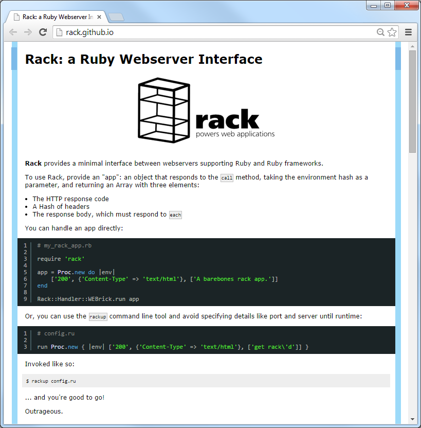

title: Almost Sinatra in Six Lines of Ruby - A Breakdown

# Agenda

Almost Sinatra in Six Lines of Ruby - A Breakdown

- What's Sinatra?
- What's Almost Sinatra?
- Why? Why? Why?
- Almost Sinatra - A Breakdown - Line 1
- What's Rack?
- What's Tilt?
- Almost Sinatra - A Breakdown - Line 2
- Almost Sinatra - A Breakdown - Line 3
- Almost Sinatra - A Breakdown - Line 4
- Almost Sinatra - A Breakdown - Line 5
- Almost Sinatra - A Breakdown - Line 6
- The Proof of the Pudding  - example.rb
- Got Inspired? Build Your Own Microframework
- Real World Case Study - webservice gem - (Yet Another) HTTP JSON API (Web Service) Builder 
- Thanks - Links, Links, Links
- Bonus: Fun Almost Sinatra Obfuscation Hacks
 

# Awesome Vienna.rb - Awesome Awesomeness

> aweseome /ˈɔːsəm/ - adjective  -
>   inspiring, excellent, outstanding, wonderful, cool, terrific, extraordinary

### What's Awesome [Your-Topic-Here]? 

A collection of awesome links. A single README page on GitHub.
Contributions welcome. Send in a pull request etc.

Awesome Ruby

- [Awesome Events @ Planet Ruby](https://github.com/planetruby/awesome-events)
- [Awesome Rubies @ Planet Ruby](https://github.com/planetruby/awesome-rubies)
- [Awesome ActiveRecord @ Planet Ruby](https://github.com/planetruby/awesome-activerecord)

Awesome Markdown

- [Awesome Markdown](https://github.com/writekit/awesome-markdown)
- [Awesome Books](https://github.com/writekit/awesome-books)

Awesome (Open) Data

- [Awesome SQLite @ Planet Open Data](https://github.com/planetopendata/awesome-sqlite)
- [Awesome World @ Planet Open Data](https://github.com/planetopendata/awesome-world)
- [Awesome Football @ Planet Open Data](https://github.com/planetopendata/awesome-football)

# What's Sinatra?

Simple (yet powerful and flexible) micro webframework.

~~~
require 'sinatra'

get '/' do
  'Hallo Vienna! Servus Wien!'
end
~~~

Trivia Quiz - How Many Lines of Ruby Code?

(A) 20 Lines
(B) 200 Lines
(C) 2 000 Lines
(D) 20 000 Lines

# What's Almost Sinatra?

Sinatra refactored, only six lines now. A hack by Konstantin Haase.

[almost_sinatra.rb](https://github.com/rkh/almost-sinatra/blob/master/almost_sinatra.rb):

~~~
%w.rack tilt date INT TERM..map{|l|trap(l){$r.stop}rescue require l};$u=Date;$z=($u.new.year + 145).abs;puts "== Almost Sinatra/No Version has taken the stage on #$z for development with backup from Webrick"
$n=Module.new{extend Rack;a,D,S,q=Rack::Builder.new,Object.method(:define_method),/@@ *([^\n]+)\n(((?!@@)[^\n]*\n)*)/m
%w[get post put delete].map{|m|D.(m){|u,&b|a.map(u){run->(e){[200,{"Content-Type"=>"text/html"},[a.instance_eval(&b)]]}}}}
Tilt.mappings.map{|k,v|D.(k){|n,*o|$t||=(h=$u._jisx0301("hash, please");File.read(caller[0][/^[^:]+/]).scan(S){|a,b|h[a]=b};h);v[0].new(*o){n=="#{n}"?n:$t[n.to_s]}.render(a,o[0].try(:[],:locals)||{})}}
%w[set enable disable configure helpers use register].map{|m|D.(m){|*_,&b|b.try :[]}};END{Rack::Handler.get("webrick").run(a,Port:$z){|s|$r=s}}
%w[params session].map{|m|D.(m){q.send m}};a.use Rack::Session::Cookie;a.use Rack::Lock;D.(:before){|&b|a.use Rack::Config,&b};before{|e|q=Rack::Request.new e;q.params.dup.map{|k,v|params[k.to_sym]=v}}}
~~~

# Why? Why? Why?

> Until programmers stop acting like obfuscation is morally hazardous,
> they're not artists, just kids who don’t want their food to touch.
>  -- \_why

~~~
$ sloccount alomst_sinatra.rb
Total Physical Source Lines of Code (SLOC)                = 8
Development Effort Estimate, Person-Years (Person-Months) = 0.00 (0.02)
 (Basic COCOMO model, Person-Months = 2.4 * (KSLOC**1.05))
Schedule Estimate, Years (Months)                         = 0.04 (0.51)
 (Basic COCOMO model, Months = 2.5 * (person-months**0.38))
Estimated Average Number of Developers (Effort/Schedule)  = 0.03
Total Estimated Cost to Develop                           = $ 170
 (average salary = $56,286/year, overhead = 2.40).
~~~

Performance. It's just amazing. No code is faster than no code.

# Almost Sinatra - A Breakdown - Line 1/6

(Like) Sinatra  = Rack + Tilt

Line 1:

~~~
%w.rack tilt date INT TERM..map{|l|trap(l){$r.stop}rescue require l};$u=Date;$z=($u.new.year + 145).abs;puts "== Almost Sinatra/No Version has taken the stage on #$z for development with backup from Webrick"
~~~

Breakdown:

~~~
require 'rack'
require 'tilt'

trap( 'INT' )  { $server.stop }  # rename $r to $server
trap( 'TERM' ) { $server.stop }

$port = 4567              # rename $z to $port

puts "== Almost Sinatra has taken the stage on #{$port} for development with backup from Webrick"
~~~

# What's rack?

Lets you mix 'n' match servers and apps.

Lets you stack apps inside apps inside apps inside apps inside apps.

Good News: A Sinatra app is a Rack app.

Learn more about Rack @ [`rack.github.io`](http://rack.github.io).

# What's tilt?

Tilt offers a standard "generic" interface for template engines.

Let's check-up what formats and template engines tilt includes out-of-the-box:

~~~
require 'tilt'

Tilt.mappings.each do |ext, engines|
  puts "#{ext.ljust(12)} : #{engines.inspect}"
end
~~~

Will result in:

~~~
str          : [Tilt::StringTemplate]
erb          : [Tilt::ErubisTemplate, Tilt::ERBTemplate]
rhtml        : [Tilt::ErubisTemplate, Tilt::ERBTemplate]
erubis       : [Tilt::ErubisTemplate]
etn          : [Tilt::EtanniTemplate]
etanni       : [Tilt::EtanniTemplate]
haml         : [Tilt::HamlTemplate]
sass         : [Tilt::SassTemplate]
scss         : [Tilt::ScssTemplate]
less         : [Tilt::LessTemplate]
rcsv         : [Tilt::CSVTemplate]
coffee       : [Tilt::CoffeeScriptTemplate]
nokogiri     : [Tilt::NokogiriTemplate]
builder      : [Tilt::BuilderTemplate]
mab          : [Tilt::MarkabyTemplate]
liquid       : [Tilt::LiquidTemplate]
radius       : [Tilt::RadiusTemplate]
markdown     : [Tilt::RedcarpetTemplate, Tilt::RedcarpetTemplate::Redcarpet2, Tilt::RedcarpetTemplate::Redcarpet1, Tilt::RDiscountTemplate, Tilt::BlueClothTemplate, Tilt::KramdownTemplate, Tilt::MarukuTemplate]
mkd          : [Tilt::RedcarpetTemplate, Tilt::RedcarpetTemplate::Redcarpet2, Tilt::RedcarpetTemplate::Redcarpet1, Tilt::RDiscountTemplate, Tilt::BlueClothTemplate, Tilt::KramdownTemplate, Tilt::MarukuTemplate]
md           : [Tilt::RedcarpetTemplate, Tilt::RedcarpetTemplate::Redcarpet2, Tilt::RedcarpetTemplate::Redcarpet1, Tilt::RDiscountTemplate, Tilt::BlueClothTemplate, Tilt::KramdownTemplate, Tilt::MarukuTemplate]
textile      : [Tilt::RedClothTemplate]
rdoc         : [Tilt::RDocTemplate]
wiki         : [Tilt::WikiClothTemplate, Tilt::CreoleTemplate]
creole       : [Tilt::CreoleTemplate]
mediawiki    : [Tilt::WikiClothTemplate]
mw           : [Tilt::WikiClothTemplate]
yajl         : [Tilt::YajlTemplate]
ad           : [Tilt::AsciidoctorTemplate]
adoc         : [Tilt::AsciidoctorTemplate]
asciidoc     : [Tilt::AsciidoctorTemplate]
html         : [Tilt::PlainTemplate]
~~~

# Almost Sinatra - A Breakdown - Line 2/6

Line 2:

~~~
$n=Module.new{extend Rack;a,D,S,q=Rack::Builder.new,Object.method(:define_method),/@@ *([^\n]+)\n(((?!@@)[^\n]*\n)*)/m
~~~

Breakdown:

~~~
$n = Module.new do
  app = Rack::Builder.new      # rename a to app
  req = nil                    # rename q to req
~~~

# Almost Sinatra - A Breakdown - Line 3/6

Line 3:

~~~
%w[get post put delete].map{|m|D.(m){|u,&b|a.map(u){run->(e){[200,{"Content-Type"=>"text/html"},[a.instance_eval(&b)]]}}}}
~~~

Breakdown:

~~~
  ['get','post','put','delete'].each do |method|
    define_method method do |path, &block|
      app.map( path ) do
        run ->(env){ [200, {'Content-Type'=>'text/html'}, [app.instance_eval( &block )]]}
      end
    end
  end
~~~

# Almost Sinatra - A Breakdown - Line 4/6

Line 4:

~~~
Tilt.mappings.map{|k,v|D.(k){|n,*o|$t||=(h=$u._jisx0301("hash, please");File.read(caller[0][/^[^:]+/]).scan(S){|a,b|h[a]=b};h);v[0].new(*o){n=="#{n}"?n:$t[n.to_s]}.render(a,o[0].try(:[],:locals)||{})}}
~~~

Breakdown:

~~~
  Tilt.mappings.each do |ext, engines|          # rename k to ext and v to engines
    define_method ext do |text, *args|          # rename n to text and o to args
      template = engines[0].new(*args) do
        text
      end
      locals = (args[0].respond_to?(:[]) ? args[0][:locals] : nil) || {}    # was o[0].try(:[],:locals)||{}
      template.render( app, locals )
    end
  end
~~~

Commentary: Almost Sinatra will define a method for every format so you can use, for example:

~~~
markdown "Strong emphasis, aka bold, with **asterisks** or __underscores__."
~~~

or

~~~
erb "Hello <%%= name %>!", locals: { name: params['name'] }
~~~

# Almost Sinatra - A Breakdown - Line 5/6

Line 5:

~~~
%w[set enable disable configure helpers use register].map{|m|D.(m){|*_,&b|b.try :[]}};END{Rack::Handler.get("webrick").run(a,Port:$z){|s|$r=s}}
~~~

Breakdown:

~~~
  # was END { ... }; change to run! method
  define_method 'run!' do
    Rack::Handler.get('webrick').run( app, Port:$port ) {|server| $server=server }
  end
~~~

# Almost Sinatra - A Breakdown - Line 6/6

Line 6:

~~~
%w[params session].map{|m|D.(m){q.send m}};a.use Rack::Session::Cookie;a.use Rack::Lock;D.(:before){|&b|a.use Rack::Config,&b};before{|e|q=Rack::Request.new e;q.params.dup.map{|k,v|params[k.to_sym]=v}}}
~~~

Breakdown:

~~~
  ['params','session'].each do |method|
    define_method method do
      req.send method
    end
  end

  app.use Rack::Session::Cookie
  app.use Rack::Lock
  app.use Rack::Config do |env|
    req = Rack::Request.new( env )
  end
end # Module.new
~~~

#  The Proof of the Pudding  - example.rb

`example.rb`:

~~~
require_relative 'almost_sinatra'

include $n    # include "anonymous" Almost Sinatra DSL module

get '/hello' do
  erb "Hello <%%= name %>!", locals: { name: params['name'] }
end

get '/' do
  markdown <<EOS
## Welcome to Almost Sinatra 

A six line ruby hack by Konstantin Haase.

Try:
- [Say hello!](/hello?name=Nancy)

Powered by Almost Sinatra (#{Time.now})
EOS
end

run!
~~~

Use

~~~
$ ruby ./example.rb
~~~

# Got Inspired? Build Your Own Microframework

- New York, New York
- Nancy
- Rum
- Cuba
- Roda
- and many more

# Real World Case Study - webservice gem - (Yet Another) HTTP JSON API (Web Service) Builder 

Micro "framework" for building HTTP JSON APIs (about 100 lines of code).
Example:

~~~
get '/beer/:key' do
  Beer.find_by_key!( params[ :key ] )
end

get '/brewery/:key' do
  Brewery.find_by_key!( params[ :key ] )
end
~~~

# Thanks - Links, Links, Links

- Article :: [Decoding Almost Sinatra](https://robm.me.uk/2013/12/13/decoding-almost-sinatra.html), by Rob Miller
- Article :: [Code Safari: Almost Sinatra, Almost Readable](http://www.sitepoint.com/code-safari-almost-sinatra-almost-readable/), by Xavier Shay
- Article :: [tilt gem - let's build (yet another) micro web framework in less than 33 lines of code](http://planetruby.github.io/gems/tilt.html), by Gerald Bauer

# Bonus: Fun Almost Sinatra Obfuscation Hacks

"Calculate" the Sinatra Port 4567:

~~~
(Date.new.year + 145).abs     # Date.new.year always returns -4712, the default value for years
# => 4567
~~~

"Get" empty Hash (e.g. `{}`):

~~~
Date._jisx0301("hash, please")
# => {}
~~~

