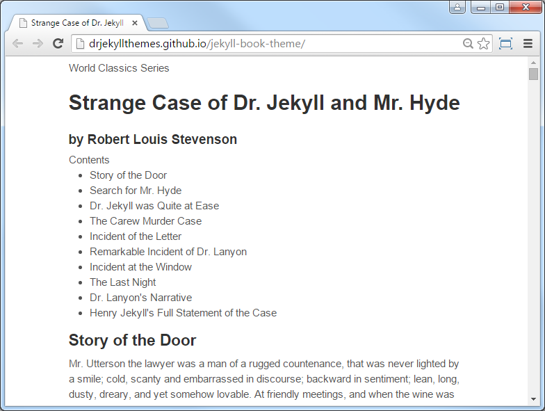
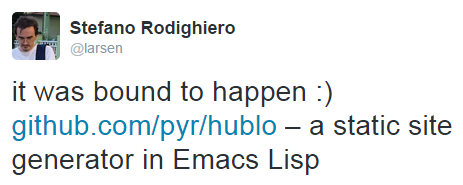
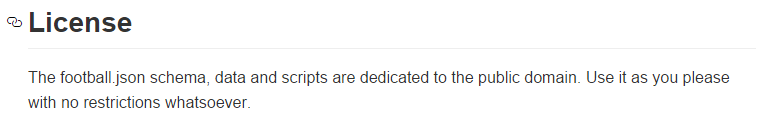
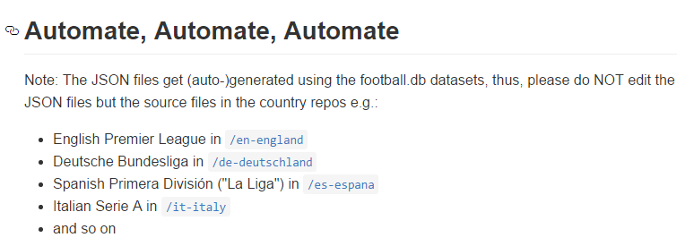
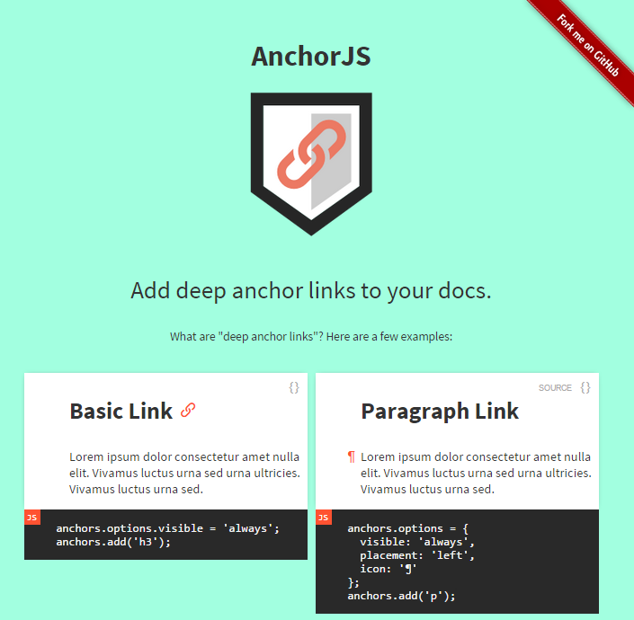

title: Add Anchor Links to Your Website


%css

pre {
  padding: 4px 4px 4px 4px;
  border-top: #bbb 1px solid;
  border-bottom: #bbb 1px solid;
  background: #f3f3f3;
}

%end


# Agenda


- What's a static site generator?
- Case Study - Dr. Jekyll and Mr Hyde Novella
- Why Static?
    - The "Classic" Dynamic Site Generators
    - Faster, Simpler, Prettier
    - Static is the New Dynamic
- Static Site Generators in JavaScript 
- Add Anchor Links to Your Static Site
    - V1.0
    - V2.0
    - V3.0
    - V4.0 w/ JavaScript
    - V5.0 w/ Anchor.js
       - Anchor.js Options
       - More Examples


# What's a static site generator?

Turns a bunch of files e.g.

- plain text documents
- hypertext documents, building blocks, templates and layouts
- datafiles
- and much more

into ready-to-serve, ready-to-use (static) web sites.


# Case Study - Another Awesome Blog

Turn text such as:

`_posts/2015-09-30-what-s-javascript.md`:

```
## What's Javascript?

JavaScript (/ˈdʒɑːvəˌskrɪpt/) is a high level, dynamic, untyped, and interpreted
programming language. It has been standardized in the ECMAScript language specification.
Alongside HTML and CSS, it is one of the three essential technologies
of World Wide Web content production; the majority of websites employ it and
it is supported by all modern web browsers without plug-ins.
```

Using some "magic" into a ready-to-serve blog (static site).

Just kidding ;-) not yet another awesome blog; let's try something new
e.g. let's build a single-page book (static site).


# Case Study - Dr. Jekyll and Mr Hyde Novella

Turns text such as:

`01.md`:

```
## Story of the Door

Mr. Utterson the lawyer was a man of a rugged countenance, that was
never lighted by a smile; cold, scanty and embarrassed in
discourse; backward in sentiment; lean, long, dusty, dreary, and
yet somehow lovable. At friendly meetings, and when the wine was to
his taste, something eminently human beaconed from his eye
...
```

`02.md`:

```
## Search for Mr. Hyde

That evening Mr. Utterson came home to his bachelor house in sombre
spirits and sat down to dinner without relish. It was his custom of
a Sunday, when this meal was over, to sit close by the fire, a
volume of some dry divinity on his reading-desk, until the clock of
the neighbouring church rang out the hour of twelve, when he would
go soberly and gratefully to bed. On this night, however, as soon as
...
```

(Source: [`worldclassics/dr-jekyll-and-mr-hyde`](https://github.com/worldclassics/dr-jekyll-and-mr-hyde))


# Case Study - Dr. Jekyll and Mr Hyde Novella (Cont.)


Add your chapters to the classics books theme (static site). For example:

```
├── _config.yml             # book configuration
├── _chapters               # sample chapters
|   ├── 01.md
|   ├── 02.md
|   ├── ...
|   └── 10.md
├── _layouts                           
|   └── default.html        # master layout template
├── css                               
|   ├── _settings.scss      # style settings (e.g. variables)
|   └── style.scss          # master style page
└── index.html              # all-in-one page book template
```

Using:

```
$ jekyll build
```


# Case Study - Dr. Jekyll and Mr Hyde Novella (Cont.)

Will result in an all-in-one single page book (static site):

```
└── _site               # output build folder; site gets generated here
    ├── css
    |   └── style.css   # styles for pages (copied 1:1 as is)
    └── index.html      # all-in-one book page
```

Example:




(Live Demo: [`drjekyllthemes.github.io/jekyll-book-theme`](http://drjekyllthemes.github.io/jekyll-book-theme))


# Static in the "Real World"

- Books
- Magazines
- Newspapers
- etc.

### Trivia Quiz 

Strange Case of Dr Jekyll and Mr Hyde by Robert Louis Stevenson 

Q: Last Update In (Static Since) ______ ?

- [ A ] 1854
- [ B ] 1886
- [ C ] 1921
- [ D ] 2007


# Why Static? - The "Classic" Dynamic Site Generators 

**The Biggies** (PHP Rules!)

- WordPress
- Drupal
- Joomla

On your live production site requires

- database (e.g. mysql)
- application server (e.g. mod_php)
- web server (e.g. apache)


# Why Static? - Faster, Simpler, Prettier

- Fast, Faster, Fastest

- Simple, Simpler, Simplest

- Pretty, Prettier, Prettiest
    - e.g. designer nirvana - do-it-yourself - full control over your design; use Bootstrap, Material, or what not.

Bonus: Secure - invite all the hackers - basically unbreakable!

There are only static files on your server.
If an attacker hacks your server, there's "just" some "temporary" data loss.
To recover
- Regenerate your site on your local machine.
- Upload it again to the server or shutdown the old "hacked" server and use a new server
  and you're back in action.


# Why Static?  - Static is the New Dynamic

Back to the future. Build sites like it's 1995.



Q: Any Vim Users? Anything like that in Vim? 


# Trivia Quiz - The Great Gatsby

Q: Written by ________ ?

- [ A ] D. H. Lawrence 
- [ B ] F. Scott Fitzgerald
- [ C ] Ian S. Taylor
- [ D ] Kyle A. Mathews

Q: Last Update in _____ ?

- [ A ] 1885
- [ B ] 1925 
- [ C ] 1995
- [ D ] 2015


# What's Gatsby? (Yet Another) Static Site Generator (in JavaScript)

Started in 2015 by Kyle Mathews - Gatsby is -
surprise, surprise - (yet another) static site generator in JavaScript
that turns plain text into dynamic blogs and sites using
Webpack modules and React.js components and routing machinery.

Find out more @ [gatsbyjs/gatsby](https://github.com/gatsbyjs/gatsby).


# More Static Site Generators in JavaScript (& CoffeeScript)

The Biggies

- Hexo
- Metalsmith
- Wintersmith
- Blacksmith
- Harp
- Assemble
- GitBook
- and many more

Q: What static site generators (in JavaScript)
do you use? Anyone? 


# Add Anchor Links to Your Static Site

What's an anchor link?

Let's you (deep) link a heading or paragraph inside a page.

Example - link to the "License" section - use: `README.md#license`




Example - link to "Automate, Automate, Automate" section - use: `README.md#automate-automate-automate`




# Add Anchor Links to Your Static Site - Cont.


Step 1: Add id attribute to heading 

Before

```
<h2>Search for Mr. Hyde</h2>
```

After

```
<h2 id="search-for-mr-hyde">Search for Mr. Hyde</h2>
```

Step 2: Use the anchor


Now you can use `#search-for-mr-hyde` to link to
the "Search for Mr. Hyde" heading.
That's it.


# Add Anchor Links to Your Static Site - V2.0

What's new?

- Add a "permalink" marker e.g. `#`

Step 1: Add id attribute and a "permalink" marker to heading

Before

```
<h2>Search for Mr. Hyde</h2>
```

After

```
<h2 id="search-for-mr-hyde">
  Search for Mr. Hyde
  <a href="#search-for-mr-hyde">#</a>
</h2>
```

That's it.


# Add Anchor Links to Your Static Site - V3.0

What's new?

- Only show "permalink" marker when hovering over heading

Step 1: Add id attribute and a "permalink" marker to heading

Before

```
<h2>Search for Mr. Hyde</h2>
```

After

```
<h2 id="search-for-mr-hyde">
  Search for Mr. Hyde
  <a href="#search-for-mr-hyde" class="header-link">
    <i class="fa fa-link"></i>
  </a>
</h2>
```

Step 2: Add some CSS (styling)

```
/* Let's use font awesome */

@font-face {
  font-family: 'FontAwesome';
  src: url('../fonts/fontawesome-webfont.eot?v=4.1.0');
  src: url('../fonts/fontawesome-webfont.eot?#iefix&v=4.1.0') format('embedded-opentype'), url('../fonts/fontawesome-webfont.woff?v=4.1.0') format('woff'), url('../fonts/fontawesome-webfont.ttf?v=4.1.0') format('truetype'), url('../fonts/fontawesome-webfont.svg?v=4.1.0#fontawesomeregular') format('svg');
  font-weight: normal;
  font-style: normal;
}

.fa {
  display: inline-block;
  font-family: FontAwesome;
  font-style: normal;
  font-weight: normal;
  line-height: 1;
  -webkit-font-smoothing: antialiased;
  -moz-osx-font-smoothing: grayscale;
}

.fa-link:before {
  content: "\f0c1";
}

.header-link {
  position: relative;
  left: 0.5em;
  opacity: 0;
  font-size: 0.8em;

  -webkit-transition: opacity 0.2s ease-in-out 0.1s;
  -moz-transition: opacity 0.2s ease-in-out 0.1s;
  -ms-transition: opacity 0.2s ease-in-out 0.1s;
}

h2:hover .header-link {
  opacity: 1;
}
```


# Add Anchor Links to Your Static Site (using JavaScript) - V4.0

What's new?

- Let's use JavaScript (jQuery)

Turn

```
<h2 id="search-for-mr-hyde">Search for Mr. Hyde</h2>
```

into

```
<h2 id="search-for-mr-hyde">
  Search for Mr. Hyde
  <a href="#search-for-mr-hyde" class="header-link">
    <i class="fa fa-link"></i>
  </a>
</h2>
```

on page load e.g.:

```
$(function() {
  return $("h2").each( function(i, el) {
    var $el, icon, id;
    $el = $(el);
    id = $el.attr('id');
    icon = '<i class="fa fa-link"></i>';
    $el.append($("<a />").addClass("header-link").attr("href", "#" + id).html(icon));
    }
  });
});
```


# Add Anchor Links to Your Static Site (using JavaScript) - V5.0

What's new?

- Let's use pre-packaged JavaScript (e.g Anchor.js)

What's Anchor.js?





# Add Anchor Links to Your Static Site (using JavaScript) - V5.0 (Cont.)


## Step 1: Include script

```
<script src="anchor.js"></script>
```

## Step 2:  Add anchors to all headings (h2s) on the page

```
anchors.add('h1');
```

That's it.


# Add Anchor Links to Your Static Site (using JavaScript) - V5.0 (Cont.)


## Anchor.js Options

### `placement`

- `right` (default)   =>  right appends the anchor to the end of the element
- `left`              =>  left places it to the left, in the margin

### `visible`

- `hover` (default)   => hover displays the anchor when hovering over the element
- `always`            => always will always display the anchor link

### `icon`

- (any character)   => Replace the default link icon with the character(s) provided.
    These are a few good options: #, ¶, and §.

### `class`

- (any string)    =>  Adds the provided class(es) to the anchor html.


# Add Anchor Links to Your Static Site (using JavaScript) - V5.0 (Cont.)

Example 1:

- Add anchors to all h1s, h2s and h3s inside of #post.
- Anchors will be always visible.

```
anchors.options.visible = 'always';
anchors.add('#post h1, #post h2, #post h3');
```


Example 2:

- Provide options as an object before adding anchors to the page.
- Adds always-visible ¶ anchors in the left margin of each paragraph tag inside .story

```
anchors.options = {
  placement: 'left',
  visible: 'always',
  icon: '¶'
};
anchors.add('.story > p');
```


# Vienna.html - Join Us - No Database Required


### What's Vienna.html?

- Europe's 1st Static Site User Group. Follow along @viennahtml
on Twitter and sign-up on GitHub with a pull request using
a static site datafile. Yes, you can.


### Next (First) Meetups

**October**

Late October. "Joint" meetup with Vienna.rb at Sektor 5.

"Dr. Jekyll and Mr. Hyde" -
All about `drjekyll/drj` - the missing static site package manager
and `mrhyde/mrh` - the missing static site configuration script wizard.


**November**

First "regular" meetup in November at Sektor 5.

**Talks, talks, talks!**

Present about a great JavaScript static site generator, tool, or
practice, for example.


