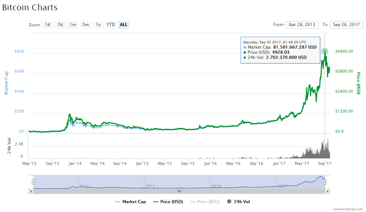
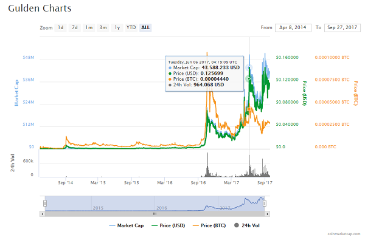

title: Blockchain! Blockchain! Blockchain! - Build Your Own Blockchains in JavaScript from Zero (Scratch)


# Alchemy - How-To Mine Digital Schilling? How-To Turn Digital Bits Into $$$ or €€€?

**Transactions (Hyper) Ledger Book**

| From                | To               | Amount  |
|---------------------|------------------|--------:|
| Grossklockner (†)   | Sepp             |    3798 |
| Grossvenediger (†)  | Franz            |    3666 |
| Dachstein (†)       | Sissi            |    2995 |
| Wildspitze (†)      | Maria            |    3768 |
|                     |                  |         |
| Sissi               | Eva              |     20  |
| Sepp                | Maria            |     17  |
| Franz               | Sissi            |      3  |
| Sepp                | Ferdl            |    100  |
|                     |                  |         |
| Franz               | Max              |     17  |
| Maria               | Adam             |      4  |

(†): Miner Transaction - New Schilling on the Market!

(Source: [openblockchains/schilling](https://github.com/openblockchains/schilling))


# Blockchain! Blockchain! Blockchain! Decentralize Payments. Decentralize Transactions. Decentralize Blockchains.

What's Blockchain?

- Distributed Database?
- Hyper Ledger Book?
- Consensus with Proof-of-Work or Proof-of-Stake?
- Digital Fingerprints? Cryptographic Hashes?
- Lottery? Central Bank?
- Byzantine-Generals Solution?

Yes. Yes. Yes. Blockchain! Blockchain! Blockchain!

(Source: [openblockchains/whatsblockchain](https://github.com/openblockchains/whatsblockchain))


# The Proof of the Pudding is ...  The Bitcoin (BTC) Blockchain(s)

A Success Story on the Blockchain.

May 22, 2010 - World's 1st Bitcoin Payment

A developer bought two pizzas using 10 000 Bitcoin (BTC) - a then-little-known digital (crypto)currency.
Estimated worth about $40.

Triva Q: How much is one Bitcoin worth today? Q: How much are 10 000 Bitcoin worth today?


# $20 Million Dollar Pizza Day - Celebrating the Birth of Bitcoin Alchemy - $$$



(Source: [coinmarketcap.com/currencies/bitcoin](https://coinmarketcap.com/currencies/bitcoin))


# Let's Build Your Own Blockchain in JavaScript (From Zero / Scratch)

Crypto God? JavaScript Ninja / Rockstar?

Yes, you can.


# Code, Code, Code - A Blockchain in JavaScript in 20 Lines! A Blockchain is a Data Structure

What's Blockchain?

It's a list (chain) of blocks linked and secured by digital fingerprints (also known as
crypto hashes).


```
const SHA256 = require( "js-sha256" )     // for hash checksum digest function SHA256

class Block {

  constructor(index, data, previousHash) {
    this.index        = index
    this.timestamp    = new Date()
    this.data         = data
    this.previousHash = previousHash
    this.hash         = this.calcHash()
  }

  calcHash() {
    var sha = SHA256.create()
    sha.update( this.index.toString() +
                this.timestamp.toString() +
                this.data +
                this.previousHash )
    return sha.hex()
  }
```

(Source: [openblockchains/awesome-blockchains/blockchain.js](https://github.com/openblockchains/awesome-blockchains/blob/master/blockchain.js/blockchain.js))

Yes, that's it.


# Code, Code, Code - A Blockchain in JavaScript in 20 Lines! A Blockchain is a Data Structure (Cont.)

Let's add two helpers (`first`, `next`) for building ("mining") blocks.

```
class Block {
  ...
  static first( data="Genesis" ) {    // create genesis (big bang! first) block
    // uses index zero (0) and arbitrary previousHash ("0")
    return new Block( 0, data, "0" )
  }

  static next( previous, data="Transaction Data..." ) {
    return new Block( previous.index+1, data, previous.hash )
  }
}
```

(Source: [openblockchains/awesome-blockchains/blockchain.js](https://github.com/openblockchains/awesome-blockchains/blob/master/blockchain.js/blockchain.js))

Let's get started -  build a blockchain a block at a time!

```
b0 = Block.first( "Genesis" )
b1 = Block.next( b0, "Transaction Data..." )
b2 = Block.next( b1, "Transaction Data......" )
b3 = Block.next( b2, "More Transaction Data..." )

blockchain = [b0, b1, b2, b3]

console.log( blockchain )
```


# Code, Code, Code - A Blockchain in JavaScript in 20 Lines! A Blockchain is a Data Structure (Cont.)

> Wait, so a blockchain is just a linked list?
>
> No. A linked list is only required to have a reference to the previous element,
> a block must have an identifier depending on the previous block's identifier,
> meaning that you cannot replace a block without recomputing every single block that comes after.
> In this implementation that happens as the previous digest is input in the calc_hash method.


will log something like:

```
[ Block {
      index: 0,
      timestamp: 2017-09-18T08:25:54,
      data: 'Genesis',
      previousHash: '0',
      hash:         'c396de4c03ddb5275661982adc75ce5fc5905d2a2457d1266c74436c1f3c50f1' },
    Block {
      index: 1,
      timestamp: 2017-09-18T08:25:54,
      data: 'Transaction Data...',
      previousHash: 'c396de4c03ddb5275661982adc75ce5fc5905d2a2457d1266c74436c1f3c50f1',
      hash:         '493131e09c069645c82795c96e4715cea0f5558be514b5096d853a5b9899154a' },
    Block {
      index: 2,
      timestamp: 2017-09-18T08:25:54,
      data: 'Transaction Data......',
      previousHash: '493131e09c069645c82795c96e4715cea0f5558be514b5096d853a5b9899154a',
      hash:         '97aa3cb5052615d60ff8e6b41bef606562588c4874f011970ac2f218e2f0f4a8' },
    Block {
      index: 3,
      timestamp: 2017-09-18T08:25:54,
      data: 'More Transaction Data...',
      previousHash: '97aa3cb5052615d60ff8e6b41bef606562588c4874f011970ac2f218e2f0f4a8',
      hash:         'e10e020f832e46c2b60e1c3c0412bd370b2fde5f0f782c16eb87d0313ea0d3a3' } ]
```


# What about Proof-of-Work? What about Consensus?

Making (Hash) Mining a Lottery - Find the Lucky Number

```
calcHash() {
  var sha = SHA256.create()
  sha.update( this.index.toString() +
              this.timestamp.toString() +
              this.data +
              this.previousHash )
  return sha.hex()
}
```

The computer (node) in the blockchain network that computes the
next block with a valid hash wins the lottery?

For adding a block to the chain you get a reward! You get 25 Bitcoin! (†)

Bitcoin adds a block every twenty minutes.

(†) The reward gets halfed. In Sep'17 you'll get 12.5 Bitcoin.


# What about Proof-of-Work? What about Consensus? (Cont.)

Random SHA256 hash #1: `c396de4c03ddb5275661982adc75ce5fc5905d2a2457d1266c74436c1f3c50f1`

Random SHA256 hash #2: `493131e09c069645c82795c96e4715cea0f5558be514b5096d853a5b9899154a`

Triva Q: What's SHA256?

- (A) Still Hacking Anyway
- (B) Secure Hash Algorithm
- (C) Sweet Home Austria
- (D) Super High Aperture


# What about Proof-of-Work? What about Consensus? (Cont.)

A: SHA256 == Secure Hash Algorithms 256 Bits

Trivia: Designed by the National Security Agency (NSA) of the United States of America (USA).

Secure == Random  e.g. Change one Letter and the Hash will Change Completely

Making (Hash) Mining a Lottery - Find the Lucky Number

Find a hash that starts with ten leading zeros e.g.

`0000000000069645c82795c96e4715cea0f5558be514b5096d853a5b9899154a`

Hard to compute! Easy to check / validate.


# What about Proof-of-Work? What about Consensus? (Cont.)

Making (Hash) Mining a Lottery - Find the Lucky Number (Nonce)

```
computeHashWithProofOfWork( difficulty="00" ) {
    var nonce = 0
    while( true ) {
      var hash = this.calcHashWithNonce( nonce )
      if( hash.startsWith( difficulty ))
        return nonce, hash    // bingo! proof of work if hash starts with leading zeros (00)
      else
        nonce += 1            // keep trying (and trying and trying)
    }
}

calcHashWithNonce( nonce=0 ) {
    var sha = SHA256.create()
    sha.update( nonce.toString() +
                this.index.toString() +
                this.timestamp.toString() +
                this.data +
                this.previousHash )
    return sha.hex()
}
```

(Source: [awesome-blockchains/blockchain_with_proof_of_work.js](https://github.com/openblockchains/awesome-blockchains/blob/master/blockchain.js/blockchain_with_proof_of_work.js))


# The World's Worst Database - Bitcoin Blockchain Mining

- Uses approximately the same amount of electricity as could power an average American household
  for a day per transaction
- Supports 3 transactions / second across a global network with millions of CPUs/purpose-built ASICs
- Takes over 10 minutes to "commit" a transaction
- Doesn't acknowledge accepted writes: requires you read your writes,
  but at any given time you may be on a blockchain fork, meaning your write might not actually
  make it into the "winning" fork of the blockchain (and no, just making it into the mempool doesn't count).
  In other words: "blockchain technology" cannot by definition tell you if a given write is ever
  accepted/committed except by reading it out of the blockchain itself (and even then)
- Can only be used as a transaction ledger denominated in a single currency,
  or to store/timestamp a maximum of 80 bytes per transaction

(Source: [Tony Arcieri - On the dangers of a blockchain monoculture](https://tonyarcieri.com/on-the-dangers-of-a-blockchain-monoculture))


# Tulip Mania Quiz - Win 100 Schilling on the Blockchain!

Q: Tulip Mania Bubble in Holland - What Year?

- (A) 1561
- (B) 1637
- (C) 1753
- (D) 1817

Q: What's the Name of the Most Expensive Tulip?

- (A) Admiral van Eijck
- (B) Admiral of Admirals
- (C) Semper Augustus
- (C) Semper Cesarus


# Tulips on the Blockchain! Adding Transactions

Learn by Example from the Real World (Anno 1637) - Buy! Sell! Hold! Enjoy the Beauty of Admiral of Admirals, Semper Augustus and More.

**Transactions (Hyper) Ledger Book**

| From                | To           | What                      | Qty |
|---------------------|--------------|---------------------------|----:|
| Dutchgrown (†)      | Vincent      | Tulip Bloemendaal Sunset  |  10 |
| Keukenhof (†)       | Anne         | Tulip Semper Augustus     |   7 |
|                     |              |                           |     |
| Flowers (†)         | Ruben        | Tulip Admiral van Eijck   |   5 |
| Vicent              | Anne         | Tulip Bloemendaal Sunset  |   3 |
| Anne                | Julia        | Tulip Semper Augustus     |   1 |
| Julia               | Luuk         | Tulip Semper Augustus     |   1 |
|                     |              |                           |     |
| Bloom & Blossom (†) | Daisy        | Tulip Admiral of Admirals |   8 |
| Vincent             | Max          | Tulip Bloemendaal Sunset  |   2 |
| Anne                | Martijn      | Tulip Semper Augustus     |   2 |
| Ruben               | Julia        | Tulip Admiral van Eijck   |   2 |
|                     |              |                           |     |
| Teleflora (†)       | Max          | Tulip Red Impression      |  11 |
| Anne                | Naomi        | Tulip Bloemendaal Sunset  |   1 |
| Daisy               | Vincent      | Tulip Admiral of Admirals |   3 |
| Julia               | Mina         | Tulip Admiral van Eijck   |   1 |
|                     |              |                           |     |
| Max                 | Isabel       | Tulip Red Impression      |   2 |

(†): Grower Transaction - New Tulips on the Market!

(Source: [openblockchains/tulips](https://github.com/openblockchains/tulips))


# Tulips on the Blockchain! Adding Transactions (Cont.)

**Quotes - Blockchains are the next Internets / Tulips**

> People who compare digital tokens to tulips are essentially saying digital tokens are a bubble backed
> by nothing but pure hype and speculation.
>
> What they fail to understand is that tulips come from dirt, not a blockchain.
>
> And as we all know, blockchain is possibly the best technological innovation since the internet.
> It will have a tremendous impact on global business and society in general.
> -- [TulipToken](http://tuliptoken.com)


# Tulips on the Blockchain! Adding Transactions (Cont.)

```
let b0 = Block.first(
        { from: "Dutchgrown", to: "Vincent", what: "Tulip Bloemendaal Sunset", qty: 10 },
        { from: "Keukenhof",  to: "Anne",    what: "Tulip Semper Augustus",    qty: 7  } )

let b1 = Block.next( b0,
        { from: "Flowers", to: "Ruben", what: "Tulip Admiral van Eijck",  qty: 5 },
        { from: "Vicent",  to: "Anne",  what: "Tulip Bloemendaal Sunset", qty: 3 },
        { from: "Anne",    to: "Julia", what: "Tulip Semper Augustus",    qty: 1 },
        { from: "Julia",   to: "Luuk",  what: "Tulip Semper Augustus",    qty: 1 } )

let b2 = Block.next( b1,
        { from: "Bloom & Blossom", to: "Daisy",   what: "Tulip Admiral of Admirals", qty: 8 },
        { from: "Vincent",         to: "Max",     what: "Tulip Bloemendaal Sunset",  qty: 2 },
        { from: "Anne",            to: "Martijn", what: "Tulip Semper Augustus",     qty: 2 },
        { from: "Ruben",           to: "Julia",   what: "Tulip Admiral van Eijck",   qty: 2 } )
...
```


# Tulips on the Blockchain! Adding Transactions (Cont.)

resulting in:

```
[ Block {
    index:     0,
    timestamp: 1637-09-25 17:39:21,
    data:
     [ { from: 'Dutchgrown', to: 'Vincent',  what: 'Tulip Bloemendaal Sunset', qty: 10 },
       { from: 'Keukenhof',  to: 'Anne',     what: 'Tulip Semper Augustus',    qty: 7 } ],
    previousHash: '0',
    hash:         '7cb2df9eee29ca77c99eb4591a25dcbdfa9609aff2bd3558d1a0fe22acd08a51' },
  Block {
    index:     1,
    timestamp: 1637-09-25 17:49:21,
    data:
     [ { from: 'Flowers',  to: 'Ruben',  what: 'Tulip Admiral van Eijck',   qty: 5 },
       { from: 'Vicent',   to: 'Anne',   what: 'Tulip Bloemendaal Sunset',  qty: 3 },
       { from: 'Anne',     to: 'Julia',  what: 'Tulip Semper Augustus',     qty: 1 },
       { from: 'Julia',    to: 'Luuk',   what: 'Tulip Semper Augustus',     qty: 1 } ],
    previousHash: '7cb2df9eee29ca77c99eb4591a25dcbdfa9609aff2bd3558d1a0fe22acd08a51',
    hash:         'a7464e98290039f467e7abf6699180205f5151e76b57a79b39f43acc39d75660' },
  Block {
    index:     2,
    timestamp: 1637-09-25 17:59:21,
    data:
     [ { from: 'Bloom & Blossom', to: 'Daisy',    what: 'Tulip Admiral of Admirals', qty: 8 },
       { from: 'Vincent',         to: 'Max',      what: 'Tulip Bloemendaal Sunset',  qty: 2 },
       { from: 'Anne',            to: 'Martijn',  what: 'Tulip Semper Augustus',     qty: 2 },
       { from: 'Ruben',           to: 'Julia',    what: 'Tulip Admiral van Eijck',   qty: 2 } ],
    previousHash: 'a7464e98290039f467e7abf6699180205f5151e76b57a79b39f43acc39d75660',
    hash:         'b7e4952f801651c1e14d61d77b869d18268b46c468923089f1da33e3959b56b9' },
  ...
]
```


# What's Blockchain Lite - JavaScript Edition?  

blockchain-lite library / module (npm: [`blockchain-lite`](https://www.npmjs.com/package/blockchain-lite)) -
build your own blockchain with crypto hashes -
revolutionize the world with blockchains, blockchains, blockchains one block at a time

**Usage**

Let's get started.  Build your own blockchain one block at a time.
Example:

``` js
const Blocks = require( "blockchain-lite" )

// use basic block
let Block = Blocks.basic

let b0 = Block.first( 'Genesis' )
let b1 = Block.next( b0, 'Transaction Data...' )
let b2 = Block.next( b1, 'Transaction Data......' )
let b3 = Block.next( b2, 'More Transaction Data...' )

let blockchain = [b0, b1, b2, b3]

console.log( blockchain )
```


# Case Study -  Dutch Gulden on the Blockchain!



(Source: [coinmarketcap.com/currencies/gulden](https://coinmarketcap.com/currencies/gulden))


# Schilling! Schilling! on the Blockchain! Rock-Solid Alpine Dollar from Austria

Who's in? Invest Now!

Learn more @ [openblockchains/schilling](https://github.com/openblockchains/schilling)


# Bonus: Blockchain Articles

[**Reflections on the Blockchain**](http://rufuspollock.com/2016/07/02/reflections-on-the-blockchain) by Rufus Pollock (Open Knowledge Foundation), July 2016 --
_The DAO: Code is not Law – and It’s Dangerous to Think So ++
The Internet changed the world - surely the Blockchain will too? ++
Gold-rush or Internet-rush? ++
Governance Matters in Bitcoin ++
The Myth of a Costless, Ownerless Network ++
Lessons from History_

[**On the Dangers of a Blockchain Monoculture**](https://tonyarcieri.com/on-the-dangers-of-a-blockchain-monoculture) by Tony Arcieri, January 2016 --
_The Bitcoin blockchain: the world's worst database ++
Next-generation protocols ++
Decentralized ledger protocols ++
Bitcoin-NG ++
Blockchain! Blockchain! Blockchain! ++
The great decentralized database in the sky_


[**I Don’t Believe in Blockchain**](https://www.tbray.org/ongoing/When/201x/2017/05/13/Not-Believing-in-Blockchain) by Tim Bray, May 2017


[**Minimum Viable Blockchain**](https://www.igvita.com/2014/05/05/minimum-viable-block-chain/) by Ilya Grigorik, May 2014 --
_Securing transactions with triple-entry bookkeeping ++
Securing transactions with PKI ++
Balance = Σ(receipts) ++
Multi-party transfers & verification ++
Double-spending and distributed consensus -
 Requirements for a distributed consensus network;
 Protecting the network from Sybil attacks;
Proof-of-work as a participation requirement ++
Building the minimum viable blockchain -
 Adding "blocks" & transaction fee incentives;
 Racing to claim the transaction fees;
 Resolving chain conflicts;
 Blocks are never final ++
Properties of the (minimum viable) blockchain_

[**Blockchains by analogies and applications: How blockchain compares to Git, Raft, and other technologies.**](https://www.oreilly.com/ideas/blockchains-by-analogies-and-applications)
by Kieren James-Lubin, January 2016 --
_Blockchains are databases ++
Understanding transactions ++
Persistent, replicated databases (related technology: Git) ++
Peer-to-peer networks (related technology: BitTorrent) ++
Distributed consensus (related technology: distributed databases, Raft) ++
Minting new coins (mining) ++
Embedded identities (related technology: TLS) ++
Smart contracts: Like SQL expressions & triggers ++
What can we really do with blockchains?_


# Bonus: Blockchain Books

[**Attack of the 50 Foot Blockchain: Bitcoin, Blockchain, Ethereum & Smart Contracts**](https://davidgerard.co.uk/blockchain/table-of-contents/) by David Gerard, London, 2017 --
_What is a bitcoin? ++
The Bitcoin ideology ++
The incredible promises of Bitcoin! ++
Early Bitcoin: the rise to the first bubble ++
How Bitcoin mining centralised ++
Who is Satoshi Nakamoto? ++
Spending bitcoins in 2017 ++
Trading bitcoins in 2017: the second crypto bubble ++
Altcoins ++
Smart contracts, stupid humans ++
Business bafflegab, but on the Blockchain ++
Case study: Why you can’t put the music industry on a blockchain_

[**Mastering Bitcoin - Programming the Open Blockchain**](https://github.com/bitcoinbook/bitcoinbook/blob/second_edition/ch09.asciidoc) 2nd Edition,
by Andreas M. Antonopoulos, 2017 - FREE (Online Source Version) --
_What Is Bitcoin? ++
How Bitcoin Works ++
Bitcoin Core: The Reference Implementation ++
Keys, Addresses ++
Wallets ++
Transactions ++
Advanced Transactions and Scripting ++
The Bitcoin Network ++
The Blockchain ++
Mining and Consensus ++
Bitcoin Security ++
Blockchain Applications_

[**Blockchain for Dummies, IBM Limited Edition**](https://www.ibm.com/blockchain/what-is-blockchain.html) by Manav Gupta, 2017 - FREE (Digital Download w/ Email) --
_Grasping Blockchain Fundamentals ++
Taking a Look at How Blockchain Works ++
Propelling Business with Blockchains ++
Blockchain in Action: Use Cases ++
Hyperledger, a Linux Foundation Project ++
Ten Steps to Your First Blockchain application_


# Bonus: Awesome Blockchains

A collection about awesome blockchains - open distributed public databases w/ crypto hashes incl. git ;-). Blockchains are the new tulips. Distributed is the new centralized.

More @ [openblockchains/awesome-blockchains](https://github.com/openblockchains/awesome-blockchains)


# Bonus: Git, Git, Git - The Stupid Content Tracker with Crypto Hashes

_Everything is local. Distributed is the new centralized._

> Yep, that's the joke. Nobody has been able to explain to me how the "blockchain" buzzword is significantly different to "git repo".
> -- [Yaakov](https://twitter.com/yaakov_h/status/902659507255312384)
>
> But if you said "let's build a currency where all transactions are stored in a git repo"
> you wouldn't be taken seriously for even 24 hrs.
> -- [Yaakov](https://twitter.com/yaakov_h/status/902659847224664064)

> Soon explaining git like "a git repo is like a blockchain with commits instead of blocks".
> -- [Nicolás Berger](https://twitter.com/nicoberger/status/901776907418697729)
>
> "A local branch is like a state channel. It can be pushed and merged into the master blockchain at any moment."
> -- [Nicolás Berger](https://twitter.com/nicoberger/status/901777571456614400)

> The #Blockchain has changed the world. Here I make the argument that the #Blockchain is just like #git.
> -- [Jackson Kelley](https://twitter.com/sjkelleyjr/status/901464041163341824)
