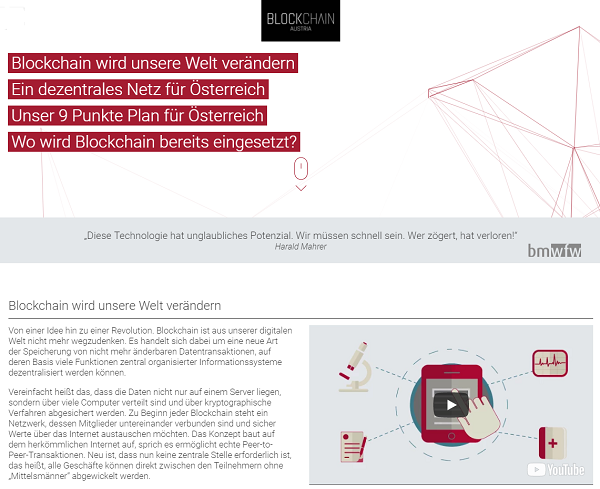

title: Land der Berge! Land der Blockchain! Austria

# Land der Berge! Land der Blockchain! Blockchain! Blockchain! - Austria

> Diese Technologie hat unglaubliches Potenzial. Wir müssen schnell sein. Wer zögert, hat verloren!
>
> -- Harald Mahrer, Bundesminster Bundesminister für Wissenschaft, Forschung und Wirtschaft (bmwfw)

**Blockchain wird unsere Welt verändern.**
Von einer Idee hin zu einer Revolution. Blockchain ist aus unserer digitalen Welt nicht mehr wegzudenken...

**Ein dezentrales Netz für Österreich.**
Österreich ist am Sprung zur europäischen Innovationsspitze...

Das World Economic Forum prognostizierte, dass schon im Jahr 2025
insgesamt 10 Prozent des weltweiten Bruttoinlandsprodukts
mit Hilfe der Blockchain-Technologie abgewickelt werden.
Wenn wir uns heute nicht mit derartigen Technologien beschäftigen, tun es andere.

> Es gibt kein sichereres oder transparenteres System, um Daten zu verwalten.
>
> -- Harald Mahrer, Bundesminster Bundesminister für Wissenschaft, Forschung und Wirtschaft (bmwfw)

(Source: [blockchain-austria.gv.at](https://www.blockchain-austria.gv.at))

# Land der Berge! Land der Blockchain! Blockchain! Blockchain! - Austria

Keep Calm and Learn Git First.

> Wo ist die #Git Austria Initiative um (sicher & transparent)
> öffentliche  Daten, Dokumente und Kode zu verwalten? #digital #austria #bmwfw
>
> -- [Gerald Bauer @ Vienna.html](https://twitter.com/viennahtml/status/910776683552264195)

# Land der Berge! Land der Blockchain! Blockchain! Blockchain! - Austria

> #Blockchain - eine Potenzialanalyse. Experten am Wort. #eGov
> [Kundenmagazin / Im Zeichen der Blockchain](https://www.brz.gv.at/downloads/kundenmagazin_neu/Im_Zeichen_der_Blockchain_readit_0217_screen.pdf?63xf7a)
>
> -- [Bundesrechenzentrum (BRZ)](https://twitter.com/brz_gmbh/status/910424777671749632),
> Marktführender Technologiepartner des öffentlichen Sektors
> in Österreich #egov #blockchain #opendata #smartcity

# Land der Berge! Land der Blockchain! Blockchain! Blockchain! - Austria

> Gruss vom Österr. #Blockchain Hersteller.
> Lieferbar in Ruby, Python & JavaScript. Gratis.
> Mehr unter [github.com/openblockchains](https://github.com/openblockchains).  
> Cheers. Prost.
>
> -- [Gerald Bauer @ Vienna.html](https://twitter.com/viennahtml/status/910770299108458496)

