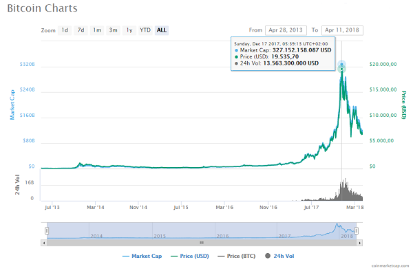
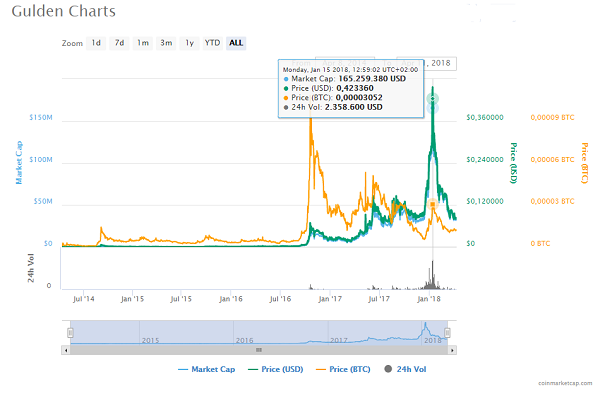
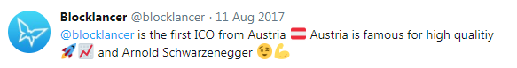
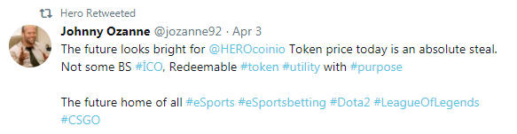
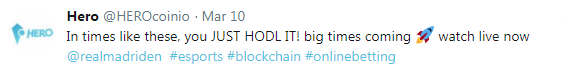
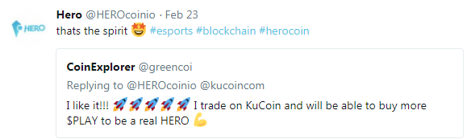
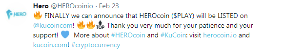
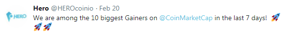
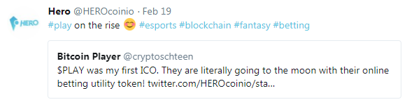
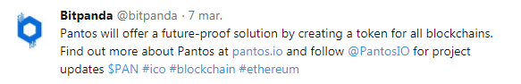

title: Blockchain! Blockchain! Blockchain! - Build Your Own Blockchains in Go from Zero (Scratch)


# Alchemy - How-To Mine Digital Schilling? How-To Turn Digital Bits Into $$$ or €€€?

**Transactions (Hyper) Ledger Book**

| From                | To               | Amount  |
|---------------------|------------------|--------:|
| Grossklockner (†)   | Sepp             |    3798 |
| Grossvenediger (†)  | Franz            |    3666 |
| Dachstein (†)       | Sissi            |    2995 |
| Wildspitze (†)      | Maria            |    3768 |
|                     |                  |         |
| Sissi               | Eva              |     20  |
| Sepp                | Maria            |     17  |
| Franz               | Sissi            |      3  |
| Sepp                | Ferdl            |    100  |
|                     |                  |         |
| Franz               | Max              |     17  |
| Maria               | Adam             |      4  |

(†): Miner Transaction - New Schilling on the Market!

(Source: [bitshilling/bitshilling](https://github.com/bitshilling/bitshilling))


# Blockchain! Blockchain! Blockchain! Decentralize Payments. Decentralize Transactions. Decentralize Blockchains.

What's Blockchain?

- Distributed Database?
- Hyper Ledger Book?
- Consensus with Proof-of-Work or Proof-of-Stake?
- Digital Fingerprints? Cryptographic Hashes?
- Lottery? Central Bank?
- Byzantine-Generals Solution?

Yes. Yes. Yes. Blockchain! Blockchain! Blockchain!

(Source: [openblockchains/whatsblockchain](https://github.com/openblockchains/whatsblockchain))


# The Proof of the Pudding is ...  The Bitcoin (BTC) Blockchain(s)

A Success Story on the Blockchain.

May 22, 2010 - World's 1st Bitcoin Payment

A developer bought two pizzas using 10 000 Bitcoin (BTC) - a then-little-known digital (crypto)currency.
Estimated worth about $40.

Triva Q: How much is one Bitcoin worth today? Q: How much are 10 000 Bitcoin worth today?


# $20 Million Dollar Pizza Day - Celebrating the Birth of Bitcoin Alchemy - $$$



(Source: [coinmarketcap.com/currencies/bitcoin](https://coinmarketcap.com/currencies/bitcoin))


# Let's Build Your Own Blockchain in Go (From Zero / Scratch)

Crypto God? Go Ninja / Rockstar?

Yes, you can.


# Code, Code, Code - A Blockchain in Go in 20 Lines! A Blockchain is a Data Structure

What's Blockchain?

It's a list (chain) of blocks linked and secured by digital fingerprints (also known as
crypto hashes).


``` go
package main

import "..."

type Block struct {
  Timestamp int64       // seconds since (unix) epoch (1970-01-01)
  Data      string
  PrevHash  string
  Hash      string  
}


func calcHash( data string ) string {
  hashed := sha256.Sum256( []byte(data) )
  return binToStr( hashed[:] )   // note: [:] converts [32]byte to []byte
}


func NewBlock(data string, prevHash string) Block {
  timestamp := time.Now().Unix()
  hash      := calcHash( intToStr(timestamp) + prevHash + data )

  return Block { timestamp, data, prevHash, hash }
}
```

(Source: [openblockchains/awesome-blockchains/blockchain.go](https://github.com/openblockchains/awesome-blockchains/blob/master/blockchain.go/blockchain.go))

Yes, that's it.


# Code, Code, Code - A Blockchain in Go in 20 Lines! A Blockchain is a Data Structure (Cont.)


Let's get started -  build a blockchain a block at a time!

``` go
func main() {

  b0 := NewBlock( "Hello, Cryptos!", "0000000000000000000000000000000000000000000000000000000000000000" )
  b1 := NewBlock( "Hello, Cryptos! - Hello, Cryptos!", b0.Hash )

  blockchain := []Block {b0, b1}
}
```


# Code, Code, Code - A Blockchain in Go in 20 Lines! A Blockchain is a Data Structure (Cont.)

> Wait, so a blockchain is just a linked list?
>
> No. A linked list is only required to have a reference to the previous element,
> a block must have an identifier depending on the previous block's identifier,
> meaning that you cannot replace a block without recomputing every single block that comes after.
> In this example that happens as the previous digest is input in the calcHash method.


Will print something like:

``` go
fmt.Println( b0 )
// {1522687834 Hello, Cryptos!
//    0000000000000000000000000000000000000000000000000000000000000000
//    d85da0f449ff9ddc2c5ba638b23b9524381811227eb463b8c9e0be40dc1b1a8a}
fmt.Println( len( b0.Hash ))
// => 64
fmt.Println( len( b0.PrevHash ))
// => 64

fmt.Println( b1 )
// {1522687834 Hello, Cryptos! - Hello, Cryptos!
//     d85da0f449ff9ddc2c5ba638b23b9524381811227eb463b8c9e0be40dc1b1a8a
//     e48ba730165d88e15435483fc3a60714be526096a0c9a71ad10623340e33c7e3}
fmt.Println( len( b1.Hash ))
// => 64
fmt.Println( len( b1.PrevHash ))
// => 64

fmt.Println( blockchain )
// => [{1522687834 Hello, Cryptos!
//           0000000000000000000000000000000000000000000000000000000000000000
//           d85da0f449ff9ddc2c5ba638b23b9524381811227eb463b8c9e0be40dc1b1a8a}
//     {1522687834 Hello, Cryptos! - Hello, Cryptos!
//           d85da0f449ff9ddc2c5ba638b23b9524381811227eb463b8c9e0be40dc1b1a8a
//           e48ba730165d88e15435483fc3a60714be526096a0c9a71ad10623340e33c7e3}]
```


# What about Proof-of-Work? What about Consensus?

Making (Hash) Mining a Lottery - Find the Lucky Number

``` go
hash := calcHash( intToStr(timestamp) + prevHash + data )
```

The computer (node) in the blockchain network that computes the
next block with a valid hash wins the lottery.

For adding a block to the chain you get a reward! You get ~25~ 12.5 Bitcoin! (†)

Bitcoin adds a block every ten minutes.

(†) The reward gets halfed about every two years. In Sep'17 you'll get 12.5 Bitcoin.


# What about Proof-of-Work? What about Consensus? (Cont.)

Random SHA256 hash #1: `c396de4c03ddb5275661982adc75ce5fc5905d2a2457d1266c74436c1f3c50f1`

Random SHA256 hash #2: `493131e09c069645c82795c96e4715cea0f5558be514b5096d853a5b9899154a`

Triva Q: What's SHA256?

- (A) Still Hacking Anyway
- (B) Secure Hash Algorithm
- (C) Sweet Home Austria
- (D) Super High Aperture


# What about Proof-of-Work? What about Consensus? (Cont.)

A: SHA256 == Secure Hash Algorithms 256 Bits

Trivia: Designed by the National Security Agency (NSA) of the United States of America (USA).

Secure == Random  e.g. Change one Letter and the Hash will Change Completely

Making (Hash) Mining a Lottery - Find the Lucky Number

Find a hash that starts with ten leading zeros e.g.

`0000000000069645c82795c96e4715cea0f5558be514b5096d853a5b9899154a`

Hard to compute! Easy to check / validate.


# What about Proof-of-Work? What about Consensus? (Cont.)

Making (Hash) Mining a Lottery - Find the Lucky Number (Nonce)

Nonce == Number used once

``` go
func calcHash( data string ) string {
  hashed := sha256.Sum256( []byte(data) )
  return binToStr( hashed[:] )   // note: [:] converts [32]byte to []byte
}

func computeHashWithProofOfWork( data string ) (int64,string) {
  nonce := int64( 0 )
  for {
    hash := calcHash( intToStr(nonce) + data )
    if strings.HasPrefix( hash, "0000" ) {
        return nonce,hash    // bingo! proof of work if hash starts with leading zeros (0000)
    } else {
        nonce += 1           // keep trying (and trying and trying)
    }
  }
}
```

(Source: [awesome-blockchains/blockchain_with_proof_of_work.go](https://github.com/openblockchains/awesome-blockchains/blob/master/blockchain.go/blockchain_with_proof_of_work.go))


# What about Proof-of-Work? What about Consensus? (Cont.)

Making (Hash) Mining a Lottery - Find the Lucky Number (Nonce)

Nonce == Number used once

``` go
type Block struct {
  Timestamp  int64       // seconds since (unix) epoch (1970-01-01)
  Data       string
  PrevHash   string
  Hash       string
  Nonce      int64       // number used once - lucky (mining) lottery number
}

func NewBlock( data string, prevHash string ) Block {
  timestamp   := time.Now().Unix()
  nonce, hash := computeHashWithProofOfWork( intToStr(timestamp) + prevHash + data )

  return Block { timestamp, data, prevHash, hash, nonce }
}
```


# What about Proof-of-Work? What about Consensus? (Cont.)

Let's rerun the sample with the proof of work machinery added.
Now the sample will print something like:

``` go
b0 := NewBlock( "Hello, Cryptos!", "0000000000000000000000000000000000000000000000000000000000000000" )
b1 := NewBlock( "Hello, Cryptos! - Hello, Cryptos!", b0.Hash )

fmt.Println( b0 )
// {1522691756 Hello, Cryptos!
//    0000000000000000000000000000000000000000000000000000000000000000
//    00009f597a8e28fc42a450c0ed2eff1b6507f76f6a7d1e112686700ce37e3676
//    42278}
fmt.Println( len( b0.Hash ))
// => 64
fmt.Println( len( b0.PrevHash ))
// => 64

fmt.Println( b1 )
// {1522691756 Hello, Cryptos! - Hello, Cryptos!
//     00009f597a8e28fc42a450c0ed2eff1b6507f76f6a7d1e112686700ce37e3676
//     00009ef5ea432f840c3fb23dbedb5cce4c72e2951a140c1289dda1fedbcd6e99
//     105106}
```

See the difference?
All hashes now start with leading zeros (`0000`)
and the nonces (e.g. `42278` or `105106`)
are the random "lucky numbers" that makes it happen.
That's the magic behind the proof of work.


# What's Your Hash Rate?

``` go
for factor := 1; factor++; factor <= 7  {
   difficulty := strings.Repeat( "0", factor )
   fmt.Printf( "\nDifficulty: %s (%d bits)\n", difficulty, len(difficulty)*4 )

   fmt.Println( "Starting search..." )
   t1 := time.Now()
   nonce, _ := computeHashWithProofOfWork( "Hello, Cryptos!", difficulty )
   t2 := time.Now()

   delta := t2.Sub( t1 )
   fmt.Printf( "Elapsed Time: %s, Hashes Calculated: %d\n", delta, nonce )

   if delta.Seconds() > 0.001 {
     hashrate := float64(nonce)/delta.Seconds()
     fmt.Printf( "Hash Rate: %d hashes per second\n", int64(hashrate))
   }
}
```

(Source: [awesome-sha256/hashrate.go](https://github.com/openblockchains/awesome-sha256/blob/master/hashrate.go))


# What's Your Hash Rate? (Cont.)

Prints:

```
Difficulty: 0 (4 bits)
Starting search...
Elapsed Time: 0s, Hashes Calculated: 56

Difficulty: 00 (8 bits)
Starting search...
Elapsed Time: 1.0001ms, Hashes Calculated: 143
Hash Rate: 142985 hashes per second

Difficulty: 000 (12 bits)
Starting search...
Elapsed Time: 5.0002ms, Hashes Calculated: 3834
Hash Rate: 766769 hashes per second

Difficulty: 0000 (16 bits)
Starting search...
Elapsed Time: 33.0019ms, Hashes Calculated: 26762
Hash Rate: 810923 hashes per second

Difficulty: 00000 (20 bits)
Starting search...
Elapsed Time: 137.0078ms, Hashes Calculated: 118592
Hash Rate: 865585 hashes per second

Difficulty: 000000 (24 bits)
Starting search...
Elapsed Time: 26.5378148s, Hashes Calculated: 21554046
Hash Rate: 812201 hashes per second
```


# Triva Quiz: What's the Bitcoin Hash Rate?

A: About 25 million trillions of hashes per second (in April 2018)

Estimated number of tera hashes per second (trillions of hashes per second)
the Bitcoin network is performing.


(Source: [blockchain.info](https://blockchain.info/charts/hash-rate))


# The World's Worst Database - Bitcoin Blockchain Mining

- Uses approximately the same amount of electricity as could power an average American household
  for a day per transaction
- Supports 3 transactions / second across a global network with millions of CPUs/purpose-built ASICs
- Takes over 10 minutes to "commit" a transaction
- Doesn't acknowledge accepted writes: requires you read your writes,
  but at any given time you may be on a blockchain fork, meaning your write might not actually
  make it into the "winning" fork of the blockchain (and no, just making it into the mempool doesn't count).
  In other words: "blockchain technology" cannot by definition tell you if a given write is ever
  accepted/committed except by reading it out of the blockchain itself (and even then)
- Can only be used as a transaction ledger denominated in a single currency,
  or to store/timestamp a maximum of 80 bytes per transaction

(Source: [Tony Arcieri - On the dangers of a blockchain monoculture](https://tonyarcieri.com/on-the-dangers-of-a-blockchain-monoculture))


# Tulip Mania Quiz - Win 100 Schilling on the Blockchain!

Q: Tulip Mania Bubble in Holland - What Year?

- (A) 1561
- (B) 1637
- (C) 1753
- (D) 1817

Q: What's the Name of the Most Expensive Tulip?

- (A) Admiral van Eijck
- (B) Admiral of Admirals
- (C) Semper Augustus
- (C) Semper Cesarus


# Tulips on the Blockchain! Adding Transactions

Learn by Example from the Real World (Anno 1637) - Buy! Sell! Hold! Enjoy the Beauty of Admiral of Admirals, Semper Augustus and More.

**Transactions (Hyper) Ledger Book**

| From                | To           | What                      | Qty |
|---------------------|--------------|---------------------------|----:|
| Dutchgrown (†)      | Vincent      | Tulip Bloemendaal Sunset  |  10 |
| Keukenhof (†)       | Anne         | Tulip Semper Augustus     |   7 |
|                     |              |                           |     |
| Flowers (†)         | Ruben        | Tulip Admiral van Eijck   |   5 |
| Vicent              | Anne         | Tulip Bloemendaal Sunset  |   3 |
| Anne                | Julia        | Tulip Semper Augustus     |   1 |
| Julia               | Luuk         | Tulip Semper Augustus     |   1 |
|                     |              |                           |     |
| Bloom & Blossom (†) | Daisy        | Tulip Admiral of Admirals |   8 |
| Vincent             | Max          | Tulip Bloemendaal Sunset  |   2 |
| Anne                | Martijn      | Tulip Semper Augustus     |   2 |
| Ruben               | Julia        | Tulip Admiral van Eijck   |   2 |
|                     |              |                           |     |
| Teleflora (†)       | Max          | Tulip Red Impression      |  11 |
| Anne                | Naomi        | Tulip Bloemendaal Sunset  |   1 |
| Daisy               | Vincent      | Tulip Admiral of Admirals |   3 |
| Julia               | Mina         | Tulip Admiral van Eijck   |   1 |
|                     |              |                           |     |
| Max                 | Isabel       | Tulip Red Impression      |   2 |

(†): Grower Transaction - New Tulips on the Market!

(Source: [openblockchains/tulips](https://github.com/openblockchains/tulips))


# Tulips on the Blockchain! Adding Transactions (Cont.)

**Quotes - Blockchains are the next Internets / Tulips**

> People who compare digital tokens to tulips are essentially saying digital tokens are a bubble backed
> by nothing but pure hype and speculation.
>
> What they fail to understand is that tulips come from dirt, not a blockchain.
>
> And as we all know, blockchain is possibly the best technological innovation since the internet.
> It will have a tremendous impact on global business and society in general.
> -- [TulipToken](http://tuliptoken.com)


# Tulips on the Blockchain! Adding Transactions (Cont.)


``` go
  to be done
```


# Tulips on the Blockchain! Adding Transactions (Cont.)

resulting in:

``` go
   to be done
```


# What's Blockchain Lite - Go Edition?  (Upcoming)

blockchain-lite library (github: [`openblockchains/blockchain.lite.go`](https://github.com/openblockchains/blockchain.lite.go) -
build your own blockchain with crypto hashes -
revolutionize the world with blockchains, blockchains, blockchains one block at a time

**Usage**

Let's get started.  Build your own blockchain one block at a time.

``` go
import(
   blk "github.com/openblockchains/blockchain.lite.go"
)

b0 := blk.NewBlock( "Hello, Cryptos!", "0000000000000000000000000000000000000000000000000000000000000000" )
b1 := blk.NewBlock( "Hello, Cryptos! - Hello, Cryptos!", b0.Hash )

blockchain := []Block {b0, b1}

fmt.Println( blockchain )
```


# Case Study -  Dutch Gulden on the Blockchain!



(Source: [coinmarketcap.com/currencies/gulden](https://coinmarketcap.com/currencies/gulden))


# Schilling! Schilling! on the Blockchain! Rock-Solid Alpine Dollar from Austria

Who's in? Invest now!

Crypto #Schilling on the #Blockchain in 197 Days 7 Hours 30 Minutes!

Join the Rock-Solid Alpine Dollar Movement!

Learn more @ [bitshilling/bitshilling](https://github.com/bitshilling)


# What's Next? Beyond Currencies / Money

Crypto Collectibles - Non Fungible Tokens (NFTs) - Unique Bits & Bytes on the Blockchain

- Fun, Fun, Fun - Blockchain Gambling Casinos
  - Kitties, Puppies, Dragons, Lambos, ...
- Assets, Deeds, Titles ,...
  - Land, Houses, Appartments, ...
  - Tickets, ...


# CryptoKitties (Yes, Cute Little Cartoon Cats) on the Blockchain!

Collectible. Breedable. Adorable.

Collect and breed digital cats. Start meow. Buy! Sell! Hodl!

> - Fabulous Persian Spock Gerbil Gold Cottoncandy - Extremely rare gen 5 swift virgin | 2.9 ETH
> - Rarity: 0.00264% Gen 5 JAGUAR FABULOUS GOLD DALI!! VIRGIN!
> - Rarity: 0.0015% Princess Bubblegum is now for sale! Gen 12 | Brisk | Virgin | Chartreux | Bubblegum | Otaku | Emeraldgreen | Saycheese | Mauveover | Spock - Starts ETH 20/Ends ETH 10
> - Gold ducat, Gen 5, Virgin, Swift. Very cheap
> - Cheap Gen 1 cute kittie with rare genes! Only 0.125 ETH
> - UNIQUE Virgin Peach Googly Gold Mauveover gen:2 cooldown:1 0.87992% RARE
> - SUPER CHEAP: Gerbil, Ragdoll, Scarlet, Chestnut, Cotton Candy!!! 0.02 ETH (~$14)
> - I'm giving away a Gen 1 FAST Gold for free...
>
> -- [CrypoKittiesMarket](https://www.reddit.com/r/CryptoKittiesMarket)

Learn more @ [cryptokitties.co](https://cryptokitties.co)


# CryptoKittes & CryptoCollectibles - Buy! Sell! Hodl!

- [Awesome CryptoKitties](https://github.com/cryptocopycats/awesome-cryptokitties)   @ [CryptoCopycats](https://github.com/cryptocopycats)
- [Awesome CryptoCollectibles (& Assets)](https://github.com/cryptocopycats/awesome-cryptocollectibles) @ [CryptoCopycats](https://github.com/cryptocopycats)


# Awesome Blockchains @ Open Blockchains

A collection about awesome blockchains - open distributed public databases w/ crypto hashes incl. git ;-). Blockchains are the new tulips. Distributed is the new centralized.

More @ [openblockchains/awesome-blockchains](https://github.com/openblockchains/awesome-blockchains)


# Articles - Build / Code Your Own Blockchains from Scratch (Zero) in Go

Build / Code Your Own Blockchains in Go Series by [Ivan Kuznetsov](https://jeiwan.cc/tags/blockchain)

- [Part 1: Basic Prototype](https://jeiwan.cc/posts/building-blockchain-in-go-part-1/)
- [Part 2: Proof-of-Work](https://jeiwan.cc/posts/building-blockchain-in-go-part-2/)
- [Part 3: Persistence and CLI](https://jeiwan.cc/posts/building-blockchain-in-go-part-3/)
- [Part 4: Transactions 1](https://jeiwan.cc/posts/building-blockchain-in-go-part-4/)
- [Part 5: Addresses](https://jeiwan.cc/posts/building-blockchain-in-go-part-5/)
- [Part 6: Transactions 2](https://jeiwan.cc/posts/building-blockchain-in-go-part-6/)
- [Part 7: Network](https://jeiwan.cc/posts/building-blockchain-in-go-part-7/)


Build / Code Your Own Blockchain in Go Series by Coral Health

- [Part 1: Code your own blockchain in less than 200 lines of Go!](https://medium.com/@mycoralhealth/code-your-own-blockchain-in-less-than-200-lines-of-go-e296282bcffc)
- [Part 2: Blockchain networking](https://medium.com/@mycoralhealth/part-2-networking-code-your-own-blockchain-in-less-than-200-lines-of-go-17fe1dad46e1)
- [Code your own blockchain mining algorithm!](https://medium.com/@mycoralhealth/code-your-own-blockchain-mining-algorithm-in-go-82c6a71aba1f)
- [Learn how to store data through the blockchain using IPFS](https://medium.com/@mycoralhealth/learn-to-securely-share-files-on-the-blockchain-with-ipfs-219ee47df54c)
- [Code your own proof of stake algorithm!](https://medium.com/@mycoralhealth/code-your-own-proof-of-stake-blockchain-in-go-610cd99aa658)


and others.


# Austrian  Blockchain Token Whitepapers - Free Easy Money - Scam Alert

Thanks for your money! Thanks for holding the bag!




More @ [austriacodes/blockchain-whitepapers](https://github.com/austriacodes/blockchain-whitepapers)


# Austrian Blockchain Token Case Study - Hero (PLAY) by Byte Heroes

Token: Ethereum #20

by Byte Heroes, Praterstraße 1/3 Space 32, 1020 Vienna, Austria














More @ [austriacodes/blockchain-whitepapers](https://github.com/austriacodes/blockchain-whitepapers)


# Austrian Blockchain Token Case Study - Crowd (CRWD) by Conda Austria

by Conda, Donau-City-Straße 6, 1220 Vienna, Austria


Buyer beware! If it sounds too good to be true, - surprise, surprise - it is.
The Future is Bright! Free Easy Money Bullshit (BS) Example - [Early Investors are making 50 000% returns on ICOs](https://hackernoon.com/investors-are-making-50-000-returns-on-icos-32432bc741d1) by Coin and Crypto.

> Early investment is paying off big time
>
> The average return on the S&P is 10%. Over the last year bitcoin has seen unprecedented returns of 1000%. 
> But savvy cryptocurrency investors are investing in initial coin offerings (ICOs) 
> and making return on investments (ROIs) 
> as high as 50 000%. Stop and think about that for a moment. That means for a $100 investment in early 2017
> you could have netted $50 000. Not too shabby for a year of trading.
> 
> [..]
>
> The majority of startups fail, even well funded ones,
> so be prepared to lose [all] what you invest [gamble], 
> even if the landscape is optimistic. [To the moon! Thanks for your money and hodling the bag!] 


More @ [austriacodes/blockchain-whitepapers](https://github.com/austriacodes/blockchain-whitepapers)


# Austrian Blockchain Token Case Study - Pandos (PAN) by Bitpanda

by Pantos, Burggasse 116/3+3A, 1070 Vienna, Austria



Future-Proof!? For ALL Blockchains!?  -- Q: Just wondering - Can you predict the future? How many blockchains are out there now (and in the future)?

More @ [austriacodes/blockchain-whitepapers](https://github.com/austriacodes/blockchain-whitepapers)


# Q: What's a Token Sale Scam?

A: If you buy these digital tokens (on the blockchain) giving free money
as a donation / gift to a company to revolutionize 
the world one block at a time than everything is ok.

If you buy these digital token (on the blockchain) trying to get rich (quick)
by selling them at a higher price to a greater fool than - surprise, surprise - 
you're getting scammed.

Let's quote the fineprint from the "Legal FAQ" from the most serious / reputable
token sale, that is, Pantos by Bitpanda:

> Pantos - in whatever form – do NOT represent a claim on or against Bitpanda. 
> Bitpanda may decide NOT to exchange Pantos - in whatever form - at ANY time at their sole discretion. 
> [Thanks for the free money and holding the bag!] 
>
> -- Source: [Pantos Legal FAQ](https://pantos.io/pdf/pantos-ico-details.pdf)

The point is ... you own binary bits (on the blockchain) and
the value is ... excactly zero.  You say? Wait, but the token value is not (yet) excactly zero.
HODL! HODL! How much richer are you today? 

Ask yourself why should the company work hard, hard, hard to make you rich, rich, rich 
when - surprise, surprise - the company already collected all the free money from greater fools 
and  - surprise, surprise - you have zero legal claim to anything. 
Welcome to the world of business! Buyer beware! 


More @ [austriacodes/blockchain-whitepapers](https://github.com/austriacodes/blockchain-whitepapers)


# Bonus: Blockchain Books

[**Attack of the 50 Foot Blockchain: Bitcoin, Blockchain, Ethereum & Smart Contracts**](https://davidgerard.co.uk/blockchain/table-of-contents/) by David Gerard, London, 2017 --
_What is a bitcoin? ++
The Bitcoin ideology ++
The incredible promises of Bitcoin! ++
Early Bitcoin: the rise to the first bubble ++
How Bitcoin mining centralised ++
Who is Satoshi Nakamoto? ++
Spending bitcoins in 2017 ++
Trading bitcoins in 2017: the second crypto bubble ++
Altcoins ++
Smart contracts, stupid humans ++
Business bafflegab, but on the Blockchain ++
Case study: Why you can’t put the music industry on a blockchain_

[**Mastering Bitcoin - Programming the Open Blockchain**](https://github.com/bitcoinbook/bitcoinbook/blob/second_edition/ch09.asciidoc) 2nd Edition,
by Andreas M. Antonopoulos, 2017 - FREE (Online Source Version) --
_What Is Bitcoin? ++
How Bitcoin Works ++
Bitcoin Core: The Reference Implementation ++
Keys, Addresses ++
Wallets ++
Transactions ++
Advanced Transactions and Scripting ++
The Bitcoin Network ++
The Blockchain ++
Mining and Consensus ++
Bitcoin Security ++
Blockchain Applications_

[**Blockchain for Dummies, IBM Limited Edition**](https://www.ibm.com/blockchain/what-is-blockchain.html) by Manav Gupta, 2017 - FREE (Digital Download w/ Email) --
_Grasping Blockchain Fundamentals ++
Taking a Look at How Blockchain Works ++
Propelling Business with Blockchains ++
Blockchain in Action: Use Cases ++
Hyperledger, a Linux Foundation Project ++
Ten Steps to Your First Blockchain application_

**The Truth Machine: The Blockchain and the Future of Everything** by Paul Vigna and Michael J. Casey, New York, 2018 --
_A SocietyBuilding Tool ++
The God Protocol ++
Governing the Digital Economy ++
Enabling the Fourth Industrial Revolution ++
The Old Guards New Makeover ++
A SelfSovereign Identity ++
A New Constitution for the Digital Age_


# Bonus: Git, Git, Git - The Stupid Content Tracker with Crypto Hashes

_Everything is local. Distributed is the new centralized._

> Yep, that's the joke. Nobody has been able to explain to me how the "blockchain" buzzword is significantly different to "git repo".
> -- [Yaakov](https://twitter.com/yaakov_h/status/902659507255312384)
>
> But if you said "let's build a currency where all transactions are stored in a git repo"
> you wouldn't be taken seriously for even 24 hrs.
> -- [Yaakov](https://twitter.com/yaakov_h/status/902659847224664064)

> Soon explaining git like "a git repo is like a blockchain with commits instead of blocks".
> -- [Nicolás Berger](https://twitter.com/nicoberger/status/901776907418697729)
>
> "A local branch is like a state channel. It can be pushed and merged into the master blockchain at any moment."
> -- [Nicolás Berger](https://twitter.com/nicoberger/status/901777571456614400)

> The #Blockchain has changed the world. Here I make the argument that the #Blockchain is just like #git.
> -- [Jackson Kelley](https://twitter.com/sjkelleyjr/status/901464041163341824)

> `git merge [-m REF] [-g BLOB] --push`
>  Merge and push all signed commits to the blockchain.
> -- [Git Commands](https://twitter.com/git_commands/status/935574015015612416)


