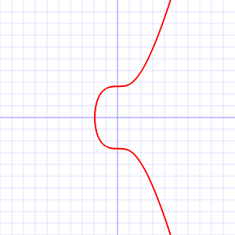

# Blockchain Evolution - 1st, 2nd, 3rd, 4th Generation - From Bitcoin to Ethereum 1.0 to Libra to Ethereum 2.0


Bitcoin Public Service Announcement

**BEWARE: Bitcoin is a gigantic ponzi scheme¹.
To the moon!? The new gold standard!?
Do NOT "invest" trying to get-rich-quick HODLing.
Why not? The bitcoin code is archaic and out-of-date.
Burn, baby, burn! Proof-of-work / waste is a global
energy environmental disaster
using 300 kW/h per bitcoin transaction (!) that's about 179 kilograms of CO₂ emissions².
Programmable money (or the internet of value)
for all future generations with (bitcoin) script
without loops and jumps (gotos) and all "stateless"!? LOL.**


¹:  

(Source: [Best of Bitcoin Maximalist - Scammers, Morons, Clowns, Shills & BagHODLers - Inside The New New Crypto Ponzi Economics](https://bitsblocks.github.io/bitcoin-maximalist))

²: Assuming let's say 0.596 kilograms of CO₂ per kW/h
(that's the energy efficiency in Germany) that's
about 179 kilograms of CO₂ per bitcoin transaction (300 kW/h × 0.596 kg). For more insights see the [Bitcoin Energy Consumption Index](https://digiconomist.net/bitcoin-energy-consumption).


## Part I - Private Key, Public Key and Address


Crypto (Bank) Accounts

Trivia Quiz: How long does it take to open up 10 000 (bank) accounts?

- [ A ]  1 second
- [ B ]  1 minute
- [ C ]  1 hour
- [ D ]  ___ Other, please tell.


Did you know? The crypto private key for bitcoin, ethereum and others
is an (unsigned) 256-bit (32 byte) integer number.

Trivia Quiz: What's the maximum value for a 256-bit (32 byte) integer number
(hint 2^256-1)?

Maximum value of 2^256-1 =

``` ruby
2**256-1
#=> 115792089237316195423570985008687907853269984665640564039457584007913129639935
(2**256-1).to_s.length
#=> 78
```

78 (!) decimal digits


Triva: Q: What's the maximum value for a 256-bit (32 byte) integer number
in hexadecimal format?

``` ruby
(2**256-1).to_s(16)
=> "ffffffffffffffffffffffffffffffffffffffffffffffffffffffffffffffff"
(2**256-1).to_s(16).length
=> 64

(2**256-1).to_s(2)
=> "1111111111111111111111111111111111111111111111111111111111111111111111111111111111111111111111111111111111111111111111111111111111111111111111111111111111111111111111111111111111111111111111111111111111111111111111111111111111111111111111111111111111111111"
(2**256-1).to_s(2)
=> 256
```


BEWARE - Blockchain Bandits!
If you use a low integer number e.g.  1, 2, etc.
your account is guaranteed to get robbed by blockchain bandits in
seconds.

(See [A "Blockchain Bandit" Is Guessing Private Keys and Scoring Millions](https://www.wired.com/story/blockchain-bandit-ethereum-weak-private-keys/)
by Andy Greenberg, Wired Magazine, April 2019)


How big (or how safe) is a (random) 256-bit (32 byte) integer number?

- How many sand grains on the beach?
- How many sand grains on earth?
- How many atoms in the universe?


The public key gets auto-generated/calculated from the
256-bit integer number.

How?  Elliptic Curve Cryptography

> Elliptic-curve cryptography (ECC) is
> an approach to public-key cryptography based
> on the algebraic structure of elliptic curves over finite fields.
>
> (Source: [Elliptic-curve cryptography @ Wikipedia](https://en.wikipedia.org/wiki/Elliptic-curve_cryptography))


What's an Elliptic Curve?



> This is a graph of secp256k1's elliptic curve¹ `y² = x³ + 7`
> over the real numbers.
> Note that because secp256k1 is actually defined over the field Zₚ,
> its graph will in reality look like random scattered points,
> not anything like this.
>
> (Source: [Secp256k1 @ Bitcoin Wiki](https://en.bitcoin.it/wiki/Secp256k1))


An ECDSA (Elliptic Curve Digital Signature Algorithm) private key is a random number between 1 and the order of the elliptic curve group. The public key are two numbers (that is, a point with the coordinates x and y) computed by multiplying 
the generator point (`G`) of the curve with the private key. 
This is equivalent to adding the generator to itself `private_key` times.


``` ruby
require 'ecdsa'           # Use an elliptic curve (digital signature algorithm) library

# This private key is just an example. It should be much more secure!
privatekey = 1234

# Elliptic curve multiplication
group  = ECDSA::Group::Secp256k1      # Select the curve used in Bitcoin and Ethereum
point = group.generator.multiply_by_scalar( privatekey ) # Multiply by integer (not hex string)

point.x
#=> 102884003323827292915668239759940053105992008087520207150474896054185180420338
point.y
#=> 49384988101491619794462775601349526588349137780292274540231125201115197157452

point.x.to_s(16)
#=> "e37648435c60dcd181b3d41d50857ba5b5abebe279429aa76558f6653f1658f2"
point.y.to_s(16)
#=> "6d2ee9a82d4158f164ae653e9c6fa7f982ed8c94347fc05c2d068ff1d38b304c"
```

Is the public key the (bank) account address?

``` ruby
# 1) Uncompressed format (with prefix 04)
#   Convert to 64 hexstring characters (32 bytes) in length

prefix = '04'
pubkey = prefix + "%064x" % point.x + "%064x" % point.y
#=> "04e37648435c60dcd181b3d41d50857ba5b5abebe279429aa76558f6653f1658f26d2ee9a82d4158f164ae653e9c6fa7f982ed8c94347fc05c2d068ff1d38b304c"

# 2) Compressed format (with prefix - 02 = even / 03 = odd)
#   Instead of using both x and y coordinates,
#   just use the x-coordinate and whether y is even/odd

prefix = point.y % 2 == 0 ? '02' : '03'
pubkey = prefix + "%064x" % point.x
#=> "02e37648435c60dcd181b3d41d50857ba5b5abebe279429aa76558f6653f1658f2"
```


Public key is the "raw" to the metal format.
Why not use it?

- Can we make it shorter?
- Can we make it more secure?
- Can we protect against typos?
- Can we add a checksum?


Hashing, Hashing, Hashing

What's a one-way crypto hashing algorithm / function?

``` ruby
require 'digest'

Digest::SHA256.hexdigest( 'Hello, Cryptos!' )
#=> "33eedea60b0662c66c289ceba71863a864cf84b00e10002ca1069bf58f9362d5"
```

Trivia Quiz: What's SHA256?

- [ A ]  Still Hacking Anyway
- [ B ]  Secure Hash Algorithm
- [ C ]  Sweet Home Austria
- [ D ]  Super High Aperture

B: SHA256 == Secure Hash Algorithms 256 Bits

SHA256 is a (secure) hashing algorithm designed by the National Security Agency (NSA)
of the United States of America (USA).

Note: SHA256 hash is 256 bits (32 bytes) in size - not really any shorter.
What to do? Any ideas?

Let's use RIPEMD160 resulting in a short 160 bit (20 byte) digest.


Security Trivia Quiz: What's RIPEMD160?

RACE¹ Integrity Primitives Evaluation Message Digest 160-bit

¹: Research and development in Advanced Communications technologies in Europe

``` ruby
require 'digest'                           # Hash (Digest) Functions

def hash160( pubkey )
  binary    = [pubkey].pack( "H*" )       # Convert to binary first before hashing
  sha256    = Digest::SHA256.digest( binary )
  ripemd160 = Digest::RMD160.digest( sha256 )
              ripemd160.unpack( "H*" )[0]    # Convert back to hex
end

pubkey = "02b4632d08485ff1df2db55b9dafd23347d1c47a457072a1e87be26896549a8737"
hash160( pubkey )
#=> "93ce48570b55c42c2af816aeaba06cfee1224fae"
```

That was step one.
We calculated the public key hash.
Now what about the address?


> There are currently three Bitcoin address formats in use:
>
> - P2PKH (Pay to public key hash) which begin with the number 1, eg: `1BvBMSEYstWetqTFn5Au4m4GFg7xJaNVN2`.
> - P2SH (pay to script hash) type starting with the number 3, eg: `3J98t1WpEZ73CNmQviecrnyiWrnqRhWNLy`.
> - Bech32 type starting with bc1, eg: `bc1qar0srrr7xfkvy5l643lydnw9re59gtzzwf5mdq`.
>
> (Source: [Bitcoin address @ Bitcoin Wiki](https://en.bitcoin.it/wiki/Address))


What's Base 56 Encoding? What's Base 32 Encoding?

Alphabets - Base 16 (a.k.a. Hexadecimal), Base 32, Base 56:

- `123456789ABCDEFGHJKLMNPQRSTUVWXYZabcdefghijkmnopqrstuvwxyz`
- `0123456789ABCDEF`
- `023456789acdefghjklmnpqrstuvwxyz`


Triva Quiz: What characters (digits/letters) are
missing in the base 32/base 56 alphabets?

- In Base 56   -  `0` (Zero), `O` (Upper-O), `I` (Upper-I), `l` (Lower-L)
- In Base 32 (Bitcoin Bech32 Version) - `1`, `B`, `I`, `O`


Why use base56 (and not "standard" base64)?


```
// - Don't want 0OIl characters that look the same in some fonts and
//      could be used to create visually identical looking account numbers.
// - A string with non-alphanumeric characters is not as easily accepted as an account number.
// - E-mail usually won't line-break if there's no punctuation to break at.
// - Doubleclicking selects the whole number as one word if it's all alphanumeric.
```

(Source: `base58.h` - Bitcoin Source Code Header Comments)


Why use base32 (and not base56)?

- The lack of mixed case makes it more efficient to read out loud or to put into QR codes.
  Base32 does come with a 15% length increase (compared to base56).
- Base58 needs a lot of space in QR codes, as it cannot use the alphanumeric mode.
  Alphanumeric mode used by base32 (with uppercase letters)
  is 45% more compact than the normal byte mode.


...


Aside:  What's Base 6? Let's Roll the Dice

An important part of creating a private key is ensuring the random number
is truly random.
Physical randomness is better than computer generated pseudo-randomness.
The easiest way to generate physical randomness is with a dice.
To create a private key you only need one six-sided die
which you roll 99 times.
Stopping each time to record the value of the die.
When recording the values follow these rules: 1=1, 2=2, 3=3, 4=4, 5=5, 6=0.
By doing this you are recording the big random number, your private key,
in base 6 format.

Home Work Exercise:
Turn the 99 character base 6 private key into a base 10 or base 16 number.

``` ruby
p99 = 99.times.reduce('') { |buf,_| buf << rand(6).to_s }
#=> "413130205513310000115530450343345150251504444013455422453552225503020102150031231134314351124254004"
p99.to_i(6)
#=> 77254760463198588454157792320308725646096652667800343330432100522222375944308

p99.to_i(6).to_s(16)
#=> "aacca516ccbf72dac2c4c447b9f64d12855685e99810ffcf7763a12da6c04074"
p99.to_i(6).to_s(16).length
#=> 64

p99.to_i(6).to_s(2)
#=> "1010101011001100101001010001011011001100101111110111001011011010110000101100010011000100010001111011100111110110010011010001001010000101010101101000010111101001100110000001000011111111110011110111011101100011101000010010110110100110110000000100000001110100"
```


Aside:  What's Base 2? Let's Flip A Coin - Heads or Tails?

Triva Quiz: For an (unsigned) 256-bit number - how many times
do you need to flip the coin?


Bitcoin Trivia:

> As initially the sole and subsequently the predominant miner,
> Satoshi Nakamoto [the pseudonymous Bitcoin founder]
> was awarded bitcoin at genesis and for 10 days afterwards.
> Except for test transactions these remain unspent since mid January 2009.
> The public bitcoin transaction log shows that Nakamoto's known addresses contain
> roughly one million bitcoins. At bitcoin's peak in December 2017,
> this was worth over US$19 billion,
> making Nakamoto possibly the 44th richest person in the world at the time.
>
> (Source: [Satoshi Nakamoto @ Wikipedia](https://en.wikipedia.org/wiki/Satoshi_Nakamoto))


The one million bitcoins are yours if the pay-to-pubkey (p2pk) script
returns with true. The only input you need to unlock the fortune
is the private key. Are you Satoshi?


...


That's it. Thanks.


Upcoming:

- Proof-of-Work Mining - Byzantine Fault Tolerance (BFT) - State Machine Replication and the Truth Machine
- Contract-Oriented (Blockchain) Programming / Scripting - Turning Complete and the Halting Problem  - "On Chain" Storage vs "State-Less"
- Inside Libra & Move - "Stable" Coin with Reserve "Stake" for Payments


Appendix:

Sign a transaction with an (elliptic curve) private key

``` ruby
require 'ecdsa'           # Use an elliptic curve (digital signature algorithm) library
require 'digest'
require 'securerandom'

# Step 1 - Calculate the Transaction (tx) Hash
tx = 'from: Alice  to: Bob     cryptos: 43_000_000_000'
txhash = Digest::SHA256.digest( tx )

# Step 2 - Get the Signer's Private key
privatekey = 1234     # This private key is just an example. It should be much more secure!

signature = nil
while signature.nil?
  # Step 3 - Auto-Generate a New (Secure) Private Key 
  group     = ECDSA::Group::Secp256k1      # Select the curve used in Bitcoin and Ethereum
  tempkey   = 1 + SecureRandom.random_number( group.order - 1 )

  # Sign!
  signature = ECDSA.sign(group, privatekey, txhash, tempkey)
end

signature.r
#=> 80563021554295584320113598933963644829902821722081604563031030942154621916407
signature.s
#=> 58316177618967642068351252425530175807242657664855230973164972803783751708604

signature.r.to_s(16)
#=> "3306a2f81ad2b2f62ebe0faec129545bc772babe1ca5e70f6e56556b406464c0"
signature.s.to_s(16)
#=> "4fe202bb0835758f514cd4a0787986f8f6bf303df629dc98c5b1a438a426f49a"
```


Verify a signed transaction with an (elliptic curve) public key:

``` ruby
require 'ecdsa'           # Use an elliptic curve (digital signature algorithm) library
require 'digest'

# Step 1 - Calculate the Transaction (tx) Hash
tx = 'from: Alice  to: Bob     cryptos: 43_000_000_000'
txhash = Digest::SHA256.digest( tx )

# Step 2 - Get the Signer's Public Key
group  = ECDSA::Group::Secp256k1      # Select the curve used in Bitcoin and Ethereum
pubkey = ECDSA::Point.new( group,
   102884003323827292915668239759940053105992008087520207150474896054185180420338,
   49384988101491619794462775601349526588349137780292274540231125201115197157452
)

# Step 3 - Get the Transaction's Signature
signature = ECDSA::Signature.new(
  80563021554295584320113598933963644829902821722081604563031030942154621916407,
  58316177618967642068351252425530175807242657664855230973164972803783751708604
)

# Don't Trust - Verify
ECDSA.valid_signature?( pubkey, txhash, signature)
#=> true


# or using hexadecimal numbers

pubkey = ECDSA::Point.new( group,
  0xe37648435c60dcd181b3d41d50857ba5b5abebe279429aa76558f6653f1658f2,
  0x6d2ee9a82d4158f164ae653e9c6fa7f982ed8c94347fc05c2d068ff1d38b304c
)

signature = ECDSA::Signature.new(
  0x3306a2f81ad2b2f62ebe0faec129545bc772babe1ca5e70f6e56556b406464c0,
  0x4fe202bb0835758f514cd4a0787986f8f6bf303df629dc98c5b1a438a426f49a
)

ECDSA.valid_signature?( pubkey, txhash, signature)
#=> true
```
