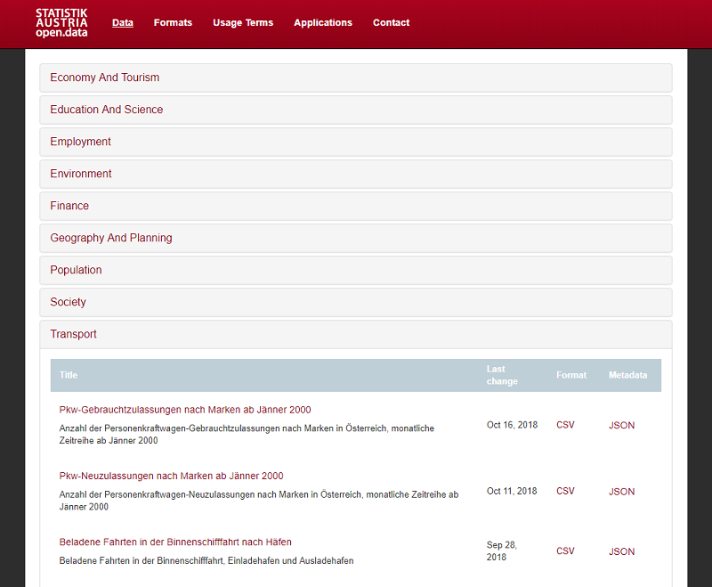
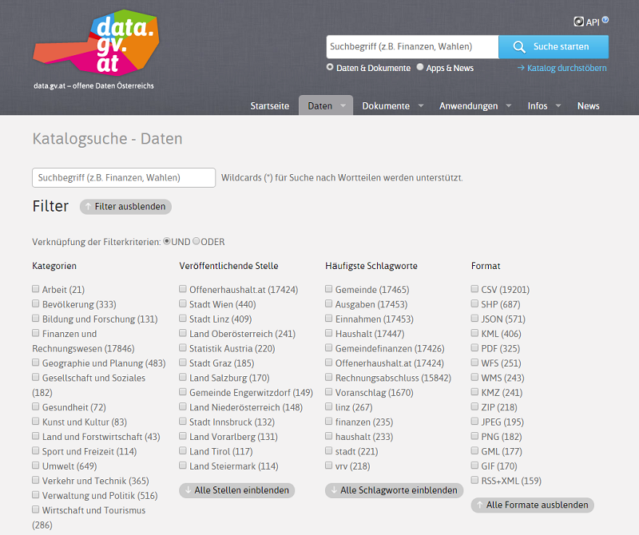
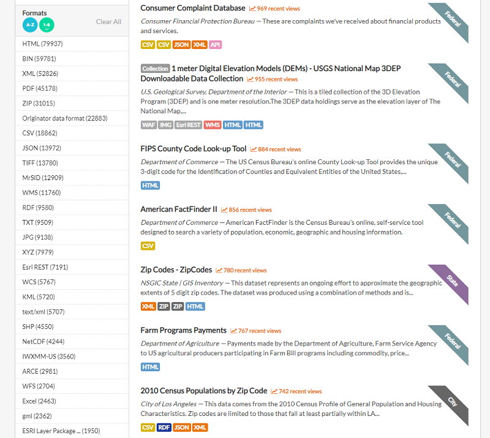
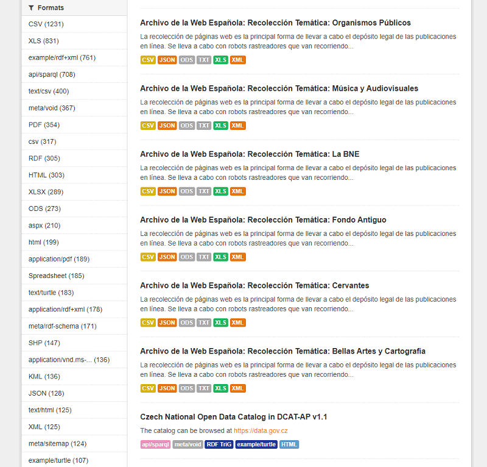
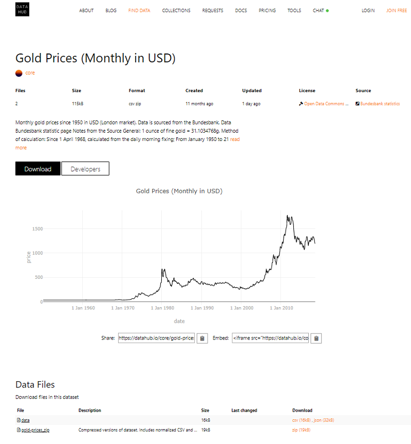
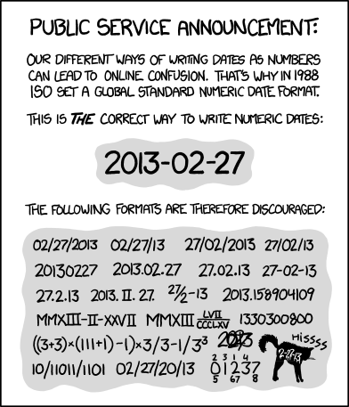
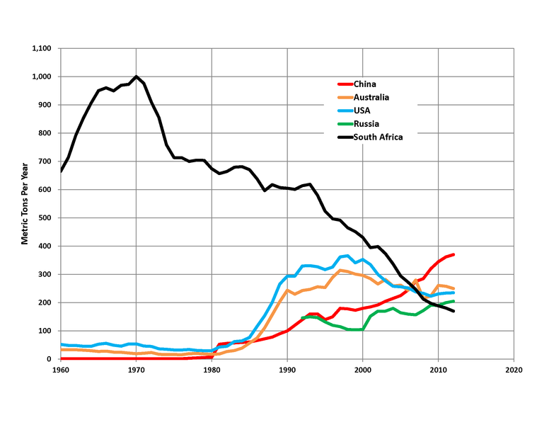

title: Mining for Gold Using the World's #1 and Most Popular Data Format


# Agenda

- Q: The World's Most Popular Data Format?
  - Data Format Timeline / History - Past, Present, Future
  - Data Formats @ Statistics Austria
    - Triva Quiz: Who Invented the Space Character in Writing (and When)?
    - Triva Quiz: Who Invented the Space Character in CSV (and When)?
  - Data Formats @ Open Gov Data Austria
  - Data Formats @ Open Gov Data United States of America (U.S.A.)
  - Data Formats @ DataHub v1
    - Data Formats @ DataHub v2  - (Tabular) Data Packages
  - And the Winner is ... Lies, Damned Lies and Statistics
-  What's Comma-Separated Values (CSV) - One Format? Many Formats?
   - CSV Basics - What about commas in values?
   - CSV Basics - What about quotes in quotes?
   - CSV Basics - Many Formats / Dialects / Variants?
   - CSV Basics - Edge Cases
   - CSV Basics - Type Inference and Data Converters
- CSV Formats / Variants
  - CSV "The Right Way"  
  - CSV "Strict"
  - CSV <3 Numeric
  - CSV <3 JSON
  - CSV <3 YAML
  - Database Export
    - PostgreSQL CSV
    - PostgreSQL Text
    - MySQL
- CsvReader Library Usage
  - What about type inference and data converters?
  - What about Enumerable?
  - What about headers?
  - What about symbol keys for hashes?
  - What about (typed) structs?
  - What about tabular data packages with pre-defined types / schemas?
- Triva Quiz - Mining for Gold - What's the country with the biggest gold mining / production per year today?


# Trivia Quiz - The World's Most Popular Data Format?

- [ ]  XML
- [ ]  YAML
- [ ]  JSON
- [ ]  CSV
- [ ]  CSV ♥ JSON
- [ ]  TAB
- [ ]  PDF (!?)
- [ ]  HTML
- [ ]  Other, Please Tell


# Data Format Timeline / History - Past, Present, Future


1970s - Pre Personal Computer (PC) Age

- [CSV = Comma-Separated Values](https://en.wikipedia.org/wiki/Comma-separated_values)
- [TAB = Tab(ulator)](https://en.wikipedia.org/wiki/Tab_key)


1990s - Internet / Web Age

- [PDF = Portable Document Format](https://adobe.com/pdf) - 1993¹-  (25 years ago)
- [HTML = Hypertext Markup Language](https://www.w3.org/html/) - 1993-
- [XML = Extensible Markup Language](https://www.w3.org/XML/) - 1996-

2000s  

- [YAML = YAML Ain't Markup Language (was: Yet Another Markup Language)](http://yaml.org) - 2001-  (17 year ago)
- [JSON = JavaScript Object Notation](https://json.org)  - 2001-

Now

- [CSV ♥ JSON](https://github.com/csv11/csv-json) - 2018-  (3 days ago)
- [CSV ♥ YAML](https://github.com/csv11/csv-yaml) - 2018-  (upcoming :-))


Notes:

¹: First release of PDF as an open standard on July 1, 2008.


# Data Formats @ Statistics Austria




(Source: [`data.statistik.gv.at`](http://data.statistik.gv.at/web/catalog.jsp))

It's all CSV :-) with meta data in JSON. Example:

```
JAHR;GCD;GEM_NAME;BEV_ABSOLUT;BEV_UNTER15;BEV_UEBER65;AUSL_STAATSB;...
2011;10101;Eisenstadt;13.101;13,8;18,2;9,4;...
2011;10201;Rust;1.896;13,8;22,2;4,7;...
2011;10301;Breitenbrunn am Neusiedler See;1.902;12,1;22,4;5,6;...
2011;10302;Donnerskirchen;1.742;12,3;20,2;3,8;...
2011;10303;Großhöflein;1.929;12,9;17;3,4;...
...
```

Note: The semicolon `;` is the value separator and for numbers
the dot `.` is the thousands separator (!) e.g. `13.101`
and the comma `,` is the decimal separator/point e.g. `13,8` :-).


# Triva Quiz: Who Invented the Space Character in Writing (and When)?

- [ ] The Greeks in the Golden Age
- [ ] The Romans in the Age of Empire (What have the Romans ever done for us?)
- [ ] The Irish Monks in the Middle Ages 
- [ ] The Frankish Alchemists in the Charlemagne's Age (800-)


# Triva Quiz: Who Invented the Space Character in CSV (and When)?

- [ ] [CSV v1.1](https://csv11.github.io) in 2018 :-)

Still waiting :-). Yes, you can. Let's make it happen.
Pretty printed version with space (CSV v1.1). Example:

```
JAHR; GCD;   GEM_NAME;                 BEV_ABSOLUT; BEV_UNTER15; BEV_UEBER65; AUSL_STAATSB; ...
2011; 10101; Eisenstadt;                    13.101;        13,8;        18,2;          9,4; ...
2011; 10201; Rust;                           1.896;        13,8;        22,2;          4,7; ...
2011; 10301; Breitenbrunn am Neusiedler See; 1.902;        12,1;        22,4;          5,6; ...
2011; 10302; Donnerskirchen;                 1.742;        12,3;        20,2;          3,8; ...
2011; 10303; Großhöflein;                    1.929;        12,9;          17;          3,4; ...
...
```


# Data Formats @ Open Gov Data Austria



(Source: [`data.gv.at`](https://www.data.gv.at/suche/))


- How many datasets? 20_383 datasets
- How many in CSV? 19_201 (!) => ~95%

Note: [Offenerhaushalt.at](https://www.offenerhaushalt.at) (= Open Spending)
17_424 (!) datasets (that, is ~85% of all datasets)
for budgets (money, money, money) - all in CSV.

2nd largest open data publisher - the city of Vienna - with 440 datasets (that is, ~2%).

Open (structured) data in JPEG (195), PNG (182), GIF (170) - really?!


# Data Formats @ Open Gov Data United States of America (U.S.A.)



(Source: [`data.gov`](https://catalog.data.gov/dataset))


- How many datasets? 303_079 datasets
- How many in CSV? 18_862 =>  ~6%

Trivia Quiz: [What's MrSID?](https://en.wikipedia.org/wiki/MrSID)
[What's XYZ?](https://en.wikipedia.org/wiki/XYZ_file_format)

- MrSID = acronym for MultiResolution Seamless Image Database (MrSID) format
- XYZ = chemical format for molecule geometry incl. the number of atoms with cartesian and atomic coordinates


# Data Formats @ DataHub v1



(Source: [`old.datahub.io`](https://old.datahub.io/dataset))


- How many datasets? 11_344 datasets
- How many in CSV (+ text/csv + csv)? 1_231 + 400 + 317 (1_948) => ~17%

Trivia Quiz: [What's meta/void?](https://en.wikipedia.org/wiki/VoID)

- VoID = acronym for Vocabulary of Interlinked Datasets (VoID) -
 an RDF schema vocabulary for metadata


# Data Formats @ DataHub v2  - (Tabular) Data Packages



(Source: [`datahub.io`](https://datahub.io/core/gold-prices))


# And the Winner is ... Lies, Damned Lies and Statistics

>  Statistics can be used to support anything - especially statisticians¹. 
>
> -- Franklin P. Jones

¹: Or (big) data gold mining scientists, of course :-).


# What's Comma-Separated Values (CSV) - One Format? Many Formats?

Text format - all (string) values separated by comma.

```
a,b,c
1,2,3
```

in ruby:

``` ruby
[["a","b","c"],
 ["1","2","3"]]
```


# CSV Basics - What about commas in values?

Wrap the value in double quotes (`"`):

```
a,b,c,"d,e"
1,2,3,"4,5"
```

in ruby:

``` ruby
[["a","b","c","d,e"],
 ["1","2","3","4,5"]]
```


# CSV Basics - What about quotes in quotes?

Variant 1: Double the double quote (`""`):

```
"Hamlet says, ""Seems,"" madam! Nay it is; I know not ""seems."""
```


Variant 2: Use backslash escape (`\"`):

```
"Hamlet says, \"Seems,\" madam! Nay it is; I know not \"seems.\""
```


# CSV Basics - Many Formats / Dialects / Variants?

That's it :-).
Where's the controversy?
What's the heated discussion all about?


# CSV Basics - Edge Cases

What about leading and/or trailing whitespaces?

```
1 , 2 , 3
"a", "b", "c"
```

What about blank lines?

```
1,2,3

4,5,6
```

What about "stray" quotes?

```
Paris, 48°51'24"N,2°21'03"E
```


What about blank vs empty string?

```
,,"",""
```

What about nulls, not a number (nan), infinity, newlines,
and more?

What about treating un-quoted and quoted values different?

What about treating un-quoted and quoted leading and trailing spaces different?

And so on and so forth.


# CSV Basics - Type Inference and Data Converters

How to convert strings to:

- numbers
  - integers
  - floats
- booleans (true, false, no, yes, on, off, etc.)
- nulls (null, nil, etc.)
- dates
- arrays (?)
- structs (?)
- etc.





# CSV Formats / Variants

CSV Formats supported by the (new)
csvreader library:

- CSV "The Right Way"  
- CSV "Strict"
- CSV <3 Numeric
- CSV <3 JSON
- CSV <3 YAML

Database Export:
- PostgreSQL CSV
- PostgreSQL Text
- MySQL

Or configure (or build) your own :-).


# Database Export Variants Configuration (CsvReader Library Ed.)

`Csv.mysql` uses:

``` ruby
ParserStrict.new( sep: "\t",
                  quote: false,
                  escape: true,
                  null: "\\N" )
```

`Csv.postgres` or `Csv.postgresql` uses:

``` ruby
ParserStrict.new( doublequote: false,
                  escape: true,
                  null: "" )
```

`Csv.postgres_text` or `Csv.postgresql_text` uses:

``` ruby
ParserStrict.new( sep: "\t",
                  quote: false,
                  escape: true,
                  null: "\\N" )
```


# CsvReader Library Usage


``` ruby
txt <<=TXT
1,2,3
4,5,6
TXT

records = Csv.parse( txt )     ## or CsvReader.parse
pp records
# => [["1","2","3"],
#     ["4","5","6"]]

# -or-

records = Csv.read( "values.csv" )   ## or CsvReader.read
pp records
# => [["1","2","3"],
#     ["4","5","6"]]

# -or-

Csv.foreach( "values.csv" ) do |rec|    ## or CsvReader.foreach
  pp rec
end
# => ["1","2","3"]
# => ["4","5","6"]
```


# CsvReader Library Usage - What about type inference and data converters?

Use the converters keyword option to (auto-)convert strings to nulls, booleans, integers, floats, dates, etc.
Example:

``` ruby
txt <<=TXT
1,2,3
true,false,null
TXT

records = Csv.parse( txt, :converters => :all )     ## or CsvReader.parse
pp records
# => [[1,2,3],
#     [true,false,nil]]
```


Built-in converters include:

| Converter    | Comments          |
|--------------|-------------------|
| `:integer`   |   convert matching strings to integer |
| `:float`     |   convert matching strings to float   |
| `:numeric`   |   shortcut for `[:integer, :float]`   |
| `:date`      |   convert matching strings to `Date` (year/month/day) |
| `:date_time` |   convert matching strings to `DateTime` |
| `:null`      |   convert matching strings to null (`nil`) |
| `:boolean`   |   convert matching strings to boolean (`true` or `false`) |
| `:all`       |   shortcut for `[:null, :boolean, :date_time, :numeric]` |


Or add your own converters. Example:

``` ruby
Csv.parse( 'Ruby, 2020-03-01, 100', converters: [->(v) { Time.parse(v) rescue v }] )
#=> [["Ruby", 2020-03-01 00:00:00 +0200, "100"]]
```

A custom converter is a method that gets the value passed in 
and if successful returns a non-string type (e.g. integer, float, date, etc.)
or a string (for further processing with all other converters in the "pipeline" configuration).


# CsvReader Library Usage - What about Enumerable?

Yes, every reader includes `Enumerable` and runs on `each`.
Use `new` or `open` without a block
to get the enumerator (iterator).
Example:


``` ruby
csv = Csv.new( "a,b,c" )
it  = csv.to_enum
pp it.next  
# => ["a","b","c"]

# -or-

csv = Csv.open( "values.csv" )
it  = csv.to_enum
pp it.next
# => ["1","2","3"]
pp it.next
# => ["4","5","6"]
```


# CsvReader Library Usage - What about headers?

Use the `CsvHash`
if the first line is a header (or if missing pass in the headers
as an array) and you want your records as hashes instead of arrays of strings.
Example:

``` ruby
txt <<=TXT
A,B,C
1,2,3
4,5,6
TXT

records = CsvHash.parse( txt )      ## or CsvHashReader.parse
pp records

# -or-

txt2 <<=TXT
1,2,3
4,5,6
TXT

records = CsvHash.parse( txt2, headers: ["A","B","C"] )      ## or CsvHashReader.parse
pp records

# => [{"A": "1", "B": "2", "C": "3"},
#     {"A": "4", "B": "5", "C": "6"}]

# -or-

records = CsvHash.read( "hash.csv" )     ## or CsvHashReader.read
pp records
# => [{"A": "1", "B": "2", "C": "3"},
#     {"A": "4", "B": "5", "C": "6"}]

# -or-

CsvHash.foreach( "hash.csv" ) do |rec|    ## or CsvHashReader.foreach
  pp rec
end
# => {"A": "1", "B": "2", "C": "3"}
# => {"A": "4", "B": "5", "C": "6"}
```


# CsvReader Library Usage - What about symbol keys for hashes?

Yes, you can use the header_converters keyword option.
Use `:symbol` for (auto-)converting header (strings) to symbols.
Note: the symbol converter will also downcase all letters and
remove all non-alphanumeric (e.g. `!?$%`) chars
and replace spaces with underscores.

Example:

``` ruby
txt <<=TXT
a,b,c
1,2,3
true,false,null
TXT

records = CsvHash.parse( txt, :converters => :all, :header_converters => :symbol )  
pp records
# => [{a: 1,    b: 2,     c: 3},
#     {a: true, b: false, c: nil}]

# -or-
options = { :converters        => :all, 
            :header_converters => :symbol }

records = CsvHash.parse( txt, options )  
pp records
# => [{a: 1,    b: 2,     c: 3},
#     {a: true, b: false, c: nil}]
```

Built-in header converters include:

| Converter    | Comments            |
|--------------|---------------------|
| `:downcase`  |   downcase strings  |
| `:symbol`    |   convert strings to symbols (and downcase and remove non-alphanumerics) |


# CsvReader Library Usage - What about (typed) structs?

See the [csvrecord library »](https://github.com/csv11/csvrecord)

Example from the csvrecord docu:

Step 1: Define a (typed) struct for the comma-separated values (csv) records. Example:

```ruby
require 'csvrecord'

Beer = CsvRecord.define do
  field :brewery        ## note: default type is :string
  field :city
  field :name
  field :abv, Float     ## allows type specified as class (or use :float)
end
```

or in "classic" style:

```ruby
class Beer < CsvRecord::Base
  field :brewery
  field :city
  field :name
  field :abv, Float
end
```


Step 2: Read in the comma-separated values (csv) datafile. Example:

```ruby
beers = Beer.read( 'beer.csv' )

puts "#{beers.size} beers:"
pp beers
```

pretty prints (pp):

```
6 beers:
[#<Beer:0x302c760 @values=
   ["Andechser Klosterbrauerei", "Andechs", "Doppelbock Dunkel", 7.0]>,
 #<Beer:0x3026fe8 @values=
   ["Augustiner Br\u00E4u M\u00FCnchen", "M\u00FCnchen", "Edelstoff", 5.6]>,
 #<Beer:0x30257a0 @values=
   ["Bayerische Staatsbrauerei Weihenstephan", "Freising", "Hefe Weissbier", 5.4]>,
 ...
]
```

Or loop over the records. Example:

``` ruby
Beer.read( 'beer.csv' ).each do |rec|
  puts "#{rec.name} (#{rec.abv}%) by #{rec.brewery}, #{rec.city}"
end

# -or-

Beer.foreach( 'beer.csv' ) do |rec|
  puts "#{rec.name} (#{rec.abv}%) by #{rec.brewery}, #{rec.city}"
end
```


printing:

```
Doppelbock Dunkel (7.0%) by Andechser Klosterbrauerei, Andechs
Edelstoff (5.6%) by Augustiner Bräu München, München
Hefe Weissbier (5.4%) by Bayerische Staatsbrauerei Weihenstephan, Freising
Rauchbier Märzen (5.1%) by Brauerei Spezial, Bamberg
Münchner Dunkel (5.0%) by Hacker-Pschorr Bräu, München
Hofbräu Oktoberfestbier (6.3%) by Staatliches Hofbräuhaus München, München
```


# CsvReader Library Usage - What about tabular data packages with pre-defined types / schemas?

See the [csvpack library »](https://github.com/csv11/csvpack)


# Triva Quiz - Mining for Gold - What's the country with the biggest gold mining / production per year today?


- [ ] Russia
- [ ] Peru
- [ ] China
- [ ] South Africa
- [ ] Australia
- [ ] Other, please tell.


# Triva Quiz - Mining for Gold - What's the country with the biggest gold mining / production per year today?

```
Country, Gold production (metric tons), Reserves (metric tons)
China,         440,  2 000
Australia,     300,  9 800
Russia,        255,  5 500
United States, 245,  3 000
Canada,        180,  2 200
Peru,          155,  2 300
South Africa,  145,  6 000
Mexico,        110,  1 400
Uzbekistan,    100,  1 800
Brazil,         85,  2 400
```




(Source: [List of countries by gold production](https://en.wikipedia.org/wiki/List_of_countries_by_gold_production))

