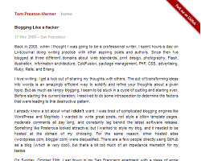
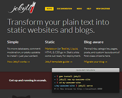
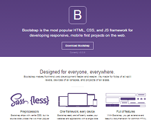
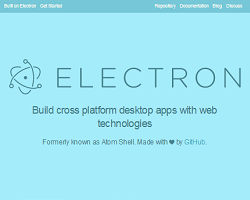
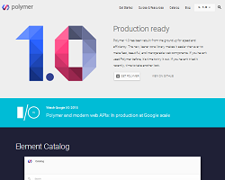
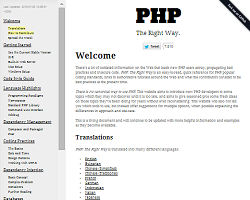
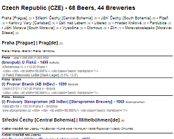
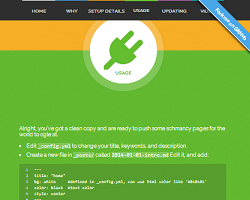
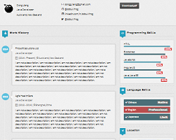

title: Dr Jekyll and Mr Hyde - Build Static Sites in Ruby


# Agenda

- What is HTML? - The Ten Most Important Tags
- `index.html` - A single-page static site
- `index.md`  - `index.html` Simplified
- What is Markdown?
- The World's Greatest (Jekyll) Static Sites
- Getting Started with Jekyll
    - Quick Start
    - Folder Structure
- What's Dr Jekyll?
- The World's Greatest (Jekyll) Static Sites Themes
- What's Mr Hyde?


# What is HTML? - The Ten Most Important Tags

HTML = Hypertext Markup Language

The world's most popular markup language - billions of (web) pages
and millions of (web) sites.

HTML                                 | Notes
------------------------------------ | -------------------
**Basic Block Tags**                 |
`<p>..</p>`                          | Paragraph
`<h1>..</h1>` - `<h6>..</h6>`        | Heading 1-6
`<ul>(<li>...</li>)+</ul>`           | Bullet (Unordered) List
`<ol>(<li>...</li>)+</ol>`           | Numbered (Ordered) List
**Basic Inline Tags**                |
`<i>...</i> or <em>...</em>`         | Italic Text (Emphasis)
`<b>...</b> or <strong>...</strong>` | Bold Text (Strong Emphasis)
`<br>`                               | (Hard) Line Break
`<a href="...">...</a>`              | (Hyper-)Link
``          | Image with Alt(ernative) Text


# `index.html` - A single-page static site

```
<h3>Ruby developers and Rails aficionados meet in Austria's capital</h3>

<p>
On Thursday, March the 7th, Rails and Ruby developers will exchange their workspaces to meet fellow engineers
to discuss their favorite language. Andreas Tiefenthaler, Anton Bangratz and Floor Drees initiated
these 'user group meetups', excited to meet like minded people.
The vienna.rb meetups are open to both experienced Ruby developers and people that are new to programming.
</p>
```


# `index.md`  - `index.html` Simplified

md = Markdown

```
### Ruby developers and Rails aficionados meet in Austria's capital

On Thursday, March the 7th, Rails and Ruby developers will exchange their workspaces to meet fellow engineers
to discuss their favorite language. Andreas Tiefenthaler, Anton Bangratz and Floor Drees initiated
these 'user group meetups', excited to meet like minded people.
The vienna.rb meetups are open to both experienced Ruby developers and people that are new to programming.
```


# What is Markdown?

Easy-to-read and easy-to-write markup in plain vanilla text e.g.
"shortcodes" for HTML tags e.g.


### Heading 1-6 - `<h1>...</h1>` - `<h6>...</h6>`

```
# Heading 1
## Heading 2
### Heading 3
#### Heading 4 ####
##### Heading 5 #####
###### Heading 6 ######
```

Resulting in:

<h1>Heading 1</h1>
<h2>Heading 2</h2>
<h3>Heading 3</h3>
<h4>Heading 4</h4>
<h5>Heading 5</h5>
<h6>Heading 6</h6>

</>


# What is Markdown? (Cont.)

### Paragraph - `<p>...</p>`

```
This is a paragraph. Paragraphs are separated
by a blank line.

This is another paragraph.
```

Resulting in:

This is a paragraph. Paragraphs are separated
by a blank line.

This is another paragraph.

</>


### (Hard) Line Break - `<br>`

```
Leave two spaces at the end of a line to do a line break.··↵
This is a new line.··↵
This is another new line.
```

Resulting in:

Leave two spaces at the end of a line to do a line break.  
This is a new line.  
This is another new line.

</>


# The World's Greatest (Jekyll) Static Sites

The world's first Jekyll static site - surprise, surprise -
(yet) another blog:

Tom Preston-Werner - Blogging Like a Hacker




[[Live]](http://tom.preston-werner.com/2008/11/17/blogging-like-a-hacker.html)
[[Source]](https://github.com/mojombo/mojombo.github.io)


# The World's Greatest (Jekyll) Static Sites (Cont.)

Not just about blogs e.g.

Jekyll - Simple, blog-aware, static sites



[[Live]](http://jekyllrb.com)
[[Source]](https://github.com/jekyll/jekyll/tree/master/site)


# The World's Greatest (Jekyll) Static Sites (Cont.)

More (world famous) project sites:

Bootstrap - The World's Most Popular Mobile-First
and Responsive Front-End Framework



[[Live]](http://getbootstrap.com)
[[Source]](https://github.com/twbs/bootstrap/tree/master/docs)


Electron (Atom Shell) - Build Cross Platform Desktop Apps
with Web Technologies 



[[Live]](http://electron.atom.io)
[[Source]](https://github.com/atom/electron.atom.io)

Polymer - Build Modern Apps Using Web Components 



[[Live]](https://polymer-project.org)
[[Source]](https://github.com/Polymer/docs)


And Many More. See the [Planet Jekyll Showcase](http://planetjekyll.github.io/showcase).


# The World's Greatest (Jekyll) Static Sites (Cont.)

More than just project sites e.g.

PHP: The Right Way - A Living Free Online Book 



[[Live]](http://www.phptherightway.com)
[[Source]](https://github.com/codeguy/php-the-right-way)


Open Data Handbook v2 - Guides, Case Studies and Resources
for Government 'n' Civil Society on the What, Why 'n' How of Open Data 


[[Live]](http://opendatahandbook.org)
[[Source]](https://github.com/okfn/opendatahandbook)


The Free World Beer Book - Auto-Build Using Open Public Domain
Beer, Brewery 'n' Brewpub Data (Work-in-Progress) 



[[Live]](http://openbeer.github.io/book/cz.html)
[[Source]](https://github.com/openbeer/book)

And Many More. See the [Planet Jekyll Showcase](http://planetjekyll.github.io/showcase).


# Getting Started with Jekyll

```
$ jekyll help

jekyll 2.5.3 -- Jekyll is a blog-aware, static site generator in Ruby

Usage:

  jekyll <subcommand> [options]

Options:
  -s, --source [DIR]  Source directory (defaults to ./)
  -d, --destination [DIR]  Destination directory (defaults to ./_site)
      --safe         Safe mode (defaults to false)
  -p, --plugins PLUGINS_DIR1[,PLUGINS_DIR2[,...]]  Plugins directory (defaults to ./_plugins)
      --layouts DIR  Layouts directory (defaults to ./_layouts)
  -h, --help         Show this message
  -v, --version      Print the name and version
  -t, --trace        Show the full backtrace when an error occurs

Subcommands:
  serve, server, s      Serve your site locally
  docs                  Launch local server with docs for Jekyll v2.5.3
  build, b              Build your site
  doctor, hyde          Search site and print specific deprecation warnings
  new                   Creates a new Jekyll site scaffold in PATH
  help                  Show the help message, optionally for a given subcommand.
```


# Getting Started with Jekyll - Quick Start

```
  $ jekyll new my-site
     # => New jekyll site installed in ~/my-site
  $ cd my-site
  $ jekyll build
     # => Configuration file: ~/_config.yml
     #                Source: ~/my-site
     #           Destination: ~/my-site/_site
     #          Generating... done.
  $ jekyll serve
     # =>     Server address: http://127.0.0.1:4000/
     #      Server running... press ctrl-c to stop.
```

Browse your site e.g. open the page @ `http://127.0.0.1:4000`


# Getting Started with Jekyll - Folder Structure

Minimial:

```
├── _config.yml                        # site configuration
├── _posts                             # blog posts
|   ├── 2015-01-01-week-1-factbook.md  #   filename format => YEAR-MONTH-DAY-TITLE.MARKUP
|   ├── 2015-01-08-week-2-hoe.md
|   └── 2015-01-15-week-3-slideshow.md
├── _layouts                           
|   ├── default.html                   # master layout template
|   └── post.html                      # blog post template
├── css                               
|   └── styles.css                     # styles for pages
├── feed.xml                           # web feed template (e.g. in rss or atom format)
└── index.html                         # index template
```

will result in (with `permalink: date`):

```
└── _site                                  # output build folder; site gets generated here
    ├── css                               
    |   └── styles.css                     # styles for pages (copied 1:1 as is)
    ├── 2015
    |   └── 01
    |       ├── 01
    |       |   └── week-1-factbook.html   # blog post page
    |       ├── 08
    |       |   └── week-2-hoe.html        # another blog post page
    |       └── 15
    |           └── week-3-slideshow.html  # another blog post page
    ├── feed.xml                           # web feed (e.g. in rss or atom format)
    └── index.html                         # index page
```

or result in (with `permalink: /:title.html`):

```
└── _site                           # output build folder; site gets generated here
    ├── css                               
    |   └── styles.css                     # styles for pages (copied 1:1 as is)
    ├── week-1-factbook.html        # blog post page
    ├── week-2-hoe.html             # another blog post page
    ├── week-3-slideshow.html       # another blog post page
    ├── feed.xml                    # web feed (e.g. in rss or atom format)
    └── index.html                  # index page
```


# What's Dr Jekyll?

The Missing Jekyll Static Site (Theme) Package Manager.

### List Themes Command - `list`, `ls`, `l`

Use:

```
$ drjekyll list    # or
$ drjekyll ls      # or
$ drjekyll l       # or
$ drj l
```

Resulting in:

```
  1..Planet Jekyll's Starter (Minimal) (starter | planetjekyllsstarterminimal) by Gerald Bauer - #white 
  2..Dr Jekyll's Minimal (minimial | drjekyllsminimal) by Gerald Bauer - #white 
  3..Dr Jekyll's Bootstrap (bootstrap | drjekyllsbootstrap) by Gerald Bauer - #bootstrap #scss #white 
  4..Dr Jekyll's Classics Book (classics | drjekyllsclassicsbook) by Gerald Bauer - #books #white 
  5..Poole (poole) by Mark Otto - #poole 
  6..Poole's Hyde (pooleshyde) by Mark Otto - #poole 
  7..Poole's Lanyon (pooleslanyon) by Mark Otto - #poole 
  8..Beautiful Jekyll (beautifuljekyll) by Dean Attali
...
```


# What's Dr Jekyll? (Cont.)

### New Theme Command - `new`, `n`

To download and install (unzip/unpack) a theme archive use:

```
$ drjekyll new starter    # or
$ drjekyll n starter      # or
$ drj n starter
```

This will download the `starter.zip` to your working folder and
unzip the archive into the `./starter` folder.


**More Examples**

To download and install (unzip/unpack):

```
  7..Poole's Lanyon (lanyon | pooleslanyon) by Mark Otto - #poole 
```

Use:

```
$ drjekyll new lanyon     # or
$ drjekyll n lanyon       # or
$ drj      n lanyon
```

And so on and so forth.


# The World's Greatest (Jekyll) Static Sites Themes


Poole's Hyde by Mark Otto (License: MIT) 


[[Live Demo]](http://hyde.getpoole.com)

Poole's Lanyon by Mark Otto (License: MIT)


[[Live Demo]](http://lanyon.getpoole.com)


# The World's Greatest (Jekyll) Static Sites Themes (Cont.)

Planet Jekyll's Starter (Minimal) (License: Public Domain) 


[[Live Demo]](http://planetjekyll.github.io/jekyll-starter-theme)
  
Dr Jekyll's Bootstrap (License: Public Domain) 


[[Live Demo]](http://drjekyllthemes.github.io/jekyll-bootstrap-theme)
 
Dr Jekyll's Classics Book (License: Public Domain)


[[Live Demo]](http://drjekyllthemes.github.io/jekyll-book-theme)


# The World's Greatest (Jekyll) Static Sites Themes (Cont.)

Single Paged by Tim O'Brien (License: MIT) 



[[Live Demo]](http://t413.com/SinglePaged)

Grid Gallery by Nii Adjetey Sowah (License: WTF)


[[Live Demo]](https://nadjetey.github.io/GridGallery)


iCard Resume by Dong Liang (License: MIT)



[[Live Demo]](http://ddbullfrog.github.io/iCard-Resume)


And Many More. See the [Dr Jekyll's Themes](http://drjekyllthemes.github.io) listing.


# What's Mr Hyde?

The missing jekyll static site quick starter script wizard.


### New Wizard Command - `new`, `n`

To run a static site quick starter wizard script
to download and install (unzip/unpack) a theme archive and configure
a static site ready-to-use. Try:


```
$ mrhyde new starter    # or
$ mrhyde n starter      # or
$ mrh n starter
```

This will download the `starter.rb` wizard script
from the [Mr. Hyde's Scripts](https://github.com/mrhydescripts/scripts) repo
and run through all steps.


# What's Mr Hyde? (Cont.)

```
Welcome, before setting up your site Mr. Hyde will ask you some questions.

Q: What's your site's title? [Your Site Title]:  Another Beautiful Static Site
Q: What's your name? [Henry Jekyll]: Edward Hyde
Q: Select your theme:
     1 - Starter
     2 - Bootstrap
     3 - Minimal
   Your choice (1-3)? [1]: 2 

Thanks! Ready-to-go. Stand back.

  Downloading Dr. Jekyll's Bootstrap Theme...
  Setting up Dr. Jeykll's Bootstrap Theme..
  ...
  Updating settings in _config.yml...
    title: "Another Beautiful Static Site"
    author.name: "Edward Hyde"
  ...
Done.
```

That's it. Now use:

```
$ cd starter
$ jekyll serve
```

And open up your new static site in your browser.


# What's Mr Hyde? (Cont.)

**More Quick Starter Wizard Scripts**

See the [Mr. Hyde's Scripts](https://github.com/mrhydescripts/scripts) library.


**Write Your Own Mr Hyde Script**

Example - `starter.rb`:

```
###############################################
# Mr. Hyde's Quick Start Static Site Script

say "Welcome, before setting up your site Mr. Hyde will ask you some questions."

title = ask "What's your site's title", "Your Site Title"

name  = ask "What's your name", "Henry Jekyll"

theme = select "Select your theme", ["Starter", "Bootstrap", "Minimal"]

say "Thanks! Ready-to-go. Stand back."

install_theme theme

config do |c|
  c.title        = title
  c.author.name  = name
  
  c.mrhyde.last_updated = Time.now
  c.mrhyde.title        = title
  c.mrhyde.name         = name
  c.mrhyde.theme        = theme
end

say "Done."
```


# Vienna.html - Join Us - No Database Required


### What's Vienna.html?

- Europe's 1st Static Site User Group. Follow along @viennahtml
on Twitter and sign-up on GitHub with a pull request using
a static site datafile. Yes, you can.

**Talks, talks, talks!**

Present about a great static site generator, tool, or
practice, for example.


