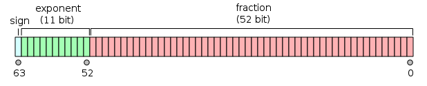
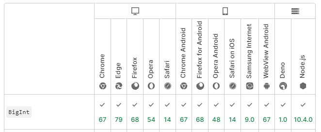
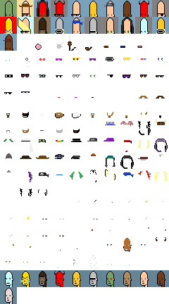

# Query the (Open) Ethereum Blockchain (Database) with Contract Services

using strongly-typed application binary interfaces (ABIs) with ethers.js (v6) via JSON-RPC


Abstract:

I am a no-coiner (HODLing 0 ethers) and a (big) fan of open data / transactions / art.
There's lot of misunderstandings of blockchains and crypto -
this talk shows how you can use the ethers.js library to query ("on-chain")
contract services on ethereum (for free).

The ABI (application binary interface) - "serialized" in JSON - for contract services
is kind of emerging as a new (open) standard / spec for (yes, strongly-typed) apis
(that you can use in any programming language incl. - of course - javascript).
Learn the difference between "on-chain" and "off-chain" tokens
or how to query for "on-chain" (generative) art and much more.


## Ethers.js v5 vs v6?  What's News?

> Big Numbers
>
> One of the biggest changes in v6 is that the BigNumber
> class has been replaced with the built-in ES2020 BigInt
> offered by modern JavaScript environments.
>
> There is plenty of online documentation to get you started with JavaScript ES2020 BigInt.
> Keep in mind, just like BigNumber, a ES2020 BigInt can only operate on integers.


## Numbers in JavaScript

No Integer!  All Numbers are (64-Bit) Double Precision Floating Point Numbers
(w/ 52 bits to represent the mantissa)




(Source: [Double-precision floating-point format @ Wikipedia](https://en.wikipedia.org/wiki/Double-precision_floating-point_format))


Max (biggest) integers safely to represent between `-(2^53 – 1)` and `2^53 – 1`


``` js
Number.MAX_SAFE_INTEGER
//=> 9007199254740991

2**53-1
//=> 9007199254740991
```


## Money, Money, Money


Best Practice - Use Integers Only (For Calculations)

Euro 5.99   change to 599 cents

1 Euro == 100 Cents (10^2)


Triva Quiz

Bitcoin 5.99  change to ___ sat(oshis)

Ether 5.99     change to __ wei

- 1 Bitcoin ==  ____ Sat(oshis) (10^ __ )
- 1 Ether == ____ Wei  (10^ __ )

<details>
<summary>Answer
</summary

1 Bitcoin ==  100 000 000 Sat(oshis) (10^8) - 100 million satoshis

1 Ether == 1000 000 000 000 000 000 Wei  (10^18)


Bitcoin 5.99  change to 599 000 000 sat(oshis)

Ether 5.99     change to 5990 000 000 000 000 000 wei

or with ethers.js

``` js
parseEther( "5.99" );
//=> 5990000000000000000n
```

</details>


## Before BigInt

``` js
10**18
//=> 1000000000000000000

(10**18)+1      // or   (10**18)+2 ...
//=> 1000000000000000000  - FAIL!!
```

Notice the suffix n (for BigInt)

``` js
(10n**18n)+1n
//=> 1000000000000000001n - SUCCESS!!
```

Note: You CANNOT mix & match numbers and bigint in calculations - bigint calculations only work with bigints.
e.g. `(10n**18)+1`
Otherwise you get:

> Error: Cannot mix BigInt and other types, use explicit conversions


However, you CAN compare numbers and bigints as usual:

``` js
1n < 2;  // true
2n > 1;  // true
2 > 2;   // false
2n > 2;  // false
2n >= 2; // true
```

Beware - about strictly vs loosly equal number and bigints:

``` js
0n === 0; // false
1n === 1; // false

0n == 0; // true
1n == 1; // true
```


Bigint "Convenience" Helper Functions - works with Number, String, Hex, Octal & Bin


``` js
const hugeNum = BigInt(9007199254740991);
//=> 9007199254740991n
```
Note: Number - remember - only up-to Number.MAX_INTEGER! that is 9007199254740991 (2^53-1)


``` js
const hugeString = BigInt("9007199254740991");
//=> 9007199254740991n

const hugeHex = BigInt("0x1fffffffffffff");
//=> 9007199254740991n

const hugeOctal = BigInt("0o377777777777777777");
//=> 9007199254740991n

const hugeBin = BigInt("0b11111111111111111111111111111111111111111111111111111");
//=> 9007199254740991n
```

or use literals

``` js
const hugeHex = 0x1fffffffffffffn;
//=> 9007199254740991n

const hugeOctal = 0o377777777777777777n;
//=> 9007199254740991n

const hugeBin = 0b11111111111111111111111111111111111111111111111111111n;
//=> 9007199254740991n
```


## BigInt - Can I Use?

BigInt added in ES2020 (ES11)




Or see <https://caniuse.com/bigint>


## The "Magic" of Private/Public Key Cryptography is Big Integer Numbers

How Big (in Bits) Is Safe & Secure For Elliptic Curve Cryptography (ECC)?


Triva Quiz - Private Keys (in Bitcoin, Ethereum, etc.) Are Big Integer Numbers - Q: How Big?

- (A) 128-Bit
- (B) 256-Bit
- (C) 512-Bit
- (D) 1024-Bit
- __ Other, Please Tell


``` js
2n**256n-1n
//=> 115792089237316195423570985008687907853269984665640564039457584007913129639935n

// as hexstring  (64 chars)
0xffffffffffffffffffffffffffffffffffffffffffffffffffffffffffffffffn  // or
BigInt( "0xffffffffffffffffffffffffffffffffffffffffffffffffffffffffffffffff" )
//=> 115792089237316195423570985008687907853269984665640564039457584007913129639935n
```


If you ask - How big (or how safe) is a (random) 256-bit / 32 byte integer number?

- How many sand grains on the beach?
- How many sand grains on earth?
- How many atoms in the universe?

Yes, 256-bit is that big - there aren't enough atoms in the universe (squared).


Aside - Elliptic What?

> Elliptic-curve cryptography (ECC) is an approach to public-key cryptography
> based on the algebraic structure of elliptic curves over finite fields.
>
> (Source: [Elliptic-curve cryptography @ Wikipedia](https://en.wikipedia.org/wiki/Elliptic-curve_cryptography))


Why not "classic" and "military-grade" RSA (Rivest–Shamir–Adleman) public-key cryptography?
How big (in bits) is safe?

> RSA keys are typically 1024 to 4096 bits long.
> In 2003, RSA Security estimated that 1024-bit keys were likely to become crackable by 2010.
> As of 2020, it is not known whether such keys can be cracked,
> but minimum recommendations have moved to at least 2048 bits.
> It is generally presumed that RSA is secure if n is sufficiently large,
> outside of quantum computing.
>
> (Source: [RSA cryptosystem @ Wikipedia](https://en.wikipedia.org/wiki/RSA_(cryptosystem)))


##  ethers.js  Uses Noble Crypto(graphy) JS Libraries by Paul Milller

Article - Learning fast elliptic-curve cryptography (ECC) [in JavaScript/TypeScript with BigInts]
see <https://paulmillr.com/posts/noble-secp256k1-fast-ecc/>

Live Demo - Elliptic curve (point) calculator
see <https://paulmillr.com/noble/>


---


## Getting Started w/ ethers.js


## History -  Programming Ethereum (or is it Web 3.0?) with JavaScript API


web3.js  - First (and original) library -  still available (and in use) - see <https://web3js.readthedocs.io>

ethers.js - New (cool) kid in town  by [Richard Moore](https://github.com/ricmoo) (Toronto, Canada)  - "One-Man Show"


## ethers.js - The official project summary / readme blurb


> A complete, compact and simple library for Ethereum and ilk, written in TypeScript.
>
> **Features**
>
> - Keep your private keys in your client, **safe** and sound
> - Import and export **JSON wallets**
> - Import and export BIP 39 **mnemonic phrases** (12 word backup phrases) and **HD Wallets** (English as well as Czech, French, Italian, Japanese, Korean, Simplified Chinese, Spanish, Traditional Chinese)
> - Meta-classes create JavaScript objects from any contract ABI, including **ABIv2** and **Human-Readable ABI**
> - Connect to Ethereum nodes over [JSON-RPC](https://github.com/ethereum/wiki/wiki/JSON-RPC), [INFURA](https://infura.io), [Etherscan](https://etherscan.io), [Alchemy](https://alchemyapi.io), [Ankr](https://ankr.com) or [MetaMask](https://metamask.io)
> - **ENS names** are first-class citizens; they can be used anywhere an Ethereum addresses can be used
> - **Tiny** (~120kb compressed; 400kb uncompressed)
> - **Tree-shaking** focused; include only what you need during bundling
> - **Complete** functionality for all your Ethereum desires
> - Extensive [documentation](https://docs.ethers.org/v6/)
> - Large collection of **test cases** which are maintained and added to
> - Fully written in **TypeScript**, with strict types for security
> - **MIT License** (including ALL dependencies); completely open source to do with as you please
>
> (Source: [ethers-io/ethers.js @ GitHub](https://github.com/ethers-io/ethers.js))


## ethers.js  - Getting Started w/ Node.js

```
$ npm install ethers
$ npm ls --all

`-- ethers@6.3.0
  +-- @adraffy/ens-normalize@1.9.0
  +-- @noble/hashes@1.1.2
  +-- @noble/secp256k1@1.7.1
  +-- aes-js@4.0.0-beta.3
  +-- tslib@2.4.0
  `-- ws@8.5.0
    +-- UNMET OPTIONAL DEPENDENCY bufferutil@^4.0.1
    `-- UNMET OPTIONAL DEPENDENCY utf-8-validate@^5.0.2
```


## Query for Token Contract Basics

- name
- symbol
- totalSupply

using


```
function name() view returns (string)
function symbol() view returns (string)
function totalSupply() view returns (uint256)
```


## Query for Token Contract Basics (Cont.)

No ethereum accounts (or ether) needed for read-only (query) contract access.

All data is public (incl. data declared "private" in code).

All contract functions / methods are always strongly-typed.

AND require / follow an application binary interface
(for data encoding/decoding - big endian vs little endian etc.).


## Token Basics - Via JSON-RPC Using ethers.js


``` js
import { ethers } from "ethers";    // Import everything

console.log( `Hello, ethers.js ${ethers.version}!` );
//=> Hello, ethers.js 6.3.0!

const provider = new ethers.JsonRpcProvider( "https://mainnet.infura.io/v3/<your_api_key_here>" );
```

**Blockchain JSON-RPC Provider Options**

Option 1)
You can run your own local (ethereum) blockchain node (e.g. geth).

Option 2)
Easier to get started with third-party provider
e.g.  Infura, Alchemy, QuickNode, and many more.

Requires (free) sign-up for API key.


## Contract №1 - Token Basics - Via JSON-RPC Using ethers.js  (Cont.)


``` js
const abi = [
  "function name() view returns (string)",
  "function symbol() view returns (string)",
  "function totalSupply() view returns (uint256)",
];

const addr = '0x06012c8cf97bead5deae237070f9587f8e7a266d';

// Create a contract
const contract = new ethers.Contract( addr, abi, provider);

const name = await contract.name();
//=> CryptoKitties
const sym = await contract.symbol();
//=> CK
const total = await contract.totalSupply();
//=> 2022592n
```


**Q: What about (cryptokitties) token metadata (& image)?**

A: It's still early ;-). SOON!
In theory, yes.  KittBase contract incl. `function tokenMetadata(uint256 tokenId) view returns (string)`
In practice, the metadata contract (reference) is set to null address (0x0000000000000000000000000000000000000000).

"Social" consensus ;-).  Use:
- <https://api.cryptokitties.co/kitties/1>.
- <https://api.cryptokitties.co/kitties/2>
- ...
- <https://api.cryptokitties.co/kitties/2022592>

resulting in:

``` json
{"id":1,
 "name":"Genesis",
 "generation":0,
 "genes":"626837621154801616088980922659877168609154386318304496692374110716999053",
 "created_at":"2017-11-23T06:19:59.000Z",
 "birthday":"2017-11-23T00:00:00.000Z",
 "image_url":"https://img.cryptokitties.co/0x06012c8cf97bead5deae237070f9587f8e7a266d/1.png",
 "image_url_cdn":"https://img.cn.cryptokitties.co/0x06012c8cf97bead5deae237070f9587f8e7a266d/1.png",
 ...
}
```


A classic crypto fraud - "own your kitties 100% forever!" - yeah, sure


reality -  you do NOT own the kitty/cat image
and the metadata (& image) is "off-chain" and hosted on a classic "central" company web server.
What you "own" is the token (and the "on-chain" genes/dna - a 256-bit integer)
that you can sell to greater fools for (fun &) profit!

Read the (hidden) fineprint - from the CryptoKitties License F.A.Q:

> Dapper Labs, Inc. created [and owns] the art of your cryptokitty,
> and it's a big part of our brand.
> At the end of the day, businesses also need to have the right to make the big decisions [and the big $$$] about how the art gets used in a commercial setting.
>
> We reserve to ourselves the right to make bigger [and bigger] deals
> to help our business grow [and rake in all the $$$ for ourselves - of course].
>
> [...]
>
> Q: What am I allowed to do with the art:
>
> - Use the Kitty art for your own personal, non-commercial use.
>
> Q: What am I NOT allowed to do with the art:
>
> - Modifying the art;
> - Using the art to market or sell products;
> - Trying to trademark your art, or otherwise acquire intellectual property rights in it.


=> "own your kitties 100% forever!" - the blockchain guarantees and says so ;-).

Dapper Labs Inc. (Vancouver, Canada) - A Billion $$ Unicorn with "Blue-Chip" Venture Capital Investors & More


## Contract №2  - "Off-Chain" Token Basics - Via JSON-RPC Using ethers.js

Let's try another...   add to abi ...

- `function tokenURI(uint256 tokenId) view returns (string)`

and let's query... Phree the Phunks ...


``` js
const addr = '0xf07468ead8cf26c752c676e43c814fee9c8cf402';

const abi = [
  "function name() view returns (string)",
  "function symbol() view returns (string)",
  "function totalSupply() view returns (uint256)",
  "function tokenURI(uint256 tokenId) view returns (string)",
];


// Create a contract
const contract = new ethers.Contract( addr, abi, provider);

const name = await contract.name();
//=> CryptoPhunksV2
const sym = await contract.symbol();
//=> PHUNK
const total = await contract.totalSupply();
//=> 10000n
```

**Q: What about token metadata (& image)?**

Let's try...


``` js
const token0 = await contract.tokenURI( 0 );
//=> ipfs://QmcfS3bYBErM2zo3dSRLbFzr2bvitAVJCMh5vmDf3N3B9X/0

const token1 = await contract.tokenURI( 1 );
//=> ipfs://QmcfS3bYBErM2zo3dSRLbFzr2bvitAVJCMh5vmDf3N3B9X/1

...

const token9999 = await contract.tokenURI( 9999 );
//=> ipfs://QmcfS3bYBErM2zo3dSRLbFzr2bvitAVJCMh5vmDf3N3B9X/9999
```

resulting in "off-chain" ipfs (InterPlanetary File System) links.

Tip: Try an ipfs http gateway e.g.

- <https://ipfs.io/ipfs/QmcfS3bYBErM2zo3dSRLbFzr2bvitAVJCMh5vmDf3N3B9X/0>
- <https://ipfs.io/ipfs/QmcfS3bYBErM2zo3dSRLbFzr2bvitAVJCMh5vmDf3N3B9X/1>
- ...
- <https://ipfs.io/ipfs/QmcfS3bYBErM2zo3dSRLbFzr2bvitAVJCMh5vmDf3N3B9X/9999>

resulting in:

``` json
{"description":"Phunk #0",
 "name":"Phunk #0",
 "attributes":[{"trait_type":"Eyes","value":"Green Eye Shadow"},
               {"trait_type":"Ears","value":"Earring"},
               {"trait_type":"Hair","value":"Blonde Bob"},
               {"trait_type":"Sex","value":"Female"}],
 "image_url":"https://gateway.pinata.cloud/ipfs/Qmazio5AkcBwNJByXHtbBk1hgnw4g1ADsYK369TSPLMqar/phunk0000.png"}
```


## (Blockchain) Contract Services  - Strongly-Typed ABIs Available As JSON

In theory you can write your blockchain contracts in any language.
In practice Solidity (JavaScript-like) is mostly used
and the definite (contract) ABI spec is
<https://docs.soliditylang.org/en/latest/abi-spec.html>


**From Solidity To (Contract) ABI JSON**

The solc (solidity ompiler) generates / compiles the contract source(s)
into a binary [blob] AND the ABI in JSON e.g.

``` json
{"type":     "function",
 "name":     "name",
 "constant": true,
 "payable":  false,
 "stateMutability": "view",
 "inputs": [],
 "outputs":[{"name":"","type":"string"}]
},
{"type":     "function",
 "name":     "symbol",
 "constant": true,
 "payable":  false,
 "stateMutability": "view",
 "inputs": [],
 "outputs":[{"name":"","type":"string"}]
},
{"type":"function",
 "name":"totalSupply",
 "constant":true,
 "payable":false,
 "stateMutability":"view",
 "inputs":[],
 "outputs":[{"name":"","type":"uint256"}]
},
...
```

Great idea. Easy to read/parse (for computers) BUT gets big and unreadable very fast for humans.

Tip: See [ABI-To-Sol](https://gnidan.github.io/abi-to-sol/)
to convert JSON ABIs back to "human" readable
"Solidity-like" interface headers.


## The "Human-Reabable" ABI Format

Yes, introduced first in ethers.js
(and invented by Richard Moore back in 2018 -
see [ethers.js: Human-Readable Contract ABIs](https://blog.ricmoo.com/human-readable-contract-abis-in-ethers-js-141902f4d917)).

Human-readable, really? At least computer programmer-readable ;-).


``` js
const abi = [
  "function name() view returns (string)",
  "function symbol() view returns (string)",
  "function totalSupply() view returns (uint256)",
  "function tokenURI(uint256 tokenId) view returns (string)",
  "function traitDetails(uint256 layerIndex, uint256 traitIndex) view returns (string name, string mimetype, bool hide)",
  "function traitData(uint256 layerIndex, uint256 traitIndex) view returns (string)",
];
```


## Contract №3 - "On-Chain" Token Basics - Via JSON-RPC Using ethers.js

Let's try another...  Seize the memes of production...

``` js
const addr = '0xe9b91d537c3aa5a3fa87275fbd2e4feaaed69bd0';

const abi = [
  "function name() view returns (string)",
  "function symbol() view returns (string)",
  "function totalSupply() view returns (uint256)",
  "function tokenURI(uint256 tokenId) view returns (string)",
  "function traitDetails(uint256 layerIndex, uint256 traitIndex) view returns (string name, string mimetype, bool hide)",
  "function traitData(uint256 layerIndex, uint256 traitIndex) view returns (string)",
];


// Create a contract
const contract = new ethers.Contract( addr, abi, provider);

const name = await contract.name();
//=> Crypto Marcs
const sym = await contract.symbol();
//=> MARCS
const total = await contract.totalSupply();
//=> 5000n
```

**Q: What about token metadata (& image)?**

Let's try...

``` js
const token0 = await contract.tokenURI( 0 );
```


resulting in:

```
data:application/json;base64,
eyJuYW1lIjoiQ3J5cHRvIE1hcmNzICMwIiwiZGVzY3JpcHRpb24iOiJBIGNvbGxlY3Rpb24gb2YgNWs
gQ3J5cHRvTWFyY3MgZnVsbHkgT24tQ2hhaW4gLSBTZWl6aW5nIHRoZSBtZW1lcyBvZiBwcm9kdWN0aW
9uIiwic3ZnX2ltYWdlX2RhdGEiOiJkYXRhOmltYWdlL3N2Zyt4bWw7YmFzZTY0LFBITjJaeUIzYVdSM
GFEMGlNVEl3TUNJZ2FHVnBaMmgwUFNJeE1qQXdJaUIyYVdWM1FtOTRQU0l3SURBZ01USXdNQ0F4TWpB
d0lpQjJaWEp6YVc5dVBTSXhMaklpSUhodGJHNXpQU0pvZEhSd09pOHZkM2QzTG5jekxtOXlaeTh5TUR
Bd0wzTjJaeUlnYzNSNWJHVTlJbUpoWTJ0bmNtOTFibVF0WTI5c2IzSTZkSEpoYm5Od1lYSmxiblE3WW
1GamEyZHliM1Z1WkMxcGJXRm5aVHAxY213b1pHRjBZVHBwYldGblpTOXdibWM3WW1GelpUWTBMR2xXU
Ws5U2R6QkxSMmR2UVVGQlFVNVRWV2hGVldkQlFVRkNaMEZCUVVGWlEwRlpRVUZCUkdka2VqTTBRVUZC
UVVOWVFrbFhXRTFCUVVGelZFRkJRVXhGZDBWQmJYQjNXVUZCUVVGS2EyeEZVVlpTU1dsbE0wNU5VVVZ
CUVVGcVJFMU5ReTgxTWtWRGRteFNRVEF3Ym5Gek0yMDVRWGRCUVVGQlFVRkJTbmt4UXpkdlJFeGtaSG
[...]
dmiOiJTcG90cyJ9LHsidHJhaXRfdHlwZSI6Ik1hcmMgVHlwZSIsInZhbHVlIjoiTWFyYyA0In1dfQ==
```


let's base64 decode - resulting in:

``` json
{"name":"Crypto Marcs #0",
 "description":"A collection of 5k CryptoMarcs fully On-Chain - Seizing the memes of production",
 "svg_image_data":"data:image/svg+xml;base64,PHN2ZyB3aWR0aD0iMTIwMCI...",
 "image_data":"data:image/svg+xml;base64,PHN2ZyB3aWR0aD0iMTAwJSI...",
 "attributes":[{"trait_type":"1/1","value":"Original"},
               {"trait_type":"Mouth","value":"Marc"},
               {"trait_type":"Eyes","value":"Marc"},
               {"trait_type":"Lips","value":"Marc"},
               {"trait_type":"Facial Hair","value":"Marc"},
               {"trait_type":"Head","value":"Bandana"},
               {"trait_type":"Neck","value":"Grey Shirt"},
               {"trait_type":"Nose","value":"Marc"},
               {"trait_type":"Ear","value":"Marc"},
               {"trait_type":"Emotion","value":"Marc"},
               {"trait_type":"Face","value":"Spots"},
               {"trait_type":"Marc Type","value":"Marc 4"}]}
```

and let's base64 decode the svg_image_data ;-) - resulting in:

``` xml
<svg width="1200" height="1200" viewBox="0 0 1200 1200" version="1.2"
     xmlns="http://www.w3.org/2000/svg"
     style="background-color:transparent;
            background-image:url(data:image/png;base64,iVBORw0KGgoAAA...),
                             url(data:image/png;base64,iVBORw0KGgoAAA...),
                             url(data:image/png;base64,iVBORw0KGgoAAA...),
                             url(data:image/png;base64,iVBORw0KGgoAAA...),
                             url(data:image/png;base64,iVBORw0KGgoAAA...),
                             url(data:image/png;base64,iVBORw0KGgoAAA...),
                             url(data:image/png;base64,iVBORw0KGgoAAA...),
                             url(data:image/png;base64,iVBORw0KGgoAAA...),
                             url(data:image/png;base64,iVBORw0KGgoAAA...),
                             url(data:image/png;base64,iVBORw0KGgoAAA...),
                             url(data:image/png;base64,iVBORw0KGgoAAA...),
                             url(data:image/png;base64,iVBORw0KGgoAAA...);
            background-repeat:no-repeat;
            background-size:contain;
            background-position:center;
            image-rendering:-webkit-optimize-contrast;-ms-interpolation-mode:nearest-neighbor;
            image-rendering:-moz-crisp-edges;
            image-rendering:pixelated;">
</svg>
```


## Contract №3 - Let's seize the memes of production ;-).


Let's get (query for) all generative art (image) blocks and names...
If the contract uses / supports:

-  `function traitDetails(uint256 layerIndex, uint256 traitIndex) view returns (string name, string mimetype, bool hide)` and
-  `function traitData(uint256 layerIndex, uint256 traitIndex) view returns (string)`

than you can "auto-magically" download all "on-chain" layers,
that is, all metadata triplets by repeatedly calling `traitDetails` starting
with index `0/0`, `0/1`, ..., `1/0`, `1/1`, ... and so on e.g.

- `traitDetails( 0, 0 )`  => `["Zombie", "image/png", false]`
- `traitDetails( 0, 1 )`  => `["Cline", "image/png", false]`
- ...
- `traitDetails( 1, 0 )`  =>  `["Bubble Gum", "image/png", false]`
- `traitDetails( 2, 1 )`  =>  `["Medical Mask", "image/png", false]`
- ...

resulting in 171 Attributes (incl. Nones) in 11 Categories (plus 1/1s):

```
id, category, name
0, 1/1, Zombie
1, 1/1, Cline
2, 1/1, Pauly Devil
3, 1/1, Deal With It Devil
4, 1/1, Marc
5, 1/1, Gold
6, 1/1, Marcdonalds
7, 1/1, Marc (2)
8, 1/1, Devil
9, 1/1, Marc (3)
10, 1/1, Madlad Marc
11, 1/1, Chad
12, 1/1, Ape
13, 1/1, Claudia Bot
14, 1/1, Marc (4)
15, 1/1, Bot
16, 1/1, Marc (5)
17, 1/1, Marc (6)
18, 1/1, Alien
19, 1/1, Claudia Gold
20, 1/1, Marc (7)
21, 1/1, Original
22, Mouth, Bubble Gum
23, Mouth, Medical Mask
24, Mouth, Hookah
25, Mouth, Pipe
26, Mouth, Cigar
27, Mouth, Vape
28, Mouth, Cigarette
29, Mouth, None
30, Eyes, Tears
31, Eyes, Monocle
32, Eyes, Lasers
33, Eyes, Pink Shades
34, Eyes, Aviators
35, Eyes, Polarized White
36, Eyes, VR Headset
37, Eyes, Gold Glasses
38, Eyes, 3D Glasses
...
```


and all images (as binary blobs) by calling `traitData` e.g.

- `traitData( 0, 0 )`  => `"\x89PNG..."`
- `traitData( 0, 1 )`  => `"\x89PNG..."`
- ...

and so on resulting in:




For many more real-world examples incl. Mad Camels, Ape Origins, Punkin Spicies, NFL, etc.
see the [**Art Factory Sandbox**](https://github.com/generativeartfactory/artfactory.sandbox).


## Questions? Comments?


Thanks.


**What's ETH Vienna / Wien Meetup / Stammtisch?**

The idea is to (re)start the Eth(erum) community in Vienna / Wien.

Eth(ereum) Vienna Meetup(s) - Jour Fixe - Every First Wednesday of the Month.

- **Wednesday, April 5th, 2023, 6-8pm - (Ethereum) Blockchain & Red Kriek Beer**
- **Wednesday, May 3rd, 2023, 6-8pm**
- **Wednesday, June 7th, 2023, 6-8pm**
- Summer Break

@ Delirium Café Vienna, Passauer Platz 2, 1. District (Beside the Church - Maria am Gestade)

Note: Everyone MUST pay for your own drink(s) and optional food.
For the menu & prices, see <https://paddysco.at/datein/Delirium-Cafe-Menu.pdf>. For example - A traditional (on tap!) Belgian kriek lambic beer by Brouwerij F. Boon costs 0.15L €2.80 / 0.33L €4.80.

Join us. See  <https://meetup.com/eth-vienna> or <https://viennacrypto.github.io>.


---

##  Bonus

## What's the point of (Contract) ABIs?

Spec(ification) of strongly-typed function calls (and function call data)
guarantees binary interop(eration).

It is kind of emerging as a new (open) standard / spec for (yes, strongly-typed) apis
(that you can use in any programming language incl. - of course - javascript).

Note: Ideally all (blockchain) contract code is open source (and "byte-by-byte" verified)
but in practice NOT all contract source code gets published.


Yes, "native" language is Solidity.

Designed "like-JSON", that is, limited set of data types - works and fits into most programming languages.
See my own [abicoder (yes, v2-compatible) in ruby](https://github.com/rubycocos/blockchain/tree/master/abicoder) ;-).

ABI v2  (yes, there's an update)  incl. tuples (also known as structs)
and arrays of arrays or tuple of tuples or array of tuples and so on.


## ABI Types

The following elementary types are supported:

- `uint<M>`: unsigned integer type of `M` bits, `0 < M <= 256`, `M % 8 == 0`. e.g. `uint32`, `uint8`, `uint256`.
- `int<M>`: two's complement signed integer type of `M` bits, `0 < M <= 256`, `M % 8 == 0`.
- `address`: equivalent to `uint160`, except for the assumed interpretation and language typing.
  For computing the function selector, `address` is used.
- `bool`: equivalent to `uint8` restricted to the values 0 and 1. For computing the function selector, `bool` is used.
- `bytes<M>`: binary type of `M` bytes, `0 < M <= 32`.


The following (fixed-size) array types are supported:

- `<type>[M]`: a fixed-length array of `M` elements, `M >= 0`, of the given type.


The following non-fixed-size types are supported:

- `bytes`: dynamic sized byte sequence.
- `string`: dynamic sized unicode string assumed to be UTF-8 encoded.
- `<type>[]`: a variable-length array of elements of the given type.

Types can be combined to a tuple by enclosing them inside parentheses, separated by commas:

- `(T1,T2,...,Tn)`: tuple consisting of the types `T1`, ..., `Tn`, `n >= 0`

It is possible to form tuples of tuples, arrays of tuples and so on.


## What's abigen?

Using the abigen command-line tool
you can generate type-safe "wrapper" code for contracts from abis (in json)
for your language.

Started with Go Lang  (a statically compiled programming language)
but works practically with any language.
See my own [little abigen in ruby, that is, abi2ruby](https://github.com/rubycocos/blockchain/tree/master/abi2ruby) ;-) -
a python-like dynamic programming language.


Also used in JS  for auto-documentation "in the real-world"
or - of course - for type-safe contracts in ... TypeScript -
see  [ABI Type - Strict TypeScript types for Contract ABIs.](https://abitype.dev)
and many more.


