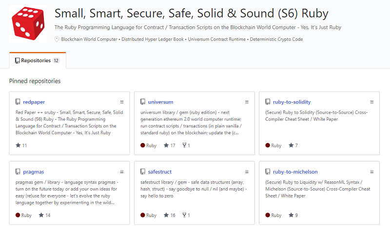
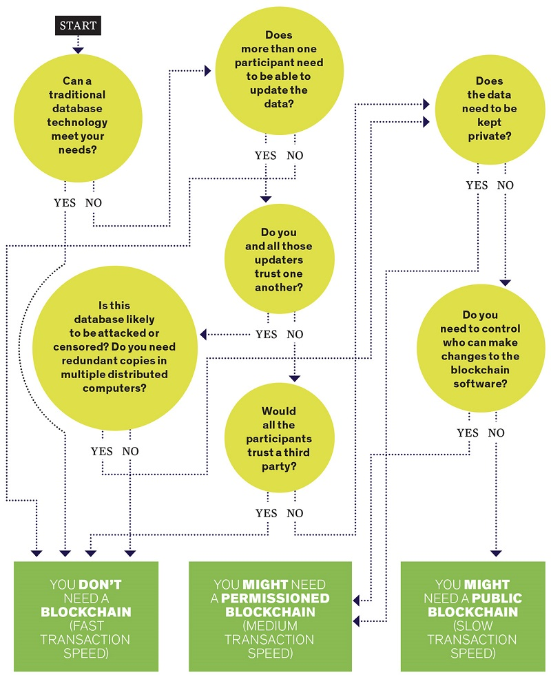

# Contract Scripting for Everyone: (Hyperledger) Car Registration Sample with (Secure) Ruby


## Hyperledger Fabric - Getting Started - Simple (Asset) Storage Service

``` go
package main

import (
    "fmt"

    "github.com/hyperledger/fabric/core/chaincode/shim"
    "github.com/hyperledger/fabric/protos/peer"
)

// SimpleAsset implements a simple chaincode to manage an asset
type SimpleAsset struct {
}

// Init is called during chaincode instantiation to initialize any
// data. Note that chaincode upgrade also calls this function to reset
// or to migrate data.
func (t *SimpleAsset) Init(stub shim.ChaincodeStubInterface) peer.Response {
    // Get the args from the transaction proposal
    args := stub.GetStringArgs()
    if len(args) != 2 {
            return shim.Error("Incorrect arguments. Expecting a key and a value")
    }

    // Set up any variables or assets here by calling stub.PutState()

    // We store the key and the value on the ledger
    err := stub.PutState(args[0], []byte(args[1]))
    if err != nil {
            return shim.Error(fmt.Sprintf("Failed to create asset: %s", args[0]))
    }
    return shim.Success(nil)
}

// Invoke is called per transaction on the chaincode. Each transaction is
// either a 'get' or a 'set' on the asset created by Init function. The Set
// method may create a new asset by specifying a new key-value pair.
func (t *SimpleAsset) Invoke(stub shim.ChaincodeStubInterface) peer.Response {
    // Extract the function and args from the transaction proposal
    fn, args := stub.GetFunctionAndParameters()

    var result string
    var err error
    if fn == "set" {
            result, err = set(stub, args)
    } else { // assume 'get' even if fn is nil
            result, err = get(stub, args)
    }
    if err != nil {
            return shim.Error(err.Error())
    }

    // Return the result as success payload
    return shim.Success([]byte(result))
}

// Set stores the asset (both key and value) on the ledger. If the key exists,
// it will override the value with the new one
func set(stub shim.ChaincodeStubInterface, args []string) (string, error) {
    if len(args) != 2 {
            return "", fmt.Errorf("Incorrect arguments. Expecting a key and a value")
    }

    err := stub.PutState(args[0], []byte(args[1]))
    if err != nil {
            return "", fmt.Errorf("Failed to set asset: %s", args[0])
    }
    return args[1], nil
}

// Get returns the value of the specified asset key
func get(stub shim.ChaincodeStubInterface, args []string) (string, error) {
    if len(args) != 1 {
            return "", fmt.Errorf("Incorrect arguments. Expecting a key")
    }

    value, err := stub.GetState(args[0])
    if err != nil {
            return "", fmt.Errorf("Failed to get asset: %s with error: %s", args[0], err)
    }
    if value == nil {
            return "", fmt.Errorf("Asset not found: %s", args[0])
    }
    return string(value), nil
}

// main function starts up the chaincode in the container during instantiate
func main() {
    if err := shim.Start(new(SimpleAsset)); err != nil {
            fmt.Printf("Error starting SimpleAsset chaincode: %s", err)
    }
}
```

(Source: [Hyperledger Fabric » Tutorials » Chaincode for Developers](https://hyperledger-fabric.readthedocs.io/en/release-1.4/chaincode4ade.html))


## Hyperledger Fabric - Getting Started - Simple (Asset) Storage Service (Cont.)

**Use the new chaincode**

```
peer chaincode install -p chaincodedev/chaincode/sacc -n mycc -v 0
peer chaincode instantiate -n mycc -v 0 -c '{"Args":["a","10"]}' -C myc
```

Now issue an invoke to change the value of `a` to `20`.

```
peer chaincode invoke -n mycc -c '{"Args":["set", "a", "20"]}' -C myc
```

Finally, query `a`. We should see a value of `20`.

```
peer chaincode query -n mycc -c '{"Args":["query","a"]}' -C myc
```


(Source: [Hyperledger Fabric » Tutorials » Chaincode for Developers](https://hyperledger-fabric.readthedocs.io/en/release-1.4/chaincode4ade.html))


## Simple (Asset) Storage Service - (Secure) Ruby Contract Version


``` ruby
def setup( key, value )
  @state = Mapping.of( String => String ).new
  @state[ key ] = value
end

def set( key, value )
  @state[ key] = value
end

def get( key )
  assert @state.has_key?( key ), "Asset not found: #{key}"
  @state[ key ]
end
```

or with (optional) type signatures

``` ruby
sig [String, String],
def setup( key, value )
  @state = Mapping.of( String => String ).new
  @state[ key ] = value
end

sig [String, String],
def set( key, value )
  @state[ key] = value
end

sig [String] => [String],
def get( key )
  assert @state.has_key?( key ), "Asset not found: #{key}"
  @state[ key ]
end
```

(Source: `s6ruby/universum-contracts/hyperledger/simple_asset.rb`)


## Simple (Asset) Storage Service  - (Secure) Ruby Contract Version (Cont.)

**Use the new contract code**

``` ruby
require "universum"

## create contract
tx = Uni.send_transaction( from: "0x1111", data: ["./simple_asset", "a", "10"] )
simple_asset = tx.receipt.contract
```

Now issue an invoke to change the value of `a` to `20`.

``` ruby
Uni.send_transaction( from: "0x1111", to: simple_asset, data: [:set, "a", "20"] )
```

Finally, query `a`. We should see a value of `20`.

``` ruby
Uni.send_transaction( from: "0x1111", to: simple_asset, data: [:get, "a"] )
```

(Source: `s6ruby/universum-contracts/hyperledger/run_simple_asset.rb`)


## Expert Corner - Use (Code) Your Own (Secure) Ruby Contract (State) Storage


``` ruby
class HyperledgerStorage
  def initialize( stub )
    @stub
  end
  def []( key )
    @stub.get_state( key )
  end
  def []=( key, value )
    @stub.put_state( key, value )
  end
end
```

See (Secure) Ruby [Language Syntax Pragmas](https://github.com/s6ruby/pragmas) for more.


## What's (Secure) Ruby?



(Source: [`github.com/s6ruby`](https://github.com/s6ruby))


## What's (Secure) Ruby? (Cont.)

sruby - Small, Smart, Secure, Safe, Solid & Sound (S6) Ruby

The Ruby Programming Language for Contract / Transaction Scripts on the Blockchain World Computer - Yes, It's Just Ruby

sruby is a subset of mruby that is a subset of "classic" ruby.

**What's missing and why?**

Less is more. The golden rule of secure code is keep it simple, stupid.

- NO inheritance
- NO recursion
- NO re-entrance - auto-magic protection on function calls
- NO floating point numbers or arithmetic
- NO overflow & underflow in numbers - auto-magic "safe-math" protection
- NO null (`nil`) - all variables, structs and hash mappings have default (zero) values
- and much much more

**What's the upside?**

You can cross-compile (transpile) contract scripts (*) to:

- Solidity - JavaScript-like contract scripts
- Liquidity - OCaml-like (or ReasonML-like) contract scripts
- Hyperledger Fabric Chaincode -  Go / Java / JavaScript (Node.js) contract scripts
- and much much more

(*) in the future.


**Yes, yes, yes - It's just "plain-vanilla" ruby**

Remember - the code is and always will be just "plain-vanilla" ruby
that runs with "classic" ruby or mruby "out-of-the-box".


## Contract-Oriented Programming Languages - Do We Need A New Language?

New Languages

1) Turning Incomplete (No loops, No Jumps, etc.)

- Bitcoin (Genesis!) ⇒ **(Bitcoin) Script** - Forth-like contract scripts run on stack machine
- Bitcoin Elements (Side-Chain) ⇒  **Simplicity** - "Next Generation" (Bitcoin) Script - "type-safe" (functional) Haskell-like "bitmachine"


2) Turning Complete
- Ethereum & Friends ⇒ **Solidity** - JavaScript-like contract scripts run on Ethereum Virtual stack-Machine (EVM)
- Tezos              ⇒ **Liquidity** - OCaml-like (or ReasonML-like) contract scripts run on "Michelson" "type-safe" (functional) stack machine


New APIs Only - Use "Classic" Languages

- EOSIO              ⇒  **C++**  (must compile to WebAssembly; runs with WebAssembly stack machine)
- Hyperledger Fabric ⇒  **Go / Java / JavaScript (Node.js)** run in Docker container using the Chaincode API / Interface
   - `start(...)`
   - `getState( key )` / `putState( key, value )`
   - `error()` / `success()`


## Networks, Networks, Networks - Running the Contract Code

- Main Network
- Test Network
- Private (Local) Test Network

For (secure) ruby use the "classic" ruby runtime (with a library)
to run the contract code on
the private (local) test network.

⇒ "yes, it's just ruby" philosophy

⇒ coding is coding, debugging is debugging, testing is testing, and so on -
use the tools you already know and love :-).

Good luck on trying to rebuild a new ecosystem from scratch.


## Hyperledger Fabric Sample - Fabcar

FabCar is a database of car records stored in the ledger of a Fabric network. We can consider this as a traditional database storing the data:
it is like a table, indexed with a Car Identifier (CarID), and the information of Maker, Model, Colour and Owner is recorded for this car.

The data are stored in the world state database inside the ledger.
Interaction with the data is through chaincode.


## Fabcar Chaincode

``` go
/*
 * The sample smart contract for documentation topic:
 * Writing Your First Blockchain Application
 */

package main

/* Imports
 * 4 utility libraries for formatting, handling bytes, reading and writing JSON, and string manipulation
 * 2 specific Hyperledger Fabric specific libraries for Smart Contracts
 */
import (
 "bytes"
 "encoding/json"
 "fmt"
 "strconv"

 "github.com/hyperledger/fabric/core/chaincode/shim"
 "github.com/hyperledger/fabric/protos/peer"
)

// Define the Smart Contract structure
type FabCar struct {
}

// Define the car structure, with 4 properties.  Structure tags are used by encoding/json library
type Car struct {
 Make   string `json:"make"`
 Model  string `json:"model"`
 Colour string `json:"colour"`
 Owner  string `json:"owner"`
}

/*
 * The Init method is called when the Smart Contract "fabcar" is instantiated by the blockchain network
 * Best practice is to have any Ledger initialization in separate function -- see initLedger()
 */
func (t *FabCar) Init(APIstub shim.ChaincodeStubInterface) peer.Response {
 return shim.Success(nil)
}

/*
 * The Invoke method is called as a result of an application request to run the Smart Contract "fabcar"
 * The calling application program has also specified the particular smart contract function to be called, with arguments
 */
func (t *FabCar) Invoke(APIstub shim.ChaincodeStubInterface) peer.Response {

 // Retrieve the requested Smart Contract function and arguments
 function, args := APIstub.GetFunctionAndParameters()
 // Route to the appropriate handler function to interact with the ledger appropriately
 if function == "queryCar" {
  return t.queryCar(APIstub, args)
 } else if function == "initLedger" {
  return t.initLedger(APIstub)
 } else if function == "createCar" {
  return t.createCar(APIstub, args)
 } else if function == "queryAllCars" {
  return t.queryAllCars(APIstub)
 } else if function == "changeCarOwner" {
  return t.changeCarOwner(APIstub, args)
 }

 return shim.Error("Invalid Smart Contract function name.")
}

func (t *FabCar) queryCar(APIstub shim.ChaincodeStubInterface, args []string) peer.Response {

 if len(args) != 1 {
  return shim.Error("Incorrect number of arguments. Expecting 1")
 }

 carAsBytes, _ := APIstub.GetState(args[0])
 return shim.Success(carAsBytes)
}

func (t *FabCar) initLedger(APIstub shim.ChaincodeStubInterface) peer.Response {
 cars := []Car{
  Car{Make: "Toyota", Model: "Prius", Colour: "blue", Owner: "Tomoko"},
  Car{Make: "Ford", Model: "Mustang", Colour: "red", Owner: "Brad"},
  Car{Make: "Hyundai", Model: "Tucson", Colour: "green", Owner: "Jin Soo"},
  Car{Make: "Volkswagen", Model: "Passat", Colour: "yellow", Owner: "Max"},
  Car{Make: "Tesla", Model: "S", Colour: "black", Owner: "Adriana"},
  Car{Make: "Peugeot", Model: "205", Colour: "purple", Owner: "Michel"},
  Car{Make: "Chery", Model: "S22L", Colour: "white", Owner: "Aarav"},
  Car{Make: "Fiat", Model: "Punto", Colour: "violet", Owner: "Pari"},
  Car{Make: "Tata", Model: "Nano", Colour: "indigo", Owner: "Valeria"},
  Car{Make: "Holden", Model: "Barina", Colour: "brown", Owner: "Shotaro"},
 }

 i := 0
 for i < len(cars) {
  fmt.Println("i is ", i)
  carAsBytes, _ := json.Marshal(cars[i])
  APIstub.PutState("CAR"+strconv.Itoa(i), carAsBytes)
  fmt.Println("Added", cars[i])
  i = i + 1
 }

 return shim.Success(nil)
}

func (t *FabCar) createCar(APIstub shim.ChaincodeStubInterface, args []string) peer.Response {

 if len(args) != 5 {
  return shim.Error("Incorrect number of arguments. Expecting 5")
 }

 var car = Car{Make: args[1], Model: args[2], Colour: args[3], Owner: args[4]}

 carAsBytes, _ := json.Marshal(car)
 APIstub.PutState(args[0], carAsBytes)

 return shim.Success(nil)
}

func (t *FabCar) queryAllCars(APIstub shim.ChaincodeStubInterface) peer.Response {

 startKey := "CAR0"
 endKey := "CAR999"

 resultsIterator, err := APIstub.GetStateByRange(startKey, endKey)
 if err != nil {
  return shim.Error(err.Error())
 }
 defer resultsIterator.Close()

 // buffer is a JSON array containing QueryResults
 var buffer bytes.Buffer
 buffer.WriteString("[")

 bArrayMemberAlreadyWritten := false
 for resultsIterator.HasNext() {
  queryResponse, err := resultsIterator.Next()
  if err != nil {
   return shim.Error(err.Error())
  }
  // Add a comma before array members, suppress it for the first array member
  if bArrayMemberAlreadyWritten == true {
   buffer.WriteString(",")
  }
  buffer.WriteString("{\"Key\":")
  buffer.WriteString("\"")
  buffer.WriteString(queryResponse.Key)
  buffer.WriteString("\"")

  buffer.WriteString(", \"Record\":")
  // Record is a JSON object, so we write as-is
  buffer.WriteString(string(queryResponse.Value))
  buffer.WriteString("}")
  bArrayMemberAlreadyWritten = true
 }
 buffer.WriteString("]")

 fmt.Printf("- queryAllCars:\n%s\n", buffer.String())

 return shim.Success(buffer.Bytes())
}

func (t *FabCar) changeCarOwner(APIstub shim.ChaincodeStubInterface, args []string) peer.Response {

 if len(args) != 2 {
  return shim.Error("Incorrect number of arguments. Expecting 2")
 }

 carAsBytes, _ := APIstub.GetState(args[0])
 car := Car{}

 json.Unmarshal(carAsBytes, &car)
 car.Owner = args[1]

 carAsBytes, _ = json.Marshal(car)
 APIstub.PutState(args[0], carAsBytes)

 return shim.Success(nil)
}

// The main function is only relevant in unit test mode. Only included here for completeness.
func main() {

 // Create a new FabCar Contract
 err := shim.Start(new(FabCar))
 if err != nil {
  fmt.Printf("Error creating new FabCar Contract: %s", err)
 }
}
```

(Source: [`hyperledger/fabric-samples/chaincode/fabcar/go/fabcar.go`](https://github.com/hyperledger/fabric-samples/blob/master/chaincode/fabcar/go/fabcar.go))


## Fabcar - From Go Chaincode to (Secure) Ruby Contract Script

``` go
type Car struct {
 Make   string `json:"make"`
 Model  string `json:"model"`
 Colour string `json:"colour"`
 Owner  string `json:"owner"`
}
```

vs

``` ruby
struct :Car, {
  make:   "",
  model:  "",
  colour: "",
  owner:  "",    ## note: should really be Address(0) !!!
}
```


## initLedger - Fabcar - From Go Chaincode to (Secure) Ruby Contract Script

``` go
func (t *FabCar) Init(APIstub shim.ChaincodeStubInterface) peer.Response {
 return shim.Success(nil)
}

func (t *FabCar) initLedger(APIstub shim.ChaincodeStubInterface) peer.Response {
 cars := []Car{
  Car{Make: "Toyota", Model: "Prius", Colour: "blue", Owner: "Tomoko"},
  Car{Make: "Ford", Model: "Mustang", Colour: "red", Owner: "Brad"},
  Car{Make: "Hyundai", Model: "Tucson", Colour: "green", Owner: "Jin Soo"},
  Car{Make: "Volkswagen", Model: "Passat", Colour: "yellow", Owner: "Max"},
  Car{Make: "Tesla", Model: "S", Colour: "black", Owner: "Adriana"},
  Car{Make: "Peugeot", Model: "205", Colour: "purple", Owner: "Michel"},
  Car{Make: "Chery", Model: "S22L", Colour: "white", Owner: "Aarav"},
  Car{Make: "Fiat", Model: "Punto", Colour: "violet", Owner: "Pari"},
  Car{Make: "Tata", Model: "Nano", Colour: "indigo", Owner: "Valeria"},
  Car{Make: "Holden", Model: "Barina", Colour: "brown", Owner: "Shotaro"},
 }

 i := 0
 for i < len(cars) {
  fmt.Println("i is ", i)
  carAsBytes, _ := json.Marshal(cars[i])
  APIstub.PutState("CAR"+strconv.Itoa(i), carAsBytes)
  fmt.Println("Added", cars[i])
  i = i + 1
 }

 return shim.Success(nil)
}
```

vs


``` ruby
def setup
  @state = Mapping.of( String => Car ).new
end

def init_ledger
  [Car.new( make: "Toyota",     model: "Prius",   colour: "blue",   owner: "Tomoko"),
   Car.new( make: "Ford",       model: "Mustang", colour: "red",    owner: "Brad"),
   Car.new( make: "Hyundai",    model: "Tucson",  colour: "green",  owner: "Jin Soo"),
   Car.new( make: "Volkswagen", model: "Passat",  colour: "yellow", owner: "Max"),
   Car.new( make: "Tesla",      model: "S",       colour: "black",  owner: "Adriana"),
   Car.new( make: "Peugeot",    model: "205",     colour: "purple", owner: "Michel"),
   Car.new( make: "Chery",      model: "S22L",    colour: "white",  owner: "Aarav"),
   Car.new( make: "Fiat",       model: "Punto",   colour: "violet", owner: "Pari"),
   Car.new( make: "Tata",       model: "Nano",    colour: "indigo", owner: "Valeria"),
   Car.new( make: "Holden",     model: "Barina",  colour: "brown",  owner: "Shotaro"),
  ].each_with_index do |car,i|
    puts "i is #{i}"
    @state[ "CAR#{i}" ] = car
   puts "Added #{car.inspect}"
  end
end
```


## queryCar - Fabcar - From Go Chaincode to (Secure) Ruby Contract Script


``` go
func (t *FabCar) queryCar(APIstub shim.ChaincodeStubInterface, args []string) peer.Response {

 if len(args) != 1 {
  return shim.Error("Incorrect number of arguments. Expecting 1")
 }

 carAsBytes, _ := APIstub.GetState(args[0])
 return shim.Success(carAsBytes)
}
```

vs

``` ruby
def query_car( key )
  @state[ key ]
end
```


## createCar - Fabcar - From Go Chaincode to (Secure) Ruby Contract Script

``` go
func (t *FabCar) createCar(APIstub shim.ChaincodeStubInterface, args []string) peer.Response {

 if len(args) != 5 {
  return shim.Error("Incorrect number of arguments. Expecting 5")
 }

 var car = Car{Make: args[1], Model: args[2], Colour: args[3], Owner: args[4]}

 carAsBytes, _ := json.Marshal(car)
 APIstub.PutState(args[0], carAsBytes)

 return shim.Success(nil)
}
```

vs

``` ruby
def create_car( key, make, model, colour, owner )
 car = Car.new( make: make, model: model, colour: colour, owner: owner )
  @state[ key ] = car
end
```

or

``` ruby
def create_car( key, make, model, colour, owner )
  @state[ key ] = Car.new( make, model, colour, owner )
end
```


## changeCarOwner - Fabcar - From Go Chaincode to (Secure) Ruby Contract Script

``` go
func (t *FabCar) changeCarOwner(APIstub shim.ChaincodeStubInterface, args []string) peer.Response {

 if len(args) != 2 {
  return shim.Error("Incorrect number of arguments. Expecting 2")
 }

 carAsBytes, _ := APIstub.GetState(args[0])
 car := Car{}

 json.Unmarshal(carAsBytes, &car)
 car.Owner = args[1]

 carAsBytes, _ = json.Marshal(car)
 APIstub.PutState(args[0], carAsBytes)

 return shim.Success(nil)
}
```

vs

``` ruby
def change_car_owner( key, owner )
  car = @state[ key ]
  car.owner = owner
  @state[ key ] = car
end
```

or

``` ruby
def change_car_owner( key, owner )
  assert @state.has_key?( key ), "Car not found: #{key}"
  @state[ key ].owner = owner
end
```


## queryAllChars - Fabcar - From Go Chaincode to (Secure) Ruby Contract Script

``` go
func (t *FabCar) queryAllCars(APIstub shim.ChaincodeStubInterface) peer.Response {

 startKey := "CAR0"
 endKey := "CAR999"

 resultsIterator, err := APIstub.GetStateByRange(startKey, endKey)
 if err != nil {
  return shim.Error(err.Error())
 }
 defer resultsIterator.Close()

 // buffer is a JSON array containing QueryResults
 var buffer bytes.Buffer
 buffer.WriteString("[")

 bArrayMemberAlreadyWritten := false
 for resultsIterator.HasNext() {
  queryResponse, err := resultsIterator.Next()
  if err != nil {
   return shim.Error(err.Error())
  }
  // Add a comma before array members, suppress it for the first array member
  if bArrayMemberAlreadyWritten == true {
   buffer.WriteString(",")
  }
  buffer.WriteString("{\"Key\":")
  buffer.WriteString("\"")
  buffer.WriteString(queryResponse.Key)
  buffer.WriteString("\"")

  buffer.WriteString(", \"Record\":")
  // Record is a JSON object, so we write as-is
  buffer.WriteString(string(queryResponse.Value))
  buffer.WriteString("}")
  bArrayMemberAlreadyWritten = true
 }
 buffer.WriteString("]")

 fmt.Printf("- queryAllCars:\n%s\n", buffer.String())

 return shim.Success(buffer.Bytes())
}
```

vs

``` ruby
def query_all_cars
  #####################
  # Homework :-).
  #####################
end
```


## Fabcar - (Secure) Ruby Contract Script - All Together Now

``` ruby
struct :Car, {
  make:   "",
  model:  "",
  colour: "",
  owner:  "",    ## note: should really be Address(0) !!!
}

def setup
  @state = Mapping.of( String => Car ).new
end

def init_ledger
  [Car.new( make: "Toyota",     model: "Prius",   colour: "blue",   owner: "Tomoko"),
   Car.new( make: "Ford",       model: "Mustang", colour: "red",    owner: "Brad"),
   Car.new( make: "Hyundai",    model: "Tucson",  colour: "green",  owner: "Jin Soo"),
   Car.new( make: "Volkswagen", model: "Passat",  colour: "yellow", owner: "Max"),
   Car.new( make: "Tesla",      model: "S",       colour: "black",  owner: "Adriana"),
   Car.new( make: "Peugeot",    model: "205",     colour: "purple", owner: "Michel"),
   Car.new( make: "Chery",      model: "S22L",    colour: "white",  owner: "Aarav"),
   Car.new( make: "Fiat",       model: "Punto",   colour: "violet", owner: "Pari"),
   Car.new( make: "Tata",       model: "Nano",    colour: "indigo", owner: "Valeria"),
   Car.new( make: "Holden",     model: "Barina",  colour: "brown",  owner: "Shotaro"),
  ].each_with_index do |car,i|
    puts "i is #{i}"
    @state[ "CAR#{i}" ] = car
    puts "Added #{car.inspect}"
  end
end

def query_car( key )
  assert @state.has_key?( key ), "Car not found: #{key}"
  @state[ key ]
end

def create_car( key, make, model, colour, owner )
  @state[ key ] = Car.new( make, model, colour, owner )
end

def change_car_owner( key, owner )
  assert @state.has_key?( key ), "Car not found: #{key}"
  @state[ key ].owner = owner
end

def query_all_cars
  #####################
  # Homework :-).
  #####################
end
```

(Source: `s6ruby/universum-contracts/hyperledger/fabcar.rb`)


## FabCar  - (Secure) Ruby Contract Version (Cont.)

**Use the new contract code**

``` ruby
require "universum"

## create contract
tx = Uni.send_transaction( from: "0x1111", data: ["./fabcar"] )
fabcar = tx.receipt.contract
```

Now issue an invoke to init the ledger.

``` ruby
Uni.send_transaction( from: "0x1111", to: fabcar, data: [:init_ledger] )
```

Finally, query `CAR0`. We should see a value of
`<Car make:"Toyota", model: "Prius", colour: "blue", owner: "Tomoko">`.


``` ruby
Uni.send_transaction( from: "0x1111", to: fabcar, data: [:query_car, "CAR0"] )
```

(Source: `s6ruby/universum-contracts/hyperledger/run_fabcar.rb`)


## Bonus - Do You Need A Blockchain?

###  Do You Need A Blockchain?  - TL;DR Version

Manager Executive TL;DR (Too Long; Didn't Read) Summary:

Q: Do you need a blockchain?  NO.


### Do You Need A Blockchain - Bitcoin Maximalist Version

Q: Do you need digital cash / gold?

No   ⇒ You DON'T need a blockchain

Yes  ⇒ Use Bitcoin - the ONLY blockchain that works


### Do You Need A Blockchain?  - IEEE Spectrum Verison

Q: Can a traditional database meet your needs?  Yes  ⇒ You DON'T need a blockchain

Q: Does more than one participant need to be able to update the data? No  ⇒ You DON'T need a blockchain

Q: Do you and all those updaters trust one another - Yes/No?

Q: Would all the participants trust a third party? Yes ⇒ You DON'T need a blockchain

Q: Is this database likely to be attacked or censored? Do you need redundant
copies in multiple distributed computers? No ⇒ You DON'T need a blockchain

Q: Does the data need to be kept private? Yes ⇒ You MIGHT need a permissioned blockchain

Q: Do you need to control who can make changes to the blockchain software?
Yes ⇒ You MIGHT need a permissioned blockchain,
No ⇒ You MIGHT need a public blockchain




(Source: [Do You Need a Blockchain?](https://spectrum.ieee.org/computing/networks/do-you-need-a-blockchain), IEEE Spectrum, Special Report: Blockchain World)


### Do You Need A Blockchain?  - ETH Zürich Version

Q: Do you need to store state?   No  ⇒ Definitely NO Blockchain Needed

Q: Are there multiple writers?   No  ⇒ Definitely NO Blockchain Needed

Q: Can you use an always online trusted third party (TTP)?  No   ⇒ Definitely NO Blockchain Needed

Q: Are all writers known?   No   ⇒ Perhaps, Permissionless Blockchain might work!

Q: Are all writers trusted?   Yes   ⇒ Definitely NO Blockchain Needed

Q: Is public verifiability required?
  No   ⇒ Perhaps, Private Permissioned Blockchain might work!,
  Yes  ⇒ Perhaps, Public Permissioned Blockchain might work!


(Source: [doyouneedablockchain.com](http://doyouneedablockchain.com),
Do you need a Blockchain? by Karl Wüst, Department of Computer Science (ETH Zurich) and
Arthur Gervais, Department of Computing (Imperial College London))


## Contracts, Contract, Contracts ++ New Contracts Per Month - Total Contracts ⇑⇑⇑⇑⇑


(Source: [State of the DApps Stats](https://www.stateofthedapps.com/stats))


## Contracts, Contracts, Contracts - Transactions Per Contract Category


(Source: [State of the DApps Stats](https://www.stateofthedapps.com/stats))


## Bonus - Contracts, Contracts, Contracts - Vienna Crypto Programming Talk Notes

See the talk notes [Contracts, Contracts, Contracts - Code Your Own (Crypto Blockchain) Contracts w/ Ruby (sruby), Universum & Co »](https://raw.githubusercontent.com/geraldb/talks/master/contracts.md)

The talk covers:

- What's a (Smart) Contract?
  - Code is Law?
- Contract-Oriented Programming Languages
  - Genesis - Bitcoin Script
    - Ivy - Higher-Level Bitcoin Script
    - History Corner - Bitcoin - The World's Worst Database for Everything? - Bitcoin Maximalism in Action
  - Turing Complete and the Halting Problem
    - Fees, Fees, Fees - $$$ - There's No Free Lunch
  - What's the World's Most Popular Programming Language? Python? JavaScript?
    - Solidity - JavaScript-like Contract-Oriented Programming Language with (Static) Types
    - Vyper - Python-like Contract-Oriented Programming Language with (Static) Types - Python 3-Compatible Syntax
  - Why Not Just Ruby?
    - Small, Smart, Secure, Safe, Solid & Sound (S6) Ruby - Yes, It's Just Ruby
- 10 Contracts - Contracts by Example
  - Hello, World! - Greeter
  - Piggy Bank
  - Simple Storage
  - Simple Ponzi - King of Ether
  - Ballot - Liquid / Delegative Democracy - Let's Vote
  - Roll the (Satoshi) Dice - Win x65 000 (Casino Gambling)
  - Tic-Tac-Toe
  - Kick Start Your Project with a Crowd Funder
  - PonzICO - Blockchain Performance Art
  - Powerball Mega Millions Lottery
- Networks, Networks, Networks - Running the Contract Code
  - Hello, World! - Greeter - Running on the Private (Local) Test Network
  - Simple Ponzi - Running on the Private (Local) Test Network
- New to (Secure) Ruby Contract Programming / Scripting?
