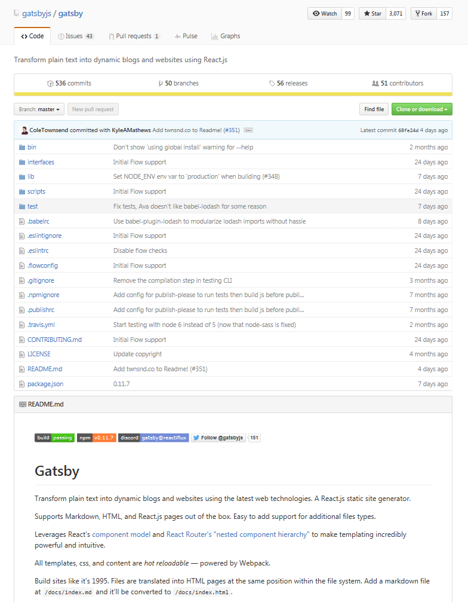
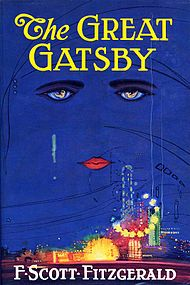
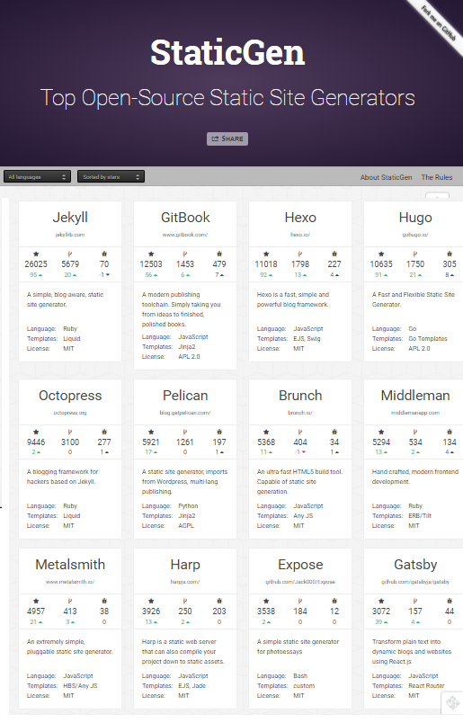

title: Stay Static - Build Single-Page Static (Web)Sites w/ the Great Gatsby


# Agenda

- Hello, Gatsby!
- Gatsby Stay Static Sample Site - Posts, Pages, Datafiles
- Markdown Madness - Markdown Extensions n Goodies
- Universal ("Isomorphic") HTML Components (Templates) in React w/ JSX
- Inside Gatsby - Building Blocks - React, Webpack, and Friends
- Demo - Go Live - Free (Static) Site Hosting Options
- Why Static?
- Thanks - Stay Static


# Dynamic (Web)Site Generators

**The Biggies** (PHP Rules!)

- WordPress
- Drupal
- Joomla!

On your live production site requires

- database (e.g. mysql)
- application server (e.g. mod_php)
- web server (e.g. apache)

On every request - (re)builds the page on-the-fly e.g. queries the database, runs scripts,
merges templates, etc.


# Static (Web)Site Generators / Builders

On your live production site requires

- web server (e.g. apache, ngnix, etc.) only

- **NO** database needed
- **NO** application server needed

Note: You can even go "server-less" e.g.
host your site on a web service e.g. Amazon S3 (Simple Storage Service).

You build the complete site, that is, **all pages** "ahead-of-time"
on a "build" machine. You will end-up with a bunch of (static) ready-to-use
HTML, CSS and JS files (*). Upload to production site and you're live
w/ a kind of "super cache".

(*) and media files e.g. graphics, music recordings, etc.


# Static (Web)Site Generators / Builders

**The Biggies** in 1999

1. Macromedia Dreamweaver
2. Microsoft FrontPage
3. Netscape Composer

And today?


# Hello, Gatsby!

by Kyle Mathews et al (★3 071) -
github: [`gatsbyjs/gatsby`](https://github.com/gatsbyjs/gatsby)




# How Did It All Get Started?

Why not build (another) blog w/ React.js in 5 minutes?
The world's 1st Gatsby site?

**Bricolage** (web: [bricolage.io](https://bricolage.io), github: [KyleAMathews/blog](https://github.com/KyleAMathews/blog)) - a blog written
 by **Kyle Mathews** who lives and works in San Francisco building useful things.


# Static in the "Real World"

- Books
- Magazines
- Newspapers
- etc.

### World Classics Trivia Quiz

Q: The Great Gatsby by ____ ?

- [ A ] Robert Louis Stevenson
- [ B ] Francis Scott Fitzgerald
- [ C ] Stephen Edwin King
- [ D ] Kyle A Mathews

Q: Last Update In (Static Since) ______ ?

- [ A ] 1855
- [ B ] 1885
- [ C ] 1925
- [ D ] 2015


# World Classics Triva Quiz (Cont.) - Answers



The Great Gatsby is a **1925** novel written by American author
**Francis Scott Fitzgerald** ...
a portrait of the Jazz Age or the Roaring Twenties ...

(Source: [Wikipedia - The Great Gatsby](https://en.wikipedia.org/wiki/The_Great_Gatsby))


# Getting Started w/ Gatsby

Gatsby is a JavaScript package using Webpack, React, React-Router,
Markdown and more to let you build static (web)sites.
Use npm to install e.g.:

```
$ npm install -g gatsby
```


# Gatsby Commands

Try:

```
$ gatsby -h
```

prints

```
$ gatsby -h

Usage:  
  gatsby [command] [options]

Available Commands:
  new [rootPath] [starter]  Create new Gatsby project.
  develop [options]         Start development server. Watches files and rebuilds and hot reloads
                              if something changes
  build [options]           Build a Gatsby project.
  serve-build [options]     Serve built site.

Options:
  -h, --help     output usage information
  -V, --version  output the version number
```

See the [Gatsby Quick Reference (Cheat Sheet)](https://github.com/statictimes/quickrefs/blob/master/GATSBY.md)


# Gatsby Quick Starter - Ready-to-Use/Fork Themes

- Simple blog
- Simple documentation site
- Kitchen sink demo site (default)

To get started use:

```
$ gatsby new blog https://github.com/gatsbyjs/gatsby-starter-blog
```

Basically the same as:

```
$ git clone https://github.com/gatsbyjs/gatsby-starter-blog
$ cd gatsby-starter-blog
$ npm install
```

To test drive use:

```
$ gatsby develop  
```

And open the browser. Voila.


# Gatsby Stay Static Sample Site

Shows how-to-use:

- Posts (e.g. Blog News 'n' Updates Posts Sorted by Date)
- Pages  (e.g. About Page)
- Datafiles (e.g. Links 'n' Bookmarks)


# Gatsby In Action - Why Gatsby? Live Hot Reloading Demo

No. 1 Selling Point - Hot (!) Reloading - Thanks to Webpack

Works for:

- React Web Components (Templates)
- Your Writing (in Markdown) e.g. Posts / Pages
- Styles
- Configuration in config.toml e.g. Site Title, Author Name, etc.

Does NOT Work for:

- Adding New Files (Requires Server Restart - Sorry.)


# Gatsby Stay Static Site - File Structure

```
│   config.toml
|   html.js
|   package.json
├───components/
│      Footer.js
│      Header.js
│      LinkList.js
│      PostList.js
├───css/
|      style.css
├───data/
|      links.js
├───pages/
|   |  404.md
|   |  index.js
|   |  _template.js
|   ├───pages/
|   |      about.md
|   └───posts/
|          2014-11-11-new-repo-maps.md
|          2014-12-12-new-build-system.md
|          2015-08-25-new-season.md
|          _template.js
└───wrappers/
      md.js
```

(Source: [`staystatic/gatsby`](https://github.com/staystatic/staystatic/tree/master/gatsby))


# Gatsby Stay Static Site - Posts with Front Matter

YAML + Markdown

```
---
title: "beer.db - New Repo /maps - Free 'Full-Screen' Interactive Beer Maps w/ Brewery Listings"
date:   2015-08-25
layout: post
path: "/posts/new-repo-maps/"
---

The beer.db project - offering free public domain beer, brewery
and brewpubs data - added a new repo, that is, `/maps`
for hosting 'full-screen' interactive beer maps with brewery listings.

See an example [beer map for Austria](http://openbeer.github.io/maps/at)
(~200 breweries n brewpubs) live or
[check the source](https://github.com/openbeer/maps) using the mapbox.js mapping library.

...
```

(Source: [`staystatic/gatsby/pages/posts/new-repo-maps.md`](https://github.com/staystatic/staystatic/blob/master/gatsby/pages/posts/2014-11-11-new-repo-maps.md))


# Gatsby Stay Static Site - Pages with Front Matter

YAML + Markdown

```
---
title: About
path:  "/about/"
---

Gatsby Static Site Sample. Shows how to use:

1. Pages (see `pages/pages/about.md`)
2. Posts (see `pages/posts/*.md`)
3. Custom Content Types (see `data/links.js`)
```

(Source: [`staystatic/gatsby/pages/pages/about.md`](https://github.com/staystatic/staystatic/blob/master/gatsby/pages/pages/about.md))


# Markdown Madness - Markdown Library Options in Gatsby

**markdown-it** ★1 858 by Vitaly Puzrin, Alex Kocharin et al (github: [markdown-it/markdown-it](https://github.com/markdown-it/markdown-it))

Markdown parser, done right. 100% CommonMark support, extensions, syntax plugins & high speed

Extensions / Goodies Include:

- Tables
- Fenced Code Blocks ("GitHub"-Style)
- Footnotes
- And Much more

[Try it live](https://markdown-it.github.io)


# Markdown Madness - Markdown Goodies - Tables

```
Feature                  | Gatsby
------------------------ | ------------
Settings / Configuration | TOML
Front Matter / Meta Data | YAML
Datafiles                | JavaScript
HTML Templates           | JSX
HTML "Shortcodes"        | Markdown
```

becomes

Feature                  | Gatsby
------------------------ | ------------
Settings / Configuration | TOML
Front Matter / Meta Data | YAML
Datafiles                | JavaScript
HTML Templates           | JSX
HTML "Shortcodes"        | Markdown


# Markdown Madness - Markdown Goodies - Fenced Code Blocks

    ```
    // Enable everything
    var md = require('markdown-it')({
      html: true,
      linkify: true,
      typographer: true,
    });
    ```

# Markdown Madness - Markdown Goodies - Footnotes

```
This is a footnote.[^1]

[^1]: the footnote text.
```

becomes

This is a footnote. <sup>1</sup>

1. the footnote text. ↩


# Gatsby Stay Static Site - Datafiles

**Datafile** - JavaScript

```
//////////////////////////
//  Links 'n' Bookmarks

export default [
 { title: "football.db - Open Football Data",
   url:   "https://github.com/openfootball" },
 { title: "beer.db - Open Beer, Brewery 'n' Brewpub Data",
   url:   "https://github.com/openbeer" },
 { title: "world.db - Open World Data",
   url:   "https://github.com/openmundi" }
]
```

(Source: [`staystatic/gatsby/data/links.js`](https://github.com/staystatic/staystatic/blob/master/gatsby/data/links.js))


# Gatsby Stay Static Site  - HTML Web Components - Loops

**Templates** - React HTML Web Components

```
class LinkList extends React.Component {
  render() {
    const {links} = this.props;
    return (
      <ul>
        {links.map( link => <li><a href={link.url}>{link.title}</a></li> )}
      </ul>
    )
  }
}

// Use like:
//   <LinkList links={links}/>
```

(Source: [`staystatic/gatsby/components/LinkList.js`](https://github.com/staystatic/staystatic/blob/master/gatsby/components/LinkList.js))


# Gatsby Stay Static Site  - HTML Web Components - Loops (Cont.)

```
import { Link } from 'react-router'
import { prefixLink } from 'gatsby-helpers'

class PostList extends React.Component {
  render () {
    const {posts} = this.props;
    return (
      <ul>
        {posts.map( post => <li><Link to={prefixLink(post.path)}>{post.data.title}</Link></li> )}
      </ul>
    )
  }
}

// Use like:
//  <PostList posts={posts}/>
```

(Source: [`staystatic/gatsby/components/PostList.html`](https://github.com/staystatic/staystatic/blob/master/gatsby/components/PostList.js))


# Gatsby Stay Static Site - HTML Web Components - Includes

**Templates** - React HTML Web Components

```
import Header from 'components/Header'
import Footer from 'components/Footer'

class MasterTemplate extends React.Component {
  render() {
    return (
      <div>
        <Header/>
        <div>
          {this.props.children}
        </div>
        <Footer/>
      </div>
    )
  }
```

(Source: [`staystatic/gatsby/pages/_templates.js`](https://github.com/staystatic/staystatic/blob/master/gatsby/pages/_template.js))


# Gatsby Stay Static Site - HTML Web Components - Includes (Cont.)

```
class Footer extends React.Component {
  render() {
    return (
      <div id="footer">
          A <a href="http://staystatic.github.io">Stay Static</a> Sample Site
      </div>
      )
  }
}
```

(Source: [`staystatic/gatsby/components/Footer.js`](https://github.com/staystatic/staystatic/blob/master/gatsby/components/Footer.js))


```
import { Link } from 'react-router'
import { prefixLink } from 'gatsby-helpers'
import { config } from 'config'


class Header extends React.Component {
  render() {
    return (
      <div id="header">
        <table style={{width: "100%"}}>
         <tbody>
         <tr>
           <td>
            <Link to={prefixLink('/')}>{ config.siteTitle }</Link>
           </td>
           <td style={{textAlign: "right"}}>
            <Link to={prefixLink('/about/')}>About</Link>
           </td>
          </tr>
          </tbody>
        </table>
      </div>
      )
  }
}
```

(Source: [`staystatic/gatsby/components/Header.js`](https://github.com/staystatic/staystatic/blob/master/gatsby/components/Header.js))


# Gatsby Stay Static Site - Configuration / Settings

TOML

```
siteTitle  = "Gatsby Stay Static Site Sample"
linkPrefix = "/sites/gatsby"
```

(Source: [`staystatic/gatsby/config.toml`](https://github.com/staystatic/staystatic/blob/master/gatsby/config.toml))


# Gatsby - Summary

|  -                       | Gatsby       |
| ------------------------ | ------------ |
| GitHub Stars (+1s)       | ★3 071       |
|  -                       |  -           |
| Settings / Configuration | TOML         |
| HTML Templates           | React        |
| . Layouts                | React        |
| . Includes               | React        |
| Front Matter / Meta Data | YAML         |
| Datafiles                | JavaScript   |
| CSS Preprocessing        | PostCSS etc. |
| HTML "Shortcodes"        | Markdown     |


# Gatsby Stay Static Site Demo

```
$ gatsby build
```

results in

```
Generating CSS
Generating Static HTML
Compiling production bundle.js
Copying assets
```


# Gatsby Stay Static Site Demo (Cont.)

File Structure in `/public`:

```
|   404.html
|   bundle.js
|   bundle.js.map
|   index.html
|   styles.css
├───about/
|       index.html
└───post/
    ├───new-build-system/
    |       index.html
    ├───new-repo-maps/
    |       index.html
    |
    └───new-season/
            index.html
```


# Going Live - Free (Static) Site Hosting Options

- GitHub Pages      -- use git push  
- GitLab Pages      -- use git push
- Surge.sh  -- go live with six keystrokes - s u r g e [ENTER]
- Google Firebase (Free Tier)   
- And Many More


# Why Static? - Static is the New Dynamic

- Fast, Faster, Fastest

- Simple, Simpler, Simplest

- Pretty, Prettier, Prettiest
    - e.g. designer nirvana - do-it-yourself - full control over your design; use Bootstrap, Material, or what not.

Bonus: Secure e.g. just a bunch of (static) files on your server.


# Why Static? - Static is the New Dynamic (Cont.)

Some Articles:

- [**Why Static Website Generators Are The Next Big Thing**](https://www.smashingmagazine.com/2015/11/modern-static-website-generators-next-big-thing) by Mathias Biilmann Christensen, Nov 2015; Smashing Magazine
- [**Seven Reasons to Use a Static Site Generator**](https://www.sitepoint.com/7-reasons-use-static-site-generator) by Craig Buckler, March 2016; Site Point
- [**Nine Reasons Your Site Should Be Static**](https://www.netlify.com/blog/2016/05/18/9-reasons-your-site-should-be-static) by Aaron Autrand, May 2016; Netlify
- [**Five Bullshit Reasons Not to Use a Static Generator**](https://www.netlify.com/blog/2016/05/24/5-bullst-reasons-not-to-use-a-static-generator)
by Aaron Autrand, May 2016; Netlify
  - I want good SEO!
  - Updating content is too hard! I can't use a CMS!
  - There's no way for users to interact with my content!
  - There are too many choices!
  - It takes too long to set up!  


# Thanks - Stay Static

**Stay Static Sample Sites (Showcase)**

- [Stay Static](http://staystatic.github.io)
  - [`/hugo`](https://github.com/staystatic/staystatic/tree/master/hugo)
  - [`/jekyll`](https://github.com/staystatic/staystatic/tree/master/jekyll)
  - [`/middleman`](https://github.com/staystatic/staystatic/tree/master/middleman)
  - [`/webgen`](https://github.com/staystatic/staystatic/tree/master/webgen)
  - [`/metalsmith-handlebars`](https://github.com/staystatic/staystatic/tree/master/metalsmith-handlebars)
  - [`/metalsmith-nunjucks`](https://github.com/staystatic/staystatic/tree/master/metalsmith-nunjucks)  
  - [`/gatsby`](https://github.com/staystatic/staystatic/tree/master/gatsby)

**Stay Up-To-Date - Follow Along**

- For Vienna.html News => Follow [@viennahtml](https://twitter.com/viennahtml)
- For Static Site News => Follow [@statictimes](https://twitter.com/statictimes)
- For Writing in Plain Text w/ Markdown News => Follow [@manuscriptsnews](https://twitter.com/manuscriptsnews)


# Appendix: Static Site Builders / Generators

StaticGen.com




# Appendix: More React.js Static Site Builders / Generators

**Phenomic** (web: [phenomic.io](https://phenomic.io), github: [MoOx/phenomic](https://github.com/MoOx/phenomic)) ★823
by Maxime Thirouin et al

**Leo** (github: [superawesomelabs/leo](https://github.com/superawesomelabs/leo)) ★15
by Christopher Biscardi et al

And others.

