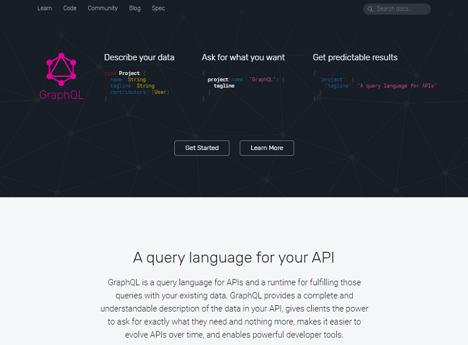
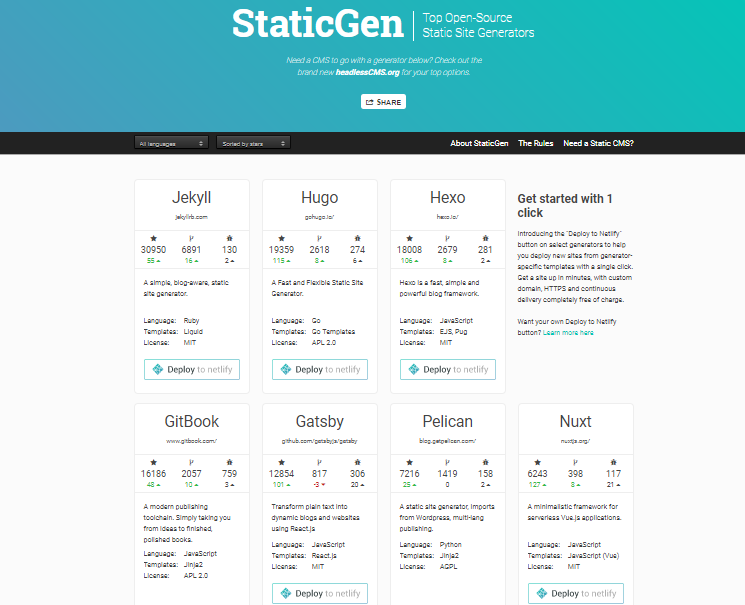

title: Stay Static - Build Single-Page Static Websites w/ Gatsby (and GraphQL)


# Agenda

- Dynamic Website Generators
  - Why Static? Inside a Dynamic WordPress Page Query
- Static Website Generators
- Hello, Gatsby!
  - Open Source Heroes - Kyle Mathews
- Getting Started w/ Gatsby
  - Gatsby Commands
  - Gatsby Quick Starter - Ready-to-Use/Fork Themes
  - Hello, React World! - The World's Simplest Gatsby Website
  - Gatsby In Action - Why Gatsby (v0)? Live Hot Reloading
  - Gatsby In Action - Why Gatsby (v1)? Continued
- Gatsby Stay Static Sample Website
  - Gatsby Stay Static Website - File Structure
  - Gatsby Stay Static Website - Pages
  - Gatsby Stay Static Site - Posts with Front Matter
    - Markdown Madness - Markdown Library Options in Gatsby
  - Gatsby Stay Static Website - Datafiles
  - Gatsby Stay Static Website - HTML Web Components - Loops
  - Gatsby Stay Static Website - HTML Web Components - Includes
  - Gatsby Stay Static Website - Configuration / Settings
  - Gatsby Stay Static Website Demo
  - Going Live - Free (Static) Website Hosting Options
- What's GraphQL?
  - Gatsby GraphQL Example - Query Site Metadata
  - Gatsby GraphQL Example - Query Filesystem
  - What's GraphiQL?
  - Gatsby GraphQL Example - Query Markdown Pages
  - Gatsby GraphQL Example - WordPress Post Query
  - How to Use GraphQL and React with Gatsby?
- CSS-in-JS - Start using CSS in JavaScript (JS)
- Gatsby (Static) Websites in the "Real World"


# 10 Years Ago - Dynamic Website Generators in 2007

**The Biggies** (PHP Rules!)

- WordPress
- Drupal
- Joomla!

On your live production site requires

- database (e.g. mysql)
- application server (e.g. mod_php)
- web server (e.g. apache)

On every request - (re)builds the page on-the-fly
e.g. queries the database, runs scripts,
merges templates, etc.


# Why Static? Inside a Dynamic WordPress Page Query

1. When a visitor first clicks on or types a URL for a page that is part of your blog, WordPress starts by running a few core files (wp-config.php, wp-settings.php, etc.) If you are interested in the specifics of the file loading order, start at index.php and follow the chain of files as each PHP file includes/requires additional PHP files (or read this excellent post at humanshell.net)
2. WordPress loads and initializes any plugins you have activated (calls the plugin init actions).
3. WordPress loads the "text domain" for internationalization, and the functions.php file from the currently active theme.
4. WordPress runs the wp() function (in wp-includes/functions.php), which calls $wp->main() ($wp is an object of class WP, which is defined in wp-includes/class-wp.php). This tells WordPress to:
    1. Parse the URL into a query specification using WP->parse_request() -- more on that below.
    2. Set all the is_ variables that are used by Conditional Tags using $wp_query->parse_query() ($wp_query is an object of class WP_Query, which is defined in wp-includes/query.php). Note that in spite of this function's name, in this case WP_Query->parse_query doesn't actually do any parsing for us, since that is done before-hand by WP->parse_request().
    3. Convert the query specification into a MySQL database query, and run the database query to get the list of posts, in function WP_Query->get_posts(). Save the posts in the $wp_query object to be used in the WordPress Loop.
    4. Handle 404 errors.
    5. Send the blog's HTTP headers.
    6. Set up some variables for the WordPress Loop.
5. WordPress loads your template, figures out which template file to use according to the Template Hierarchy, and runs that file (basically doing whatever your template file says to do). Or, WordPress could run one of the feed files (such as wp-rss2.php) instead.
6. Generally, the template or feed file runs the WordPress Loop to print blog posts or a static page.
7. The template or feed file will also likely print out permalinks to some archives, categories, or posts using built-in WordPress functions.

And so and so on and so on and so on.

(Source: [codex.wordpress.org/Query_Overview](https://codex.wordpress.org/Query_Overview))


# 10 Years Later - Dynamic Website Generators Today in 2017?

**The Biggies** (PHP Rules!)

- WordPress
- Drupal
- Joomla!

See the difference ;-) JavaScript Fatigue - Anyone?
Use WordPress (PHP) ;-)
28.8% of the Internet and counting.


# Static Website Generators / Builders in 1999

**The Biggies** in 1999

1. Macromedia Dreamweaver
2. Microsoft FrontPage
3. Netscape Composer

And today?


# Hello, Gatsby!

by Kyle Mathews et al (★12 869) -
github: [`gatsbyjs/gatsby`](https://github.com/gatsbyjs/gatsby)


(Source: [gatsbyjs.org](https://gatsbyjs.org))


# Getting Started w/ Gatsby

Gatsby is a JavaScript package using Webpack, React, React Router,
React Helmet, GraphQL, Markdown
and more to let you build static websites.
Use npm to install e.g.:

```
$ npm install -g gatsby-cli
```


# Gatsby Commands

Try:

```
$ gatsby -h
```

prints

```
Usage:  
  gatsby [command] [options]

Available Commands:
  new [rootPath] [starter]  Create new Gatsby project.
  develop [options]         Start development server. Watches files and rebuilds and hot reloads
                              if something changes
  build [options]           Build a Gatsby project.
  serve [options]           Serve built site.

Options:
  -h, --help     output usage information
  -V, --version  output the version number
```

See the [Gatsby Quick Reference (Cheat Sheet)](https://github.com/statictimes/quickrefs/blob/master/GATSBY.md)


# Gatsby Quick Starter - Ready-to-Use/Fork Themes

- Hello, React World!
- Simple website (default)
- Simple blog
- Simple documentation website
- Kitchen sink demo site

To get started use:

```
$ gatsby new hello https://github.com/gatsbyjs/gatsby-starter-hello-world
```

Basically the same as:

```
$ git clone https://github.com/gatsbyjs/gatsby-starter-hello-world
$ cd gatsby-starter-hello-world
$ npm install
```

To test drive use:

```
$ gatsby develop  
```

And open the browser. Voila.


# Hello, React World! - The World's Simplest Gatsby Website

Web Page - `src/pages/index.js`:

```
import React from "react"

export default () => <div>Hello, React World!</div>
```

That's it! Add `package.json`:

```
{
  "name": "gatsby-starter-hello-react-world",
  "scripts": {
    "develop": "gatsby develop",
    "build":   "gatsby build",
    "serve":   "gatsby serve"
  },
  "dependencies": {
    "gatsby":      "^1.8.11",
    "gatsby-link": "^1.4.1"
  }
}
```

And install / run / build etc.:

```
$ npm install
$ npm run build
```


# Open Source Heroes - Kyle Mathews

Kyle Mathews working on Gatsby.js full-time since August 2016.
Looking for sponsorship/consulting.

Trivia Quiz - Q: How many open source JavaScript (node module) packages
on npm?

A:

- [ A ]  100+
- [ B ]  200+
- [ C ]  500+
- [ D ]  1000+

Comparison: The Vienna React "Mafia":

- 49 packages by [Nik Graf (`~nikgraf`)](https://www.npmjs.com/~nikgraf)
- 35 packages by [Max Stoiber (`~mxstbr`)](https://www.npmjs.com/~mxstbr)
- 17 packages by [Andrey Okonetchnikov (`~okonet`)](https://www.npmjs.com/~okonet)
- 7 packages by [Patrick Stapfer (`~ryyppy`)](https://www.npmjs.com/~ryyppy)

[Click for answer](https://www.npmjs.com/~kylemathews) ;-).


# Gatsby Stay Static Sample Website

Shows how-to-use:

- Posts (e.g. Blog News 'n' Updates Posts Sorted by Date)
- Pages  (e.g. About Page)
- Datafiles (e.g. Links 'n' Bookmarks)


# Gatsby In Action - Why Gatsby (v0)? Live Hot Reloading

No. 1 Selling Point (Gatsby v0) - Hot (!) Reloading - Thanks to Webpack

Works for:

- React Web Components (Templates)
- Your Writing (in Markdown) e.g. Posts / Pages
- Styles
- Configuration in gatsby-config.js e.g. Site Title, Author Name, etc.

New! (in Gatsby v1) Works for:

- Adding New Files too!


# Gatsby In Action - Why Gatsby (v1)? Continued

New Selling Points from (new) Gatsby.js Website:

- Modern web tech without the headache => e.g. React, Webpack, etc. out-of-the-box all setup ready-to-use
- Bring your own data  => e.g. pull data from any sources w/ GraphQL
- Static Progressive Web Apps (PWA)  => e.g. code and data splitting out-of-the-box all setup ready-to-use
- Speed past the competition   => e.g. build the fastest possible website;
   pre-build pages, etc.
- And some more.

(Source: [GatsbyJS.org](https://gatsbyjs.org))


# Gatsby Stay Static Website - File Structure

```
│   gatsby-config.js
│   gatsby-node.js
│   package.json
└───src/
    ├───components/
    │       Footer.js
    │       Header.js
    │       LinkList.js
    │       PostList.js
    ├───css/
    │       style.css
    ├───data/
    │       links.js
    ├───layouts/
    │       index.js
    ├───pages/
    │   │   about.js
    │   │   index.js
    │   └───posts/
    │           new-build-system.md
    │           new-repo-maps.md
    │           new-season.md
    └───templates/
            post.js
```

(Source: [`staystatic/gatsby`](https://github.com/staystatic/staystatic/tree/master/gatsby))


# Gatsby Stay Static Website - Pages

```
import React from "react"

export default () =>
<div>
  <h1>About</h1>
  <p>
   Gatsby Static Site Sample. Shows how to use:
  </p>
  <ol>
    <li>Pages (see <code>src/pages/about.html</code>)</li>
    <li>Posts (see <code>src/pages/posts/*.md</code>)</li>
    <li>Custom Content Types (see <code>src/data/links.js</code>)</li>
  </ol>
</div>
```

(Source: [`staystatic/gatsby/src/pages/about.js`](https://github.com/staystatic/staystatic/blob/master/gatsby/src/pages/about.js))


# Gatsby Stay Static Site - Posts with Front Matter

YAML + Markdown

```
---
title: "beer.db - New Repo /maps - Free 'Full-Screen' Interactive Beer Maps w/ Brewery Listings"
date:   "2015-08-25"
---

The beer.db project - offering free public domain beer, brewery
and brewpubs data - added a new repo, that is, `/maps`
for hosting 'full-screen' interactive beer maps with brewery listings.

See an example [beer map for Austria](http://openbeer.github.io/maps/at)
(~200 breweries n brewpubs) live or
[check the source](https://github.com/openbeer/maps) using the mapbox.js mapping library.

...
```

(Source: [`staystatic/gatsby/pages/posts/new-repo-maps.md`](https://github.com/staystatic/staystatic/blob/master/gatsby/src/pages/posts/new-repo-maps.md))


# Markdown Madness - Markdown Library Options in Gatsby

**remark** ★1 064 by Titus et al (github: [wooorm/remark](https://github.com/wooorm/remark))

Markdown processor powered by plugins.

Gatsby remark plugins / goodies include:

- Rendering math equations with KaTeX
- Code and syntax highlighting with Prism.js
- Copying linked files and intercepting local links
- Responsive images and iframes
- And much more


# Gatsby Stay Static Website - Datafiles

**Datafile** - JavaScript

```
//////////////////////////
//  Links 'n' Bookmarks

export default [
 { title: "football.db - Open Football Data",
   url:   "https://github.com/openfootball" },
 { title: "beer.db - Open Beer, Brewery 'n' Brewpub Data",
   url:   "https://github.com/openbeer" },
 { title: "world.db - Open World Data",
   url:   "https://github.com/openmundi" }
]
```

(Source: [`staystatic/gatsby/src/data/links.js`](https://github.com/staystatic/staystatic/blob/master/gatsby/src/data/links.js))


# Gatsby Stay Static Website  - HTML Web Components - Loops

**Templates** - React HTML Web Components

```
import React from "react"

export default ({links}) =>
<ul>
  { links.map( link => <li><a href={link.url}>{link.title}</a></li> )}
</ul>


// Use like:
//   <LinkList links={links}/>
```

(Source: [`staystatic/gatsby/src/components/LinkList.js`](https://github.com/staystatic/staystatic/blob/master/gatsby/src/components/LinkList.js))


# Gatsby Stay Static Website  - HTML Web Components - Loops (Cont.)

```
import React from "react"
import Link  from "gatsby-link"

export default ({posts}) =>
<ul>
  {posts.map( ({node : post}) =>
     <li><Link to={post.fields.slug}>{post.frontmatter.title}</Link></li> )}
</ul>

// Use like:
//  <PostList posts={posts}/>
```

(Source: [`staystatic/gatsby/src/components/PostList.html`](https://github.com/staystatic/staystatic/blob/master/gatsby/src/components/PostList.js))


# Gatsby Stay Static Website - HTML Web Components - Includes

**Templates** - React HTML Web Components

```
import Header from "../components/Header"
import Footer from "../components/Footer"

export default ({ children }) =>
      <div>
        <Header/>
        <div>
          {children()}
        </div>
        <Footer/>
      </div>
```

(Source: [`staystatic/gatsby/src/layouts/index.js`](https://github.com/staystatic/staystatic/blob/master/gatsby/src/layouts/index.js))


# Gatsby Stay Static Website - HTML Web Components - Includes (Cont.)

```
import React from "react"

export default () =>
<div id="footer">
  A <a href="http://staystatic.github.io">Stay Static</a> Sample Site
</div>
```

(Source: [`staystatic/gatsby/src/components/Footer.js`](https://github.com/staystatic/staystatic/blob/master/gatsby/src/components/Footer.js))


```
import React from 'react'
import Link  from 'gatsby-link'

export default ({data}) =>
      <div id="header">
        <table style={{{{width: "100%"}}>
         <tbody>
         <tr>
           <td>
            <Link to={"/"}>{ data.site.siteMetadata.title }</Link>
           </td>
           <td style={{{{textAlign: "right"}}>
            <Link to={"/about/"}>About</Link>
           </td>
          </tr>
          </tbody>
        </table>
      </div>
```

(Source: [`staystatic/gatsby/src/components/Header.js`](https://github.com/staystatic/staystatic/blob/master/gatsby/src/components/Header.js))


# Gatsby Stay Static Website - Configuration / Settings

JavaScript

```
module.exports = {
  siteMetadata: {
    title: "Gatsby (+GraphQL) Stay Static Site Sample",
  },
  pathPrefix: "/sites/gatsby-graphql"
}
```

(Source: [`staystatic/gatsby/gatsby-config.js`](https://github.com/staystatic/staystatic/blob/master/gatsby/gatsby-config.js))


# Gatsby - Summary

|  -                       | Gatsby       |
| ------------------------ | ------------ |
| GitHub Stars (+1s)       | ★12 870      |
|  -                       |  -           |
| Settings / Configuration | JavaScript   |
| HTML Templates           | React        |
| . Layouts                | React        |
| . Includes               | React        |
| Front Matter / Meta Data | YAML         |
| Datafiles                | JavaScript   |
| CSS Preprocessing        | CSS-in-JS, Sass, PostCSS etc. |
| HTML "Shortcodes"        | Markdown     |


# Gatsby Stay Static Website Demo

```
$ gatsby build
```

results in

```
success delete html files from previous builds - 0.016 s
success open and validate gatsby-config.js - 0.006 s
success copy gatsby files - 0.052 s
success source and transform nodes - 0.106 s
success building schema - 0.148 s
success createLayouts - 0.011 s
success createPages - 0.034 s
success createPagesStatefully - 0.014 s
success extract queries from components - 0.105 s
success run graphql queries - 0.007 s
success write out page data - 0.006 s
success update schema - 0.082 s

info bootstrap finished - 3.354 s

success Building CSS - 5.017 s
success Building production JavaScript bundles - 9.895 s
success Building static HTML for pages - 2.197 s

Done building in 20.475 seconds
```


# Gatsby Stay Static Website Demo (Cont.)

File Structure in `/public`:

```
│   app-2acd99fcfc70c7ec8a0a.js
│   app-2acd99fcfc70c7ec8a0a.js.map
│   build-js-styles.css
│   build-js-styles.css.map
│   chunk-manifest.json
│   commons-a706efda9882e3aecc8c.js
│   commons-a706efda9882e3aecc8c.js.map
│   component---src-layouts-index-js-c7801619b3d290cd7234.js
│   component---src-layouts-index-js-c7801619b3d290cd7234.js.map
│   component---src-pages-about-js-ec83f8cb31d5d651db6a.js
│   component---src-pages-about-js-ec83f8cb31d5d651db6a.js.map
│   component---src-pages-index-js-7a4ee00b60c522c51efc.js
│   component---src-pages-index-js-7a4ee00b60c522c51efc.js.map
│   component---src-templates-post-js-2c2b6669e1eef7a2bf41.js
│   component---src-templates-post-js-2c2b6669e1eef7a2bf41.js.map
│   index.html
│   path----c622219dd6f45a37b480.js
│   path----c622219dd6f45a37b480.js.map
│   path---about-a0e39f21c11f6a62c5ab.js
│   path---about-a0e39f21c11f6a62c5ab.js.map
│   path---index-a1a20f675945a44dff76.js
│   path---index-a1a20f675945a44dff76.js.map
│   path---posts-new-build-system-28812c3926bd90e09ffd.js
│   path---posts-new-build-system-28812c3926bd90e09ffd.js.map
│   path---posts-new-repo-maps-b4a76498aa30a97236aa.js
│   path---posts-new-repo-maps-b4a76498aa30a97236aa.js.map
│   path---posts-new-season-3ff4114e155504f291d4.js
│   path---posts-new-season-3ff4114e155504f291d4.js.map
│   render-page.js.map
│   stats.json
│   styles.css
│
├───about/
│       index.html
│
└───posts/
    ├───new-build-system/
    │       index.html
    │
    ├───new-repo-maps/
    │       index.html
    │
    └───new-season/
            index.html
```


# Going Live - Free (Static) Website Hosting Options

- GitHub Pages      -- use git push  
- GitLab Pages      -- use git push
- Surge.sh  -- go live with six keystrokes - s u r g e [ENTER]
- Google Firebase (Free Tier)
- Netlify (Free OpenSource Tier)   
- And Many More


# Gatsby Goodies - What's Missing?

GraphQL - Query any Data Source (at Build-Time)

And much much more.


# What's GraphQL?

A data query language (by example).

QL => Query Language  



(Source: [graphql.org](http://graphql.org))


# Gatsby GraphQL Example - Query Site Metadata

```
{
    site {
      siteMetadata {
        title
      }
    }
}
```

resulting in:

```
{
    "site": {
      "siteMetadata": {
        "title": "Gatsby (+GraphQL) Stay Static Site Sample"
      }
    }
}
```


# Gatsby GraphQL Example - Query Filesystem

```
{
  allFile
  { edges
    { node {
        relativePath
        prettySize
        birthTime
  }}}
}
```

resulting in:

```
{
    "allFile": {
      "edges": [
        {
          "node": {
            "relativePath": "pages/about.js",
            "prettySize": "343 B",
            "birthTime": "2017-09-02T16:21:53.799Z"
          }
        },
        {
          "node": {
            "relativePath": "pages/index.js",
            "prettySize": "863 B",
            "birthTime": "2017-09-02T16:53:52.821Z"
          }
        },
        {
          "node": {
            "relativePath": "pages/posts/new-repo-maps.md",
            "prettySize": "516 B",
            "birthTime": "2017-09-02T16:21:53.799Z"
          }
        },
        {
          "node": {
            "relativePath": "pages/posts/new-build-system.md",
            "prettySize": "892 B",
            "birthTime": "2017-09-02T16:21:53.799Z"
          }
        },
        {
          "node": {
            "relativePath": "pages/posts/new-season.md",
            "prettySize": "1.03 kB",
            "birthTime": "2017-09-02T16:21:53.799Z"
          }
        }
      ]
    }
}
```

# What's GraphiQL?

An in-browser IDE for exploring GraphQL.
Built into Gatsby! (only during development).

```
$ gatsby develop

Your site is running at http://localhost:8000
Your graphql debugger is running at http://localhost:8000/___graphql
```


# Gatsby GraphQL Example - Query Markdown Pages

```
{ allMarkdownRemark {
      totalCount
      edges {
        node {
          frontmatter {
            title
            date
          }
        }
      }
    }
}
```

results in:

```
{  "allMarkdownRemark": {
      "totalCount": 3,
      "edges": [
        {
          "node": {
            "frontmatter": {
              "title": "beer.db - New Repo /maps - Free 'Full-Screen' Interactive Beer Maps w/ Brewery Listings",
              "date": "2014-11-11"
            }
          }
        },
        {
          "node": {
            "frontmatter": {
              "title": "football.db - New Build System - Welcome ./Datafile",
              "date": "2014-12-12"
            }
          }
        },
        {
          "node": {
            "frontmatter": {
              "title": "football.db - New 2015/16 Seasons - English Premier League, Bundesliga, And More",
              "date": "2015-08-25"
            }
          }
        }
      ]
    }
}
```

# Gatsby GraphQL Example - WordPress Post Query

Add the [`gatsby-source-wordpress`](https://www.gatsbyjs.org/packages/gatsby-source-wordpress) plugin. Example:

```
allWordpressPost {
    edges {
      node {
        id
        slug
        title
        content
        excerpt
        date
        date_gmt
        modified
        modified_gmt
        status
        author
        featured_media
        comment_status
        ping_status
        sticky
        template
        format
        categories
        tags
      }
    }
  }
```


# Step 1 - How to Use GraphQL and React with Gatsby?

Every (React) web component can use a GraphQL query (in Gatsby)!
Export your query in the Javascript module. Example:

```
export const query = graphql`
  query IndexQuery {
    allMarkdownRemark(sort: {fields: [frontmatter___date], order: DESC}) {
      edges {
        node {
          frontmatter { title }
          fields      { slug  }
        }
      }
    }
  }
`
```


(Source: [`staystatic/gatsby/src/pages/index.js`](https://github.com/staystatic/staystatic/blob/master/gatsby/src/pages/index.js))


# Step 2 - How to Use GraphQL and React with Gatsby?

New `data` props gets "automagically" passed to your (React) web component.
Use it! Example:

```
export default ({data}) => {

 const posts = data.allMarkdownRemark.edges

 return <div>
          <div>
            <b>News 'n' Updates</b>
            <ul>
               {posts.map( ({node : post}) =>
                 <li>
                   <Link to={post.fields.slug}>
                     {post.frontmatter.title}
                  </Link>
                 </li> )}
            </ul>
          </div>
       </div>
}
```

(Source: [`staystatic/gatsby/src/pages/index.js`](https://github.com/staystatic/staystatic/blob/master/gatsby/src/pages/index.js))


# CSS-in-JS - Start using CSS in JavaScript (JS)

Gatsby has (out-of-the-box) built-in support for CSS Modules.

What about?

- Glamor  => Yes, use `gatsby-plugin-glamor`
- Glamorous => Yes, use  `gatsby-plugin-glamor glamorous`
- Styled Components => Yes, use `gatsby-plugin-styled-components`
- and many more options


# Gatsby (Static) Websites in the "Real World"

**How Did It All Get Started?**

Why not build (another) blog w/ React.js in 5 minutes?
The world's 1st Gatsby site?

**Bricolage** (web: [bricolage.io](https://bricolage.io), github: [KyleAMathews/blog](https://github.com/KyleAMathews/blog)) - a blog written
 by **Kyle Mathews** who lives and works in San Francisco building useful things.


# Gatsby (Static) Websites in the "Real World" (Cont.)

**ReasonML Documenation** (web: [reasonml.github.io](https://reasonml.github.io), github: [reasonml/reasonml.github.io](https://github.com/reasonml/reasonml.github.io))

**How To GraphQL** (web: [howtographql.com](https://www.howtographql.com), github: [howtographql/howtographql](https://github.com/howtographql/howtographql))

And many more, see [Gatsby.js Showcase](https://github.com/gatsbyjs/gatsby#showcase).

Your Website ;-)


# Thanks - Stay Static

**Stay Static Sample Sites (Showcase)**

- [Stay Static](http://staystatic.github.io)
  - [`/hugo`](https://github.com/staystatic/staystatic/tree/master/hugo)
  - [`/jekyll`](https://github.com/staystatic/staystatic/tree/master/jekyll)
  - [`/middleman`](https://github.com/staystatic/staystatic/tree/master/middleman)
  - [`/webgen`](https://github.com/staystatic/staystatic/tree/master/webgen)
  - [`/metalsmith-handlebars`](https://github.com/staystatic/staystatic/tree/master/metalsmith-handlebars)
  - [`/metalsmith-nunjucks`](https://github.com/staystatic/staystatic/tree/master/metalsmith-nunjucks)  
  - [`/gatsby`](https://github.com/staystatic/staystatic/tree/master/attic/gatsby)

**Stay Up-To-Date - Follow Along**

- For Vienna.html News => Follow [@viennahtml](https://twitter.com/viennahtml)
- For Static Site News => Follow [@statictimes](https://twitter.com/statictimes)
- For Writing in Plain Text w/ Markdown News => Follow [@manuscriptsnews](https://twitter.com/manuscriptsnews)


# Appendix: Static Site Builders / Generators




(Source: [StaticGen.com](https://staticgen.com))


# Appendix: Getting Started with Gatsby.js

Tip: Try the Official [Gatsby.js Tutorials](https://www.gatsbyjs.org/tutorial):

- Part I: Introduction to basics of Gatsby
  - Starting new projects, developing, and deploying sites.
- Part II: Introduction to using CSS in Gatsby.
  - Explore libraries like Typography.js, CSS Modules, Glamor, and Styled Components.
- Part III: Explore building nested layouts in Gatsby.
  - Layouts are sections of your site that are reused across multiple pages like headers and footers.
- Part IV: Learn how to work with Gatsby's data layer.
  - Explore source & transformer plugins. Get introduced to programmatic pages and how to write GraphQL queries.


# Appendix: More React.js Static Website Builders / Generators

**Phenomic** (web: [phenomic.io](https://phenomic.io), github: [MoOx/phenomic](https://github.com/MoOx/phenomic)) ★2 537
by Maxime Thirouin et al

**Leo** (github: [superawesomelabs/leo](https://github.com/superawesomelabs/leo)) ★92
by Christopher Biscardi et al


**Next.js** (github: [zeit/next.js](https://github.com/zeit/next.js)) ★16 783 by Guillermo Rauch et al -- version 3.0+ adds static export

And others.
