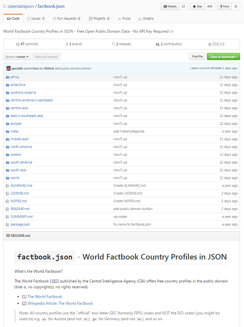
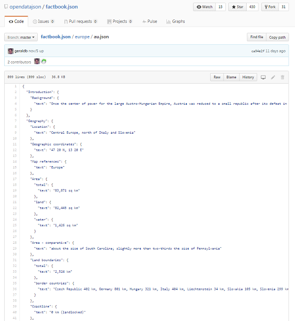
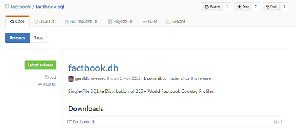
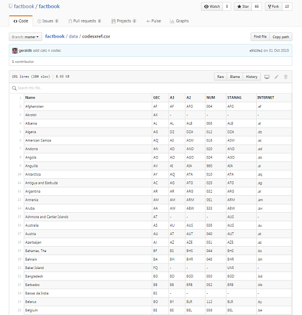
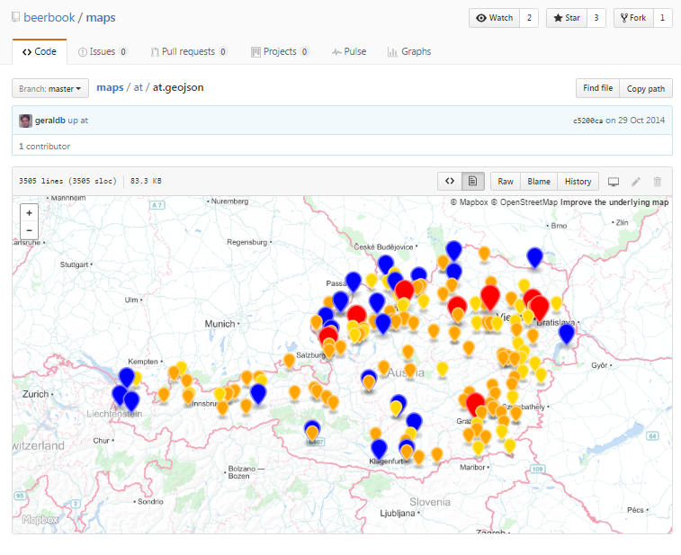

title: factbook.json - Using Git (and GitHub) for (Publishing) Data


# Agenda

- First Impressions
  - The "New" Zip Archive
  - Download Zip Archive
  - Browse Online
  - (Built-in) HTTP JSON API
  - Single-File SQLite Database Downloads
  - Data Portal / Hub
  - (Built-in) Tabular Data View
  - (Built-in) Map View


# 1st Impression - The "New" Zip Archive

A Git Repo(sitory) is the "New" Zip Archive - All-In-One Package for Data, Docs, Script 'n' More




# 2nd Impression - Download Zip Archive

Download Zip Archive - Click on the Blue "Clone or Download" Button


Or Clone, Fork, Push, Pull, etc.


# 3rd Impression - Browse Online

Browse Files incl. Datasets Online




# 4th Impression - (Built-in) HTTP JSON API

(Built-in) HTTP JSON API / Web Service -
incl. Cross-origin resource sharing (CORS). Example:

```
$ curl https://raw.githubusercontent.com/opendatajson/factbook.json/master/europe/au.json
```

```
{
  "Introduction": {
    "Background": {
      "text": "Once the center of power for the large Austro-Hungarian Empire, Austria was reduced to a small republic after its defeat in World War I. Following annexation by Nazi Germany in 1938 and subsequent occupation by the victorious Allies in 1945, Austria's status remained unclear for a decade. A State Treaty signed in 1955 ended the occupation, recognized Austria's independence, and forbade unification with Germany. A constitutional law that same year declared the country's \"perpetual neutrality\" as a condition for Soviet military withdrawal. The Soviet Union's collapse in 1991 and Austria's entry into the EU in 1995 have altered the meaning of this neutrality. A prosperous, democratic country, Austria entered the EU Economic and Monetary Union in 1999."
    }
  },
  "Geography": {
    "Location": {
      "text": "Central Europe, north of Italy and Slovenia"
    },
    "Geographic coordinates": {
      "text": "47 20 N, 13 20 E"
    },
    "Map references": {
      "text": "Europe"
    },
    "Area": {
      "total": {
        "text": "83,871 sq km"
      },
      "land": {
        "text": "82,445 sq km"
      },
      "water": {
        "text": "1,426 sq km"
      }
    },
    "Area - comparative": {
      "text": "about the size of South Carolina; slightly more than two-thirds the size of Pennsylvania"
    },
    "Land boundaries": {
      "total": {
        "text": "2,524 km"
      },
      "border countries": {
        "text": "Czech Republic 402 km, Germany 801 km, Hungary 321 km, Italy 404 km, Liechtenstein 34 km, Slovakia 105 km, Slovenia 299 km, Switzerland 158 km"
      }
    },
    "Coastline": {
      "text": "0 km (landlocked)"
    },
    ...
```

# 5th Impression - Single-File SQLite Database Downloads

Package up your datasets as single-file SQLite databases for "binary" release downloads
e.g. `factbook.db`




# 6th Impression - Data Portal / Hub

Use a GitHub Org for Datasets - Data Portal / Hub


# 7th Impression - (Built-in) Tabular Data View

Comma-Separated Values (CSV) View - Includes Search / Filter

Example - `codes.csv`:

```
Name,GEC,A3,A2,NUM,STANAG,INTERNET
Afghanistan,AF,AF,AFG,004,AFG,.af
Akrotiri,AX,-,-,-,-,-
Albania,AL,AL,ALB,008,ALB,.al
Algeria,AG,DZ,DZA,012,DZA,.dz
American Samoa,AQ,AS,ASM,016,ASM,.as
Andorra,AN,AD,AND,020,AND,.ad
Angola,AO,AO,AGO,024,AGO,.ao
Anguilla,AV,AI,AIA,660,AIA,.ai
Antarctica,AY,AQ,ATA,010,ATA,.aq
Antigua and Barbuda,AC,AG,ATG,028,ATG,.ag
Argentina,AR,AR,ARG,032,ARG,.ar
Armenia,AM,AM,ARM,051,ARM,.am
Aruba,AA,AW,ABW,533,ABW,.aw
Ashmore and Cartier Islands,AT,-,-,-,AUS,-
Australia,AS,AU,AUS,036,AUS,.au
Austria,AU,AT,AUT,040,AUT,.at
Azerbaijan,AJ,AZ,AZE,031,AZE,.az
"Bahamas, The",BF,BS,BHS,044,BHS,.bs
Bahrain,BA,BH,BHR,048,BHR,.bh
Baker Island,FQ,-,-,-,UMI,-
Bangladesh,BG,BD,BGD,050,BGD,.bd
Barbados,BB,BB,BRB,052,BRB,.bb
Bassas da India,BS,-,-,-,-,-
Belarus,BO,BY,BLR,112,BLR,.by
Belgium,BE,BE,BEL,056,BEL,.be
...
```




# 8th Impression - (Built-in) Map View

Maps (w/ OpenStreetMap) for `.geojson` - includes Zoom In / Zoom Out, Custom Markers (Size, Color, etc.) 'n' More

Example - `at.geojson`:

```
{
  "type": "Feature",
  "geometry": {
    "type": "Point",
    "coordinates": [
      15.1309828,
      48.264524
    ]
  },
  "properties": {
    "title": "Wirtshausbrauerei Haselböck",
    "description": "3662 Münichreith am Ostrong // Nr. 3",
    "city": "Münichreith am Ostrong",
    "state": "Niederösterreich",
    "web": null,
    "type": "brewpub",
    "marker-color": "#ffa500",
    "marker-size": "small"
   }
 },
 ...
```



