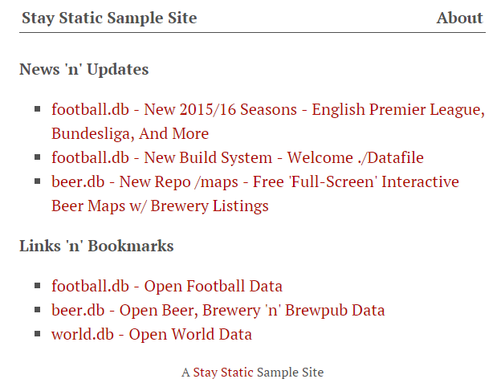
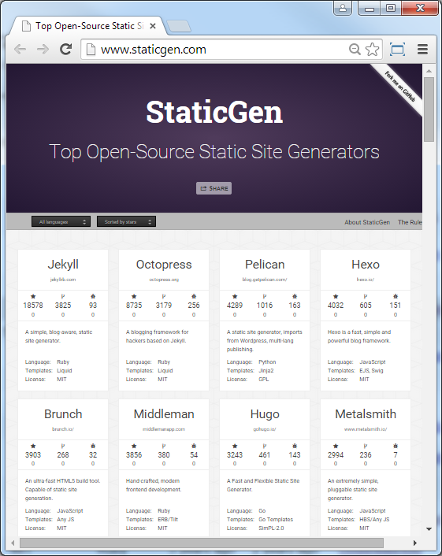

title: Stay Static - Build Static (Web)sites w/ Hugo and Go Templates


# Agenda

- Hello, Hugo!
- Hugo Stay Static Sample Site - Posts, Pages, Datafiles
- Markdown Madness - Markdown Extensions n Goodies
- HTML Template Options in Go
- Demo - Go Live - Free (Static) Site Hosting Options
- Why Static?
- Best of "Both Worlds"
- Thanks - Stay Static


# Dynamic (Web)Site Generators

**The Biggies** (PHP Rules!)

- WordPress
- Drupal
- Joomla!

On your live production site requires

- database (e.g. mysql)
- application server (e.g. mod_php)
- web server (e.g. apache)

On every request - (re)builds the page on-the-fly e.g. queries the database, runs scripts,
merges templates, etc.


# Static (Web)Site Generators / Builders

On your live production site requires

- web server (e.g. apache, ngnix, etc.) only

- **NO** database needed
- **NO** application server needed

Note: You can even go "server-less" e.g.
host your site on a web service e.g. Amazon S3 (Simple Storage Service).

You build the complete site, that is, **all pages** "ahead-of-time"
on a "build" machine. You will end-up with a bunch of (static) ready-to-use
HTML, CSS and JS files (*). Upload to production site and you're live
w/ a kind of "super cache".

(*) and media files e.g. graphics, music recordings, etc.


# Static (Web)Site Generators / Builders

**The Biggies** in 1999

1. Macromedia Dreamweaver
2. Microsoft FrontPage
3. Netscape Composer

And today?


# Hello, Hugo!

by Steve Francia, Bjørn Erik Pedersen et al (★10 186) -
web: [`gohugo.io`](https://gohugo.io),
github: [`spf13/hugo`](https://github.com/spf13/hugo)


# News Flash - New Hugo Release v0.16 on June 6th, 2016

Over 550 contributions by over 110 contributors to the main Hugo codebase.
Since last release (on November 25th, 2015)
Hugo has gained 3500 stars, 90 contributors and 23 additional themes.

What's news?

- Partial Builds e.g. now even faster on rebuilds
- Template Improvements e.g. now w/ blocks and many more
  new template functions (e.g. countwords, jsonify, md5, readFile, etc.);
- And Much More

See [Release Notes](http://gohugo.io/meta/release-notes).


# Getting Started w/ Hugo

Hugo is an all-in-one single-file binary (e.g. ~15 Megs)
Download the package (e.g. ~4 Megs) from the [release page](https://github.com/spf13/hugo/releases)
and unpack the Hugo binary. That's it.

> Linux Tip: Hugo has become part of the official Debian and Ubuntu repositories since January 2016!
> If you run the latest version, simply run `apt-get install hugo` to get started.

Try:

```
$ hugo help
```

prints

```
hugo is the main command, used to build your Hugo site.

Hugo is a Fast and Flexible Static Site Generator
built with love by spf13 and friends in Go.

Complete documentation is available at http://gohugo.io/.

Usage:
  hugo [flags]
  hugo [command]

Available Commands:
  server      A high performance webserver
  version     Print the version number of Hugo
  config      Print the site configuration
  check       Check content in the source directory
  benchmark   Benchmark hugo by building a site a number of times.
  convert     Convert your content to different formats
  new         Create new content for your site
  list        Listing out various types of content
  undraft     Undraft changes the content's draft status from 'True' to 'False'
  import      Import your site from others.
  gen         A collection of several useful generators.

Flags:
  -b, --baseURL string          hostname (and path) to the root, e.g. http://spf13.com/
  -D, --buildDrafts             include content marked as draft
  -F, --buildFuture             include content with publishdate in the future
      --cacheDir string         filesystem path to cache directory. Defaults: $TMPDIR/hugo_cache/
      --canonifyURLs            if true, all relative URLs will be canonicalized using baseURL
      --cleanDestinationDir     Remove files from destination not found in static directories
      --config string           config file (default is path/config.yaml|json|toml)
  -c, --contentDir string       filesystem path to content directory
  -d, --destination string      filesystem path to write files to
      --disable404              Do not render 404 page
      --disableRSS              Do not build RSS files
      --disableSitemap          Do not build Sitemap file
      --forceSyncStatic         Copy all files when static is changed.
      --ignoreCache             Ignores the cache directory
  -l, --layoutDir string        filesystem path to layout directory
      --log                     Enable Logging
      --logFile string          Log File path (if set, logging enabled automatically)
      --noTimes                 Don't sync modification time of files
      --pluralizeListTitles     Pluralize titles in lists using inflect (default true)
      --preserveTaxonomyNames   Preserve taxonomy names as written ("Gérard Depardieu" vs "gerard-depardieu")
      --renderToMemory          render to memory (only useful for benchmark testing)
  -s, --source string           filesystem path to read files relative from
      --stepAnalysis            display memory and timing of different steps of the program
  -t, --theme string            theme to use (located in /themes/THEMENAME/)
      --uglyURLs                if true, use /filename.html instead of /filename/
  -v, --verbose                 verbose output
      --verboseLog              verbose logging
  -w, --watch                   watch filesystem for changes and recreate as needed

Use "hugo [command] --help" for more information about a command.
```


# Hugo Stay Static Sample Site

Shows how-to-use:

- Posts (e.g. Blog News 'n' Updates Posts Sorted by Date)
- Pages  (e.g. About Page)
- Datafiles (e.g. Links 'n' Bookmarks)




# Hugo Stay Static Site - File Structure

```
│   config.toml
├───content/
│   │   about.md
│   └───post/
│           new-build-system.md
│           new-repo-maps.md
│           new-season.md
├───data/
│       links.toml
├───layouts/
│   │   index.html
│   ├───partials/
│   │       footer.html
│   │       head.html
│   │       header.html
│   ├───post/
│   │       single.html
│   └───_default/
│           single.html
└───static/
    └───css/
            style.css
```

(Source: [`staystatic/hugo`](https://github.com/staystatic/hugo))


# Hugo Stay Static Site - Pages n Posts with Front Matter

TOML + Markdown

```
+++
date  = "2014-11-11T19:47:35+01:00"
title = "beer.db - New Repo /maps - Free 'Full-Screen' Interactive Beer Maps w/ Brewery Listings"
+++

The beer.db project - offering free public domain beer, brewery
and brewpubs data - added a new repo, that is, `/maps`
for hosting 'full-screen' interactive beer maps with brewery listings.

See an example [beer map for Austria](http://openbeer.github.io/maps/at)
(~200 breweries n brewpubs) live or
[check the source](https://github.com/openbeer/maps) using the mapbox.js mapping library.

...
```

(Source: [`staystatic/hugo/content/post/new-repo-maps.md`](https://github.com/staystatic/hugo/blob/master/content/post/new-repo-maps.md))


# Markdown Madness - Markdown Library Options in Go

- No (Official) Standard Markdown Library

1. Blackfriday ★1 858 by Russ Ross  (github: [russross/blackfriday](https://github.com/russross/blackfriday))
2. Mmark  ★84 by Miek Gieben (github: [miekg/mmark](https://github.com/miekg/mmark))
   - An extension of Blackfriday; adds (even) more markdown goodies e.g. titleblocks, parts, asides, callouts and much more


# Markdown Madness - Markdown Goodies / Extensions

- Tables
- Fenced Code Blocks ("GitHub"-Style)
- Footnotes
- Typgraphy
  - Smart Quotes
  - Smart Fractions
- Definition Lists
- Strikethrough
- No Intra-Word Emphasis


# Markdown Madness - Markdown Goodies - Tables

```
Feature                  | Hugo
------------------------ | ------------
Settings / Configuration | TOML
Front Matter / Meta Data | TOML
Datafiles                | TOML
HTML Templates           | Go Templates
HTML "Shortcodes"        | Markdown
```

becomes

Feature                  | Hugo
------------------------ | ------------
Settings / Configuration | TOML
Front Matter / Meta Data | TOML
Datafiles                | TOML
HTML Templates           | Go Templates
HTML "Shortcodes"        | Markdown


# Markdown Madness - Markdown Goodies - Fenced Code Blocks

    ```
    func markdownRender(ctx *RenderingContext) []byte {
	    return blackfriday.Markdown(ctx.Content, getHTMLRenderer(0, ctx),
		         getMarkdownExtensions(ctx))
    }
    ```

# Markdown Madness - Markdown Goodies - Footnotes

```
This is a footnote.[^1]

[^1]: the footnote text.
```

becomes

This is a footnote. <sup>1</sup>

1. the footnote text. ↩


# Markdown Madness - Markdown Goodies - Typography

**Smart Quotes**

```
Hugo says "Stay Static!"   # e.g  ".." => “..”
Hugo says 'Stay Static!'   # e.g. '..' => ‘..’
```

becomes

Hugo says “Stay Static!” <br>
Hugo says ‘Stay Static!’


**Smart Fractions**

4/5 => <sup>4</sup>&frasl;<sub>5</sub> <br>
1/1000 =>  <sup>1</sup>&frasl;<sub>1000</sub>


# Markdown Madness - Markdown Goodies - Definition Lists

```
Markup
: the difference between the cost price and the selling price

Markdown
: a reduction in price, usually to encourage buying
: the amount by which a price is reduced
```

becomes

<dl>
  <dt>Markup</dt>
  <dd>the difference between the cost price and the selling price</dd>
  <dt>Markdown</dt>
  <dd>a reduction in price, usually to encourage buying</dd>
  <dd>the amount by which a price is reduced</dd>
</dl>


# Markdown Madness - Markdown Goodies

**Strikethrough**

```
Markdown Madness 50% Off Now Only €199 Was ~~€399~~ Buy Now!!!
```

becomes

Markdown Madness 50% Off Now Only €199 Was ~~€399~~ Buy Now!!!


**No Intra-Word Emphasis**

```
This is _emphasized_.
And this say_stay_static method is not.
```

becomes

This is _emphasized_.<br>
And this say_stay_static method is not.


# Hugo Stay Static Site - Datafiles

**Datafile** - TOML (Tom's Obvious, Minimal Language)

```
############################
#  Links 'n' Bookmarks
#

[[links]]
title = "football.db - Open Football Data"
url   = "https://github.com/openfootball"

[[links]]
title = "beer.db - Open Beer, Brewery 'n' Brewpub Data"
url   = "https://github.com/openbeer"

[[links]]
title = "world.db - Open World Data"
url   = "https://github.com/openmundi"
```

(Source: [`staystatic/hugo/data/links.toml`](https://github.com/staystatic/hugo/blob/master/data/links.toml))


# Hugo Stay Static Site  - HTML Templates - Loops

**Template** - Go Template Language

```
<div>
  <b>Links 'n' Bookmarks</b>
    <ul>
        {{{ range .Site.Data.links.links }}
          <li><a href="{{{ .url }}">{{{ .title }}</a></li>
        {{{ end }}
    </ul>
</div>
```

```
<div>
  <b>News 'n' Updates</b>
    <ul>
        {{{ range .Site.Pages }}
        {{{ if eq .Type "post" }}
            <li><a href="{{{ .Permalink }}">{{{ .Title }}</a></li>
        {{{ end }}
        {{{ end }}
    </ul>
</div>
```

(Source: [`staystatic/hugo/layouts/index.html`](https://github.com/staystatic/hugo/blob/master/layouts/index.html))


# Hugo Stay Static Site - HTML Templates - Includes

**Template** - Go Template Language

```
<!DOCTYPE html>
<html>
  {{{ partial "head.html" . }}
  <body>

    {{{ partial "header.html" . }}

    <div class="page">
      <h1>{{{ .Title }}</h1>
      {{{ .Content }}
    </div>

    {{{ partial "footer.html" . }}
  </body>
</html>
```

(Source: [`staystatic/hugo/layouts/_default/single.html`](https://github.com/staystatic/hugo/blob/master/layouts/_default/single.html))


# HTML Template Options in Go

Standard Go Template Language

- [Text Template Package](https://golang.org/pkg/text/template) e.g. `import "text/template"`
- [HTML Template Package](https://golang.org/pkg/html/template) e.g. `import "html/template"`
  - same interface as text/template package but automatically
    secures HTML output against certain attacks
    (e.g. knows HTML, CSS, JavaScript, and URIs.)


# HTML Standard Go Template

New in Go 1.6 - Blocks, Blocks, Blocks

`base.html`:

```
<!DOCTYPE html>
<html>
  <head>
    <meta charset="utf-8">
    <title>{{{ block "title" . }}
      <!-- Blocks may include default content. -->
      {{{ .Site.Title }}
    {{{ end }}</title>
  </head>
  <body>
    <!-- Code that all your templates share, like a header -->

    {{{ block "main" . }}
      <!-- The part of the page that begins to differ between templates -->
    {{{ end }}

    <!-- More shared code, perhaps a footer -->
  </body>
</html>
```

`list.html`:

```
<!-- Note the lack of Go's context "dot" when defining blocks -->
{{{ define "main" }}
  <h1>Posts</h1>
  {{{ range .Data.Pages }}
    <article>
      <h2>{{{ .Title }}</h2>
      {{{ .Content }}
    </article>
  {{{ end }}
{{{ end }}
```

`single.html`:

```
{{{ define "title" }}
  {{{ .Title }} &ndash; {{{ .Site.Title }}
{{{ end }}
{{{ define "main" }}
  <h1>{{{ .Title }}</h1>
  {{{ .Content }}
{{{ end }}
```


# HTML Shortcodes

Usage:

```
{
```

"Macro":

```
<div class="embed video-player">
<iframe class="youtube-player" type="text/html" width="640" height="385"
        src="http://www.youtube.com/embed/{{{ index .Params 0 }}"
        allowfullscreen frameborder="0">
</iframe>
</div>
```

becomes

```
<div class="embed video-player">
<iframe class="youtube-player" type="text/html" width="640" height="385"
        src="http://www.youtube.com/embed/09jf3ow9jfw"
        allowfullscreen frameborder="0">
</iframe>
</div>
```


# HTML Shortcodes  - Figure (Image w/ Caption)

```
<figure {{{ with .Get "class" }}class="{{{.}}"{{{ end }}>
    {{{ with .Get "link"}}<a href="{{{.}}">{{{ end }}
        
    {{{ if .Get "link"}}</a>{{{ end }}
    {{{ if or (or (.Get "title") (.Get "caption")) (.Get "attr")}}
    <figcaption>{{{ if isset .Params "title" }}
        <h4>{{{ .Get "title" }}</h4>{{{ end }}
        {{{ if or (.Get "caption") (.Get "attr")}}<p>
        {{{ .Get "caption" }}
        {{{ with .Get "attrlink"}}<a href="{{{.}}"> {{{ end }}
            {{{ .Get "attr" }}
        {{{ if .Get "attrlink"}}</a> {{{ end }}
        </p> {{{ end }}
    </figcaption>
    {{{ end }}
</figure>
```


# HTML Template Options in Go - Alternatives

Inspired by Haml, Slim, Jade and Friends

- **Amber** ★612 (github: [eknkc/amber](https://github.com/eknkc/amber)) by Ekin Koc et al
- **Ace** ★474 (github: [yosssi/ace](https://github.com/yosssi/ace)) by Keiji Yoshida et al

```
html
    head
        title Page Title
    body
        div#content
            p
                | This is a long page content
                | These lines are all part of the parent p

                a[href="/"] Go To Main Page
```


# Hugo Stay Static Site - Configuration / Settings

TOML

```
title = "Hugo Stay Static Site Sample"

baseurl = "http://staystatic.github.io/sites/hugo/"
languageCode = "en-us"
```

(Source: [`staystatic/hugo/config.toml`](https://github.com/staystatic/hugo/blob/master/config.toml))


# Hugo - Summary

|  -                       | Hugo         |
| ------------------------ | ------------ |
| GitHub Stars (+1s)       | ★10 186     |
|  -                       |  -           |
| Settings / Configuration | TOML         |
| HTML Templates           | Go Templates |
| . Layouts                | Yes          |
| . Includes               | Yes          |
| Front Matter / Meta Data | TOML         |
| Datafiles                | TOML         |
| CSS Preprocessing        | No (*)       |
| HTML "Shortcodes"        | Markdown     |

(*) Use "External" Pipeline e.g. Preprocessor in JavaScript etc.


# Hugo Stay Static Site Demo

```
$ hugo
```

results in

```
0 draft content
0 future content
4 pages created
0 paginator pages created
0 tags created
0 categories created
in 466 ms
```


# Hugo Stay Static Site Demo (Cont.)

File Structure in `/public`:

```
│   404.html
│   index.html
│   index.xml
│   sitemap.xml
├───about/
│       index.html
├───css/
│       style.css
└───post/
    │   index.html
    │   index.xml
    ├───new-build-system/
    │       index.html
    ├───new-repo-maps/
    │       index.html
    └───new-season/
            index.html
```


# Going Live - Free (Static) Site Hosting Options

- GitHub Pages      -- use git push  
- GitLab Pages      -- use git push
- Surge.sh  -- go live with six keystrokes - s u r g e [ENTER]
- Google Firebase (Free Tier)   
- And Many More


# Options for Adding Comments

- Disqus
- Facebook Comments
- Google Plus Comments
- GitHub Issues
- Comment on Hacker News
- etc.

Do-it-yourself (DIY) "Server-less" Example - [Lambda Comments](https://jimpick.com/2016/05/05/introducing-lambda-comments/) by Jim Pick


# Why Static? - Static is the New Dynamic

- Fast, Faster, Fastest

- Simple, Simpler, Simplest

- Pretty, Prettier, Prettiest
    - e.g. designer nirvana - do-it-yourself - full control over your design; use Bootstrap, Material, or what not.

Bonus: Secure e.g. just a bunch of (static) files on your server.


# Why Static? - Static is the New Dynamic (Cont.)

Some Articles:

- [**Why Static Website Generators Are The Next Big Thing**](https://www.smashingmagazine.com/2015/11/modern-static-website-generators-next-big-thing) by Mathias Biilmann Christensen, Nov 2015; Smashing Magazine
- [**Seven Reasons to Use a Static Site Generator**](https://www.sitepoint.com/7-reasons-use-static-site-generator) by Craig Buckler, March 2016; Site Point
- [**Nine Reasons Your Site Should Be Static**](https://www.netlify.com/blog/2016/05/18/9-reasons-your-site-should-be-static) by Aaron Autrand, May 2016; Netlify
- [**Five Bullshit Reasons Not to Use a Static Generator**](https://www.netlify.com/blog/2016/05/24/5-bullst-reasons-not-to-use-a-static-generator)
by Aaron Autrand, May 2016; Netlify
  - I want good SEO!
  - Updating content is too hard! I can't use a CMS!
  - There's no way for users to interact with my content!
  - There are too many choices!
  - It takes too long to set up!  


# Best of "Both Worlds"

Example: Let's use WordPress and Hugo. How?

[**WordPress <--> GitHub Sync**](https://github.com/mAAdhaTTah/wordpress-github-sync) ★312 by James DiGioia, Ben Balter et al

A WordPress plugin to sync content with a GitHub repository.


[**Wordpress to Hugo Exporter**](https://github.com/SchumacherFM/wordpress-to-hugo-exporter) ★89 by Cyrill Schumacher et al

One-click WordPress plugin that converts all posts, pages, taxonomies, metadata,
and settings to Markdown and YAML which can be dropped into Hugo.


[**Hugo Sync**](https://github.com/hiproz/hugo-sync) ★8

Synchronize your WordPress or GitHub to Hugo website automatically

And some more.


# Thanks - Stay Static

**Stay Static Sample Sites (Showcase)**

- [Stay Static](http://staystatic.github.io)
  - [`/hugo`](https://github.com/staystatic/hugo)
  - [`/jekyll`](https://github.com/staystatic/jekyll)
  - [`/middleman`](https://github.com/staystatic/middleman)
  - [`/webgen`](https://github.com/staystatic/webgen)
  - [`/metalsmith-handlebars`](https://github.com/staystatic/metalsmith-handlebars)
  - [`/metalsmith-nunjucks`](https://github.com/staystatic/metalsmith-nunjucks)  

**Stay Up-To-Date - Follow Along**

- For Vienna.html News => Follow [@viennahtml](https://twitter.com/viennahtml)
- For Static Site News => Follow [@statictimes](https://twitter.com/statictimes)
- For Writing in Plain Text w/ Markdown News => Follow [@manuscriptsnews](https://twitter.com/manuscriptsnews)


# Appendix: Spread the JAM! - A New TLA (Three-Letter Acronym)

Rebranding "Static"? Why not?

What's the JAM Stack?

- **J**avaScript
- **A**PIs and
- **M**arkup.

More [`jamstack.org`](http://jamstack.org)


# Appendix: Static Site Builders / Generators

StaticGen.com




# Appendix: Vienna.html - Join Us - No Database Required

Next meetup (last before the summer). Free. Everyone Welcome.

Tuesday, **June 28th** starting at 18.30 @ sektor5 Coworking Café+Lobby

Talks include:

- Using PostCSS with Static Site Builders by Max Stoiber
- Real World Static Site Showcase I - Inside ColorSnapper - Changelog Generation w/ Metalsmith.js and a Custom Plugin by Andrey Okonetchnikov
- Real World Static Site Showcase II - Inside Contentful - Turn Your Blog Posts into Facebook Instant Articles w/ Middleman by Rouven Weßling (Contentful)
- Real World Static Site Showcase III - Inside Chip Shop - Build Your Silicon Empire - Build A Cards Game w/ Jekyll (n Markdown) by Chris Ward


More info [`viennahtml.github.io »`](http://viennahtml.github.io)
