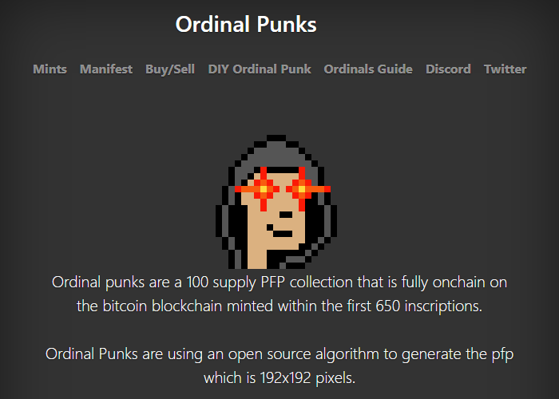
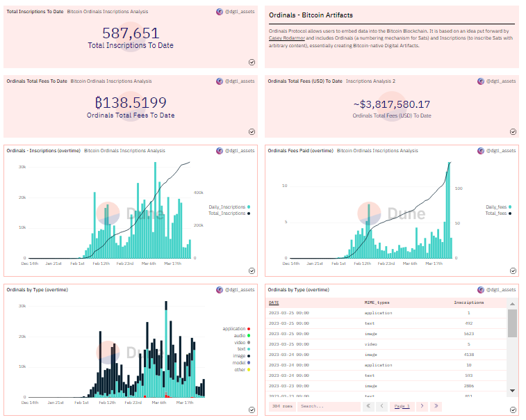
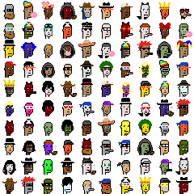
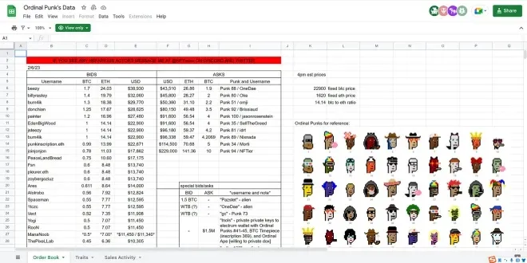

# Inside Ordinal Inscriptions - Turn the Blockchain Into A Database For Digital Artefacts

Version (& Live Talk) History:

- March 2023 @ [Technologieplauscherl LXXX](http://technologieplauscherl.at/80/)


Flashback

[**Inside the Billion Dollar $$$ (Crypto) Punk Pixel Heads**](https://github.com/cryptopunksnotdead/cryptopunks/tree/master/insidepunks) - October 2022 @ [Technologieplauscherl LXXVII](http://technologieplauscherl.at/77/)


## About Two Years Ago


I wrote:

> Q: Dear sir, how do I get rich in ~bits-coin~ punks?
>
> A: If we all buy ~bits-coin~ punks from one another
> at ever higher prices we'll all be rich beyond our wildest dreams.
>
> 21 million bits-coin. 10 000 punks. Do the math.
>
>  -- [Punks - The Free White Label Quick Starter Edition](https://github.com/cryptopunksnotdead/punks.whitelabel)


##  Fast Forward to February 2023  - What's Ordinal Theory?

Let's welcome 100 Ordinal Punks (24×24)
"inscribed" into the Bitcoin (BTC) Blockchain!


- ~$25 Inscription Fee/Punk
- ~$250 Price/Punk (0.01 BTC) To Buy


Disclaimer / Disclosure:   I am not affiliatd with Ordinal Punks. HODLing 0 Punks.


**Two Weeks Later**

(Minimum) Floor Price A Week Later - +$100 000

Three out of five "Top Sellers" ever are Ordinal Punks.
Highest is

Ordinal Punk No. 41  w/ 11.5 BTC (~US$ 270 000) on February 10th, 2023
and

Ordinal Punk No. 94 w/ 9.5 BTC (~US$ 220 000) on February 8th, 2023.


##  Ordinal Punk Pixel Heads on Bitcoin!? So what? Do I care?

The official blurb on the Ordinal Punks
website - [ordinalpunks.com](https://ordinalpunks.com/) - reads:




<!--
>  Ordinal Punks are using [**an open source algorithm**](https://github.com/cryptopunksnotdead) to generate
>  the profile picture (pfp) which is 192x192 pixels.
-->


Guess what?

Yes, the "open source algorithm"
is the (crypto) punk's not dead punk text-to-image generator.


## Flashback  - My Humble Bitcoin History (Started in 2017)

Disclaimer / Disclosure:  I am no-coiner (and "right-clicker").
HODLing 0 bitcoin / litecoin / dogecoin /etc.


Publishing Free Booklets on Bits & Block Press

- [Best of Bitcoin Maximalist - Scammers, Morons, Clowns, Shills & BagHODLers - Inside The New New Crypto Ponzi Economics](https://bitsblocks.github.io/bitcoin-maximalist) by Trolly McTrollface, et al
- [Crypto Facts - Decentralize Payments - Efficient, Low Cost, Fair, Clean - True or False?](https://bitsblocks.github.io/crypto-facts)   by Nouriel Roubini, David Gerard, et at
- [Crypto is the Mother of All Scams and (Now Busted) Bubbles - While Blockchain Is The Most Over-Hyped Technology Ever, No Better than a Spreadsheet/Database](https://bitsblocks.github.io/crypto-bubbles) by Nouriel Roubini

And on Open Blockchains

-  [Yes, Bitcoin Is a Ponzi - Learn How the Investment Fraud Works](https://github.com/openblockchains/bitcoin-ponzi)
-  [Best of Bitcon Books](https://openblockchains.github.io/bitcon-books/) Austrian Economics Bullshit to the Max - The Bitcoin Fraudsters' Lies
-  [Programming Bitcoin Script Transaction (Crypto) Contracts Step-by-Step](https://github.com/openblockchains/programming-bitcoin-script)


**BEWARE: Bitcoin is a gigantic ponzi scheme. To the moon!? The new gold standard!? Do NOT "invest" trying to get-rich-quick HODLing. Why not? The bitcoin code is archaic and out-of-date. Burn, baby, burn! Proof-of-work / waste is a global energy environmental disaster using 300 kWh per bitcoin transaction (!) that's about 179 kilograms of CO₂ emissions. Programmable money (or the internet of value) for all future generations with (bitcoin) script without loops and jumps (gotos) and all "stateless"!? LOL.**


Can you find a theme?


## The Bitcoin "Narrative" or "Are You Orange Pilled Yet?" (before Ordinal Theory, February 2023)

The (big) lies the fraudsters tell / told you...

- Bitcoin is the new gold
- Bitcoin is the new gold standard (and the best store of value and world reserve)
- Bitcoin is the new internet (of value / money)
- Bitcoin proof-of-work / waste hashing is creating "intrinsic" value
- Bitcoin proof-of-work / waste hashing power is a measure of the strength of the network
- Bitcoin mining is free (the coinbase block rewards are freebies)
- Bitcoin mining is the beginning of a renewable energy revolution
- Bitcoin HODLing creates wealth
- Bitcoin is a singularity - no copies ever possible (or accepted) - Bitcoin Cash (BCH) is NOT Bitcoin (BTC), Bitcoin Cash Satoshi Vision (BSV) is NOT Bitcoin (BTC), Bitcoin Cash ABC (BCHA) is NOT Bitcoin (BTC) and is NOT Bitcoin Cash (BCH)...
- Bitcoin is the beginning of a new era of world peace
- Bitcoin makes wars impossible - no more buying weapons with inflated national money or on public credit
- Bitcoin is the beginning of a new era of a trust-less "honest" banking and decentralized austrian finance utopia - no scams, no wash trading, no money laundering, no ponzis, no million dollar banker bonuses, no hedge fund speculation, no central banks, ...
- Bitcoin is banking the unbanked poor and unwashed
- And many more lies  (Are You Orange-Pilled Yet?)


## The new Bitcoin "narrative" (starting February 2023):

Enter Ordinal Theory and Bitcoin Inscriptions


Yeah, we found a use for Bitcon!  It's a database!

"Ulta-sound"  ~~money~~  .jpegs!
Yes, monkeys, punks, goblins, and more!

"inscribed", that is, written into the bitcoin blockchain, that is, an open (shared) public database.


Limitations:   4 MB max. (per block)
and - of course - you have to pay for every byte  (or vbyte) stored
in bitcoins.
Funny money for funny monkeys!


Aside - xkcd Cartoon No. 512 - December 3rd, 2008 (!)


<!--
 source: https://xkcd.com/512/
-->


> Breaking news  -  Of the 466 GB of data that makes up
> the bitcoin blockchain,
> over 1GB is already images of monkeys.
>
> -- [Ordinals Fees Spike as Bored Ape Yacht Club Clones Bloom on Bitcoin](https://decrypt.co/124452/bitcoin-ordinals-inscriptions-fees-rise-rewards-bored-ape-dupes), Decrypt, March 2023


Okkie - What took so long!?

- Bitcon Maxis!
- Small Blockers vs Big Blockers
- Bitcoin Gold vs Bitcoin Cash
- Burn Planet Earth vs Change the Code, Not the Climate
- etc.


Bitcoin "Small Blocker" Maxis won the "crypto (bitcon) wars":

Early "investors"  in the pyramid scheme
HODL! HODL! HODL!
and enforce ever more limits / restrictions
on transactions and "inscriptions" =>
make bitcoin "super-rare" collectibles
and "ultra-sound" money / gold

e.g.
- 2 MB block limit
- 80 byte limit on OP_RETURN "inscriptions"
- and so on


## Who is Casey Rodarmor?

Enter Casey Rodarmor (cyper punk  & coder)


Note: Yes - real "doxxed" person and name living in the United States;
not anonymous like Satoshi Nakamoto


See
- [github.com/casey](https://github.com/casey)
- [rodarmor.com](https://rodarmor.com)


> ord is an index, block explorer, and command-line [bitcoin] wallet.
> It is experimental software with no warranty.
>
> ord is written in rust and can be built from source.
>
> -- [github.com/casey/ord](https://github.com/casey/ord)


##  Ordinal Theory Q & A with Casey Rodarmor

From the Official [Ordinal Theory F.A.Q.](https://docs.ordinals.com/faq.html) written by Casey Rodarmor

**Q: What is ordinal theory?**

A: Ordinal theory is a protocol for assigning serial numbers to satoshis, the smallest subdivision of a bitcoin, and tracking those satoshis as they are spent by transactions.


Aside - What's a Satoshi?

- 1 bitcoin is 100 million satoshis (1 = 100 000 000 = 10^8)
- 1 euro or 1 dollar is 100 cents (1 = 100 = 10^2)


Aside - Q: What are Ordinal Numbers?   (let's ask Chat GPT)

A: Ordinal numbers refer to numbers that indicate the position
or order of "digital artefacts" in a collection,
such as genesis ("birth"), first, second, third, fourth,
and so on.

Note: Ordinal numbers do NOT indicate
quantity as cardinal numbers do.


**Q: Does ordinal theory require a side chain, a separate token, or changes to bitcoin?**

A: Nope! Ordinal theory works right now, without a side chain, and the only token needed is bitcoin itself.


**Q: What is ordinal theory good for?**

A: Collecting, trading, and scheming. Ordinal theory assigns identities to individual satoshis, allowing them to be individually tracked and traded, as curios and for numismatic value.

Ordinal theory also enables inscriptions, a protocol for attaching arbitrary content to individual satoshis, turning them into bitcoin-native digital artifacts.


Aside - Ordinal Theory Magic Money Miracle:

Before (ordinal theory and "curios"):
- 1 satoshi is 1 satoshi

After:
- 1 satoshi is 11.5 bitcoins (or 1 150 000 000 satoshis) ;-),
  that is, sell your "curio" ordinal
  satoshi for  bitcoins (current all-time record is 11.5 for an ordinal punk).


## First Inscription (No. 0) by Casey Rodarmor


A 1-bit (black & white) pixel art image (a skull) - "hand-painted" by Casey Rodarmor

See [inscription no. 0](https://ordinals.com/inscription/6fb976ab49dcec017f1e201e84395983204ae1a7c2abf7ced0a85d692e442799i0)

- timestamp: December, 14th 2022 20:32 UTC
- genesis (block) height: 767430
- content length: 793 bytes
- content type: image/png


## Second Inscription (No. 1) by ????


See [inscription no. 1](https://ordinals.com/inscription/26482871f33f1051f450f2da9af275794c0b5f1c61ebf35e4467fb42c2813403i0)

- timestamp: December, 17th 2022 04:49 UTC
- genesis (block) height: 767753
- content length: 20266 bytes
- content type: image/png


Trivia Quiz:

What's the "official" name for this "character"?

- [A] (Crypto) Beavis & Butt-Head
- [B] (Crypto) Beavis & Butt Bros.
- [C] (Crypto) Richard & Butt-Head
- [D] (Crypto) Dick & Butt


By the way - on offer for sale - 100 BTC (~US$ 2.5 Million).


## Q: Wen one million [bitcoin] inscriptions?

It's (still) the early days ....

Trivia Quiz:

Bitcoin (BTC) Blockchain Started - Wen?

- [A] Jan 2008 - 15 years ago
- [B] Jan 2009 - 14 years ago
- [C] Jan 2010 - 13 years ago
- [D] Jan 2011 - 12 years ago


Ordinal inscriptions taking off in late January 2023 ...
that is about seven (?) weeks ago (alpha, alpha, alpha alert!) ...


The stat(istic)s so far:

> 100 total inscriptions reached - Jan 26, 2023
>
> 1 000 inscriptions - Feb 2nd, 2023
>
> 10 000 inscriptions - Feb 7th, 2023
>
> 100 000 inscriptions - Feb 15th, 2023
>
> 200 000 inscriptions - Feb 27th, 2023
>
>  The march to one million continues...


 o o o


> Wen one million [bitcoin] inscriptions?
>
> tl;dr
>
> On April 7th, 2023
>
>
> New All-Time-High (ATH) of 27 000+ inscriptions in 24 hours.
>
> We'll hit 1 000 000 inscriptions within 45 days.
>
> -- Trevor, March 2023


### Bitcoin Ordinals Analysis / Statistics

See [Bitcoin Ordinals Analysis](https://dune.com/dgtl_assets/bitcoin-ordinals-analysis)


- Total Inscriptions To Date: 579 179
- Ordinals Total Fees (in USD) To Date:  ~$3 694 115.86
- Ordinals - Inscriptions (overtime)
- Ordinals Fees Paid (overtime)
  - Surprise, surprise - miner fee numbers go up!
    > Ordinals are a fad the bitcon maxis said.
    >
    > Miners will reject inscription transactions the bitcon maxis said.
    >
    > - Low Priority -  30 sat/vB  - $0.86
    > - Medium Priority - 39 sat/vB  - $1.11
    > - Hight Priority  - 51 sat/vB   - $1.45
- Ordinals by Type (overtime)
- Ordinals by Type (overtime)
- Aggregate Inscriptions by MIME Type
- Per Block Inscriptions
- Most # of Inscriptions in a Block
- Ordinals Fees (USD) Paid (overtime)
- Ordinals Size Usage (overtime)
- etc.





## Latest and (Very) First Hundred Inscriptions

See the latest inscriptions live (web feed for subscriptions
available)

- [ordinals.com/inscriptions](https://ordinals.com/inscriptions)


Tip:
See the (very) first hundred inscriptions (add `/99`)
- [ordinals.com/inscriptions/99](https://ordinals.com/inscriptions/99)


## Ordinals (Pixel Art) Sandbox (& Cache)

I track
and "right-click & save" pixel art collections.
See [Ordinals (Pixel Art) Sandbox (& Cache)](https://github.com/pixelartexchange/ordinals.sandbox)

- 100 Bitcoin Punks (24×24)
- 100 Taproot Punks (24×24)
- 88 G-Punks (24×24)
- 80 Forgotten Punks (24×24)
- 50 Ordinal Hero Punks (24×24)
- 100 Ordinal Umeko Punks (24×24)
- 100 Ordinary Apes (24×24)
- 100 Engraved Dragons (24×24)
- 100 Ordinal Mini Doges (24×24)
- 69 Doge Punks (28×28)
- 111 Yeti Bit Club (28×28)
- 130 Shadow Smokers (30×30)
- 20 Ordinary People (32×32)
- 111 Extra Ordinal Women (32×32)
- 100 (+1) Ordinal Doggies (32×32)
- 100 Ordinal Penguins (35×35)
- 512 Bitcoin Bandits (36×36)
- 12 Ordinal Gold Birds (42×42)
- 100 Ordinal Birds (42×42)
- 100 Ordinal Kitties (45×45)
- 100 Bitcoin Bears (48×48)
- 99 Bitcoin Goblins (68×68)
- 80 Pop Ordinal Cats (100×100)
- and many more


## Remember Litecoin (LTC)?


Trivia Quiz:

Litecoin (LTC) Blockchain Started - Wen?

- [A] Oct 2010 - 12 years ago
- [B] Oct 2011 - 11 years ago
- [C] Oct 2012 - 10 years ago
- [D] Oct 2013 - 9 years ago


Trivia Quiz:

Litecoin (LTC) Ordinal Inscriptions Started - Wen?

- [A] Jan 14th, 2023
- [B] Jan 31st, 2023
- [C] Feb 19th, 2023
- [D] Mar 4th, 2023


First [Inscription No. 0](https://ordinalslite.com/inscription/71e0f6dc87a473aa69787fff8e09e5eddfdca96e587928a5b1a25c0ae16dc0eei0):

- timestamp: February 19th, 2023 20:26 UTC
- genesis (block) height: 2425370
- content length: 57237 bytes
- content type: application/pdf


See the latest inscriptions live (web feed for subscriptions
available)

- [ordinalslite.com/inscriptions](https://ordinalslite.com/inscriptions)

Guess what?

The first punks collections - 100 Litecoin Punks (24×24) -
is using  open pixel art from (crypto) punk's not dead -
and not the open source algorithm ;-)  -
the merged blocks are kind-of-buggy (male/female blocks mixed-up).


## Doginals?  Shibescriptions?  Much wow - Such doge!


Trivia Quiz:

Dogecoin (Doge) Ordinal Shibescriptions Started - Wen?

- [A] Feb 4th, 2023
- [B] Feb 14th, 2023
- [C] Feb 24th, 2023
- [D] March 4th, 2023


See the latest inscriptions / shibescriptions live (web feed for subscriptions
available)

- [doginals.com/shibescriptions](https://doginals.com/shibescriptions)


## What More? What's Next?


New (experimental) protocols built on inscriptions


**sats names**  - `.sats` name registry / registration via inscription

see [docs.sats.id](https://docs.sats.id)


>>  Simple name registration  (using single text line)
>>
>>>       helloworld.sats
>>
>>
>>  Advanced name registration  (using JSON v5)
>>
>>>     {
>>>       "p": "sns",
>>>       "op": "reg",
>>>       "name": "helloworld.sats",
>>>     }
>
>
> Sats Names is a standard for writing names to bitcoin using ordinals.
> The goal is to build a name ecosystem for bitcoin, that is built by
> bitcoiners, and developed entirely on Bitcoin. We're just starting the
> process of building
> our indexer for this project but we can share our syntax so builders
> can begin tinkering
>
> The first write of a name on bitcoin owns the name
> For example, the first user to register
> an ordinal containing "satoshi.sats"
> owns that name and the rights to update that name.
> With ordinals anyone can write any data they wish,
> including duplicate names.
> This will lead to collisions and competing tribes of name standards.
> Bickering over various standards is a waste of our community's energy.
> There is only one neutral, objective pattern for settling collisions;
> First is first.


**brc-20 ("fungible" token)**  - via json text inscription

April Fools'-like posting by ["Domo" (on March 9th, 2023)](https://twitter.com/domodata/status/1633658974686855168):

> An experiment into "brc-20's"
> and fungibility on bitcoin with ordinals:
>
>     {
>       "p":    "brc-20",
>       "op":   "deploy",
>       "tick": "ordi",
>       "max":  "21000000",
>       "lim":  "100"
>     }
>
>  Using inspiration from sats names [et al],
> I wondered if the concept could be expanded to fungible tokens.
> This is what I came up with:
>
>>  brc-20 experiment
>>
>>  This is just a fun experimental standard demonstrating
>>  that you can create off-chain balance states with inscriptions.
>>  It by no means should be considered THE standard for fungibility
>>  on bitcoin with ordinals, as I believe there are almost certainly
>>  better design choices and optimization improvements to be made.
>>  Consequently, this is an extremely dynamic experiment,
>>  and I strongly discourage any financial decisions
>>   to be made on the basis of it's design.
>>  I do, however, encourage the bitcoin community
>>  to tinker with standard designs and optimizations
>>  until a general consensus on best practices is met
>>  (or to decide that this is a bad idea altogether!).
>>
>>  ...
>>
>>  [Read more @ brc-20 experiment](https://domo-2.gitbook.io/brc-20-experiment/)
>
>
> With this logic, anyone can deploy, mint,
> or transfer using ordinal inscriptions.
> Like other similar projects, the 'first is first' rule applies.

o o o

> There have been 23 926 BRC-20 ordinal inscriptions
>  in the past 24 hours.
>
>  It only took six weeks for people to figure
> out how to use ordinals to make fungible meme coins.
>
>  -- [Leonidas, March 9th, 2023](https://twitter.com/LeonidasNFT/status/1633926796943998978)


<!--
 more news - https://decrypt.co/123123/people-are-minting-brc-20-meme-coins-on-bitcoin-via-ordinals
-->


## Ordinal Theory Reloaded - Yes, You Can - Start Your Own Numbering "Theory"


Let's Welcome Ordinals **Height**

[Inscription No. 0](https://www.ordinalsheight.com/inscription/41c4c2afe3e6c9fb6a7d828bdff87d5976416b4a7a360a3a88cc61adb56eac12i0)
- timestamp: February 28th, 2023 19:48 UTC

see [ordinalsheight.com](https://www.ordinalsheight.com)

[ordinalsheight.com/inscriptions](https://www.ordinalsheight.com/inscriptions)

[ordinalsheight.com/inscriptions/99](https://www.ordinalsheight.com/inscriptions/99)


## As they say - It's the early days...


- Ordinals on Bitcoin (BTC), see [ordinals.com](https://ordinals.com)   -  580 861   and counting
- Ordinals on Litecoin (LTC), see [ordinalslite.com](https://ordinalslite.com)    -   219 546  and counting
- Ordinals on Dogecoin (DOGE), see [doginals.com](https://doginals.com)    - 98 513   and counting


<!--
Blockchain Primer

Q: What is a Blockchain?

A time-stamped and ordered list of transaction
in a public (shared) database...


No question about order (numbering)
and date (time-stamp).

Case study -  inscription 500 000 -  hitting the "jack pot"?

Ordinal number gets "assigned" once
the transaction is add the blockchain via a new block.

-->


## What I am up-to?

My (little) ordinals open source libraries, scripts & tools:

- [d.i.y. ordinal punks wizard / designer](https://cryptopunksnotdead.github.io/punks.js/ordinalpunks/) (js)
- [ordinals](https://github.com/pixelartexchange/artbase/tree/master/ordinals) (ruby) - ordinals api wrapper & helper
- [ordbase](https://github.com/pixelartexchange/artbase/tree/master/ordbase) (ruby)  - ordbase command-line tool - "right-clicker" tool
- [ordbased](https://github.com/pixelartexchange/ordbase.server)  (go lang)  - ordinals pixel art image server / service

Write-Ups:

- [Step-by-Step Guide - How To-Generate Your Own Ordinal Punks (Via Text Prompts)](https://gitlab.com/cryptopunksnotdead/cryptopunks/-/tree/master/ordinalpunks)
- [Awesome Ordinal Punks Page](https://gitlab.com/cryptopunksnotdead/cryptopunks/-/tree/master/awesome-ordinalpunks) -


## Questions? Comments?

Post them over at the [Help & Support](https://github.com/geraldb/help) page. Thanks.


Public Service Announcement

> Some climate activists think bitcoin
> is just fake internet money they can safely ignore.
>
> The truth? Bitcoin is causing dangerous amounts
> of real-world pollution from its ravenous consumption of fossil fuels,
> all due to its outdated [proof-of-work / waste] code.
>
> The solution? Change the [fucking] code.
>
>  -- Greenpeace [Change the Code, Not The Climate Campaign, 2023]


## Appendix / More "Stuff"


###  The Ordinal Punks Fam(ily) Tree

100 Ordinal Punks     by "Flow Stay"



100 (+1) Ordinal Phunks    by "The Inscriptor"


100 (+1) Lil' Ordinal Phunks   (on Litecoin) by "The Inscriptor"


100 (+1) Ordoggies   (on Dogecoin) by "The Inscriptor"


100 (+1) Ordinal Doggies   by "Flict" w/ "The Inscriptor"


10 000 Extraordinal Punks   by "Orc & ExtraOrd" or "Diamond_Hands_Yacht_Club & MarbuR7"

see [extraordinalpunks.com](https://www.extraordinalpunks.com)


Meanwhile on Ethereum...

100 Flipped Ordinal Punks / "Fonks"  (on Ethereum) by John van Rijck, Netherlands

see [opensea.io/collection/fonks](https://opensea.io/collection/fonks)


1000 Unofficial Ordinal Punks / "Unordinal Punks" (on Ethereum)
by Eric P. Rhodes, United States

see [opensea.io/collection/unofficial-ordinal-punks](https://opensea.io/collection/unofficial-ordinal-punks)


###  Inside Inscriptions  (Opcode Layout / "Envelope")

Inscription content is serialized using data pushes within unexecuted conditionals,
called "envelopes". Envelopes consist of an `OP_FALSE` `OP_IF` ... `OP_ENDIF`
wrapping any number of data pushes.
Because envelopes are effectively no-ops,
they do not change the semantics of the script in which they are included,
and can be combined with any other locking script.

A text inscription containing the string "Hello, world!" is serialized as follows:

```
OP_FALSE
OP_IF
  OP_PUSH "ord"
  OP_1
  OP_PUSH "text/plain;charset=utf-8"
  OP_0
  OP_PUSH "Hello, world!"
OP_ENDIF
```

First the string ord is pushed, to disambiguate inscriptions from other uses of envelopes.

`OP_1` indicates that the next push contains the content type,
and `OP_0` indicates that subsequent data pushes contain the content itself. Multiple data pushes must be used for large inscriptions, as one of taproot's few restrictions is that individual data pushes may not be larger than 520 bytes.

source: https://docs.ordinals.com/inscriptions.html


### From Zero To Hundred -  From Over-The-Counter (OTC) Trading to Ordinal (Buy/Sell) Markets


Genesis - Blockchain Minimalism -   Over-The-Counter (OTC) Trading



Source: [Punk's Data Order Book On (Google Docs) Spreadsheet](https://docs.google.com/spreadsheets/d/1_a690MxZUFGMnvU8VkchH1wLUxUQKdTbJpF9geBpHqI/edit)


Four Weeks Later - Ordinal (Buy/Sell) Markets

- https://magiceden.io/ordinals/marketplace/ordinal-phunks
- https://ordinals.market/collection/ordinals/ordinal-phunks
- https://ordinalswallet.com/collection/ordinal-phunks
- https://openordex.org/collection?slug=ordinal-phunks
- https://gamma.io/collections/ordinals/ordinal-phunks
- https://ordswap.io/collections/ordinal-phunks
- and many more


### Bitcoin Timeline & Milestones Leading to Ordinal Inscriptions

**2009**

"Chancellor on the Brink of Second Ballout for Banks"  in Genesis Bitcoin Block No. 0 -
arguably the first data ever inscribed by Satoshi Nakamoto


**2011**

Namecoin - bitcoin "side chain" to register names started - attach value (data) to names (keys) up to 520 bytes

Aside - What is a "side chain"?

A sidechain is a blockchain whose consensus rules necessarily
involve validating data from another blockchain
(referred to as the parent chain).
The concept of sidechains was first proposed by Satoshi Nakamoto in 2010,
and was first tried in production by Namecoin in October 2011.


**2012**

Colored Coins - "coloring" coins, that is, satoshis to encode unique digital tokens / assets on bitcoin itself (no "side chain")


**2014**

OP_RETURN introduces an 80 bytes limit for data

Counterparty & OmniLayer (formerly Mastercoin)  - new "protocols" for unique digital tokens / assets

Quantum  minted (via [Namecoin Block No. 174923](https://namebrow.se/name/d41b8540cbacdf1467cdc5d17316dcb672c8b43235fa16cde98e79825b68709a/))
by Kevin McCoy (b. 1967) on May 2nd, 2014  - arguably the first ever
digital certified ownership (or provenance) "non-fungible token"
for digital art than called "monegraph" short for "monetized graphics".

Trivia Aside - Namecoin records expire (without renewal after 250 days)
and "EarlyNFT" snapped up the record via namecoin to assert ownership via the blockchain title / deed
while  McCoy and Sotheby's were auctioning the "Quantum NFT" in 2021.

**2015**

Blocksize Wars begin

Spells of Genesis (Trading Card Collectible Game)  via Counterparty

**2016**

Rare Pepes - The first Rare Pepes  were mined on Bitcoin Block No. 428 919.
The Rare Pepe images on Counterparty looked like trading cards
and were minted in limited amounts (a total of 1 774 across 36 series).
Through the Rare Pepe Wallet, users could buy, sell, and store  Rare Pepe cards.


**2017**

Segregated Witness "SegWit" Bitcoin "Soft Fork" Protcol Upgrade - the 4MB limit introduced on blocks

**2021**

TapRoot Bitcoin "Soft Fork" Protocl Upgrade - new Taproot scripts introduced; data limit relaxed


**2022**

Ordinals client released to the public by Casey Rodarmor


**2023**

First ever 4MB inscription
(a .jpeg image in the [Taproot Wizard series](https://www.taprootwizards.com/) by Udi Wertheimer)
 minted (and mined by Luxor pool)

> Last night, we made history. The gatekeepers tried to censor us.
>
> But we mined the LARGEST BLOCK and LARGEST TRANSACTION IN BITCOIN'S HISTORY
>
> Special thanks to bitcoin full node operators
> for supporting our efforts and hosting our 4MB inscription
> for all eternity!
>
>  -- [Udi Wertheimer, February 2nd, 2023](https://twitter.com/udiWertheimer/status/1621176136142045191)


Inscription volume explodes - 500 000 and counting...


<!-- sources:
  Galaxy Ordinals Report - see Timeline of Bitcoin NFT Projects
  https://www.galaxy.com/research/whitepapers/bitcoin-ordinals-inscriptions-5-billion-nft-market/
 -->
