#  Inside the Billion Dollar $$$ (Crypto) Punk Pixel Heads


Version (& Live Talk) History:
- October 2022 @ [Technologieplauscherl LXXVII](https://technologieplauscherl.at/77/), Linz, Austria


##  Art (Market) Trivia Quiz - The Most Expensive Artwork of the 20th Century (Ever Sold)

- Q: What's the name of the (american) blonde (sex) bombshell (who killed herself in 1962)?

- Q: What's the name of the (dead) white (american) male artist?

- Q: What's the title of the artwork?

- Q: What's the auction price tag (sold by Christie's in New York)?

- Q: What's the name or the art "genre"?  What year / epoch?

- Q: Bonus: Is the artwork a 1 of 1 original? Is it a copy (of a photograph)? Is it a painting? Is it a photograph?


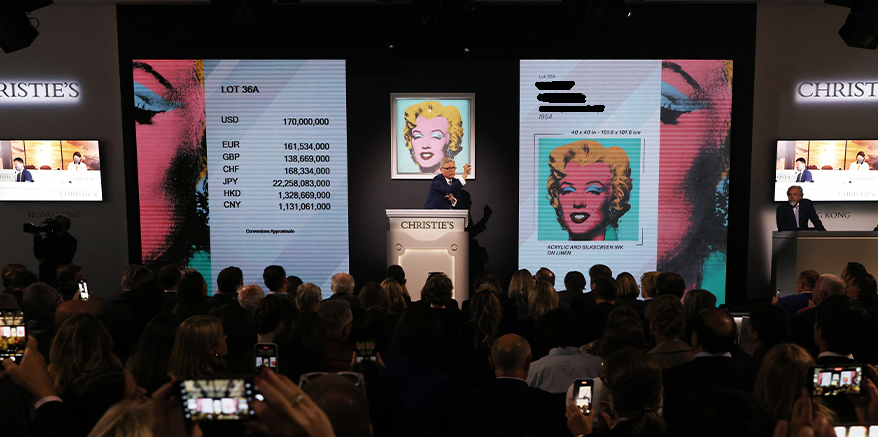


<details>
<summary>  Show / Hide Answers </summary>

> [Andy] Warhol's [Portrait of] Marilyn [Monroe (Anno 1964)]   Sells for US$ 195 Million
>
> Sets Record for 20th Century Work of Art
>
> -- [**Christie's Auction House Press Release**](https://www.christies.com/about-us/press-archive/details?PressReleaseID=10485), New York - May 9th, 2022


A:  Marilyn Monroe (1926-1962)

A:  Andy Warhol (1928-1987)

A:  Shot Sage Blue Marilyn

A:  US$ 195 Million

A: Pop Art

> Pop art is an art movement that emerged in the United Kingdom
> and the United States during the mid- to late-1950s.
> The movement presented a challenge to traditions of fine art
> by including imagery from popular and mass culture, such as advertising,
> comic books and mundane mass-produced objects.
>  One of its aims is to use images of popular culture in art,
> emphasizing the banal or kitschy elements of any culture,
> most often through the use of irony.
> It is also associated with the artists' use of mechanical means of reproduction
> or rendering techniques.
>
> -- [Pop Art @ Wikipedia]()

A:  The Marilyn, known as "Shot Sage Blue Marilyn,"
  was one of five versions in different color schemes that Warhol "painted" in 1964,
 two years after Marilyn Monroe's death.

</details>


##  Art (Market) in 2022 -  What's the New Hotness / "Genre" / Movement?

- A.I. (Artificial Intelligence) Art Generated Via Text Prompts (Specs)    - e.g. DALL·E 2, Midjourney, et al
- Securitization and "Certificate of Authenticity" Via Blockchain / Crypto Tokens


##  Marilyn in 2022 - Punk(ette) 24x24 Pixel Head / Portrait

Text-Prompt to Image:

> Punk • Female Light  • Wild Blonde  • Blue Eye Shadow  • Hot Lipstick  • Mole


or using the Punk Image Generation Library / Gem:

``` ruby
punk = YeOldePunk::Image.generate( 'Female Light',
                                   'Wild Blonde',
                                   'Blue Eye Shadow',
                                   'Hot Lipstick',
                                   'Mole' )
punk = punk.background( '#5CB5BD' )    # add sage blue-ish background ;-)

punk.save( "marilyn.png" )
punk.zoom(4).save( "marilyn@4x.png" )
```

Resulting in:


4x  


Spec:

- Punk Base Type & Skin Tone: Female Light
- Hair:   Wild Blonde
- Eyes (Make-Up):    Blue Eye Shadow
- Mouth (Make-Up):   Hot Lipstick
- Blemish:  Mole


##  Marilyn in 2022 (More Text-Prompts To Image) - Punk(ette) 24x24 Pixel Head / Portrait (Cont.)


Add '3D Glasses'

``` ruby
punk = base.add( '3D Glasses' )

punk.save( "marilyn_1a.png" )
punk.zoom(4).save( "marilyn_1a@4x.png" )
```


4x  


Add 'VR'


4x  


Add 'Earring'


4x  


Add 'Medical Mask'


4x  


Add 'Background Ukraine'


4x  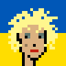


Add 'Background Rainbow / Pride'


4x  


And so on.


## History Corner - Matt & John's® (Crypto) Punks - 10 000 "Punk" Pixel Heads / Portraits - SOLD OUT!

> Matt & John's® punks are the Warhols® of the digital age. Discuss.


First Sold¹ Five Years (starting June 2017)

<https://cryptopunks.app/cryptopunks/topsales>


¹: "Free" to Claim - Pay For Transaction "Gas" Fee


## Remember the Million Dollar Homepage (Anno 2005) - Own A Piece Of Internet History! SOLD OUT!

http://www.milliondollarhomepage.com/

by Alex Tew, a (21-year-old) student from Wiltshire, England

> The home page consists of a million (1 000 000) pixels arranged in a 1000 × 1000 pixel grid;
> the image-based links on it were sold for $1 per pixel in 10 × 10 blocks.
>
>  -- [The Million Dollar Homepage @ Wikipedia](https://en.wikipedia.org/wiki/The_Million_Dollar_Homepage)


## The Billion Dollar Bitmap (Anno 2017) - Own A Piece Of ~Internet~ Art History! SOLD OUT!

> 10 000 Matt & John's® Punks V2, ≈13 500 Picasso® paintings. Do the math.


<https://github.com/larvalabs/cryptopunks/blob/master/punks.png>

by Lava Labs Bros -   John Watkinson (the "art")
and Matt Hall (the "crypto contract code")
from Canada (transplanted to New York, United States)

> The bitmap consists of 10 000 punk heads (in 24 x 24 pixels)
> arranged in a 100 x 100 grid (resulting in 2400 x 2400 pixels, 8-bit colors, ~about 828 kb)


##  The Billion Dollar Punk Industry or Con-Art Fraud?


> The current [minimum] price floor of Matt & John's® (Crypto) Punks is US$ 84 767.18 USD

10 000 x Minimum "Floor" Price = Market Cap(italization)

> The collection floor [market] cap of US$ 847 671 800.

Source: Search for punks floor price or try:

<https://nftpricefloor.com/cryptopunks>


Triva Quiz:  Million Dollar Homepage - 1px @ US$ 1

The Billion Dollar Punks - 1px @ US$ ___ ?

Hint: 1 Punk Head - 24x24 px = 576 pixels

<details>
<summary> Show / Hide Answers </summary>

US$ 80 000 / 576 pixels =  1px @ ~US$ 150

US$ 15 000 000 / 576 pixels =  1px @ ~US$ 25 000

</details>


##  Inside Punk Pixel Heads - The "Magic" Formula or Spritesheet

The Making of Punk 24x24 Pixel Heads / Portraits

- Hand-Drawn?
- 1 of 1s (1/1s)?
- Who's the Artist?

<details>
<summary> Show / Hide Answers </summary>

A:

- Computer-Generated Images
- No 1/1s (All Punk Head / Portrait Images Pasted Together Using 133 Building Block Images e.g. Female Light, Wild Blonde, Hot Lipstick, etc.)
- No A.I. (Artificial Intelligence "Machine Learning Models")

</details>


##  Inside Punk Pixel Heads - The "Magic" Formula or Spritesheet - 133 Building Block Images ("Assets")

Punks (Male 1/2/3/4 + Zombie/Ape/Alien + 63 Attributes)  - in 2x zoom:

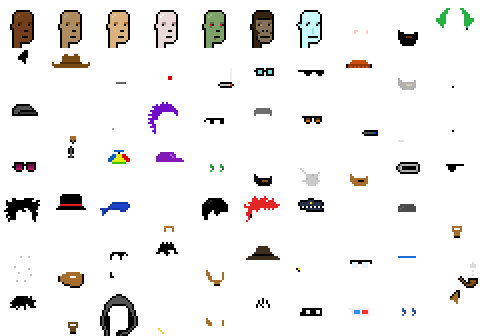

Punk(ette)s (Female 1/2/3/4 + 59 Attributes)  - in 2x zoom:

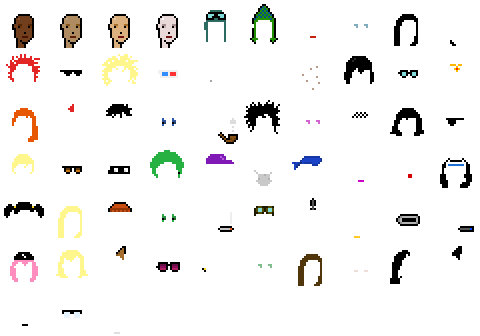


## Marilyn Step-By-Step "Deconstructed"

In "Slow Motion":

- Female 2
- Mole
- Wild Blonde
- Blue Eye Shadow
- Hot Lipstick
- Earring


4x  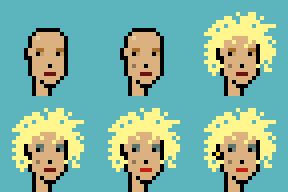

**Punk w/ Seven Attributes / Accessories**

In "Slow Motion":

- Male 2
- Mole
- Buck Teeth
- Big Beard
- Earring
- Classic Shades
- Cigarette
- Top Hat

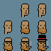
4x  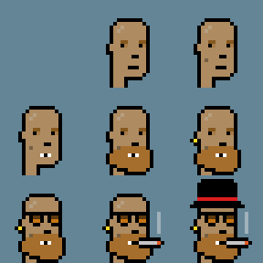


Or try Design Your Own Matt & John's® Ye Olde' Punk (Anno 2017) (24×24) Wizard
<https://cryptopunksnotdead.github.io/punks.js/yeoldepunks/>


##  The Billion Dollar Punk Industry or Con-Art Fraud?

In March 2022 the Larva Labs (Crypto) Bros - Matt & John's - sold the
"intellectual property (IP) rights"
to the Yuga Labs (Crypto) Bros for an undisclosed sum (assumed about ~US$ 300 million)


The Billion Dollar Question -  Are (Crypto) Punks Copyrightable?
Or Are Computer-Generated 24x24 Pixel Art Images Copyrightable?


How about the "signature" 3D Glasses?


4x  


Or how about the "clown nose"?


4x  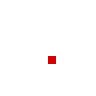


**Aside - Color By Number Books**

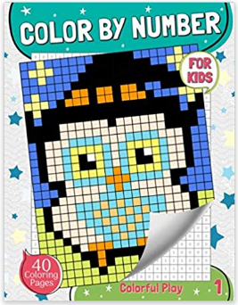

The blurb of the Color by Number for Kids: Pixel Art Coloring Book for Kids Ages 3 and Up, Colorful Play Paperback ($6.99) - see above the cover with a 28x42 pixel artwork - reads:

> Every page is a surprise.
> Featuring full-page drawings of space, astronauts, animals,
> flowers, insects, natures, cars, princess and more!
> Provides hours of fun and creativity.
> These fun coloring pages will help children (Ages 3-8) master
> their numbers and improve their manual dexterity through
> coloring.
> Suitable for age 3 and up,
> Children will have fun matching the colors to the included color
> key, or making up their own color combinations.
>

Yes, let's repeat - suitable for age 3 and up!


##  The Billion Dollar Punk Industry or Con-Art Fraud? (Cont.)

Addendum 1)

What if - What if you paint a 24x24 punk "by hand" as a 1/1 from scratch / zero?
  Who owns the copyright? The artist?


Addendum 2)

Punk Trivia - In August 2021
Matt & John's published
all punk image building blocks
on the  permissionless
decentralized blockchain (shared public database).

See Inside the CryptoPunksData Contract - Decoding the On-Blockhain Assets (11 Archetypes and 122 Attributes) and Color Palette for Easy (Re)Use "Off-Blockchain"

<https://github.com/cryptopunksnotdead/punks.sandbox/tree/master/punksdata>


Can You Copyright Transaction Data?
The punk image building blocks (133 "assets") are NOT published in the (open) contract code
but added one-by-one via public and signed addAsset transactions / function calls.
Example:

```
tx id   - function call
0x8972c6b4a44c972111bf18feccae7cfb26db615be400d1422c0763a1a2b03af5 addAsset     : 18,0x6726f0,Clown Nose
0x07907f96bb50ae69a7d5308343b52f3389d8a2d907aa44064d733bc533911e2a addAsset     : 34,0x580002,Smile
0xbb646fa184a1adc45428754f3b425fa89d75e4ebfdd6c447a0e66591f602e99f addAsset     : 72,0x355fd0455f70456080465fb0466040555f505560a0565fa0566050655f70656180665fb0666140755f507561a0765fa0766150855f30865f30,3D Glasses
...
```

e.g.
-  `0x6726f0`     is the blob for the Clown Nose (m)  . "Asset" No. 18 (of 133)
-  `0x580002`     is the blob for the Smile (m) - "Asset" No 34 (of 133)
-  `0x355fd0455f70456080465fb0466040555f505560a0565fa0566050655f70656180665fb0666140755f507561a0765fa0766150855f30865f30`  
   is the blob for the 3D Glasses (m) - "Asset" No 72 (of 133)
- ...


<https://github.com/cryptopunksnotdead/punks.contracts/blob/master/punksdata/transactions.txt>


## 10 000 Punks - Free White Label Quick Starter Edition

> Q: Dear sir, how do I get rich in ~bits-coin~ punks?
>
> A: If we all buy ~bits-coin~ punks from one another
> at ever higher prices we'll all be rich beyond our wildest dreams.
>
> 21 million bits-coin. 10 000 punks. Do the math.


The free white label quick starter edition -
(re)create from zero / scratch a pixel-perfect copy
of the first Matt & John's® 10 000 punks collection (Anno 2017)


See <https://github.com/cryptopunksnotdead/punks.whitelabel>


punks.csv - the "text-prompt to image" 10 000 metadata records in comma-separated values (csv) format:

```
type, attribute1, attribute2, attribute3, attribute4, attribute5, attribute6, attribute7
Female 2, Earring, Blonde Bob, Green Eye Shadow,,,,
Male 1, Smile, Mohawk,,,,,
Female 3, Wild Hair,,,,,,
Male 1, Wild Hair, Pipe, Nerd Glasses,,,,
Male 2, Goat, Earring, Wild Hair, Big Shades,,,
Female 2, Earring, Half Shaved, Purple Eye Shadow,,,,
Male 2, Do-rag,,,,,,
Female 2, Spots, Wild White Hair, Clown Eyes Blue,,,,
Male 1, Luxurious Beard, Messy Hair,,,,,
Male 2, Big Beard, Police Cap, Clown Nose,,,,
Female 1, Mohawk, Blue Eye Shadow,,,,,
Female 2, Black Lipstick, Straight Hair Dark, Clown Eyes Green,,,,
...
```


## What's News? Punk (Pixel) Art Collection In Summer (or Crypto Winter) 2022

Summer 2022 also known as Crypto (Art) Winter 2022

Or Creative Commons Zero (CC0) Summer of (Crypto) Art ;-)


## The Saudis - ALHAMDULILLAH!!!-  MAX BIDDING! - SOLD OUT!

The artists (& promotors)?

A: Pseudonymous "crypto bro con-art fraudsters" - Red Flag For Scams


All human (all male) 5555 punk series

<https://opensea.io/collection/thesaudis>


Right-Click & Save This

See [ALHAMDULILLAH!!! - Collect'Em All! 5555 Saudi Sheiks (24x24px) In All-In-One Image Composite (2400x1344px) - Free saudis.png Right-Click & Save Download (~346kb) »](https://old.reddit.com/r/RightClickSaveThis/comments/vx8cl6/alhamdulillah_collectem_all_5555_saudi_sheiks/)


``` ruby
saudi =  Saudi::Image.generate( 'Dark 1',
                                'Stylish Mustache',
                                'White Shemagh & Gold Agal',
                                'MAX BIDDING',
                                'Rosewood Pipe')

saudi.save( "saudi.png" )
saudi.zoom(4).save( "saudi@4x.png" )
```

resulting in:


4x  


The "magic" formula - spritesheet - 2x zoom:


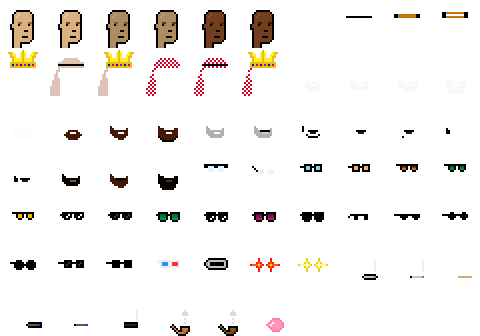


Aside - MAX BIDDING - Laser Eyes (Golden)   -  Designed by Yours Truly!

See [Inside The Saudis - Fun Fact About the Ulta-Rare $$$ Top-Selling MAX BIDDING Laser Eyes - It All Started on Punk's Not Dead In August 2021! - See DIY (Do-It-Yourself)- Yes, You Can! Make Your Own Punks With Laser Eyes »](https://old.reddit.com/r/CryptoPunksDev/comments/vvrlmf/inside_the_saudis_fun_fact_about_the_ultarare/).


## The Jews - MAX SHALOM! - SOLD OUT!

All human (all male) 5555 punk series

<https://opensea.io/collection/thejews-nft>


Right-Click & Save This

See [MAX SHALOM! - Collect'Em All! 5555 Jews From The Sacred Land (24x24px) In All-In-One Image Composite (2400x1344px) - Free jews.png Right-Click & Save Download (~548kb) »](https://old.reddit.com/r/RightClickSaveThis/comments/w28qal/max_shalom_collectem_all_5555_jews_from_the/)


And Many More

The Nigerians,
The Punjabi (Call Center) Indians, The Ancient Greeks,
The Americans, The Europeans,
and on and on and on.


## The Marcs  - Own The Memes of Production - SOLD OUT!

The artists (& promotors)?  "Doxxed" american two-person team

- All attributes stored "on-blockchain" as .png blobs.
- Create Commons Zero (CC0) "Licensed" - No Rights Reserved.

Marc Who?

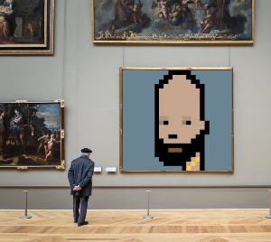

Marc Andreessen (Crypto Bro Billionaire)  Eggheads (or is that Dickheads?)


Marc Sampling Generated Via `Marc::Image.generate`

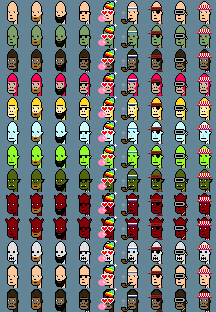

4x


The "magic" formula - spritesheet - 2x zoom:

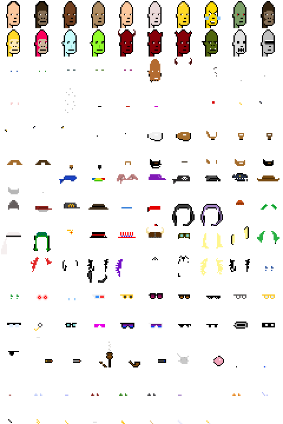


##  More Punk Collections (Upcoming) -  By Yours Truly

-  **Fifty / Fifty**  - 20 000 Punks  - 50% Male / 50% Female, that is, 10 000 Male / 10 000 Female
incl. Female Apes, Zombies & Aliens.

Preview @ Right-Click & Save This

See [10000 Punkettes - All Female (Pixel) Punk Edition Incl. Aliens (9) / Apes (24) / Zombies (88) - Free Composite All-In-One Image Download (2400x2400px) - punkettes.png (~700k) »](https://old.reddit.com/r/RightClickSaveThis/comments/vrsk0y/10000_punkettes_all_female_pixel_punk_edition/)


-  **20 000 Humans**  - 20 000 All-Human Punks - No Zombies, Apes & Aliens -
   new & more skin tones - uses (Dr. Ellis) Monk's Ten Skin Tones endorsed by Google A.I. Research (see <https://skintone.google>)

Preview @ Right-Click & Save This

See [Punks x (Human) Skin Tone Research @ Google A.I. - Collect'Em All! 10 000 Punks (24x24px), The All-Human (Dr. Ellis) Monk's Ten Skin Tones Edition - In All-In-One Image Composite (2400x2400px) - Free humans.png Right-Click & Save Download (~1.19MB) »](https://old.reddit.com/r/RightClickSaveThis/comments/vss8jw/punks_x_human_skin_tone_research_google_ai/)


- **Punk Me**  -  Design Your Own Punk (Eye Color, Hair Color, Hair Style, Skin Tone, etc.)
  to look like you or the "metaverse" you


## Questions? Comments?


## Bonus:  Free Pop Art - Pop Art How-Tos & Helpers


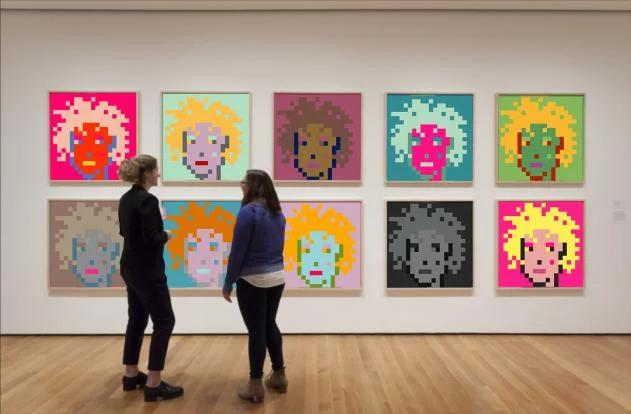


**Punks, The Dollar $$$ Bill Greenback Edition**

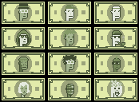

4x

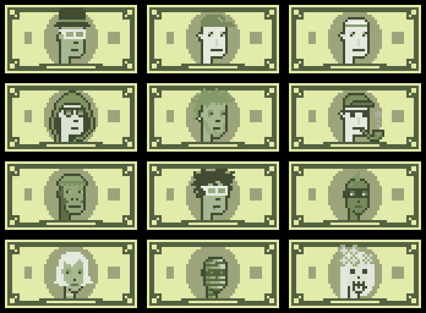

See [Pop Art Pixel Art How-To - Punks, The Dollar $$$ Bill Greenback Edition »](https://old.reddit.com/r/DIYPopArt/comments/vrsvh6/pop_art_pixel_art_howto_punks_the_dollar_bill/)


**Punks, The Neon Light Glow Edition**

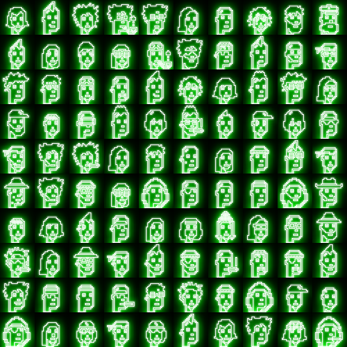

See [Punks w/ Neon Light Glow Effect - Yes, You Can - Turn Black & White Punk (Pencil Drawing) Sketches into Futuristic Punk Neon Light Signs »](https://old.reddit.com/r/DIYPopArt/comments/vrth9o/punks_w_neon_light_glow_effect_yes_you_can_turn/)


**Pop Art Helpers**

- Double Frida (2×1)  => Las Dos Fridas :-)
- Triple Frida (3×1)
- Thirty Fridas Is Better Than One (6×5)
- Forty-Two Fridas Is Better Than One (7×6)
- Two Hundred Fridas Is Better Than One (20×10)

See [Pop Art Helpers »](https://github.com/pixelartexchange/pixelart/tree/master/popart)


And on and on and on. Yes, you can!


