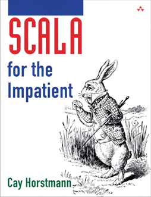

title: Java and the End of History - Learn Some New Languages and Concepts


# Java and the End of History

Learn Some New Languages and Concepts


## Java, Java, Java - 10,000,000,000 % Java

> "When all you have is a hammer, everything looks like a nail."

> "Java is like violence - if it doesn't solve your problems, you are not using enough of it."


# Web Architecture  - All Java? Really?

* What about HTML5?

* What about CSS3?

* What about JavaScript?

* What about HTTP/REST? e.g ETag, Cache Headers, Cookie-Less Requests for Static Resources, etc.
  
* What about SQL/NoSQL?

* What about Web Server Configuration Settings? e.g Gzip, Static Resources across Applications, etc.

* What about Memory Caching (MemCache)?

-> All Java? Really?


# The March of Progress 

1980: C

```
printf("%10.2f", x);
```

1988: C++

```
cout << setw(10) << setprecision(2) << showpoint << x;
```

1996: Java (Enterprise Edition)

```
java.text.NumberFormat formatter = java.text.NumberFormat.getNumberInstance(); 
formatter.setMinimumFractionDigits(2); 
formatter.setMaximumFractionDigits(2); 
String s = formatter.format(x); 
for (int i = s.length(); i < 10; i++) System.out.print(' '); 
System.out.print(s);
```


# The March of Progress Continued

2004: Java

```
System.out.printf("%10.2f", x);
```

2008: Scala and Groovy
   
```
printf("%10.2f", x)
```

Flashback: 1980 C

```
printf("%10.2f", x);
```

Note the lack of semi-colon. Improvement!!

Question: Ideas on how to progess?


# The March of Progress - Example Ruby 

Flashback: 1980 C

```
printf("%10.2f", x);
```

Ruby Version I:

```
printf("%10.2f", x);
```

or

```
printf "%10.2f", x
```

Semi-colon **and parenthesis optional**. Improvement!!

Ruby Version II:

```
puts "10.2f" % x
```

Make formatting an expression, that is, independant of printf (works everywhere). Example:

```
str = "10.2f" % x
```


# Anyways, the point is...

Java is not the End of History. Open your mind. Learn some new concepts and languages. 

Scala:

```
class Person(name: String, age: Int) {
  def description = name + " is " + age + " years old"
}
```


Java:

```
public class Person {
  private String _name;
  private int    _age;
      
  public Person( String name, int age ) { _name = name; _age = age; }
      
  public String getName() { return _name; }
  public void setName( String name ) { _name = name; }
      
  public int getAge() { return _age; }
  public void setAge( int age ) { _age = age; }
      
  public String getDescription() { return name + " is " + age + " years old"; }
}
```


# What's missing in Java? What's wrong with Java?

Anyone?

# 10 Scala One Liners - Possible in Java?

%%% todo: escape numbered list in markdown how?

1) Multiple Each Item in a List by 2

```
(1 to 10) map { _ * 2 }
```

2) Sum a List of Numbers

```
(1 to 1000).sum
```

3) Verify if Exists in a String

```
val wordList = List("scala", "akka", "play framework", "sbt", "typesafe")
val tweet = "This is an example tweet talking about scala and sbt."

wordList.exists(tweet.contains)
```

4) Read in a File

```
val fileText = io.Source.fromFile("data.txt").mkString
val fileLines = io.Source.fromFile("data.txt").getLines.toList
```

5) Happy Birthday to You!

```
(1 to 4).map { i => "Happy Birthday " + (if (i == 3) "dear NAME" else "to You") }.foreach { println }
```


# 10 Scala One Liners Continued

6) Filter list of numbers

```
val (passed, failed) = List(49, 58, 76, 82, 88, 90) partition ( _ > 60 )
```


7) Fetch and Parse an XML web service

```
val results = XML.load("http://search.twitter.com/search.atom?&q=scala")
```


8) Find minimum (or maximum) in a List

```
List(14, 35, -7, 46, 98).min
List(14, 35, -7, 46, 98).max
```

9) Parallel Processing

```
val result = dataList.par.map(line => processItem(line))
```

10) Sieve of Eratosthenes

```
(n: Int) => (2 to n) |> (r => r.foldLeft(r.toSet)((ps, x) => if (ps(x)) ps -- (x * x to n by x) else ps))
```

Source: [mkaz.com/solog/scala/10-scala-one-liners-to-impress-your-friends.html](http://mkaz.com/solog/scala/10-scala-one-liners-to-impress-your-friends.html)


# More 10 One Liners

* 10 Ruby One Liners
* 10 CoffeeScript One Liners
* 10 Python One Liners
* 10 Clojure One Liners
* and so on


# Tip: Some Books


* Learn You a Haskell  - Free Online Book -> [learnyouahaskell.com](http://learnyouahaskell.com)

* Scala for the Impatient (Java Pro) - Free Online Book Chapters  -> [horstmann.com/scala](http://horstmann.com/scala)

* 7 Languages in 7 Weeks (Ruby, Io, Prolog, Scala, Erlang, Clojure, Haskell) -> [pragprog.com/book/btlang/seven-languages-in-seven-weeks](http://pragprog.com/book/btlang/seven-languages-in-seven-weeks)



That's it. Thanks.
