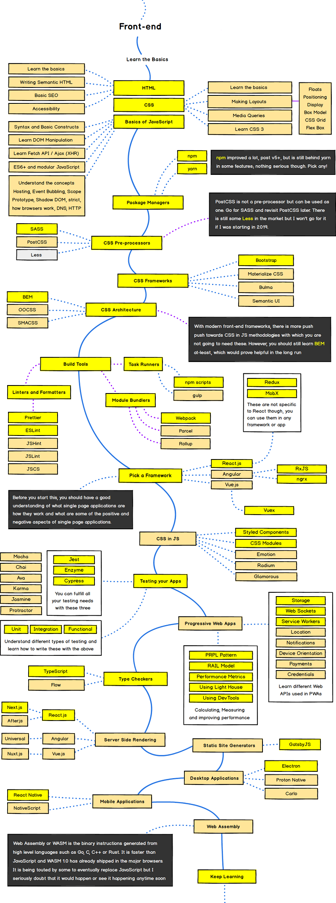
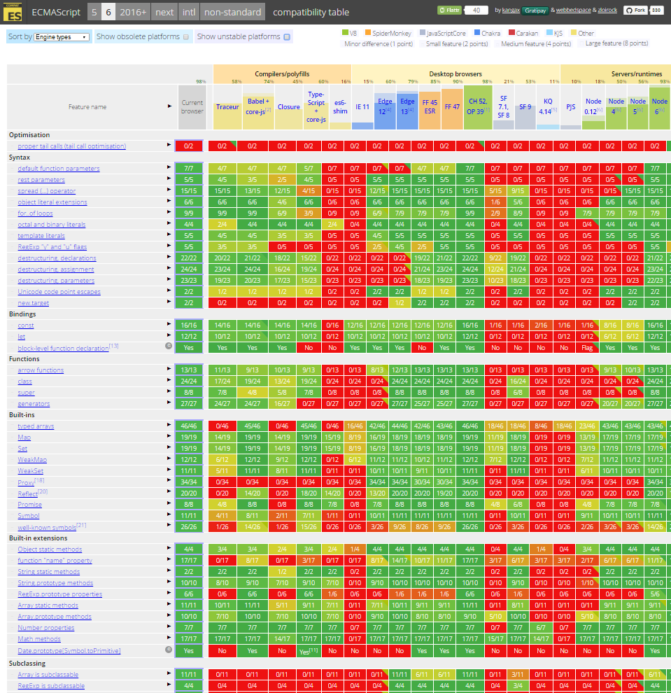
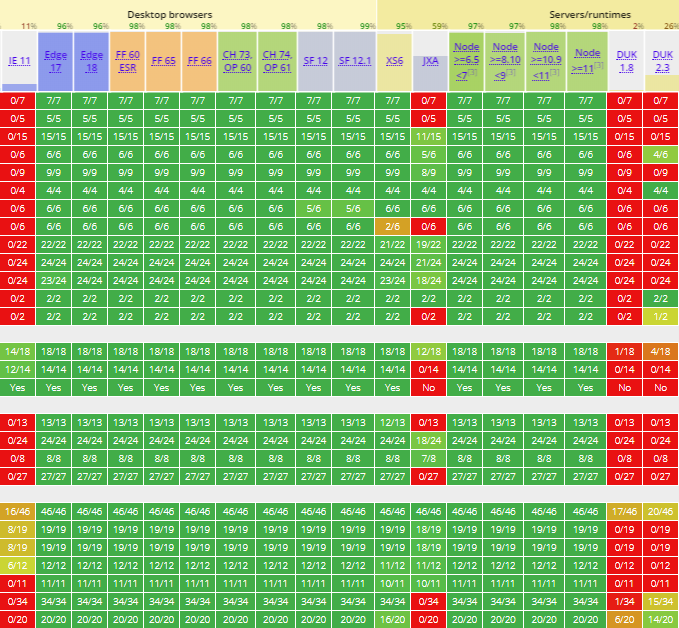
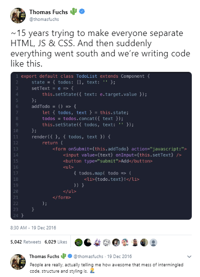
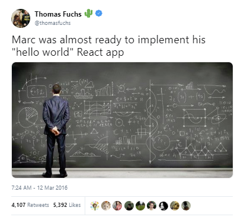
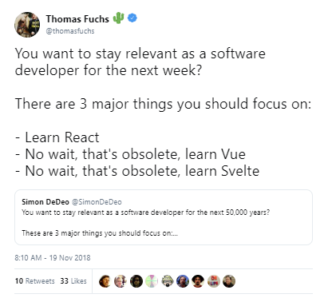

# JavaScript in 2019 - Teach Yourself Web Programming in ~24 Hours~ 10 Minutes


## Silicon Valley Mantra - Software is Eating the World

Q: Who's going to write all that code?

<!--
- [ ] You
- [ ] Robots
- [ ] Let's Go Shopping / Let's Buy
- [ ] Other, Please Tell
-->

Q: And in what programming language(s)?


## Trivia Quiz - Q: What's the world's most popular programming language?

- [ A ] JavaScript
- [ B ] Python
- [ C ] C
- [ D ] Java
- [ ? ] Other, Please Tell


##  JavaScript is eating the world!?

> I usually finish with a joke: **Always bet on JavaScript.**
>
> -- [Brendan Eich](https://brendaneich.com), Inventor of JavaScript

Remember:

(Sun/Oracle) JavaFX[1]
vs (Adobe) Flash/ActionScript
vs (Microsoft) Silverlight/.NET
vs HTML/JavaScript

1: FX = Special (Visual Graphics) Effects

Java Applets, Java Web Start, ActiveX,
VBScript (Visual Basic Script),
Adobe AIR (Adobe Integrated Runtime),
Google Gears,
Google Web Toolkit (GWT),
Google Native Client (NaCl),
and on and on and on.  FAIL. FAIL. FAIL.


## And the Winner is...

JavaScript for "higher-level" web (application) programming

WebAssembly (formerly asm.js) for "lower-level" web ("byte code") programming

Python for data science, machine learning and "casual" programming

C for systems programming

SQL for (relational) database queries

and so on.


## One Language to Rule Them All?! - Bits & Bytes Rule

It's just 0 and 1s.  Bits & Bytes.  Mix & Match.

JavaScript Trend: Assembly and Compiler (incl. Source-to-Source Compiler)
"Renaissance" in 2019 Continues => Ever More Choices - JavaScript Fatigue?!





##  Occam's Razor - Less Code is More

> Occam's razor (also Ockham's razor)
> is the problem-solving principle that essentially states that
> "simpler solutions are more likely to be correct than complex ones."
> When presented with competing hypotheses to solve a problem, one should select
> the solution with the fewest assumptions.
> The idea is attributed to English Franciscan friar
> William of Ockham (c. 1287–1347), a scholastic philosopher and theologian.
>
> -- [Occam's razor @ Wikipedia]()

Question: How to decide what language (or "patterns") to use if you have
hundreds of choices?

Less code is more.
Less abstractions (and to the "metal"1:) is more.
More examples upcoming later.


1: "Use the platform" always wins (because native is faster).


## Top Starred (JavaScript) Projects on GitHub in 2019

1. vuejs/vue
Vue.js is a progressive, incrementally-adoptable JavaScript framework for building UI on the web

2. twbs/bootstrap
The most popular HTML, CSS, and JavaScript framework for developing responsive, mobile first projects on the web.

3. facebook/react
A declarative, efficient, and flexible JavaScript library for building user interfaces.

4. d3/d3
Bring data to life with SVG, Canvas and HTML

5. facebook/react-native
A framework for building native apps with React

6. Microsoft/vscode
Visual Studio Code

7. electron/electron
Build cross-platform desktop apps with JavaScript, HTML, and CSS

8. facebook/create-react-app
Set up a modern web app by running one command

9. flutter/flutter
Flutter makes it easy and fast to build beautiful mobile apps

10. nodejs/node
Node.js JavaScript runtime

11. FortAwesome/Font-Awesome
The iconic SVG, font, and CSS toolkit

12. angular/angular.js (v1)
AngularJS - HTML enhanced for web apps

13. daneden/animate.css
A cross-browser library of CSS animations. As easy to use as an easy thing.

(Source: https://github.com/search?l=&p=2&q=stars%3A%22%3E+20000%22&ref=advsearch&type=Repositories&utf8=%E2%9C%93 )


1: excludes learning / course projects (freeCodeCamp/freeCodeCamp,
  EbookFoundation/free-programming-books, sindresorhus/awesome, getify/You-Dont-Know-JS, airbnb/javascript, kamranahmedse/developer-roadmap)
  or political campaigns (996icu/996.ICU)
  or machine learning (tensorflow/tensorflow) and others


## And Many More Top (JavaScript) Projects

axios/axios - Promise based HTTP client for the browser and node.js

jquery/jquery - jQuery JavaScript Library

mrdoob/three.js - JavaScript 3D library

atom/atom - The hackable text editor

webpack/webpack - A bundler for javascript and friends. Packs many modules into a few bundled assets. Code Splitting allows for loading...

GoogleChrome/puppeteer - Headless Chrome Node API

reduxjs/redux - Predictable state container for JavaScript apps

Microsoft/TypeScript - TypeScript is a superset of JavaScript that compiles to clean JavaScript output

angular/angular (v2) - One framework. Mobile & desktop

mui-org/material-ui - React components for faster and easier web development. Build your own design system, or start with Material Design

socketio/socket.io - Realtime application framework (Node.JS server)

and many many more


## Trivia Quiz: Q: What's common to all these top JavaScript projects?

- [ ] Free as in Free Lunch / Beer
- [ ] Free as in Free Speech
- [ ] Pricing Starts at $40 per Head
- [ ] Other, Please Tell


## Aside - History Nostalgia Corner - What Happened with jQuery?

jquery/jquery - jQuery JavaScript Library

jQuery in 2019?

"Use the platform" always win (because native is faster)

(DOM) Queries with CSS selectors now built into all (modern) browsers

getSelector


More fluid / beautiful / convenient functions

Loop over DOM nodes - in 1999:

2019:


## JavaScript in Action - What's Your Code (Text) Editor?

Evergreen

- [ ] Vim
- [ ] Emacs

<!-- -->

New Kids

- [ ] [Visual Studio Code](https://code.visualstudio.com) by Microsoft
- [ ] [Atom](https://atom.io) by GitHub (now part of Microsoft)

1: Note: Microsoft Visual Studio is different from Microsoft Visual Studio Code


## JavaScript in 2019


## JavaScript in 2016  - A Look Back

[The New New JavaScript / ECMAScript (ES6, ES7, ES8)](https://github.com/geraldb/talks/blob/master/es6.md)

Q: How many new language feature can you find?

`components/PostList.js`:

``` js
import React from 'react'
import { Link } from 'react-router'
import { prefixLink } from 'gatsby-helpers'


export default class PostList extends React.Component {
  render () {
    const {posts} = this.props;
    return (
      <ul>
        {posts.map( post => <li><Link to={prefixLink(post.path)}>{post.data.title}</Link></li> )}
      </ul>
    )
  }
}
```


# The New New JavaScript - What's News? (Cont.)

Q: How many new language feature can you find?

A:

- Classes
- Modules
- Arrow Functions
- Destructuring (e.g. Assignment "Shortcuts" with Pattern Matching)
- Let + Const


And much more

- Enhanced Object Literals
- Template Strings
- Unicode
- Default + Rest + Spread
- Iterators + For..Of
- Map + Set + WeakMap + WeakSet
- Symbols (e.g. New Data Type)
- Subclassable Built-ins (e.g. Array, Date, Element, etc.)
- Math + Number + String + Object APIs
- Binary and Octal Literals
- Generators
- Promises
- Proxies
- Reflect API
- And much more


# ES6 (ES2015) - Can I Use ___ ? - Browser Support Matrix in 2016

- Microsoft Internet Explorer (IE) 11  - 15%
- Microsoft Edge 14  - 90%
- Mozilla Firefox 49 - 93%
- Google Chrome 52 - 98%
- Apple Safari 10  - Surprise (!) - 100%

(Source: [ES6 Compatibility Table](http://kangax.github.io/compat-table/es6/), Jul/2016)




# ES6 (ES2015) - Can I Use ___ ? - Browser Support Matrix in 2019

- Microsoft Internet Explorer (IE) 11  - 11%
- Microsoft Edge 18  - 96%
- Mozilla Firefox 66 - 98%
- Google Chrome 73 - 98%
- Apple Safari 12.1  - Surprise (!) - 99%

(Source: [ES6 Compatibility Table](http://kangax.github.io/compat-table/es6/), April/2019)




What's the missing 2%?

Really, just the optimisation feature called
"[proper tail calls (tail call optimisation)](http://www.ecma-international.org/ecma-262/6.0/#sec-tail-position-calls)".


## What's New in JavaScript 2016, 2017, 2018, 2019?

JavaScript (JS), ECMAScript (ES), ES5, ES6, ES7, ES8,
ES9, ES10, ES2015, ES2016, ES2017, ES2018, ES2019

First appeared on May 23, 1995 -- 23 years ago

- ES 5 - Release on December 2009
- ES2015 (ES 6) - Release on June 2015  -  Almost 6 Years(!)
- ES2016 (ES 7) - Release on June 2016
- ES2017 (ES 8) - Release on June 2017
- ES2018 (ES 9) - Release on June 2018 (Current Version today in 2019)
- ES2019 (ES 10) -  Release on ??
- and so on

Note: New Release Schedule Starting with ES2016 (ES7) - Every Year A Release


## Aside - Trivia Quiz - Java Release Schedule in 2019

Q: What the latest Java release (as of April/2019)?

- [ ] Java 41
- [ ] Java 12
- [ ] Java 9
- [ ] Other, Please Tell

Q: What's the Java release Schedule in 2019?

- [ ] One Release Every Two Years
- [ ] One Release Every Year
- [ ] Two Releases Every Year (Every Six Month)
- [ ] Other, Please Tell


## What's New In ES2019?

- `Array.prototype.`{`flat,flatMap`}
- `Object.fromEntries()`
- `String.prototype.`{`trimStart,trimEnd`}
- `Symbol.prototype.description`
- Optional catch binding
- Stable `Array.prototype.sort()`
- Well-formed `JSON.stringify`
- JSON superset
- `Function.prototype.toString` revision

(Source: [Exploring ES2018 and ES2019](http://exploringjs.com/es2018-es2019/toc.html) by Axel Rauschmayer)


## What's New In ES2018?

- Asynchronous iteration
- Rest/Spread Properties
- RegExp named capture groups
- RegExp Unicode property escapes
- RegExp lookbehind assertions
- `s` (`dotAll`) flag for regular expressions
- `Promise.prototype.finally()`
- Template Literal Revision

(Source: [Exploring ES2018 and ES2019](http://exploringjs.com/es2018-es2019/toc.html) by Axel Rauschmayer)


## What's New In ES2016? ES2017?

**2017**

- Async functions
- Shared memory and atomics
- `Object.entries()` and `Object.values()`
- New string methods: `padStart` and `padEnd`
- `Object.getOwnPropertyDescriptors()`
- Trailing commas in function parameter lists and calls

**2016**

- `Array.prototype.includes`
- Exponentiation operator (`**`)

(Source: [Exploring ES2016 and ES2017](http://exploringjs.com/es2016-es2017/) by Axel Rauschmayer)


## React in 2019 - (Un)popular Opinions

 -- [19 Dec 2016](https://twitter.com/thomasfuchs/status/810885087214637057)

 - [9 Nov 2017](https://twitter.com/thomasfuchs/status/928808041587314689)

 -- [12 Mar 2016](https://twitter.com/thomasfuchs/status/708675139253174273)

  -- [22 Feb 2017](https://twitter.com/thomasfuchs/status/834481271443226627)

 -- [19 Nov 2018](https://twitter.com/thomasfuchs/status/1064551463429521413)


## Less is More


## Compiler with New (Functional) Language (Haskell Syntax Style )

Elm

- built-in virtual dom / built-in reactive updates
- dom nodes are always unchangeable / immutable (by defintion)


Cons:

- "Radical" new syntax for Java or JavaScript coders
- "Radical" functional code (always typed and always unchangeable / immutable)


## Types, Types, Types

TypeScript   - Gradual Typing for JavaScript

ReasonML (OCaml Syntax)  - 100 % (Strong) Typing for JavaScript-like ReasonML


## Many More Languages

Java:
- Scala.js
- Kotlin.js
- Clojure.js

CoffeScript, PureScript, Opal (Ruby), Brython (Python),
and many many more.

See CoffeeScript Wiki Page - 100+


## JavaScript + WebAssembly

- "Higher-Level" Language  - JavaScript
- "Lower-Level" Language - WebAssembly (formerly asm.js)
