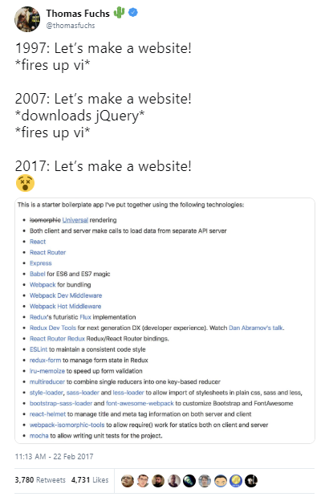

# JavaScript in 2019 - Teach Yourself Web Programming in ~24 Hours~ 10 Minutes


## Silicon Valley Mantra - Software is Eating the World

Q: Who's going to write all that code?

<!--
- [ ] You
- [ ] Robots
- [ ] Let's Go Shopping / Let's Buy
- [ ] Other, Please Tell
-->

Q: And in what programming language(s)?


## Trivia Quiz - Q: What's the World's Most Popular Programming Language?

- [ A ] JavaScript
- [ B ] Python
- [ C ] C
- [ D ] Java
- [ ? ] Other, Please Tell


##  JavaScript is Eating the World!? - Atwood's JavaScript Law

> Any application that can be written in JavaScript,
> will eventually be written in
> JavaScript.
>
> -- Jeff Atwood, Co-Founder of Stackoverflow, 2007

All applications will ultimately wind up on the web and
therefore must be written in JavaScript (or WebAssembly).


## JavaScript is Eating the World!? - Always Bet on JavaScript

> I usually finish with a joke: **Always bet on JavaScript.**
>
> -- [Brendan Eich](https://brendaneich.com), Inventor of JavaScript


The New New / The Next JavaScript - Rest in Peace (R.I.P.):

(Sun/Oracle) JavaFX¹
vs (Adobe) Flash/ActionScript
vs (Microsoft) Silverlight/.NET
vs HTML/JavaScript

¹: FX = Special (Visual Graphics) Effects

Java Applets, Java Web Start, ActiveX,
VBScript (Visual Basic Script),
Adobe AIR (Adobe Integrated Runtime),
Google Gears,
Google Web Toolkit (GWT),
Google Native Client (NaCl),
and on and on and on.  FAIL. FAIL. FAIL.


## And the Winner is...

JavaScript for "higher-level" web (application) programming

WebAssembly (formerly asm.js) for "lower-level" web ("byte code") programming

Python for data science, machine learning and "casual" programming

Ruby for secure (crypto blockchain) contract transaction script and
data / text wrangling programming

C for systems programming

SQL for (relational) database queries programming

CSS for styling and layout programming

and so on.


## CSS Trivia Quiz - Vertical Align / Center - Mission Impossible?

Q: How to vertical align / center the content in a box?

- [ A ] Use a block turned into a (bitmap pixel-perfect) image
- [ B ] Use JavaScript
- [ C ] Use the "new" flexbox layout
- [ ? ] Other, Please Tell


## One Language to Rule Them All?! - Bits & Bytes Rule

It's just 0 and 1s.  Bits & Bytes.  Mix & Match.

JavaScript Trend: Assembly and Compiler (incl. Source-to-Source Compiler)
"Renaissance" in 2019 Continues => Ever More Choices - JavaScript Fatigue?!


## Teach Yourself Web Programming in 2019 - Roadmap

 -- [19 Nov 2018](https://twitter.com/thomasfuchs/status/1064551463429521413)


**Roadmap to becoming a web programmer in 2019**


(Source: [Roadmap to becoming a web developer in 2019 by Kamran Ahmed](https://github.com/kamranahmedse/developer-roadmap))


## Top Starred (JavaScript) Projects on GitHub¹ in 2019

1. vuejs/vue
Vue.js is a progressive, incrementally-adoptable JavaScript framework for building UI on the web

2. twbs/bootstrap
The most popular HTML, CSS, and JavaScript framework for developing responsive, mobile first projects on the web.

3. facebook/react
A declarative, efficient, and flexible JavaScript library for building user interfaces.

4. d3/d3
Bring data to life with SVG, Canvas and HTML

5. facebook/react-native
A framework for building native apps with React

6. Microsoft/vscode
Visual Studio Code

7. electron/electron
Build cross-platform desktop apps with JavaScript, HTML, and CSS

8. facebook/create-react-app
Set up a modern web app by running one command

9. flutter/flutter
Flutter makes it easy and fast to build beautiful mobile apps

10. nodejs/node
Node.js JavaScript runtime

11. FortAwesome/Font-Awesome
The iconic SVG, font, and CSS toolkit

12. angular/angular.js (v1)
AngularJS - HTML enhanced for web apps

13. daneden/animate.css
A cross-browser library of CSS animations. As easy to use as an easy thing.

(Source: [GitHub Search - `stars: > 50000`](https://github.com/search?l=&o=desc&q=stars%3A%22%3E+50000%22&s=stars&type=Repositories))


¹: excludes learning / course projects (freeCodeCamp/freeCodeCamp,
  EbookFoundation/free-programming-books, sindresorhus/awesome, getify/You-Dont-Know-JS, airbnb/javascript, kamranahmedse/developer-roadmap)
  or political campaigns (996icu/996.ICU)
  or machine learning (tensorflow/tensorflow) and others


## And Many More Top (JavaScript) Projects

axios/axios - Promise based HTTP client for the browser and node.js

jquery/jquery - jQuery JavaScript Library

mrdoob/three.js - JavaScript 3D library

atom/atom - The hackable text editor

webpack/webpack - A bundler for javascript and friends. Packs many modules into a few bundled assets. Code Splitting allows for loading...

GoogleChrome/puppeteer - Headless Chrome Node API

reduxjs/redux - Predictable state container for JavaScript apps

Microsoft/TypeScript - TypeScript is a superset of JavaScript that compiles to clean JavaScript output

angular/angular (v2) - One framework. Mobile & desktop

mui-org/material-ui - React components for faster and easier web development. Build your own design system, or start with Material Design

socketio/socket.io - Realtime application framework (Node.JS server)

and many many more


## Trivia Quiz: Q: What's Common to All Top JavaScript Projects?

- [ A ] Free as in Free Lunch / Beer
- [ B ] Free as in Free Speech
- [ C ] Pricing Starts at $40 per Head
- [ ? ] Other, Please Tell


## Aside - History Nostalgia Corner - What Happened with jQuery?


  -- [22 Feb 2017](https://twitter.com/thomasfuchs/status/834481271443226627)

 -- [12 Mar 2016](https://twitter.com/thomasfuchs/status/708675139253174273)


jquery/jquery - jQuery JavaScript Library

jQuery in 2019?

"Use the platform" always win (because native is faster)

(DOM) Queries with CSS selectors now built into all (modern) browsers

``` js
$('.my #awesome selector');
```

vs

``` js
document.querySelectorAll('.my #awesome selector');
```

More fluid / beautiful / convenient functions.
Example - Loops:

``` js
$.each(array, function(i, item){

});
```

vs

``` js
array.forEach(function(item, i){

});
```

See [You might not need jQuery](http://youmightnotneedjquery.com/),
[(Now More Than Ever) You Might Not Need jQuery](https://css-tricks.com/now-ever-might-not-need-jquery/),

and others.


## JavaScript in Action - What's Your Code (Text) Editor?

Evergreen

- [ A ] Vim
- [ B ] Emacs

<!-- -->

New Kids

- [ C ] [Visual Studio Code¹](https://code.visualstudio.com) by Microsoft
- [ D ] [Atom](https://atom.io) by GitHub (now part of Microsoft)

¹: Note: Microsoft Visual Studio is different from Microsoft Visual Studio Code


## JavaScript in 2019


## JavaScript in 2016  - A Look Back

[The New New JavaScript / ECMAScript (ES6, ES7, ES8)](https://github.com/geraldb/talks/blob/master/es6.md)

Q: How many new language feature can you find?

`components/PostList.js`:

``` js
import React from 'react'
import { Link } from 'react-router'
import { prefixLink } from 'gatsby-helpers'


export default class PostList extends React.Component {
  render () {
    const {posts} = this.props;
    return (
      <ul>
        {posts.map( post => <li><Link to={prefixLink(post.path)}>{post.data.title}</Link></li> )}
      </ul>
    )
  }
}
```


# The New New JavaScript - What's News? (Cont.)

Q: How many new language feature can you find?

A:

- Classes
- Modules
- Arrow Functions
- Destructuring (e.g. Assignment "Shortcuts" with Pattern Matching)
- Let + Const


And much more

- Enhanced Object Literals
- Template Strings
- Unicode
- Default + Rest + Spread
- Iterators + For..Of
- Map + Set + WeakMap + WeakSet
- Symbols (e.g. New Data Type)
- Subclassable Built-ins (e.g. Array, Date, Element, etc.)
- Math + Number + String + Object APIs
- Binary and Octal Literals
- Generators
- Promises
- Proxies
- Reflect API
- And much more


# ES6 (ES2015) - Can I Use ___ ? - Browser Support Matrix in 2016

- Microsoft Internet Explorer (IE) 11  - **15%**
- Microsoft Edge 14  - 90%
- Mozilla Firefox 49 - 93%
- Google Chrome 52 - 98%
- Apple Safari 10  - Surprise (!) - 100%

(Source: [ES6 Compatibility Table](http://kangax.github.io/compat-table/es6/), Jul/2016)


# ES6 (ES2015) - Can I Use ___ ? - Browser Support Matrix in 2019

- Microsoft Internet Explorer (IE) 11  - **11%**
- Microsoft Edge 18  - 96%
- Mozilla Firefox 66 - 98%
- Google Chrome 73 - 98%
- Apple Safari 12.1  - Surprise (!) - 99%

(Source: [ES6 Compatibility Table](http://kangax.github.io/compat-table/es6/), April/2019)


What's the missing 2%?

Really, just the optimisation feature called
"[proper tail calls (tail call optimisation)](http://www.ecma-international.org/ecma-262/6.0/#sec-tail-position-calls)".


## What's New in JavaScript 2016, 2017, 2018, 2019, 2020?

JavaScript (JS), ECMAScript (ES), ES5, ES6 / ES2015,
ES2016, ES2017, ES2018, ES2019, ES2020

First appeared on May 23, 1995 -- 23 years ago

- ES 5 - Release on December 2009
- ES 6 / ES2015 - Release on June 2015  -  Almost 6 Years(!)
- ES2016 - Release on June 2016
- ES2017 - Release on June 2017
- ES2018 - Release on June 2018 (Current Version today in 2019)
- ES2019 - Release on ??
- ES2020 - Release on ??
- and so on

Note: New Release Schedule Starting with ES2016 - Every Year A Release


## Aside - Trivia Quiz - Java Release Schedule in 2019

Q: What the latest Java release (as of April/2019)?

- [ A ] Java 41
- [ B ] Java 12
- [ C ] Java 9
- [ ? ] Other, Please Tell

Q: What's the Java release Schedule in 2019?

- [ A ] One Release Every Two Years
- [ B ] One Release Every Year
- [ C ] Two Releases Every Year (Every Six Month)
- [ ? ] Other, Please Tell


## What's New In ES2019?

- `Array.prototype.`{`flat,flatMap`}
- `Object.fromEntries()`
- `String.prototype.`{`trimStart,trimEnd`}
- `Symbol.prototype.description`
- Optional catch binding
- Stable `Array.prototype.sort()`
- Well-formed `JSON.stringify`
- JSON superset
- `Function.prototype.toString` revision

(Source: [Exploring ES2018 and ES2019](http://exploringjs.com/es2018-es2019/toc.html) by Axel Rauschmayer)


## What's New In ES2018?

- Asynchronous iteration
- Rest/Spread Properties
- RegExp named capture groups
- RegExp Unicode property escapes
- RegExp lookbehind assertions
- `s` (`dotAll`) flag for regular expressions
- `Promise.prototype.finally()`
- Template Literal Revision

(Source: [Exploring ES2018 and ES2019](http://exploringjs.com/es2018-es2019/toc.html) by Axel Rauschmayer)


## What's New In ES2016? ES2017?

**2017**

- Async functions
- Shared memory and atomics
- `Object.entries()` and `Object.values()`
- New string methods: `padStart` and `padEnd`
- `Object.getOwnPropertyDescriptors()`
- Trailing commas in function parameter lists and calls

**2016**

- `Array.prototype.includes`
- Exponentiation operator (`**`)

(Source: [Exploring ES2016 and ES2017](http://exploringjs.com/es2016-es2017/) by Axel Rauschmayer)


## What's New In ES2020?  Official Upcoming JavaScript Language Extension Proposals

See [TC39¹ - State of Proposals](https://tc39.github.io/#proposals)
or [TC39¹ - Tracking ECMAScript Proposals »](https://github.com/tc39/proposals)

¹: Technical Committee 39 @ ECMA (European Computer Manufacturers Association)

- `globalThis`
- `import()`
- Legacy RegExp features in JavaScript
- `BigInt`
- `import.meta`
- Private instance methods and accessors
- Class Public Instance Fields & Private Instance Fields
- Static class fields and private static methods
- Numeric Separators
- `Promise.allSettled`
- and some more


## React in 2016 - (Un)popular Opinions

 -- [19 Dec 2016](https://twitter.com/thomasfuchs/status/810885087214637057)

## React in 2017

[Building Web Components with React.js - Past, Present, Future](https://github.com/geraldb/talks/blob/master/react.md)


## React vs Vue vs Svelte in 2019 - Hello, World!


**React**

All `.jsx`:

``` jsx
function Message( {name} ) {
  return <h1>{ `Hello, ${name}!` }</h1>;
}

<Message name="World" />
```

Note: JSX (JavaScript XML) adds XML syntax to JavaScript
and gets compiled (or really preprocessed):

``` js
function Message( {name} ) {
  return React.createElement( "h1", null, `Hello, ${name}!`);
}

React.createElement( Message, { name: "World" });
```


**Vue**

`.html`:

``` html
<div id="message">
  Hello, {{ name }}!
</div>
```

`.js`:

``` js
var msg = new Vue({
  el: '#message',
  data: {
    name: 'World'
  }
})
```

or use "single-file" component-style:

`.vue`:

```
<template>
  <div id="message">
    Hello, {{ name }}!
  </div>
</template>

<script>
  export default {
    name: 'World'
  }
</script>
```


**Svelte**


`.svelte`:

```
<script>
	let name = 'World';
</script>

<h1>Hello {name}!</h1>
```


## What's Svelte?

Cybernetically enhanced web apps!?


**Write Less Code** Build boilerplate-free components
using languages you already know - HTML, CSS and JavaScript

**No Virtual DOM** Svelte compiles your code to tiny,
framework-less vanilla JavaScript - your app starts fast and stays fast

**True reactive** No more complex state management libraries -
Svelete brings reactivity to JavaScript itself


See [`svelte.dev` »](https://svelte.dev/)


##  Occam's Razor - Less Code is More

> Occam's razor (also Ockham's razor)
> is the problem-solving principle that essentially states that
> "simpler solutions are more likely to be correct than complex ones."
> When presented with competing hypotheses to solve a problem, one should select
> the solution with the fewest assumptions.
> The idea is attributed to English Franciscan friar
> William of Ockham (c. 1287–1347), a scholastic philosopher and theologian.
>
> -- [Occam's razor @ Wikipedia]()

Question: How to decide what language (or "patterns") to use if you have
hundreds of choices?

Less code is more.
Less abstractions (and to the "metal"¹) is more.

¹: "Use the platform" always wins (because native is faster).

  -- [9 Nov 2017](https://twitter.com/thomasfuchs/status/928808041587314689)


## React vs Vue vs Svelte in 2019 - Counter


**React**

`.jsx` - "classical" (pre-hooks):

``` jsx
class Counter extends React.Component {
  state = { count: 0 };

  handleClick = () => {
    this.setState(({ count }) => ({ count: count + 1 }));
  };

  render() {
    return
      <button onClick={this.handleClick}>
        {this.state.count}
      </button>;
  }
}

<Counter />
```

New: React "class-less" with hooks

`.jsx`:

``` jsx
function Counter() {
  const [count, setCount] = useState(0);

  return
    <button onClick={() => setCount(count + 1)}>
      {count}
    </button>;
}
```

What are Hooks?  Hooks are a new addition in React 16.8.
Hooks let you use state and other React goodies
without writing a class. (Source: [Introducing Hooks @ React](https://reactjs.org/docs/hooks-intro.html))


**Vue**

`.vue`:

```
<template>
  <button @click="handleClick">{{count}}</button>
</template>

<script>
export default {
  data() { return { count: 0 } },
  methods: {
    handleClick() { this.count += 1 }
  }
}
</script>
```


**Svelte**

`.svelte`:

```
<script>
	let count = 0;
	function handleClick() { count += 1; }
</script>

<button on:click={handleClick}>
	Clicked {count}
</button>
```


## React vs Vue vs Svelte in 2019 - A+B=? Form

**Svelte**

`.svelte`:

```
<script>
	let a = 1;
	let b = 2;
</script>

<input type="number" bind:value={a}>
<input type="number" bind:value={b}>

<p>{a} + {b} = {a + b}</p>
```


**React**

`.jsx` - "class-less" with hooks:

``` jsx
export default () => {
  const [a, setA] = useState(1);
  const [b, setB] = useState(2);

  function handleChangeA(event) { setA(+event.target.value); }
  function handleChangeB(event) { setB(+event.target.value); }

  return
    <>
      <input type="number" value={a} onChange={handleChangeA}/>
      <input type="number" value={b} onChange={handleChangeB}/>

      <p>{a} + {b} = {a + b}</p>
    </>;
};
```


**Vue**

`.vue`:

```
<template>
  <input type="number" v-model.number="a">
  <input type="number" v-model.number="b">

  <p>{{a}} + {{b}} = {{a + b}}</p>
</template>

<script>
  export default {
    data: function() {
      return {
        a: 1,
        b: 2
      };
    }
  };
</script>
```

Conclusion:

The example takes 442 characters in React,
and 263 characters in Vue,
to achieve something that takes 145 characters in Svelte.
The React version is literally three times larger!

(Source: [Svelte - Write less code: The most important metric you're not paying attention to](https://svelte.dev/blog/write-less-code))


## What's Next? JavaScript in 2016

### What's Next? JavaScript w/ Types

Biggies

- TypeScript ★48127 (20098¹) (by Microsoft) -  JavaScript Extended w/ Types
- Flow ★19356 (10693¹) (by Facebook)        -  Add Annotations for Type Checking
- Dart ★3521 (1038¹) (by Google)           -  New Language w/ (Optional) Types

And Others.

¹: Stars in July 2016


### What's Next? More Fun - Fun(ctional) Languages

Biggies

- Elm ★ 5161 (3706)¹ (by Evan Czaplicki 'n' friends) - Small (Pure) Functional Language for the Web
  - Based on Haskell (Simplified)
- ReasonML ★7610 (2467)¹ (by Facebook) - Larger (Pragmatic) Functional Language
  - Based on OCaml (New ReasonML Syntax Closer to JavaScript)

And Others.

¹: Stars in July 2016


Why Fun(ctional)?

- "Stronger" Types
  - No Null and No Undefined Possible
    - e.g. Elm Uses Maybe types with Just a and Nothing and Tuple Units e.g. `()`)
  - Lists must always be of the same type
  - If expressions must always return the same type (in if and else branch)
  - Case expressions must always cover all possible branches / values
  - And so on
- Immutability
  - Cannot change/overwrite variables (change will always create a new variable)
  - Great for "high-speed" diffing web component/element trees ("just" compare node references)
  - Great for "time travel" debugging e.g. save or restore any state in time


## Homework - Practice (or Learn) Functional Programming :-)

**Counter Example with Elm**

Homework. Practice (or Learn) Functional Programming with Elm  :-)

**Counter Example with ReasonML (and React)**

Homework. Practice (or Learn) Functional Programming with ReasonML  :-)


## Counter Example with Elm

``` elm
type Msg = Tick

model : Int
model = 0

view : Int -> Html.Html Msg
view model =
      button [ onClick Tick ] [ text (toString model) ]

update : Msg -> Int -> Int
update msg model =
    case msg of
        Add -> model + 1
```


## Counter Example with ReasonML (and React) and Timer (Side) Effect

``` reasonml
type action =
  | Tick;

type state = {
  count: int,
};

[@react.component]
let make = () => {
  let (state, dispatch) = React.useReducer(
    (state, action) =>
      switch (action) {
      | Tick => {count: state.count + 1}
      },
    {count: 0}
  );

  React.useEffect0(() => {
    let timerId = Js.Global.setInterval(() => dispatch(Tick), 1000);
    Some(() => Js.Global.clearInterval(timerId))
  });

  <div>{ReasonReact.string(string_of_int(state.count))}</div>;
};
```


## Many More Languages

Java:

- Scala.js - A safer way to build robust front-end web applications!
- Kotlin.js - Kotlin for JavaScript
- ClojureScript - Clojure to JavaScript compiler
- and many more


CoffeScript, Opal (Ruby), Brython (Python),
and many many more.

See [List of languages that compile to JavaScript »](https://github.com/jashkenas/coffeescript/wiki/list-of-languages-that-compile-to-js)


## JavaScript + WebAssembly

- "Higher-Level" Language - JavaScript
- "Lower-Level" Language - WebAssembly (formerly asm.js)


## What's WebAssembly?

Compile C, C++, Rust, and more "system" languages
to "Lower-Level" JavaScript. Use compiled code as WebAssembly modules / libraries
(almost runs with "native" speed) in JavaScript.


See [`webassembly.org »`](https://webassembly.org)


## Official WebAssembly Frequently Asked Questions (and Answers)

**Q: Is WebAssembly trying to replace JavaScript?**

A: No! WebAssembly is designed to be a complement to, not replacement of, JavaScript. While WebAssembly will, over time, allow many languages to be compiled to the Web, JavaScript has an incredible amount of momentum and will remain the single, privileged (as described above) dynamic language of the Web. Furthermore, it is expected that JavaScript and WebAssembly will be used together in a number of configurations:

Whole, compiled C++ apps that leverage JavaScript to glue things together.

HTML/CSS/JavaScript UI around a main WebAssembly-controlled center canvas, allowing developers to leverage the power of web frameworks to build accessible, web-native-feeling experiences.

Mostly HTML/CSS/JavaScript app with a few high-performance WebAssembly modules (e.g., graphing, simulation, image/sound/video processing, visualization, animation, compression, etc., examples which we can already see in asm.js today) allowing developers to reuse popular WebAssembly libraries just like JavaScript libraries today.

When WebAssembly gains the ability to access garbage-collected objects,
those objects will be shared with JavaScript, and not live in a walled-off world of their own.
