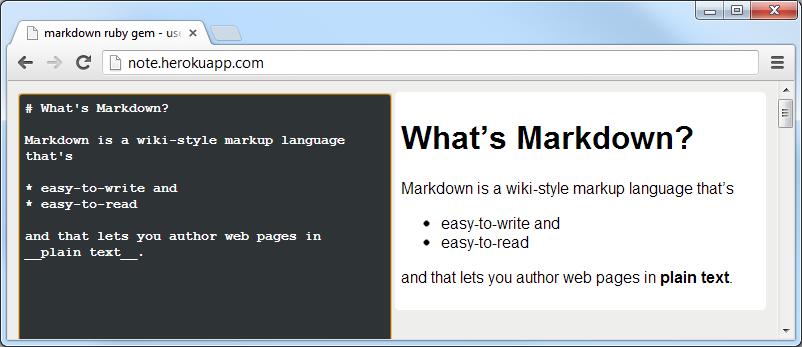
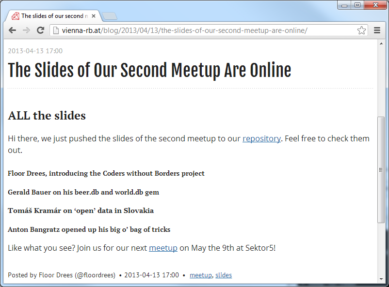
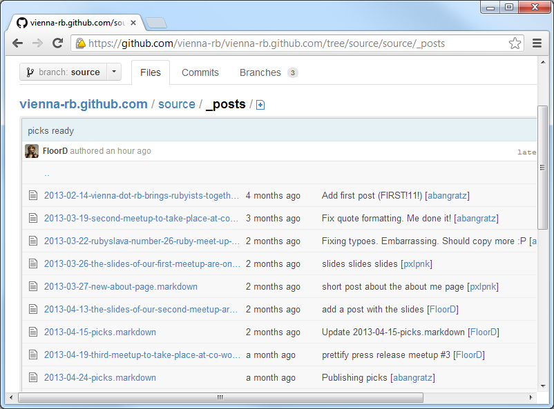
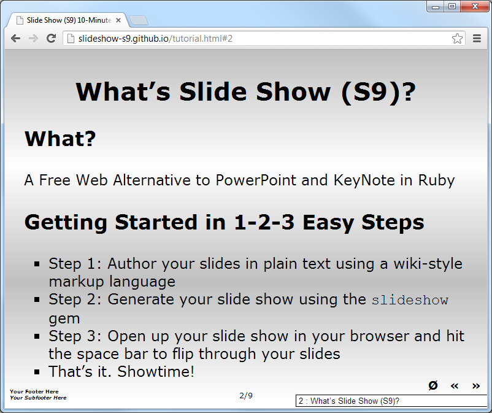
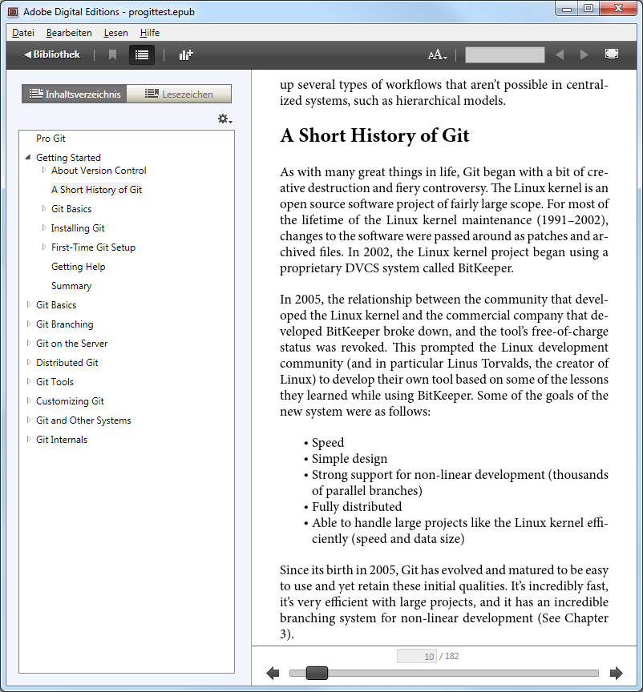
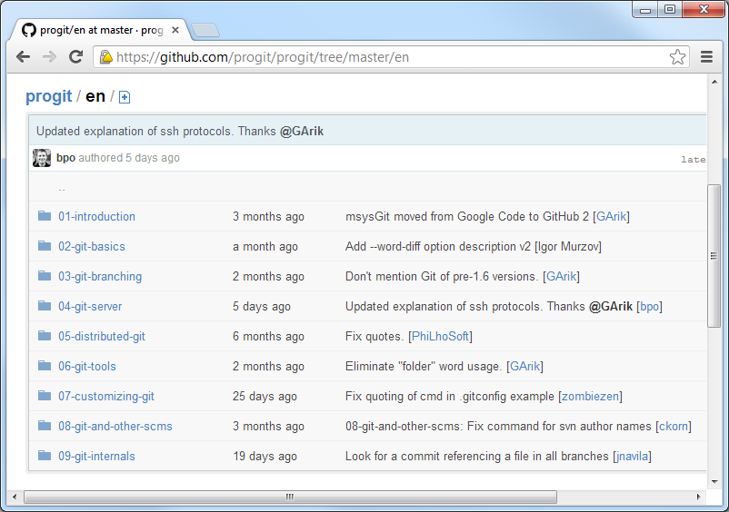

title: Using Markdown for Websites, Presentations, or Books

%css

pre {
  padding: 4px 4px 4px 4px;
  border-top: #bbb 1px solid;
  border-bottom: #bbb 1px solid;
  background: #f3f3f3;
}

%end

# Using Markdown for Websites, Presentations, or Books

Agenda

* What's Markdown?
* Syntax - Text Formatting
* Syntax - Header Formatting
* Syntax - Hyperlink
* What is Markdown good for?
* Example - Website
* Example - Presentation
* Example - Book
* Markdown Parsers in Ruby
* What's the `markdown` Gem?
* Tooling - Websites
* Tooling - Presentations
* Tooling - Books

# What's Markdown? What's Markup?

Markdown is a wiki-style markup language that's

* easy-to-write and
* easy-to-read

and that lets you author web pages in __plain text__.

# What's Markdown?  Example

~~~
# What's Markdown?

Markdown is a wiki-style markup language that's

* easy-to-write and
* easy-to-read

and that lets you author web pages in __plain text__.
~~~

becomes

~~~
<h1>What's Markdown?</h1>

Markdown is a wiki-style markup language that's

<ul>
  <li>easy-to-write and</li>
  <li>easy-to-read</li>
</ul>

and that lets you author web pages in <strong>plain text</strong>.

~~~

# Live Demo - Markdown Note

Try [`note.herokuapp.com`](http://note.herokuapp.com)

# More Plain Text Wiki-Style Markup Languages

Many languages including:

- Bulletin Board Code (BBCode) - used in PHP forums
- MediaWiki Markup   - used in Wikipedia
- Org-mode   - used in Emacs Editor
- reStructuredText (reST)  - used in Python docs
- Textile
- AsciiDoc

and many more

# Syntax - Text Formatting -  **Bold**, *Italic*, `Monospaced (Code)`

### Markdown

~~~
**bold text**  or __bold text__

*italic text*  or  _italic text_

Inline `monospaced` text.
~~~

### Bulletin Board Code

~~~
[b]bold text[/b]

[i]italic text[/i]

[code]monospace text[/code]
~~~

### Wikipedia

~~~
'''bold text'''

''italic text''

<code>monospace text</code>
~~~

# Syntax - Header Formatting

### Markdown

~~~
# Level 1 Header

## Level 2 Header

or

Level 1 Header
==============

Level 2 Header
--------------
~~~

### Bulletin Board Code

Does not support headers

### Wikipedia

~~~
= Level 1 Header =

== Level 2 Header ==
~~~

# Syntax - Hyperlink

### Markdown

~~~
<http://www.example.com>

or

[Link text](http://www.example.com "optional title attribute")

or

[Link text][id]
and elsewhere
[id]: http://www.example.com "optional title attribute"
~~~

### Bulletin Board Code

~~~
[url]http://www.example.com[/url]
[url=http://www.example.com]Link text[/url]
~~~

### Wikipedia

~~~
[[Internal page]]
[[Internal page|Displayed text]]
[http://www.example.com]
[http://www.example.com External link]
~~~

# What is Markdown good for?

- Websites
- Presentations
- Books

### Who is using Markdown?

- GitHub
- Stack Overflow
- Reddit
- You?
- And many more 

# Website Example - `vienna.rb`

`2013-04-13-the-slides-of-our-second-meetup-are-online.markdown`:

~~~
---
layout: post
title: The slides of our second meetup are online
date: 2013-04-13 17:00
author: Floor Drees (@floordrees)
categories: [slides, meetup]
---

## ALL the slides

Hi there, we just pushed the slides of the second meetup to our [repository][1].
Feel free to check them out. 

##### Floor Drees, introducing the Coders without Borders project
##### Gerald Bauer on his beer.db and world.db gem
##### Tomáš Kramár on 'open' data in Slovakia
##### Anton Bangratz opened up his big o' bag of tricks 

Like what you see? Join us for our next [meetup][2] on May the 9th at Sektor5!

[1]: https://github.com/vienna-rb/slides
[2]: http://www.meetup.com/vienna-rb/events/102695522/
~~~

Source: [`vienna-rb.at/blog/2013/04/13/the-slides-of-our-second-meetup-are-online`](http://vienna-rb.at/blog/2013/04/13/the-slides-of-our-second-meetup-are-online/)

# Website Example - `vienna.rb` (Cont.)

List of posts in Markdown. Yeah!

~~~
_posts/
  2013-02-14-vienna-dot-rb-brings-rubyists-together.markdown
  2013-03-19-second-meetup-to-take-place-at-co-working-space-sektor5.markdown
  2013-03-22-rubyslava-number-26-ruby-meet-up-in-bratislava.markdown
  2013-03-26-the-slides-of-our-first-meetup-are-online.markdown
  2013-03-27-new-about-page.markdown
  2013-04-13-the-slides-of-our-second-meetup-are-online.markdown
  2013-04-15-picks.markdown  
  ....
~~~

Source: [`github.com/vienna-rb/vienna-rb.github.com/_posts`](https://github.com/vienna-rb/vienna-rb.github.com/tree/source/source/_posts)

# Presentation Example - Slide Show (S9) 10-Minute Tutorial

`talks/tutorial.markdown`:

~~~
# Slide Show (S9) 10-Minute Tutorial

Agenda

* What's Slide Show (S9)? 
* Wiki-Style Markup Language - Markdown, Textile
* How it works - Just press F11! 
* What's S5? What's S6?
* Gradient Themes Using "Loss-Free" Vector Graphics in S9
* Turn Your Online Wiki Pages into Slide Shows

# What's Slide Show (S9)?

A Free Web Alternative to PowerPoint and Keynote in Ruby

### Getting Started in 1-2-3 Easy Steps

* Step 1: Author your slides in plain text using a wiki-style markup language
* Step 2: Generate your slide show using the `slideshow` gem
* Step 3: Open up your slide show in your browser and hit the space bar to flip through your slides
* That's it. Showtime

...

# Thanks - Learn More - Questions? Comments?

Gerald Bauer designed and developed the Slide Show (S9) Ruby gem. 
Find out more @ [`slideshow-s9.github.io`](http://slideshow-s9.github.io)

Questions? Comments? Send them along to the
[Free Web Slide Show Alternatives Forum](http://groups.google.com/group/webslideshow).
Thanks!
~~~

# Book Example - Pro Git - Distributed is the New Centralized

`progit/en/01-introduction/01-chapter1.markdown`:

~~~
## A Short History of Git ##

As with many great things in life, Git began with a bit of creative destruction and fiery controversy.
The Linux kernel is an open source software project of fairly large scope. For most of the lifetime
of the Linux kernel maintenance (1991–2002), changes to the software were passed around as patches and
archived files. In 2002, the Linux kernel project began using a proprietary DVCS system called BitKeeper.

In 2005, the relationship between the community that developed the Linux kernel and the commercial
company that developed BitKeeper broke down, and the tool’s free-of-charge status was revoked.
This prompted the Linux development community (and in particular Linus Torvalds, the creator of Linux)
to develop their own tool based on some of the lessons they learned while using BitKeeper.
Some of the goals of the new system were as follows:

* Speed
* Simple design
* Strong support for non-linear development (thousands of parallel branches)
* Fully distributed
* Able to handle large projects like the Linux kernel efficiently (speed and data size)

Since its birth in 2005, Git has evolved and matured to be easy to use and yet retain these initial qualities.
It's incredibly fast, it's very efficient with large projects, and it has an incredible branching system
for non-linear development (See Chapter 3).
~~~

# Book Example - Pro Git - Distributed is the New Centralized (Cont.)

~~~
01-introduction/
    01-chapter1.markdown
02-git-basics/
    01-chapter2.markdown
03-git-branching/
    01-chapter3.markdown
04-git-server/
    01-chapter4.markdown
05-distributed-git/
    01-chapter5.markdown
06-git-tools/
    01-chapter6.markdown
07-customizing-git/
    01-chapter7.markdown
08-git-and-other-scms/
    01-chapter8.markdown
09-git-internals/
    01-chapter9.markdown
~~~

Source: [github.com/progit/en](https://github.com/progit/progit/tree/master/en)

# Markdown Parsers in Ruby

Many options!

- kramdown   (Made in Vienna by Thomas Leitner)
- redcarpet
- bluecloth
- maruku
- rpeg-markdown
- rdiscount
- pandoc-ruby
- and more!

Usage in Ruby:

~~~
require 'markdown'

Markdown.new( 'Servus Wien' ).to_html

# => "
Servus Wien
\n"
~~~~

# What's the `markdown` Gem?

The Markdown Engine Wrapper (`markdown`) gem lets you use your Ruby markdown library of choice.  Example:

~~~
$ set MARKDOWN_LIB=kramdown
~~~

or

`~/markdown.yml`:

~~~
## Let's use the Redcarpet library

lib: redcarpet

redcarpet:
  extensions:
    - no_intra_emphasis
    - fenced_code_blocks
    - tables
    - strikethrough
~~~

Tip: The `markdown` gem includes a little command line tool. Try `markdown -h` for details.
Note - The markdown command line tool includes a server and little online markdown editor!
Try `markdown serve` to start your own web service / HTTP (JSON) API.

Source: [`github.com/geraldb/markdown`](https://github.com/geraldb/markdown)

# Tooling - Websites 

Many static site compilers/builders options! Let's use Jekyll. Example:

`mypage.markdown`:

~~~
---
title: My Page
---

## Page Header

Some text here.

## Another Page Header

More text here.

Some code:

    10 PRINT "BASIC ROCKS!"
    20 GOTO 10
~~~

To build your site (pages) issue:

~~~
$ jekyll build
~~~

That's it. More options:

- Ace
- Bonsai
- Frank
- nanoc
- Middleman
- StaticMatic
- Statis
- ZenWeb
- and many more!

# Tooling - Presentations

Many presentation builders options! Let's use Slide Show (S9). Example:

`mytalk.markdown`:

~~~
# My Slide Title

* Bullet Point One
* Bullet Point Two

# Another Slide Title

Some text here. 
~~~

To build your presentation issue:

~~~
$ slideshow mytalk.markdown
~~~

That's it. More options:

- deck.rb
- KeyDown
- Parade
- ShowOff
- Slidedown
- Slide'em up
- and many more!

# Tooling - Books

Let's use Pandoc.  Note: It's Haskell (not Ruby). Example:

`mybook.txt`:

~~~
Title: My Book
Author: Ruby Rubacuori

This is my book.

# Chapter One

Chapter one is over.

# Chapter Two

Chapter two has just begun.
~~~

To build your book issue:

~~~
$ pandoc mybook.txt -o mybook.epub
~~~

That's it.

# That's it. Thank you.

Questions? Comments?

# Appendix: What's EPUB?

EPUB (short for Electronic PUBlication) is a free and open e-book standard.
Files are zipped up archives with the extension `.epub.` Example:

~~~
title_page.html
ch01.html
ch02.html
ch03.html
styles.css
~~~

Plus some extras (defined in the Open Container Format - OCF):

~~~
mimetype                # identification as epub - application/epub+zip
META-INF/container.xml  # contents of the book (in XML)
content.opf             # .opf - Open Packaging Format (in XML)
toc.ncx                 # .ncs - Navigation Control file for XML (in XML)
nav.html
~~~

# Appendix: Zen Writing - Zen Text Editor

What's Zen Writing?

Extremely stripped down text editor - leaving you alone with your thoughts
and your words - lets you focus on your text.

### Linux

- ReText (Free, Open Source)
- UberWriter (Free, Open Source)

### Windows

- WriteMonkey (Free, Open Source)
- MarkPad (Free, Open Source)

### Apple / Mac / iPad

- Byword ($9.99)
- Marked ($2.99)
- IA Writer ($9.99)
- Elements ($4.99)

Many more

# Appendix: What's Markdown Extra?

Adds more "extras" to Markdown. Example:

- Inline HTML
- Markdown Inside HTML Blocks
- Header Id Attribute
- Fenced Code Blocks
- Tables
- Definition Lists
- Footnotes
- Abbreviations
- Emphasis
- Backslash Escapes

Table Example:

~~~
| Item      | Value |
| --------- | -----:|
| Computer  | $1600 |
| Phone     |   $12 |
| Pipe      |    $1 |
~~~

becomes

~~~
<table>
  <thead>
    <tr>
      <th>Item</th>
      <th style="text-align: right">Value</th>
    </tr>
  </thead>
  <tbody>
    <tr>
      <td>Computer</td>
      <td style="text-align: right">$1600</td>
    </tr>
    <tr>
      <td>Phone</td>
      <td style="text-align: right">$12</td>
    </tr>
    <tr>
      <td>Pipe</td>
      <td style="text-align: right">$1</td>
    </tr>
  </tbody>
</table>
~~~

# Appendix: What's Babelmark2? What's Markdown Dingus?

Markdown Dingus - very first online Markdown converter; uses original
Markdown Perl script)

- [`daringfireball.net/projects/markdown/dingus`](http://daringfireball.net/projects/markdown/dingus)

Babelmark2 - modern version of Markdown Dingus; lets you compare
many Markdown services via HTTP (JSON) API

- [`johnmacfarlane.net/babelmark2`](http://johnmacfarlane.net/babelmark2/)

