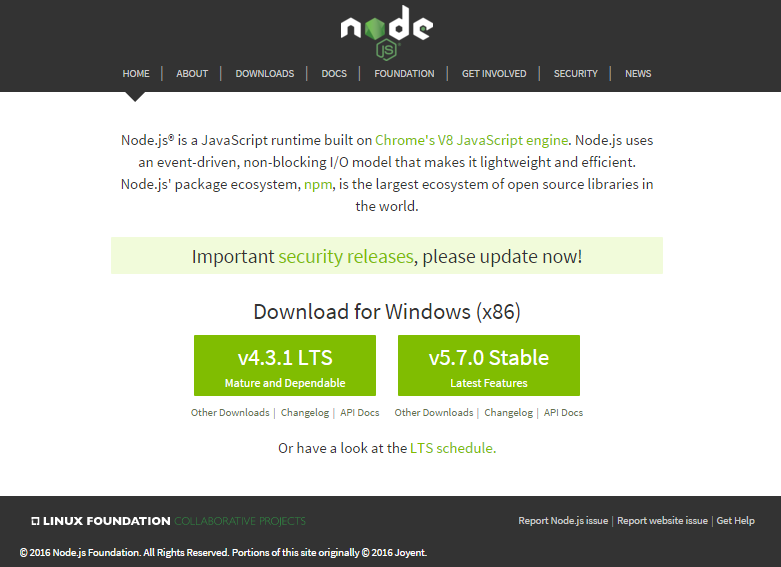

title: Building Static (Web) Sites w/ Metalsmith (Node.js)


# Agenda

- What's Metalsmith?
- Everything is a Plugin
- File / Directory Structure
- HTML Templates - Handlebars or Nunjucks?
- Pages n Posts with Front Matter
- Datafiles
- HTML Templates - Loops
- All Together Now - build.js
- Real World Showcase -  Node.js Project Site
- More Plugins
- Write Your Own Plugins
- Links, Links, Links


# What's Metalsmith?

A static site builder in JavaScript (Node.js).


See [`metalsmith.io`](http://www.metalsmith.io) »


# Metalsmith - Everything is a Plugin

Configure file processing build pipeline / chain using plugins


Example - `build.js`:

```
Metalsmith(_dirname)
  .source( 'src' )

  /*******************
    add plugins here
   ******************* /
 
  .destination( 'build' )
  .build( function(err) {
	        if (err) console.log(err);
  });
```

# Metalsmith - Everything is a Plugin (Cont.)

Example:

```
  .use( metadata({
          links:  './data/links.json' }))
  .use( inPlace({
          engine: 'nunjucks',
          pattern: '**/*.html' }))
  .use( markdown() )
  .use( layouts({
          engine: 'nunjucks',
          directory: './layouts' }))
```


# Metalsmith - File / Directory Structure

```
├── build.js                     # Metalsmith build script / configuration
├── layouts/
|   ├── default.html             # master layout template
|   ├── page.html                # - layout for pages
|   └── post.html                # - layout for blog posts
└─── src/
    ├── css/
    |   └── style.css           
    ├── data/
    |   └── links.json           # datafile (in json)
    ├── posts/
    |    ├── 2014-11-11-new-repo-maps.md
    |    ├── 2014-12-12-new-build-system.md
    |    └── 2015-08-25-new-season.md   
    ├── about.md                 # about page (in markdown e.g. md) 
    └── index.html               # front page (in hypertext e.g. html)
```


# Metalsmith - File / Directory Structure  - Output

Use:

```
$ node build.js
```

Resulting in:

```
└─── build/
     ├── css/
     |   └── style.css
     ├── posts/
     |    ├── 2014-11-11-new-repo-maps.html
     |    ├── 2014-12-12-new-build-system.html
     |    └── 2015-08-25-new-season.html
     ├── about.html
     └── index.html     
```


# Metalsmith - File / Directory Structure - Output (Cont.)


(Source: Stay Static Sample Site Showcase - `index.html`)


# Metalsmith - HTML Templates - Handlebars or Nunjucks?

Handlebars.js (web: [`handlebarsjs.com`](http://handlebarsjs.com)) - Minimalistic
Mustache-style `{{}}` "logic-less" templates
(e.g. no arguments for if conditionals or each loops possible,
no nested layouts, no content blocks, no inline macros, etc.)   

~~~
<!DOCTYPE html>
<html>
  {{{> head }}
  <body>
     {{{> header }}
    <div class="main">
      {{{{ contents }}}
    </div>   
     {{{> footer }}
  </body>
</html>
~~~

(Source: [`staystatic/metalsmith-handlebars/layouts/default.html`](https://github.com/staystatic/metalsmith-handlebars/blob/master/layouts/default.html))


# Metalsmith - HTML Templates - Handlebars or Nunjucks? (Cont.)

Nunjucks.js (web: [`mozilla.github.io/nunjucks`](https://mozilla.github.io/nunjucks)) - Rich & powerful
template language with block inheritance, autoescaping, macros, asynchronous control, and much more.
(Inspired by Jinja2 - a python template language inspired by Django's template language).


~~~
<!DOCTYPE html>
<html>
  {%% include 'partials/head.html' %}
  <body>
    {%% include 'partials/header.html' %}
    <div class="main">
      {%% block content %}
        {{{ contents | safe }}
      {%% endblock %}
    </div>   
    {%% include 'partials/footer.html' %}
  </body>
</html>
~~~


(Source: [`staystatic/metalsmith-nunjucks/layouts/default.html`](https://github.com/staystatic/metalsmith-nunjucks/blob/master/layouts/default.html))


# Metalsmith - HTML Templates - Handlebars or Nunjucks? (Cont.)

Metalsmith uses Consolidate.js (github: [tj/consolidate.js](https://github.com/tj/consolidate.js)) -
a template engine consolidation library for Node.js.

More template engines include:

- Eco (Embedded CoffeeScript)
- EJS (Embedded JavaScript)
- Jade
- Liquid
- Mustache
- And many more


# Metalsmith - Pages n Posts with Front Matter

YAML + Markdown

~~~
---
layout: post
title:  beer.db - New Repo /maps - Free Interactive Beer Maps w/ Brewery Listings
---

The beer.db project - offering free public domain beer, brewery
and brewpubs data - added a new repo, that is, `/maps` 
for hosting 'full-screen' interactive beer maps with brewery listings.

See an example [beer map for Austria](http://openbeer.github.io/maps/at)
(~200 breweries n brewpubs) live or
[check the source](https://github.com/openbeer/maps) using the mapbox.js mapping library.

...
~~~

(Source: [`staystatic/metalsmith-nunjucks/src/posts/new-repo-maps.md`](https://github.com/staystatic/metalsmith-nunjucks/blob/master/src/posts/new-repo-maps.md))


# Metalsmith - Datafiles 

Links 'n' Bookmarks in JSON

~~~
[
 { "title": "football.db - Open Football Data",
   "url":   "https://github.com/openfootball" },
 { "title": "beer.db - Open Beer, Brewery 'n' Brewpub Data",
   "url":   "https://github.com/openbeer" },
 { "title": "world.db - Open World Data",
   "url":   "https://github.com/openmundi" }
]
~~~

(Source: [`staystatic/metalsmith-nunjucks/src/data/links.json`](https://github.com/staystatic/metalsmith-nunjucks/blob/master/src/data/links.json))


# Metalsmith - HTML Templates - Loops - Handlebars or Nunjucks?

**Handlebars**

~~~
<div>
  <b>Links 'n' Bookmarks</b>
    <ul>
        {{{#each links}}
          <li><a href="{{{ url }}">{{{ title }}</a></li>
        {{{/each}}
    </ul>
</div>  
~~~

~~~
<div>
  <b>News 'n' Updates</b>
    <ul>
        {{{#each posts}}
           <li><a href="{{{ urlxx }}">{{{ title }}</a></li>
        {{{/each}}
    </ul>
</div>
~~~

(Source: [`staystatic/metalsmith-handlebars/src/index.html`](https://github.com/staystatic/metalsmith-handlebars/blob/master/src/index.html))


# Metalsmith - HTML Templates - Loops - Handlebars or Nunjucks? (Cont.)

**Nunjucks**

~~~
<div>
  <b>News 'n' Updates</b>
    <ul>
        {%% for post in posts %}
           <li><a href="{{{ post.urlxx }}">{{{ post.title }}</a></li>
        {%% endfor %}
    </ul>
</div>
~~~

~~~
<div>
  <b>Links 'n' Bookmarks</b>
    <ul>
        {%% for link in links %}
          <li><a href="{{{ link.url }}">{{{ link.title }}</a></li>
        {%% endfor %}
    </ul>
</div>  
~~~

(Source: [`staystatic/metalsmith-nunjucks/src/index.html`](https://github.com/staystatic/metalsmith-nunjucks/blob/master/src/index.html))


# Metalsmith - All Together Now - build.js


~~~
var Metalsmith  = require('metalsmith');
var markdown    = require('metalsmith-markdown');
var layouts     = require('metalsmith-layouts');
var inplace     = require('metalsmith-in-place');
var metadata    = require('metalsmith-metadata');
var collections = require('metalsmith-collections');
var permalinks  = require('metalsmith-permalinks');
var nunjucks    = require('nunjucks');


// Note: Need to add configuration to nunjucks that metalsmith cannot
nunjucks
  .configure( 'layouts', {watch: false, noCache: true}); 


metalsmith = Metalsmith(__dirname)
  .use(metadata({
    site:  { title:     "Metalsmith (+Nunjucks) Stay Static Site Sample",
             base_url": "http://staystatic.github.io/sites/metalsmith-nunjucks/" },
    links: 'data/links.json'
  }))
  .use(collections({
      posts: {
        pattern: 'posts/**/*.md',
        sortBy: 'date',
        reverse: true
      }}))
  .use(markdown())
  .use(inplace({
    engine: 'nunjucks',
    pattern: '**/*.html'
  }))
  .use(layouts({
    engine: 'nunjucks',
    pattern: '**/*.html',
    directory: 'layouts'
  }))
  .build(function(err){
    if (err) throw err;
  });
~~~

(Source: [`staystatic/metalsmith-nunjucks/build.js`](https://github.com/staystatic/metalsmith-nunjucks/blob/master/build.js))


# Real World Showcase -  Node.js Project Site



See [`nodejs.org`](https://nodejs.org)
[(Source)](https://github.com/nodejs/nodejs.org) » 


# Real World Showcase -  Node.js Project Site (Cont.)

Source - [`build.js`](https://github.com/nodejs/nodejs.org/blob/master/build.js):

```
const Metalsmith  = require('metalsmith')
const collections = require('metalsmith-collections')
const feed        = require('metalsmith-feed')
const layouts     = require('metalsmith-layouts')
const markdown    = require('metalsmith-markdown')
const prism       = require('metalsmith-prism')
const stylus      = require('metalsmith-stylus')
const permalinks  = require('metalsmith-permalinks')
const pagination  = require('metalsmith-yearly-pagination')

...

const metalsmith = Metalsmith(__dirname)
  metalsmith
    // Sets global metadata imported from the locale's respective site.json.
    .metadata({
      site: require(siteJSON),
      project: source.project,
      i18n: i18nJSON(locale)
    })
    // Sets the build source as the locale folder.
    .source(path.join(__dirname, 'locale', locale))
    // Defines the blog post/guide collections used to internally group them for
    // easier future handling and feed generation.
    .use(collections({
      blog: {
        pattern: 'blog/**/*.md',
        sortBy: 'date',
        reverse: true,
        refer: false
      },
      blogAnnounce: {
        pattern: 'blog/announcements/*.md',
        sortBy: 'date',
        reverse: true,
        refer: false
      },
      blogReleases: {
        pattern: 'blog/release/*.md',
        sortBy: 'date',
        reverse: true,
        refer: false
      },
      blogVulnerability: {
        pattern: 'blog/vulnerability/*.md',
        sortBy: 'date',
        reverse: true,
        refer: false
      },
      lastWeekly: {
        pattern: 'blog/weekly-updates/*.md',
        sortBy: 'date',
        reverse: true,
        refer: false,
        limit: 1
      },
      tscMinutes: {
        pattern: 'foundation/tsc/minutes/*.md',
        sortBy: 'date',
        reverse: true,
        refer: false
      },
      knowledgeBase: {
        pattern: 'knowledge/**/*.md',
        refer: false
      },
      guides: {
        pattern: 'docs/guides/!(index).md',
        refer: false
      }
    }))
    .use(pagination({
      path: 'blog/year',
      iteratee: (post, idx) => ({
        post,
        displaySummary: idx < 10
      })
    }))
    .use(markdown(markedOptions))
    .use(githubLinks({ locale: locale }))
    .use(prism())
    // Deletes Stylus partials since they'll be included in the main CSS file
    // anyways.
    .use(filterStylusPartials())
    .use(stylus({
      compress: true,
      paths: [path.join(__dirname, 'layouts', 'css')],
      use: [autoprefixer()]
    }))
    // Set pretty permalinks, we don't want .html suffixes everywhere.
    .use(permalinks({
      relative: false
    }))
    // Generates the feed XML files from their respective collections which were
    // defined earlier on.
    .use(feed({
      collection: 'blog',
      destination: 'feed/blog.xml',
      title: 'Node.js Blog'
    }))
    .use(feed({
      collection: 'blogAnnounce',
      destination: 'feed/announce.xml',
      title: 'Node.js Announcements'
    }))
    .use(feed({
      collection: 'blogReleases',
      destination: 'feed/releases.xml',
      title: 'Node.js Blog: Releases'
    }))
    .use(feed({
      collection: 'blogVulnerability',
      destination: 'feed/vulnerability.xml',
      title: 'Node.js Blog: Vulnerability Reports'
    }))
    .use(feed({
      collection: 'tscMinutes',
      destination: 'feed/tsc-minutes.xml',
      title: 'Node.js Technical Steering Committee meetings'
    }))
    // Finally, this compiles the rest of the layouts present in ./layouts.
    // They're language-agnostic, but have to be regenerated for every locale
    // anyways.
    .use(layouts({
      engine: 'handlebars',
      pattern: '**/*.html',
      partials: 'layouts/partials',
      helpers: {
        copyright: require('./scripts/helpers/copyright-year.js'),
        equals: require('./scripts/helpers/equals.js'),
        startswith: require('./scripts/helpers/startswith.js'),
        i18n: require('./scripts/helpers/i18n.js'),
        changeloglink: require('./scripts/helpers/changeloglink.js'),
        strftime: require('./scripts/helpers/strftime.js'),
        apidocslink: require('./scripts/helpers/apidocslink.js'),
        majorapidocslink: require('./scripts/helpers/majorapidocslink.js'),
        summary: require('./scripts/helpers/summary.js')
      }
    }))
    // Pipes the generated files into their respective subdirectory in the build
    // directory.
    .destination(path.join(__dirname, 'build', locale))

  // This actually executes the build and stops the internal timer after
  // completion.
  metalsmith.build(function (err) {
    if (err) { throw err }
    console.timeEnd('[metalsmith] build/' + locale + ' finished')
  })
}
```


# Metalsmith - More Plugins

**metadata** - Load metadata from JSON or YAML files.

**inPlace** - In-place templating, render templates in your source files.

**markdown** - Convert Markdown files to HTML.

**layouts** - Apply layouts to your source files.

---

**drafts** - Hide any files marked as drafts.

**permalinks**  - Apply custom permalinks and rename files to be nested properly for
static sites, basically converting about.html into about/index.html.

**collections** - Group files together, like blog posts.
That way you can loop over them to generate an index, or add 'next' and 'previous'
links between them.

**feed** - Generate an RSS feed for a collection.

**excerpts** - Extract the first paragraph from the beginning of any HTML file.


And Many More


# Metalsmith - Write Your Own Plugins

**Inline Plugin**

~~~
.use( function(files, metalsmith, done) {
    console.log(files);
    console.log(metalsmith);
    done();
})
~~~

Will dump all files (w/ meta data and content block)
and the metalsmith hash (w/ options, site data, collections, etc.)
to the console. Great help for understanding how metalsmith works and for
debugging - when it doesn't work ;-).


# Metalsmith - Write Your Own Plugins

**"Standard" Plugin**

~~~
var parseDate = function (files, metalsmith, done) {
  var moment = require("moment");
  for(var file in files) {
	if(files[file].date) {
	  var date = new Date(files[file].date);
	  files[file].year = moment(date).format("YYYY");
	  files[file].month = moment(date).format("MM");
	  files[file].day = moment(date).format("DD");
	}
  }
  done();
};
~~~


Usage:

~~~
.use(parseDate)
~~~


# Links, Links, Links - Static Site News, Events 'n' More

**Stay Static Sample Sites (Showcase)**

- [Stay Static](http://staystatic.github.io)
  - [`/metalsmith-handlebars`](https://github.com/staystatic/metalsmith-handlebars)
  - [`/metalsmith-nunjucks`](https://github.com/staystatic/metalsmith-nunjucks)

**Metalsmith Articles**

- [Awesome Metalsmith](https://github.com/metalsmith/awesome-metalsmith) - articles, tutorials, sample sites and more about Metalsmith

**News**

- [Static Times News @ Twitter](https://twitter.com/statictimes)
- [{static is} The New Dynamic](http://www.thenewdynamic.org)
  - [Metalsmith](http://www.thenewdynamic.org/tool/metalsmith)

**Events**

- [Vienna.html Meetup](http://viennahtml.github.io) - Next Meetup April 2016 @ sektor5 - Vienna, Austria
- [Static Web Tech Meetup](http://www.staticwebtech.com) - @ San Francisco, California
- [{static is} The New Dynamic Meetup](http://www.meetup.com/The-New-Dynamic) - @ New York City, New York


# Bonus: Many More Static Site Builder / Generators

**Q**: What about Ruby, Python, PHP, Hugo, Haskell, Rust, C, Swift, Lisp, Bash, _[Your Language Here]_, etc.?

**A**: See the Static Site Builder / Generator Directories:

- [`staticgen.com`](http://www.staticgen.com)
- [`staticsitegenerators.net`](https://staticsitegenerators.net)
- [Static Site Generators @ `static-revival.com`](https://www.static-revival.com/static-site-generators/)

