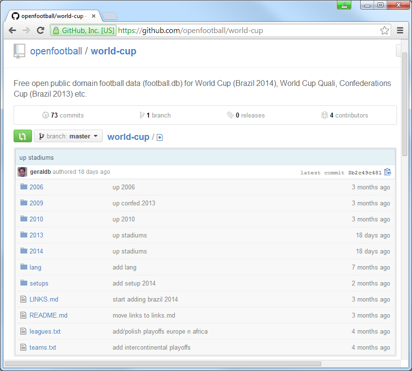
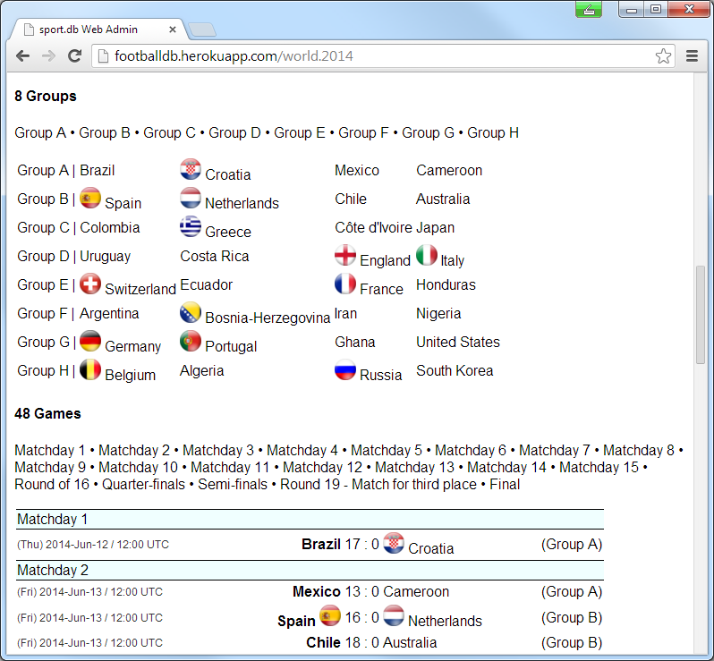
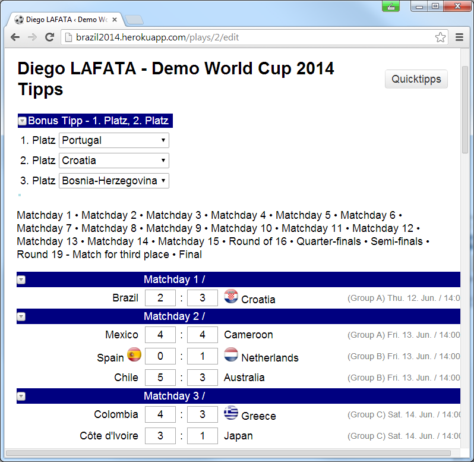

title:  Using Open Football Data - Get Ready for the World Cup in Brazil 2014 w/ Ruby

%css

pre {
  padding: 4px 4px 4px 4px;
  border-top: #bbb 1px solid;
  border-bottom: #bbb 1px solid;
  background: #f3f3f3;
}

%end

# Using Open Football Data - Get Ready for the World Cup in Brazil 2014 w/ Ruby

### Agenda

- The State of Open Data - World Cup in Brazil 2014
- Do-It-Yourself -- Let's Build `football.db` - Open Football Data
- Do-It-Yourself -- What Wiki Package to Use?
- Do-It-Yourself -- What Source Format to Use?
- Ruby, Ruby, Ruby -- `sportdb` Ruby Gem
- How to use `football.db` in Ruby - Models 
- How to use `football.db` with HTTP JSON(P) API
- More Goodies - Examples Web Apps and Books
- Bonus: License -- What is Public Domain?  Why Public Domain?
- Bonus: Beer? Wine? Alpine Ski? Formula 1?
- Bonus: How to use HTTP JSON API - `GET /beer/guinness`

# World Cup in Brazil 2014 - The World's Biggest (Sport) Event

When:

- 25 (match)days  -- 12 June - 13 July

Where:

- 12 cities  -- Rio de Janeiro, São Paulo, Brasília, Fortaleza,
  Belo Horizonte, Porto Alegre, Salvador, Recife,
  Cuiabá, Manaus, Natal, Curitiba

Teams:

- 32 teams --  Australia, Iran, Japan, South Korea,
   Algeria, Cameroon, Ghana, Ivory Coast, Nigeria,
   Costa Rica, Honduras, Mexico, United States,
   Argentina, Brazil, Chile, Colombia, Ecuador,
   Uruguay, Belgium, Bosnia and Herzegovina,
   Croatia, England, France, Germany,
   Greece, Italy, Netherlands, Portugal,
   Russia, Spain, Switzerland

Matches:

- 64 matches -- Groups stage (8x4): (Group A, Group B
   Group C, Group D, Group E, Group F, Group G
   Group H); Knockout stage: Round of 16, 
   Quarter-finals,
   Semi-finals,
   Third place match,
   Final

# The State of Open Data - World Cup in Brazil 2014

Q: Where can I get the teams, groups, match schedule (fixtures),
players, stadiums lets say in CSV, JSON or SQL?

Q: Where can I download lets say `world-cup-2014.db`?

Let's search (google):

- [`open data world cup brazil`](http://google.com/search?q=open+data+world+cup+brazil)  or
- [`json world cup brazil`](http://google.com/search?q=json+world+cup+brazil)

Nothing. Nada. Nichts. Niente. Zilch. Zero.

# The State of Open Data - World Cup in Brazil 2014 (Cont.)

### Official FIFA Site ([`fifa.com/worldcup`](http://www.fifa.com/worldcup))

=> No open data. Offers a booklet¹ (PDF) for download for match schedule.

¹) Single page, really w/ six FIFA Partners, eight FIFA World Cup Sponsors
and another six National Supporters.

### Wikipedia ([`en.wikipedia.org/wiki/2014_FIFA_World_Cup`](http://en.wikipedia.org/wiki/2014_FIFA_World_Cup))

Pro: Best source; open text license or public domain (license-free);
everything available for download (page dumps, etc).

Cons: Mostly free-form text, that is, no structured data and no web service. 

# What now? Options

1) Screen scrap FIFA site with web crawler? Why not?

2) Try to convert free-form text from Wikipedia into structured data? Why not?

3) Do-It-Yourself: Build a Wikipedia for structured data? Why not?

# Do-It-Yourself -- Let's Build `football.db` - Open Football Data

Q: What Wiki Package to Use?

MediaWiki? Semantic MediaWiki? MoinMoin? DokuWiki? PeanutButterWiki? Any Others?

Q: What Source Format to Use?

XML, JSON, YAML, SEXPS (S-Expressions), RDF Triplets,
CSV (Comma-Separated Values), TOML (Tom's Obvious, Minimal Language)? SQL? Any Others?

# Do-It-Yourself -- `github.com/openfootball`  (Cont.)

Q: What Wiki Package to Use?

A: Git (and GitHub)

Why Git?

- Distributed is the new centralized (everything is local, any workflow, many backups, and so on)
- Free and open source; small and fast version tracker

Learn more @ [`git-scm.com`](http://git-scm.com)

Why GitHub?

- Build <del>software</del> data better, together. 

Learn more @ [`github.com`](http://github.com)

# Do-It-Yourself -- What is CSV (Comma-Separated Values)?

Q: What Source Format to Use?

A: Keep it as simple as possible. Hand-crafted not machine-generated source.
Easy-to-read and easy-to-write.

<del>XML</del>, <del>JSON</del>, <del>YAML</del>, <del>SEXPS (S-Expressions)</del>,
<del>RDF Triplets</del>, <del>SQL</del>,
<del>TOML (Tom's Obvious, Minimal Language)</del>,
CSV (Comma-Separated Values)

`teams.csv`:

~~~
gre, Greece, GRE, gr
ned, Netherlands, NED, nl
ger, Germany, GER, de
por, Portugal, POR, pt
esp, Spain, ESP, es
ita, Italy, ITA, it
cro, Croatia, CRO, hr
eng, England, ENG, en
...
~~~

# Do-It-Yourself --- What's missing in CSV? What's CSV v2?

What's missing?

- No comments
- No blank lines
- No multi-line records
- No data types (or text patterns or field markers)
- No unordered fields (that is, fields depend on position) or variable number of fields per record
- No default/inherited values
- And much more

Let's fix it. Welcome CSV v2 ([`github.com/csv2`](https://github.com/csv2)).

[`south-america/br-brazil--stadiums.txt`](https://github.com/openfootball/stadiums/blob/master/south-america/br-brazil--stadiums.txt):

~~~
### Stadiums

[maracana]
  Maracanã|Estádio do Maracanã, 1950
  76_935
  Rio de Janeiro, RJ
  en.wikipedia: Estádio_do_Maracanã

[corinthians]
  Corinthians|Arena Corinthians|Arena de São Paulo, 2014
  68_000
  São Paulo, SP
  en.wikipedia: Arena_Corinthians

...
~~~

# Do-It-Yourself -- Mini Language for Football Fixtures

DSL - Domain-Specific Language 

[`world-cup/2014/cup.txt`](https://github.com/openfootball/world-cup/blob/master/2014--brazil/cup.txt):

~~~
##################################
#  World Cup 2014 Brazil

# -- Groups

Group A  |  Brazil       Croatia      Mexico         Cameroon
Group B  |  Spain        Netherlands  Chile          Australia
Group C  |  Colombia     Greece       Côte d'Ivoire  Japan
Group D  |  Uruguay      Costa Rica   England        Italy
Group E  |  Switzerland  Ecuador      France         Honduras
Group F  |  Argentina    Bosnia-Herzegovina  Iran    Nigeria
Group G  |  Germany      Portugal     Ghana          United States
Group H  |  Belgium      Algeria      Russia         South Korea

# -- Group A

Matchday 1 / Group A

(1) Thu Jun/12 17:00 Brazil - Croatia   @ Arena de São Paulo, São Paulo (UTC-3)

Matchday 2 / Group A

(2) Fri Jun/13 13:00 Mexico - Cameroon  @ Estádio das Dunas, Natal (UTC-3)
~~~

# Ruby, Ruby, Ruby -- `sportdb` Ruby Gem

Import any fixtures:

- "Classic" Comma-separated values
- "Modern" Comma-separated values v2
- Mini language for football

into any SQL database. Example:

Step 1: Get a copy of the data

~~~
$ git clone git://github.com/openmundi/world.db.git
$ git clone git://github.com/openfootball/world-cup.git
~~~

Step 2: Let's build the `world-cup-2014.db`

~~~
$ sportdb --dbname world-cup-2014.db setup --include ./world-cup --worldinclude ./world.db
~~~

That's it.

# How to use `football.db` in Ruby - Models 

Event Model

~~~
ev = Event.find_by( key: 'world.2014' )

ev.title
=> 'World Cup 2014'

ev.teams.count
=> 32

ev.games.count
=> 64

ev.rounds.count
=> 20

ev.groups.count
=> 8

ev.stadiums.count
=> 12
~~~

# How to use `football.db` in Ruby - Models (Cont.)

Team Model

~~~
bra = Team.find_by( key: 'bra' )

bra.title
=> 'Brazil'

bra.country.continent.title
=> 'South America'

bra.games.count
=> 3
~~~

# How to use `football.db` in Ruby - Models (Cont.)

Game Model

~~~
g = Game.find_by( pos: 1 )

g.team1.title
=> 'Brazil'

g.team2.title
=> 'Croatia'

f.group.title
=> 'Group A'

f.round.title
=> 'Matchday 1'

f.stadium.title
=> 'Arena de São Paulo'

f.stadium.city.title
=> 'São Paulo'
~~~

# How to use `football.db` in Ruby - Models (Cont.)

More Models

- Round  (e.g. Matchday 1, Round of 16, Final, etc.)
- Group  (e.g. Group A, Group B, etc.)
- League (e.g. World Cup, World Cup Quali, World Confed, etc.)
- Season (e.g. 2014, 2018, etc.)
- Person a.k.a. Player (e.g. Lionel Messi, Neymar Jr, etc.)
- Roster a.k.a. Team Squad (e.g. ARG-9 Lionel Messi, BRA-11 Neymar Jr, etc.)
- Ground a.k.a. Stadium (e.g. Estádio do Maracanã)
- And some more

# How to use `football.db` with HTTP JSON(P) API

~~~
$ sportdb serve
~~~

Use the `football.db` HTTP JSON(P) API - Examples

List all teams for an event (league+season) `/event/:key/teams`

- `/event/world.2014/teams`  | World Cup 2014
- `/event/de.2013_14/teams`  | Deutsche Bundesliga 2013/14

List all rounds for an event (league+season) `/event/:key/rounds`

- `/event/world.2014/rounds`  | World Cup 2014  
- `/event/de.2013_14/rounds`  | Deutsche Bundesliga 2013/14 

List all games in a round for an event (league+season) `/event/:key/round/:pos`

- `/event/world.2014/round/20` | World Cup 2014 - 20th Round (=> Final) 
- `/event/de.2013_14/round/5`  | Deutsche Bundesliga 2013/14 - 5th Round  

# How to use HTTP JSON API - `GET /event/world.2014/teams`

List all teams for an event `/event/:key/teams`

~~~
GET /event/world.2014/teams

{
  "event": {
    "key":   "world.2014",
    "title": "World Cup 2014"
  },
  "teams": [
    { "key": "gre", "title": "Greece", "code": "GRE" },
    { "key": "rus", "title": "Russia", "code": "RUS" },
    { "key": "ned", "title": "Netherlands", "code": "NED" },
    { "key": "ger", "title": "Germany", "code": "GER" },
    { "key": "por", "title": "Portugal","code": "POR" },
    ...
  ]
}
~~~

# How to use HTTP JSON API (Cont.) - `GET /event/world.2014/round/1`

List all games in a round for an event `/event/:key/round/:pos`

~~~
GET /event/world.2014/round/1

{
  "event": { "key": "world.2014", "title": "World Cup 2014" },
  "round": { "pos": 1, "title": "Matchday 1" },
  "games": [
    {
      "team1_key": "bra",
      "team1_title": "Brazil",
      "team1_code": "BRA",
      "team2_key": "cro",
      "team2_title": "Croatia",
      "team2_code": "CRO",
      "play_at": "2014/06/12",
      "score1": null,
      "score2": null,
      "score1ot": null,
      "score2ot": null,
      "score1p": null,
      "score2p": null
    }
  ]
}
~~~

# More Goodies - Examples Web Apps and Books

Any Example Web Apps?

- `sport.db.admim` - Open Source Rails Engine; see [`github.com/geraldb/sport.db.admin`](https://github.com/geraldb/sport.db.admin)

# More Goodies - Examples Web Apps and Books (Cont.)

Any Example Web Apps?

- Sportbook -  Football Betting (Prediction, Picks) Pool Manager; Open Source Rails Web App; see [`github.com/openbookie`](https://github.com/openbookie)

# More Goodies - Examples Web Apps and Books (Cont.)

Any Example Web Apps?

- `football.js` - Open Source JavaScript Matchday Widget - still early stage; see [`github.com/footballjs`](https://github.com/footballjs)
- The Free World Football Almanac - Free public domain e-book - still early stage; see [`github.com/openfootball/book`](https://github.com/openfootball/book)

Anything Else?

- Your App Here; Be Bold

# That's it. Thank you.

### Links 

- [github.com/openfootball](https://github.com/openfootball)

More Open Data Projects

- [github.com/openbeer](https://github.com/openbeer)
- [github.com/openwine](https://github.com/openwine)
- [github.com/openmundi](https://github.com/openmundi)

### Questions? Comments?

# Bonus: License -- What is Public Domain?  Why Public Domain?

## License

The `football.db` schema, data and scripts are dedicated to the public domain.
Use it as you please with no restrictions whatsoever.

## What?

No Copyright. No License. Creative Commons Zero (CC0). Unlicense. 

## Why?

Keep it simple. 

# Bonus:  Beer? Wine? Alpine Ski? Formula 1?

##  What's `beer.db`?

A free open public domain beer database n schema
for use in any (programming) language
(e.g. uses plain text fixtures/data sets). Example:

~~~
### Brewery

guinness, St. James's Gate Brewery / Guinness Brewery, 1759, Dublin
~~~

~~~
### Beer

Guinness|Guinness Draught, 4.2%, irish_dry_stout|dry_stout|stout
~~~

# Bonus: How to use HTTP JSON API - `GET /beer/guinness`

Get beer by key `/beer/:key`

~~~
GET /beer/guinness

{
  "beer":
  {
    "key":"guinness",
    "title":"Guinness",
    "synonyms": "Guinness Draught",
    "abv":"4.2",
    "srm":null,
    "og":null,
    "tags":["irish_dry_stout","dry_stout","stout"],
    "brewery":
    {
      "key": "guinness",
      "title": "St. James's Gate Brewery / Guinness Brewery"
    },
    "country":
    {
      "key":"ie",
      "title":"Irland"
    }
  }
}
~~~
