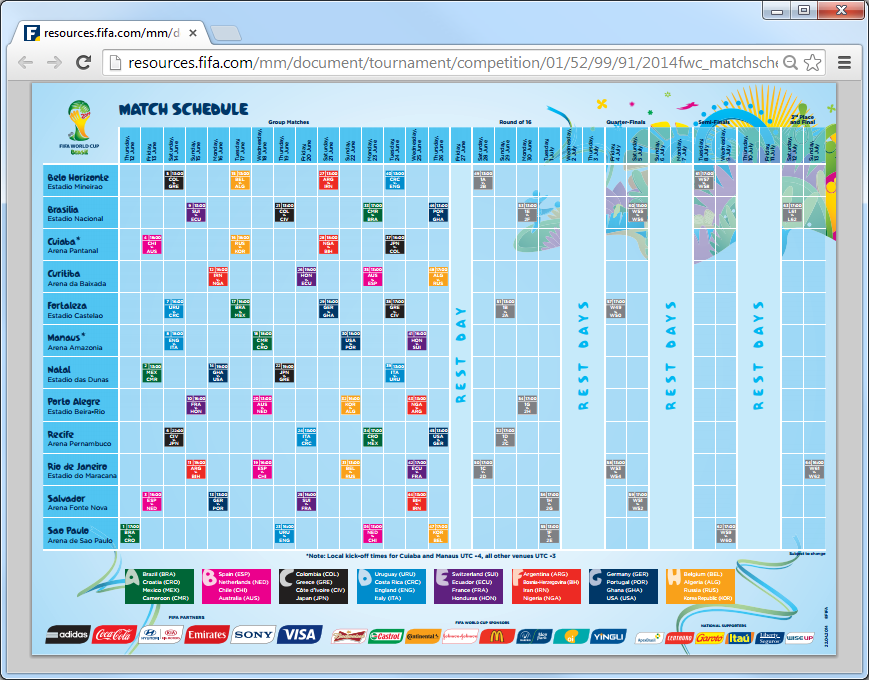
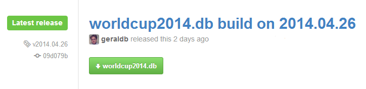
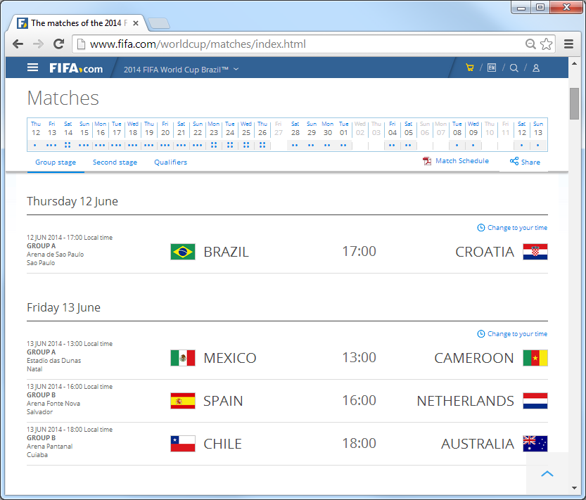
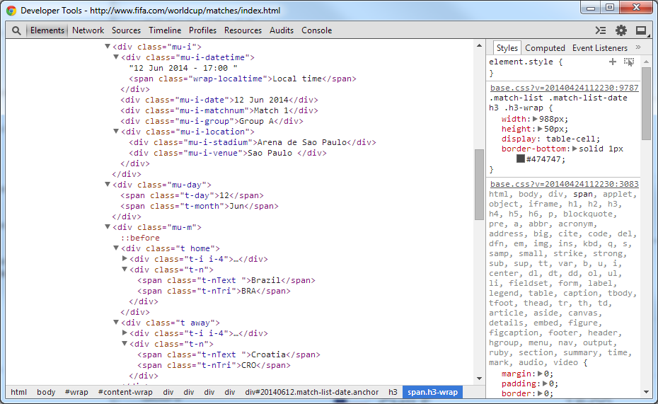

title:  Using Open Football Data - Get Ready for the World Cup in Brazil 2014 w/ JavaScript

%css

pre {
  padding: 4px 4px 4px 4px;
  border-top: #bbb 1px solid;
  border-bottom: #bbb 1px solid;
  background: #f3f3f3;
}

%end

# Using Open Football Data - Get Ready for the World Cup in Brazil 2014 w/ JavaScript

### Agenda

Let's Build A World Cup Widget in JavaScript

- Part I: Basics
    - World Cup in Brazil 2014 - The World's Biggest (Sport) Event
    - Let's Use an HTTP JSON API
    - What's `football.db?`
    - What's Open Data? - Terms of Use
        - Public Domain. No Rights Reserved. vs. © FIFA 2014. All Rights Reserved.
    - What's Structured Data?
        - Ex. FIFA - Free-Form Text vs. Structured Data
        - Ex. Wikipedia - Free-Form Text vs. Structured Data
        - Football Match Schedule Mini Language - New Structured Data Format Example
- Part II: Code, Code, Code
    - Matchday Widget Example - `footballdb.widget.js` - v1.0
    - Matchday Widget Example - `footballdb.widget.js` - v2.0
    - Web Components Machinery - New Web Standard Building Blocks
    - Matchday Widget Example - `<football-js>` - v3.0

# World Cup in Brazil 2014 - The World's Biggest (Sport) Event

When: 12 June - 13 July; Starts in:

## 43 days 3 hours 15 minutes

What:

## 32 teams 64 matches 25 matchdays 12 cities

- 32 teams --  Australia, Iran, Japan, South Korea,
    Algeria, Cameroon, Ghana, Ivory Coast, Nigeria,
    Costa Rica, Honduras, Mexico, United States,
    Argentina, Brazil, Chile, Colombia, Ecuador,
    Uruguay, Belgium, Bosnia and Herzegovina,
    Croatia, England, France, Germany,
    Greece, Italy, Netherlands, Portugal,
    Russia, Spain, Switzerland

- 12 cities  -- Rio de Janeiro, São Paulo, Brasília, Fortaleza,
    Belo Horizonte, Porto Alegre, Salvador, Recife,
    Cuiabá, Manaus, Natal, Curitiba

# Let's Build A World Cup Widget in JavaScript

First let's use an HTTP JSON API. Example:

~~~
GET /event/world.2014/teams

{
  "event": {
    "key":   "world.2014", "title": "World Cup 2014"
  },
  "teams": [
    { "key": "gre", "title": "Greece",      "code": "GRE" },
    { "key": "ned", "title": "Netherlands", "code": "NED" },
    { "key": "ger", "title": "Germany",     "code": "GER" },
    { "key": "por", "title": "Portugal",    "code": "POR" },
    ...
  ]
}
~~~

Let's ask the intertubes (let's google [`json world cup brazil`](http://www.google.com/search?q=json+world+cup+brazil)
or post a question on the open data
stackexchange ['Any Open Data Sets for the (Football) World Cup (in Brazil 2014)?'](http://opendata.stackexchange.com/questions/1791/any-open-data-sets-for-the-football-world-cup-in-brazil-2014)).

Nothing. Nada. Nichts. Niente. Zilch. Zero.

# What's `football.db?`

- Public domain football data sets offering free open football data
for the World Cup in Brazil 2014 and more.

- Free self-hosted HTTP JSON API service for football data, for example:
   - Step 1: Download the `worldcup2014.db` SQLite Database
   - Step 2: Serve up teams, rounds, matches, etc. via HTTP JSON API using the
     `sportdb` command line tool

~~~
$ sportdb serve
~~~

Services available include:

- `/event/world.2014/teams`    -- List all teams
- `/event/world.2014/rounds`   -- List all rounds (matchdays)
- `/event/world.2014/round/20` -- List all matches in a round e.g. - 20th Round (=> Final) 

~~~
GET /event/world.2014/round/1

{
  "event": { "key": "world.2014", "title": "World Cup 2014" },
  "round": { "pos": 1, "title": "Matchday 1" },
  "games": [
    {
      "team1_key": "bra",
      "team1_title": "Brazil",
      "team1_code": "BRA",
      "team2_key": "cro",
      "team2_title": "Croatia",
      "team2_code": "CRO",
      "play_at": "2014/06/12",
      "score1": null,
      "score2": null,
      "score1ot": null,
      "score2ot": null,
      "score1p": null,
      "score2p": null
    }
  ]
}
~~~

# Basics - What's Open Data? - Terms of Use

Open (Free) Data   <=>  Copyright © FIFA 2014. All Rights Reserved.

Example 1:

- A Free One-Page Booklet (PDF) Download for the Match Schedule from [`fifa.com`](http://fifa.com/worldcup/matches).
    - Copyright © FIFA 2014. All Rights Reserved.

# Basics - What's Open Data? - Terms of Use (Cont.)

Open (Free) Data    <=>   Copyright © FIFA 2014. All Rights Reserved.

Example 2:

- A Free SQLite DB Download for the Match Schedule from [`github.com/openfootball`](https://github.com/openfootball/build/releases).
    - Public Domain (No Copyright. No License. No Rights Reserved.) 

Q: Best "License" for Open Data?

A: Public Domain¹ (No License. No Copyright. No Rights Reserved.)

Q: Why?

A: Keep it simple².

\____________    
¹ Also sometimes "rebranded" or known as Creative Commons Zero (CC0) or Unlicense.    
² Full "License" Text Example: The data, schema n scripts are dedicated to the public domain. Use it as you please with no restrictions whatsoever.

# Basics - What's Structured Data? Ex. FIFA Web Page

Structured Data <=> Free-Style Text

Example 1:

- Match Schedule on FIFA Website

# Basics - What's Structured Data?  Ex. FIFA Web Page (Cont.)

Structured Data <=> Free-Style Text

Example 1:

- Match Schedule on FIFA Website
    - Show Source (Try Screen Scrapping Document Object Model Tree? Why? Why Not?)

# Basics - What's Structured Data?  Ex. Wikipedia

Structured Data <=> Free-Style Text

Example 2:

- Match Schedule on Wikipedia

# Basics - What's Structured Data?  Ex. Wikipedia (Cont.)

Structured Data <=> Free-Style Text

Example 2:

- Match Schedule on Wikipedia
    - Show Source (Try Scrapping Free-Style Text? Why? Why Not?)

Cut-n-Paste Text:

~~~
12 June 2014  17:00   Brazil    Match 1   Croatia    Arena de São Paulo, São Paulo
13 June 2014  13:00   Mexico    Match 2   Cameroon   Arena das Dunas, Natal
17 June 2014  16:00   Brazil    Match 17  Mexico     Estádio Castelão, Fortaleza
18 June 2014  19:00   Cameroon  Match 18  Croatia    Arena Amazônia, Manaus
23 June 2014  17:00   Cameroon  Match 33  Brazil     Estádio Nacional Mané Garrincha, Brasília
23 June 2014  17:00   Croatia   Match 34  Mexico     Arena Pernambuco, Recife
~~~

Wikipedia Source:

~~~
===Group A===
{{{{main|2014 FIFA World Cup Group A}}}}
{{{{Fb cl2 header navbar}}}}
{{{{Fb cl2 team |t={{{{fb|BRA}}}} |w=0 |d=0 |l=0 |gf=0 |ga=0 |bc=}}}}
{{{{Fb cl2 team |t={{{{fb|CRO}}}} |w=0 |d=0 |l=0 |gf=0 |ga=0 |bc=|border=green}}}}
{{{{Fb cl2 team |t={{{{fb|MEX}}}} |w=0 |d=0 |l=0 |gf=0 |ga=0 |bc=}}}}
{{{{Fb cl2 team |t={{{{fb|CMR}}}} |w=0 |d=0 |l=0 |gf=0 |ga=0 |bc=}}}}
|}

{{{{Football box
|date=12 June 2014
|time=17:00
|team1={{{{fb-rt|BRA}}}}
|score=[[2014 FIFA World Cup Group A#Brazil v Croatia|Match 1]]
|report=
|team2={{{{fb|CRO}}}}
|goals1=
|goals2=
|stadium=[[Arena Corinthians|Arena de São Paulo]], [[São Paulo]]
|attendance=
|referee=
}}}}
{{{{Football box
|date=13 June 2014
|time=13:00
|team1={{{{fb-rt|MEX}}}}
|score=[[2014 FIFA World Cup Group A#Mexico v Cameroon|Match 2]]
|report=
|team2={{{{fb|CMR}}}}
|goals1=
|goals2=
|stadium=[[Arena das Dunas]], [[Natal, Rio Grande do Norte|Natal]]
|attendance=
|referee=
}}}}
~~~

# Basics - What's Structured Data?  - "Classic" Format Options

Structured Data <=> Free-Style Text

"Classic" Structured Data Formats:

- JSON (Yeah!)
- CSV - Comma-Separated Values
- SQL
- XML
- YAML
- RDF Triplets
- and others

# Basics - What's Structured Data? - "New" Format Options

Structured Data <=> Free-Style Text

but also

"New" Structured Data Formats:

- DSLs (Domain-Specific Languages),
    - that is, Mini Languages for Structured Data

Example - Open Football Match Schedule Language:

~~~
(1) Thu Jun/12 17:00   Brazil - Croatia    @ Arena de São Paulo, São Paulo (UTC-3)
(2) Fri Jun/13 13:00   Mexico - Cameroon   @ Estádio das Dunas, Natal (UTC-3)
~~~

(Source:  [world-cup/2014/cup.txt](https://github.com/openfootball/world-cup/blob/master/2014--brazil/cup.txt))

Q: Why? Why invent yet another data format? Why?

A: Best of both worlds, that is, 1) looks n feels like free-form plain text - easy-to-read and
easy-to-write - 2) but offers a 100-% data accuracy guarantee (when loading
into SQL tables, for example).

# Basics - What's Structured Data? - "New" Format Options

Mini Languages for Structured Data 

Example - Open Football Match Schedule Language:

~~~
############################
# World Cup 2014 Brazil

Group A  |  Brazil       Croatia              Mexico         Cameroon
Group B  |  Spain        Netherlands          Chile          Australia
Group C  |  Colombia     Greece               Côte d'Ivoire  Japan
Group D  |  Uruguay      Costa Rica           England        Italy
Group E  |  Switzerland  Ecuador              France         Honduras
Group F  |  Argentina    Bosnia-Herzegovina   Iran           Nigeria
Group G  |  Germany      Portugal             Ghana          United States
Group H  |  Belgium      Algeria              Russia         South Korea

Matchday 1  |  Thu Jun/12
Matchday 2  |  Fri Jun/13
Matchday 3  |  Sat Jun/14
...

(16) Round of 16            |  Sat Jun/28 - Tue Jul/1
(17) Quarter-finals         |  Fri Jul/4 - Sat Jul/5
(18) Semi-finals            |  Tue Jul/8 - Wed Jul/9
(19) Match for third place  |  Sat Jul/12
(20) Final                  |  Sun Jul/13

Group A:

(1) Thu Jun/12 17:00   Brazil - Croatia       @ Arena de São Paulo, São Paulo (UTC-3)
(2) Fri Jun/13 13:00   Mexico - Cameroon      @ Estádio das Dunas, Natal (UTC-3)

(17) Tue Jun/17 16:00   Brazil - Mexico        @ Estádio Castelão, Fortaleza (UTC-3)
(18) Wed Jun/18 18:00   Cameroon - Croatia     @ Arena Amazônia, Manaus (UTC-4)

(33) Mon Jun/23 17:00   Cameroon - Brazil      @ Brasília (UTC-3)
(34) Mon Jun/23 17:00   Croatia  - Mexico      @ Recife (UTC-3)

Group B:

(3) Fri Jun/13 16:00   Spain - Netherlands     @ Arena Fonte Nova, Salvador (UTC-3)
(4) Fri Jun/13 18:00   Chile - Australia       @ Arena Pantanal, Cuiabá (UTC-4)

(19) Wed Jun/18 16:00   Spain - Chile             @ Estádio do Maracanã, Rio de Janeiro (UTC-3)
(20) Wed Jun/18 13:00   Australia - Netherlands   @ Estádio Beira-Rio, Porto Alegre (UTC-3)

(35) Mon Jun/23 13:00   Australia - Spain         @ Curitiba (UTC-3)
(36) Mon Jun/23 13:00   Netherlands - Chile       @ São Paulo (UTC-3)
...
~~~

(Source: [world-cup/2014/cup.txt](https://github.com/openfootball/world-cup/blob/master/2014--brazil/cup.txt))

# More Basics - Terms of Use (Cont.)

- Web 3.0, 4.0               <=>   Web 1.0, 2.0
- Giant Global Graph (GGG)   <=>   World Wide Web (WWW)
- Semantic Web               <=>   Linked Data
- Ontologies                 <=>   Models n Schemas
- Taxonomies                 <=>   Folksonomies
- RDF Triplet Stores         <=>   SQL DBs
- SPARQL Queries             <=>   SQL Queries
- Big Data                   <=>   Micro Data

## Just Kidding. Let's Dive into Code. Code. Code.

#  Matchday Widget Example -  `footballdb.widget.js`

Use like:

~~~

~~~

\_________________________    
¹ - selector id for div    
² - event key for world cup in brazil 2014   
³ - round 2 (e.g. matchday 2); round 20 (e.g. final)

Results in:

~~~
World Cup 2014 - Matchday 2

2014/06/13 | Mexico (MEX) - Cameroon (CMR)
2014/06/13 | Spain (ESP)  - Netherlands (NED)
2014/06/13 | Chile (CHI)  - Australia (AUS)
~~~

(Live: [footballjs.github.io/starter](http://footballjs.github.io/starter/matchday.html))

#  Matchday Widget Example -  `footballdb.widget.js` - Source

~~~
var footballdb_widget_new = function( widget_id, api_path_prefix ) {
  
  var _api_path_prefix = '';
  var _$widget;
  
  function _init( widget_id, api_path_prefix )
  {
    _api_path_prefix = api_path_prefix;
    _$widget  = $( widget_id );
  }

  function _update( event_key, round_pos )
  {
    var api_link = _api_path_prefix + "/event/" + event_key + "/round/" + round_pos; 
    
    $.getJSON( api_link, function(json) {
    
      var snippet = "";  // build up a hypertext (html) snippet to add/append
  
      snippet += "<h3>";
      snippet += json.event.title;
      snippet += " - ";
      snippet += json.round.title;
      snippet += "</h3>";
  
      snippet += "<ul>";
  
      $.each( json.games, function( index, game ) {
        snippet += "<li>";
        snippet += game.play_at + " | ";
        snippet += game.team1_title + " (" + game.team1_code +")";

       if( game.score1 != null && game.score2 != null ) {
         if( game.score1et != null && game.score2et != null ) {
           if ( game.score1p != null && game.score2p != null ) {
             snippet += " " + game.score1p + "-" + game.score2p + " pen /";
           }
           snippet += " " + game.score1et + "-" + game.score2et + " a.e.t. /";
         }
         snippet += " " + game.score1 + "-" + game.score2;
      }
      else
        snippet += " - ";
      
      snippet += " " + game.team2_title + " (" + game.team2_code +")";
      snippet += "</li>";
    });

    snippet += "</ul>";
  
    _$widget.html( snippet );
    });  // getJSON
  }  // fn _update

  // call c'tor/constructor
  _init( widget_id, api_path_prefix );

  // return/export public api
  return {
     update: _update
  }
  
} // fn football_widget_new
~~~

(Source: [github.com/footballjs/starter](https://github.com/footballjs/starter))

#  Matchday Widget Example -  `footballdb.widget.js` - v2.0

- Let's use templates (w/ `underscore.js`)
- Let's use modules (w/ `require.js`)
- Let's use a `football.db` JSON API module / wrapper

#  Matchday Widget Example -  `footballdb.widget.js` - v2.0 - Templates

`templates/events.html`:

~~~
<h3>
 <%%= event.title %>
   -  
 <%%= round.title %>
</h3>
~~~

`templates/games.html`:

~~~
<table>
 <%% _.each( games, function( game, index ) { %>
  <tr>
    <td>
      <%%= game.play_at %>
     </td>
     <td style='text-align: right;'>
       <%%= game.team1_title %> (<%%= game.team1_code %>)
     </td>

     <td>
      <%% if( game.score1 != null && game.score2 != null ) { %>
        <%% if( game.score1ot != null && game.score2ot != null ) { %>
          <%% if ( game.score1p != null && game.score2p != null ) { %>
             <%%= game.score1p %> - <%%= game.score2p %> pen /
          <%% } %>
           <%%= game.score1ot %> - <%%= game.score2ot %> a.e.t. /
        <%% } %>
        <%%= game.score1 %> - <%%= game.score2 %>
      <%% } else { %>
        - 
      <%% } %>
     </td>
     <td>
      <%%= game.team2_title %> (<%%= game.team2_code %>)
     </td>
   </tr>
  <%% }); %>
</table>
~~~

#  Matchday Widget Example -  `footballdb.widget.js` - v2.0 - Modules

Modules w/ `require.js`:

~~~
football/api.js
football/widget.js
football/templates/event.html
football/templates/games.html
football/templates/rounds.html
~~~

Template Usage in JavaScript (w/ `require.js` and `underscore.js`):

~~~
var gamesTpl     = require( 'text!football/templates/games.html' );
var renderGames  = _.template( gamesTpl );    // returns a fn for reuse
...
$games.html(  renderGames( { games: data.games } ) );
~~~

`football/widget.js`:

~~~
define( function(require) {

            require( 'utils' );
  var Api = require( 'football/api' );

  var eventTpl   = require( 'text!football/templates/event.html' ),
      roundsTpl  = require( 'text!football/templates/rounds.html' ),
      gamesTpl   = require( 'text!football/templates/games.html' );

  var renderEvent  = _.template( eventTpl ),
      renderRounds = _.template( roundsTpl ),
      renderGames  = _.template( gamesTpl );

  var Widget = {};

Widget.create = function( id, opts ) {

  var $el,
      $event,    // used for event header 
      $rounds,   // used for rounds
      $games;    // used for round details (matches/games)
  ...
~~~

#  Matchday Widget Example -  `footballdb.widget.js` - v2.0 - API Wrapper Module

`football/api.js`:

~~~
define( function() {
  
  var Api = {};

Api.create = function( opts ) {

  var defaults = { baseUrl: 'http://footballdb.herokuapp.com/api/v1' };
  var settings;

  function init( opts )  {
    settings = _.extend( {}, defaults, opts );
  }

  function fetch( path, onsuccess )  {
    var url = settings.baseUrl + path + '?callback=?';
    $.getJSON( url, onsuccess );
  }

  function fetchRounds( event, onsuccess )  {
    fetch( '/event/' + event + '/rounds', onsuccess );
  }

  function fetchRound( event, round, onsuccess ) {
    fetch( '/event/' + event + '/round/' + round, onsuccess );
  }

  init( opts ); // call "c'tor/constructor"

  // return/export public api
  return {
     fetchRound:        fetchRound,
     fetchRounds:       fetchRounds,
  }
} // end fn Api.create

  return Api;

}); // end define
~~~

# Matchday Widget Example - `<football-js>` - v3.0

- Let's build our own tag / element / web component. Example: `<football-js event='world.2014'></football-js>`

The old way in JavaScript. Usage Example:

~~~

~~~

The new way:

~~~
<link rel='import' href='football-js.html'>     <!-- HTML Imports -->

<football-js event='world.2014'></football-js>  <!-- custom tag use -->
~~~

# Web Components Machinery - New Web Standard Building Blocks

What's X-Tag? What's Polymer?

- **X-Tag**  ([`x-tags.org`](http://www.x-tags.org))- JavaScript library by Mozilla - lets you use and build custom tags for all modern browsers
- **Polymer** ([`polymer-project.org`](http://www.polymer-project.org)) - JavaScript Library by Google - lets you use and build custom tags for all modern browsers

New Web Standard Building Blocks

- **Custom Elements**          --  (`<element>`) - [W3C Spec](http://www.w3.org/TR/custom-elements/)
- **Shadow DOM**               --  (hide DOM subtrees under shadow roots - `createShadowRoot()`) - [W3C Spec](http://www.w3.org/TR/shadow-dom/)
- **HTML Imports**             --  (include and reuse HTML documents) - [W3C Spec](http://www.w3.org/TR/html-imports/)
- **HTML Templates**           --  (`<template>`) - [W3C Spec](http://www.w3.org/TR/html-templates/)
- **MDV (Model Driven Views)** --  (`repeat='{{{{ greetings }}}}'`) - JavaScript Library

# Matchday Widget Example - `<football-js>` - v3.0 (Cont.)

`football-js.html`:

~~~
<polymer-element name='football-js' attributes='event'>
  <template>
     
     ... [your (model-driven) views here] ...
  </template>
  
</polymer-element>
~~~

MDV (Model Driven Views):

~~~
<template>
  

    <h3>
      {{{{ data.event.title }}}}  -  {{{{ data.round.title }}}}
    </h3>

   <table>
   <template repeat='{{{{data.games}}}}'>
   <tr>
    <td>
      {{{{ play_at }}}}
     </td>
     <td>
       {{{{ team1_title }}}} ({{{{ team1_code }}}})
     </td>

     <td>
       {{{{ score1 }}}} - {{{{ score2 }}}}
     </td>
     <td>
      {{{{ team2_title }}}} ({{{{ team2_code }}}})
     </td>
   </tr>
   </template>
   </table>  
</template>
~~~

# Matchday Widget Example - `<football-js>` - v3.0

Usage:

~~~
<!DOCTYPE html>
<html>
  <head>
    <meta charset='utf-8'>
    <title>football.js</title>
    
    <link rel='import' href='football-js.html'>
  </head>
  <body>
    <football-js event='world.2014'></football-js>
  </body>
</html>
~~~

(Live: [footballjs.github.io/football.html/index.html](http://footballjs.github.io/football.html/index.html))

# That's it. Thank you.

### Links 

- [github.com/openfootball](https://github.com/openfootball)

More Open Data Projects

- [github.com/openbeer](https://github.com/openbeer)
- [github.com/openwine](https://github.com/openwine)
- [github.com/openmundi](https://github.com/openmundi)

### Questions? Comments?

# Bonus:  Beer? Wine? Formula 1? Alpine Ski?

##  What's `beer.db`?

A free open public domain beer database n schema
for use in any (programming) language
(e.g. uses plain text fixtures/data sets). Example:

~~~
### Brewery

guinness, St. James's Gate Brewery / Guinness Brewery, 1759, Dublin
~~~

~~~
### Beer

Guinness|Guinness Draught, 4.2%, irish_dry_stout|dry_stout|stout
~~~

# Bonus: How to use the HTTP JSON API - `GET /beer/guinness`

Get beer by key `/beer/:key`

~~~
GET /beer/guinness

{
  "beer":
  {
    "key":"guinness",
    "title":"Guinness",
    "synonyms": "Guinness Draught",
    "abv":"4.2",
    "srm":null,
    "og":null,
    "tags":["irish_dry_stout","dry_stout","stout"],
    "brewery":
    {
      "key": "guinness",
      "title": "St. James's Gate Brewery / Guinness Brewery"
    },
    "country":
    {
      "key":"ie",
      "title":"Irland"
    }
  }
}
~~~

