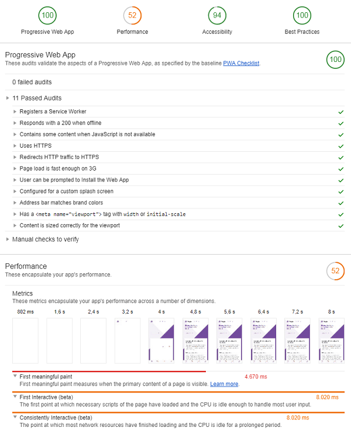
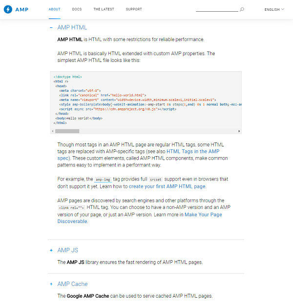
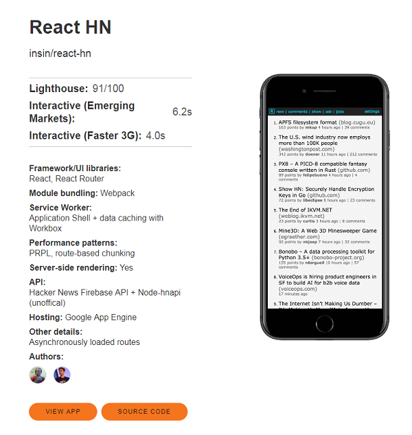

title: Progressive Web Apps (PWA) and Lighthouse


# Agenda

- How many computers in the world today?
- How many mobile apps in the world?
- The (Mobile) Web is Dead! Native Apps Rule!
  - What's Wrong with (Mobile) Web Apps?
  - Mobile Web Development History
    - Responsive Web Design
    - Mobile First Design
    - Offline First Design (with Progressive Web Apps)
- What's Progressive? What are Progressive Web Apps (PWA)?
- What's PageSpeed? Analyze your Page Speed (Performance)
- What's Lighthouse?
- Aside/Excursion: What's Accelerated Mobile Pages (AMP)?
- Progressive Web Apps - Offline, Offline, Offline
  - Service Workers - Registration Example
  - Service Workers - Cache Example
  - Service Workers Cookbook
- Progressive Web Apps - Yes, Install the Web App on Your Home Screen
  - manifest.json - The Web App Manifest
- Hacker News Readers as Progressive Web Apps
- Future of Mobile (Web) Development - Native vs Web


# Icebreaker

Q: How many computers in the world today?


# What's the markert share of Windows? In the Old "Desktop" World

| Name              |   %    |
|-------------------|--------|
| Microsoft Windows | ~ 90%  |
| Apple Mac OS X    | ~ 6%   |
| Linux             | ~ 3%   |
| Other             | ~ 1%   |

# What's the markert share of Android? In the New "Mobile" World

| Name                 |  %     |
|----------------------|--------|
| Android (on Linux)	 | ~ 70%  |
| Apple iOS	           | ~ 25%  |
| Other                | ~  5%  |


# How many computers in the world?

| Type             | Numbers                   |                                      |
| -----------------|---------------------------|--------------------------------------|
| Mainframes       | ~ 100k (100 000)          |                                      |
| Workstations     | ~ 10m (10 000 000)        |                                      |
| PCs              | ~ 1.5bn  (1 500 000 000)  | selling ~ 200m+ (200 000 000+)/year  |
| Mobile           | ~ 5bn+ (5 000 000 000)    | selling ~ 1bn+ (1 000 000 000+)/year |

**The future is... mobile!**


# How many mobile apps in the world?

- Native Apps?  (See the [Apple App Store](https://itunes.apple.com/genre/ios/id36), [Google Play Store](https://play.google.com/store/apps), etc.)
- Web Apps?
- Hybrid?


# The (Mobile) Web is Dead! Native Apps Rule!

How many (native) apps have you installed (on your phone)?

How many (web) apps have you installed (on your phone)?  Zero? Anyone?


# What's Wrong with (Mobile) Web Apps?

One Web Vison but

Mobile Web <=> Desktop Web

e.g. Offline, Unreliable Slow Connections,
Less Processing Power, Battery Life Matters,
Size Matters (Small is Beautiful),
Touch is the new Click,
etc.


# Mobile Web Development History

- Responsive Web Design

Design your web app / site for different layouts / sizes
e.g. 320px for phone (small), 760px for tables (medium), 1000+ px (large).

Great idea. But NOT enough. Try harder!


# Mobile Web Development History (Cont.)

Why? Slow. Slow. Slow.

Responsive Design is NOT optimized for Mobile.

What's Next? **Mobile First Design**

Great idea. But NOT enough. Try harder!


# Mobile Web Development History (Cont.)

Why? Again Slow. Slow. Slow.

Mobile Design is NOT optimized for offline / unreliable connections.

What's Next? **Offline First Design (with Progressive Web Apps)**


# What's Progressive? What are Progressive Web Apps (PWA)?

Progressive Web Apps  

- Reliable
  - Load instantly (no white blank screens while loading... waiting seconds, seconds, ...), can handle slow unreliable connections and offline
- Fast
  - Respond quickly to user touches (with smooth scrolling and animations)
- Engaging
  - Feels like a natural (native) app on the phone

(Source: [developers.google.com/web/progressive-web-apps](https://developers.google.com/web/progressive-web-apps))


# What's Lighthouse?

Lighthouse - a browser tool for checking the quality of your Progressive Web Apps
(mostly about speed, speed, speed).




# What's PageSpeed? Analyze your Page Speed (Performance)

Remember Ye Goode Olde PageSpeed? Let's try it:

No longer available as a browser plugin, only
a online service @ [developers.google.com/speed/pagespeed](https://developers.google.com/speed/pagespeed/).

What's missing?

Again NOT helping with mobile or offline / unreliable connections.


# What's Lighthouse?

Let's try it. Open up the developer tools in Chrome and select the Audit tab
(note: requires Chrome 60+).

New key performance indicators (KPIs) ;-)


**First meaningful paint**  <3s

First meaningful paint measures when the primary content of a page is visible.

Basically, how many seconds you see a blank white screen on startup.

**First Interactive**  <5s

The first point at which necessary scripts of the page have loaded
and the CPU is idle enough to handle most user input.

Basically, how many seconds until you can click or scroll etc, that, is
how many seconds your app is frozen on startup.


# What's Lighthouse?  Inline Spaghetti Hairball is the new Web Architecture

**Reduce render-blocking scripts**

Script elements are blocking the first paint of your page.
Consider inlining critical scripts and deferring non-critical ones.

**Reduce render-blocking stylesheets**

Link elements are blocking the first paint of your page.
Consider inlining critical links and deferring non-critical ones.


# Aside/Excursion: What's Accelerated Mobile Pages (AMP)?

Basically, everything is inline (css) or pre-cached (javascript) plus
pre-built web components (html tags) for picture gallery, for example, and more.

Why? Speed. Speed. Speed. Easy to cache. (Super)fast to load.

See [ampproject.org](https://ampproject.org).




# Progressive Web Apps - Offline, Offline, Offline

Q: What if you had a (backup) web (application) server inside your browser?

A: Let's welcome... Service Workers!


# Service Workers  - Registration Example

``` js
function registerServiceWorker() {
  // register sw script in supporting browsers
  if ('serviceWorker' in navigator) {
    navigator.serviceWorker.register('turbo.js', { scope: '/' }).then(() => {
      console.log('Service Worker registered successfully.');
    }).catch(error => {
      console.log('Service Worker registration failed:', error);
    });
  }
}
```

# Service Workers  - Cache Example

``` js
// sw.js
self.addEventListener('install', e => {
 e.waitUntil(
   // after the service worker is installed,
   // open a new cache
   caches.open('turbo-cache').then(cache => {
     // add all URLs of resources we want to cache
     return cache.addAll([
       '/',
       '/index.html',
       '/about.html',
       '/images/logo.png',
       '/style.min.css',
       '/js/bundle.min.js',
     ]);
   })
 );
});
```


# Service Workers Cookbook

Free Online Recipes / How-Tos e.g.:

- Caching
  - Cache only
  - Cache and update
  - Cache, update and refresh
  - Embedded fallback
- Web Push
  - Push Payload
  - Push Rich
  - Push Simple
  - Push and Retrieve Payload
  - Push Tag
  - Push Quota
  - Push Clients
  - Push Subscription  
- Offline
  - Offline Status
  - Offline Fallback
  - JSON Cache
- Beyond Offline
  - Virtual Server
  - API Analytics
  - Load balancer
  - Cache from ZIP
  - Dependency Injection
  - Request Deferrer
- Performance
  - Cache then Network
  - Render Store
- And more!

See [serviceworke.rs](https://serviceworke.rs).


# Progressive Web Apps - Yes, Install the Web App on Your Home Screen

Did you know? You can install progressive web app
on your home screen (like native apps).
No app store required! Back to the future.
Distributed is the new centralized :-)


# manifest.json - The Web App Manifest

In the html page head:

``` html
<link rel="manifest" href="manifest.json">
```

And the manifest itself in JavaScript Object Notation (JSON):

``` json
{
  "lang": "en",
  "name": "Hello Progessive Web App (PWA)",
  "short_name": "Hello App",
  "icons": [
    {
      "src": "/assets/images/touch/android-chrome-192x192.png",
      "sizes": "192x192",
      "type": "image/png"
    }
  ],
  "theme_color": "#1a1a1a",
  "background_color": "#1a1a1a",
  "start_url": "/",
  "display": "standalone",
  "orientation": "natural"
}
```


# Hacker News Readers as Progressive Web Apps

- Frameworks, Frameworks, Frameworks - What JavaScript Frameworks?

- Libraries, Libraries, Libraries - What JavaScript Libraries?

Many many options.

One app (Hacker News Reader). Many live open source samples.

See [hnpwa.com](https://hnpwa.com)




# Future of Mobile (Web) Development - Native vs Web

**And the Winner is... React Native!?**

Did you know? React Native ★53 662 (github: [facebook/react-native](https://github.com/facebook/react-native))
is getting more popular than native app development?

Best of both worlds? Build your apps in JavaScript with HTML-like tags, but
it's all native! Speed, Speed, Speed. It's a native app because it's a native app
(that is, NOT using a browser view for rendering, for example).


Example:

``` js
import React, { Component } from 'react';
import { Image, ScrollView, Text } from 'react-native';

class AwkwardScrollingImageWithText extends Component {
  render() {
    return (
      <ScrollView>
        <Image source={{uri: 'https://i.chzbgr.com/full/7345954048/h7E2C65F9/'}} />
        <Text>
          On iOS, a React Native ScrollView uses a native UIScrollView.
          On Android, it uses a native ScrollView.

          On iOS, a React Native Image uses a native UIImageView.
          On Android, it uses a native ImageView.

          React Native wraps the fundamental native components, giving you
          the performance of a native app, plus the clean design of React.
        </Text>
      </ScrollView>
    );
  }
}
```
