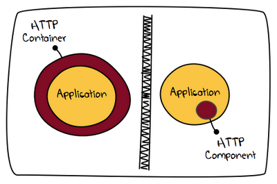
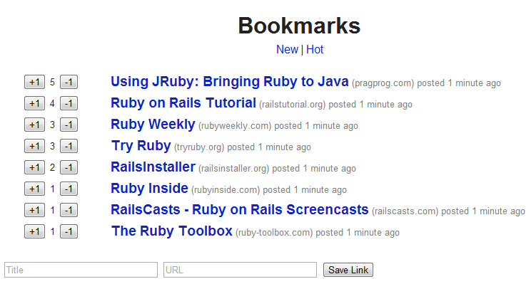

title: Keep it Simple -  Embedded Jetty, Embedded SQLite, Embedded Ruby


%css

pre {
        background-color: azure;
        padding: 5px;
    }

%end


# Ice Breakers

* Friends of Ruby (Rails)? - Anyone?

* Friends of Server-Side JavaScript (Node.js) - Anyone?

* Friends of Functional Programming (Haskell, Yesod) - Anyone?

* Friends of Scala, Play! - Anyone?

* Friends of Dart - Anyone?

* Friends of CSS Preprocessors (Less, Sass) - Anyone? 


# Keep it Simple - Case Studies / Examples 

|    |             |     |     |
| ---| ----------- | --- | --- |
| 1) | No Enterprise Java Application Server | => | Use Embedded Jetty Library to Run Container-Less |
|    |
| 2) | No Enterprise Java Database Server | => | Use Embedded SQLite Library |
|    |
| 3) | No Enterprise Java Application Framework | => | Use Embedded Ruby Library |
|    |
| 4) | No Enterprise Java IDE | => | Use Command Line, Programmer's Editor |


Notes

* SQLite - Zero-Configuration; Q: What's the world's most popular DB?


# Quiz: Java Enterprise Architecture 


`[  ]`  Factories, Factories, Factories

`[  ]`  The COBOL of the 21st Century

`[  ]`  Keep it Simple 

`[  ]`  There is only Java, Java, Java - 1,000,0000,000 % Java 


# Quiz: Java Enterprise Architecture 

|        |             |
| -------| ----------- |
| `[ X ]` | Factories, Factories, Factories   |
|         |   _Yes! => Over-engineering, Cult of Complexity_  |
| `[ X ]` | The COBOL of the 21st Century   |
|         |  _Yes! => Old technology, No Longer Hot Java or the New New Thing,_ |
|         | _Innovation Happens Elsewhere_ |
| `[   ]` | ~~Keep it Simple~~ |
|         |  _Ha!_  |
| `[ X ]` | There is only Java, Java, Java - 1,000,0000,000 % Java  |
|         |  _Yes! => The End of History, Java Rules the World Hybris_  |


Hybris (Definiton from Wikipedia):

extreme arrogance; often indicates a loss of contact with reality
and an overestimation of one's own competence or capabilities,
especially when in a position of power.


# Case Study: How to Install Container-Less Jetty Web Server


Step 1: Copy  `jetty-webapp-7.x.jar`  (~ 1 Meg)

Step 2: There is no step 2. 


# Think Different - What's Container-Less?



Container-Less? Run your web application as a plain old Java process.

Why:

* Simpler Development
* Simpler Testing
* Simpler Packaging
* Simpler Deployment


# A Simple Web App using Jetty

The simplest possible Jetty server:

```
import org.eclipse.jetty.server.Server;
    
public class SimpleServer
{
  public static void main(String[] args) throws Exception
  {
    Server server = new Server(8080);
    server.start();
    server.join();
  }
}
```


# A Simple Web App using Jetty  (Cont.)


```
import org.eclipse.jetty.server.Server;
import org.eclipse.jetty.webapp.WebAppContext;

public class AppServer
{

  public static void main(String[] args) throws Exception
  {
    Server server = new Server(8080);
 
    WebAppContext webapp = new WebAppContext();
    webapp.setContextPath("/");
    webapp.setWar( "./links.war");
    server.setHandler(webapp);
 
    server.start();
    server.join();
  }
}
```

## Compile 


    javac -cp .;./jetty-webapp-7.x.jar AppServer.java


# Let's Build a Link Bookmarking and Voting Web App

* Post links
* Vote links up or down
* Sort links by the newest or hot




#  Create a Web App using Ruby on Rails

## Create Web App Structure

    $ rails links

## Create SQLite Schema (`db/migrate/create_db.rb`)

```
create_table :links do |t|
  t.string  :title,  :null => false 
  t.string  :url,    :null => false
  t.integer :points, :default => 0
  t.timestamps   # note: macro adds created_at, updated_at
end
```

## Create SQLite DB

    $ rake db:setup     # note: rake is ruby make (simple build tool)


# Model / View / Controller (MVC)

## Model (`models/link.rb`)

```
class Link < ActiveRecord::Base

  # self.table_name = 'links'
 
  attr_accessor :score 

  def recalc_score
    time_elapsed = (Time.now - self.created_at) / 36000  # in hours
    self.score = ((self.points-1) / (time_elapsed+2)**1.8)
  end
 
  def self.hot
    self.all.each { |rec| rec.recalc_score }.sort { |l,r| l.score <=> r.score }.reverse
  end
  
end
```


# Model / View / Controller (MVC)

## Controller (`controllers/links_controller.rb`)

```
class LinksController < ApplicationController
  
  # GET /
  def index    
    @links = Link.order( 'created_at desc' ).all
  end

  # GET /hot
  def hot
    @links = Link.hot
    render :index
  end

  # POST /
  def create
    l = Link.new( params[:link] )
    l.save!
    redirect_to :back    
  end

  # PUT /:id/vote/:type
  def vote
    l = Link.find( params[:id] )
    l.points += params[:type].to_i
    l.save!
    redirect_to :back    
  end
  
end
```

# Model / View / Controller (MVC)

## View (`views/links/index.html.erb`)

```
<table id='links'>
<%% @links.each do |l| %>

<tr>
  <td class='points'>
    <%%= form_for l, :url => vote_link_path( l, :type => '1' ), :method => 'PUT' do |f| %>
      <%%= f.submit '+1' %>
    <%% end %>
      
    <%%= l.points %>

    <%%= form_for l, :url => vote_link_path( l, :type => '-1' ), :method => 'PUT' do |f| %>
      <%%= f.submit '-1' %>
    <%% end %>            
  </td>
  <td><span class='title'><%%= link_to l.title, l.url %></span>
      <span class='host'>(<%%= l.url_host %>)</span>
      <span class='created-at'>posted <%%= time_ago_in_words(l.created_at) %> ago</span>
  </td>
</tr>
  
<%% end %>
</table>

<div id='post-link'>

  <%%= form_for :link, :url => links_path() do |f| %>
    <%%= f.text_field :title, :placeholder => 'Title' %>
    <%%= f.text_field :url,   :placeholder => 'URL' %>
    <%%= f.submit 'Save Link' %>
  <%% end %>
  
</div>
```


# Zip Up and Run It


## Zip Up as Java Web Archive (links.war)

    $ rake war      # warble

## Run it

    $ java -cp .;./jetty-webapp-7.x.jar AppServer

## Surprise ??

=> One Plain Old Java Process - Embedded Jetty, Embedded SQLite, Embedded Ruby


# Java, Java, Java - Is this Java?


* Java Runtime Coded in C Code

* Ruby Runtime Coded in Java Code


## Java, Java, Java - 10,000,000,000 % Java

"When all you have is a hammer, everything looks like a nail."

"Java is like violence -- if it doesn't solve your problems, you are not using enough of it."


# Case Study: How to Install Embedded Ruby 


Step 1: Copy `jruby-complete-1.7.x.jar`

Step 2: There is no step 2.


# Java Web Archive (`.war`) Directory Structure 

```
links.war

|_ images
|  | _<empty>
|_ stylesheets
|  |_ application.css
|_ javascripts
|  | _<empty>
|_ WEB-INF
   |_ app
   |  |_ controllers
   |  |  |_ links_controller.rb
   |  |_ models
   |  |  |_ link.rb
   |  |_ views
   |     |_ layouts
   |     |  |_ application.html.erb
   |     |_ links
   |        |_ index.html.erb
   |_ config
   |  |_ database.yml
   |  |_ routes.rb
   |_ db
   |  |_ links.sqlite3
   |_ lib
      |_ jruby-complete-1.7.x.jar
      |_ jruby-rack-1.x.jar
      |_ gems.jar
```


# Quiz:  What three ingredients are used for beer brewing?

`[  ]` Water

`[  ]` Cola Sugar Syrup

`[  ]` Malt

`[  ]` Hops

`[  ]` Whiskey


# Quiz:  What three ingredients are used for beer brewing?

`[ X ]` Water   - Yes!

`[  ]` ~~Cola Sugar Syrup~~  - No!

`[ X ]` Malt    - Yes!

`[ X ]` Hops    - Yes

`[  ]` ~~Whiskey~~  - No!


# Quiz: What's used for modern apps in your web browser?

`[  ]` Hypertext Markup Language (HTML)

`[  ]` COBOL

`[  ]` Cascading Style Sheets (CSS)

`[  ]` Java

`[  ]` JavaScript (JS)


# Quiz: What's used for modern apps in your web browser?

`[ X ]` Hypertext Markup Language (HTML)

`[  ]` ~~COBOL~~ - No!

`[ X ]` Cascading Style Sheets (CSS)

`[  ]` ~~Java~~  - No!

`[ X ]` JavaScript (JS)


# What's missing in Java? What's wrong with Java?

Anyone?


# Simple Data Structures (Maps, Arrays)

Example:

```
{ customer:
  { id: '12345',
    first_name: 'Carlos',
    last_name:  'Lafata',
    address:
    [
      { typ:      'home',
        line1:    'Burgring 11',
        city:     'Wien',
        zip_code: '1010' },
      { typ:      'work',
        line1:    'Nestroyplatz 12',
        city:     'Wien',
        zip_code: '1020' }
    ] }
}
```

## Quiz:  Built into what modern languages?

`[ X ]` JavaScript

`[ X ]` Ruby

`[ X ]` Scala

`[  ]` ~~Java~~

`[  ]` ~~COBOL~~


# Simple Code Blocks (Higher Order Functions, Functions as First Class Types)

Example:

```
// Assign Function to Variable

var greet =  function() {  document.write( 'Welcome. Benvenuti. Willkommen.' ); }

// Call Function Stored in Variable

greet();

// Function as Function Parameter

function say( what )
{
  what();
  what();
  what();
}

// Pass Function Stored in Variable to Function

say( greet );
```

## Quiz: Built into what modern languages?

`[ X ]` JavaScript

`[ X ]` Ruby

`[ X ]` Scala

`[  ]` ~~Java~~

`[  ]` ~~COBOL~~


# Thank You


1) Don't put yourself in the Java ghetto (or Java rules the world hybris)

=> Learn new concepts or languages 

2) Web architecture is more than Java enterprise architecture

=> Learn HTML, JS, CSS, HTTP (REST), SQL/NoSQL, etc.


# Bonus Slide: 2012 != 2002  - JavaScript is the new Java!

Write Once, Runs Anywhere
 
 
# 2012 != 2002  - JavaScript is the new Java! (Cont.)
  
JavaScript

* runs in the browser? Yes! 
* on the server? Yes! 
* has many industry-strength open source runtimes? yes!
* not owned/controlled by single-vendor? yes!
* runs as fast as C? yes!
* can run cross-compiled C/C++ code? yes!
* has first-class functions? yes!
* ships builtin for Windows by Microsoft? yes!
* works on the iPhone, iPad? yes!


# JavaScript Case Study - `pdf.js`


Open Source PDF Reader in JavaScript; runs in your browser;
 ships with Firefox 15+ (no more plugin required; it's JavaScript!)

`mozilla.github.com/pdf.js`

# JavaScript Case Study - `sqlite.js`

LLVM to JavaScript Compiler

Step 1: Compile C Code to LLVM Bitcode (with `clang`)

Step 2: Compile LLVM Bitcode to JavaScript (with Emscripten)
