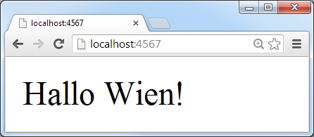

title: Building Web Services (HTTP APIs) with Ruby (and Sinatra)

%css

pre {
  padding: 4px 4px 4px 4px;
  border-top: #bbb 1px solid;
  border-bottom: #bbb 1px solid;
  background: #f3f3f3;
}

%end

# Agenda

- What's Sinatra?
- Let a Thousand Sinatra Clones Bloom
- Why Sinatra? Goodies
- Example Web Service (HTTP API) - Routes
- Sinatra in Action - `get '/beer/:key'`
- What's JSON? 
- What's JSONP?
- Serializers - From Ruby Objects to JavaScript Objects
- Appendix: Sinatra Styles - Classic or Modern (Modular)
- Appendix: Database Connection Management
- Appendix: Sinatra Books
- Appendix: What's Rack?

# What's Sinatra?

Simple (yet powerful and flexible) micro webframework.

~~~
require 'sinatra'

get '/' do
  'Hallo Wien!'
end
~~~

Sinatra itself [less than 2000 lines of code](https://github.com/sinatra/sinatra/blob/master/lib/sinatra/base.rb).  

Installation. Type in your terminal (shell):

~~~
$ gem install sinatra
~~~

# What's Sinatra? (Continued)

Example - `hallo.rb`:

~~~
require 'sinatra'

get '/' do
  'Hallo Wien!'
end
~~~

Run script (server):

~~~
$ ruby hallo.rb

>> Sinatra has taken the stage...
>> Listening on 0.0.0.0:4567, CTRL+C to stop
~~~

Open browser:

# Let a Thousand Sinatra Clones Bloom

Micro Frameworks Inspired by Sinatra

Express.js (in Server-Side JavaScript w/ Node.js):

~~~
var express = require( 'express' );
var app = express();

app.get( '/', function( req, res ) {
  res.send( 'Hallo Wien!' );
});

app.listen( 4567 );
~~~

Scotty (in Haskell):

~~~
import Web.Scotty

main :: IO ()
main = scotty 4567 $ do
    get "/" $ text "Hallo Wien!"
~~~

Dancer (Perl), Fitzgerald (PHP), Ratpack (Groovy),
Zappa (CoffeeScript), Mercury (Lua), Frank (F#), Nancy (C#/.NET),
Bogart (C), Flask (Python), and [many more](http://en.wikipedia.org/wiki/Sinatra_(software)#Frameworks_inspired_by_Sinatra).

# Why Sinatra?  Goodies

1) Single file scripts

2) Easy to package up into a gem. Example:

    $ gem install beerdb     # Yes, the beerdb includes a Sinatra app.

3) Lets you build command line tools. Example:

    $ beerdb serve           # Startup web service (HTTP API).

4) Lets you mount app inside app (including Rails). Example:

    mount BeerDb::Server, :at => '/api/v1'

# Example Web Service (HTTP API) - Routes

Lets build a beer and brewery API.

Get beer by key `/beer/:key`. Examples:

- `/beer/guinness`
- `/beer/murphysred`
- `/beer/brooklynlager`
- `/beer/ottakringerhelles`

Get brewery by key `/brewery/:key`. Examples:

- `/brewery/guinness`
- `/brewery/fullers`
- `/brewery/brooklyn`
- `/brewery/ottakringer`

Bonus:

Get random beer `/beer/rand` and random brewery `/brewery/rand`.

# Sinatra in Action - `get '/beer/:key'`

`beerdb/server.rb`:

~~~
get '/beer/:key' do |key|

  beer = Beer.find_by_key!( key )
  json_or_jsonp( beer.as_json )

end

get '/brewery/:key' do |key|

  brewery = Brewery.find_by_key!( key )
  json_or_jsonp( brewery.as_json )

end
~~~

That's it.

Bonus:

~~~
get '/beer/:key' do |key|

  if ['r', 'rnd', 'rand', 'random'].include?( key )
    beer = Beer.rnd.first
  else
    beer = Beer.find_by_key!( key )
  end

  json_or_jsonp( beer.as_json )
end

get '/brewery/:key' do |key|

  if ['r', 'rnd', 'rand', 'random'].include?( key )
    brewery = Brewery.rnd.first
  else
    brewery = Brewery.find_by_key!( key )
  end

  json_or_jsonp( brewery.as_json )
end
~~~

# What's JSON?

JSON = JavaScript Object Notation

Example - `GET /beer/ottakringerhelles`:

~~~
{
  key: "ottakringerhelles",
  title: "Ottakringer Helles",
  synonyms: "16er Blech|16er Hüs'n",
  abv: "5.2",
  og: "11.8",
  tags: [ "lager" ],
  brewery: {
    key: "ottakringer",
    title: "Ottakringer Brauerei"
  },
  country: {
   key: "at",
   title: "Austria"
  }
}
~~~

# What's JSONP?

JSONP = JSON with Padding.  Why?

Call Home Restriction. Cross-Domain Browser Requests Get Blocked. 

Hack: Wrap JSON into a JavaScript function/callback
e.g. `functionCallback( <json_data_here> )`
and serve as plain old JavaScript.

Example - `Content-Type: application/json`:

~~~
{
  key: "ottakringerhelles",
  title: "Ottakringer Helles",
  synonyms: "16er Blech|16er Hüs'n",
  abv: "5.2",
  ...
}
~~~

becomes `Content-Type: application/javascript`:

~~~
functionCallback(
  {
    key: "ottakringerhelles",
    title: "Ottakringer Helles",
    synonyms: "16er Blech|16er Hüs'n",
    abv: "5.2",
    ...
  }
);
~~~

Bonus: Little Sinatra helper for JSON or JSONP response (depending on callback parameter).

~~~
def json_or_jsonp( json )
  callback = params.delete('callback')

  if callback
    content_type :js
    response = "#{callback}(#{json})"
  else
    content_type :json
    response = json
  end
end
~~~

# Serializers - From Ruby Objects (in Memory) to JavaScript Object (in Text) 

JSON built into Ruby 2.0 as a standard library. Example:

~~~
require 'json'

hash =
{
  key:   "ottakringerhelles",
  title: "Ottakringer Helles"
}
~~~~

### 1) `JSON.generate`

~~~
puts JSON.generate( hash )

>> {"key":"ottakringerhelles","title":"Ottakringer Helles"}
~~~

### 2) `#to_json`

~~~
puts hash.to_json

>>  {"key":"ottakringerhelles","title":"Ottakringer Helles"}
~~~

# Serializers - From Ruby Objects (in Memory) to JavaScript Object (in Text) Continued

Serializers for your Models. Example:

~~~
class BeerSerializer

  def initialize( beer )
    @beer = beer
  end

  attr_reader :beer

  def as_json
    data = { key:      beer.key,
             title:    beer.title,
             synonyms: beer.synonyms,
             abv:      beer.abv,
             ...
           }
    data.to_json
  end

end # class BeerSerializer
~~~

And add `as_json` to your Model. Example:

~~~
class Beer < ActiveRecord::Base

  def as_json_v2( opts={} )
    BeerSerializer.new( self ).as_json
  end

end # class Beer
~~~

# That's it. Thanks.

### Questions? Comments?

Learn more about Sinatra @ [`sinatrarb.com`](http://sinatrarb.com)

Learn more about the open beer 'n' brewery database (`beer.db`) @ [`github.com/openbeer`](https://github.com/openbeer)

# Appendix: Sinatra Styles - Classic or Modern (Modular)

~~~
require 'sinatra'

get '/' do
  'Hallo Wien!'
end
~~~

vs.

~~~
require 'sinatra/base'

class Server < Sinatra::Base

  get '/' do
    'Hallo Wien!'
  end

end
~~~

# Appendix: Tip - Database Connection Management

Sinatra will NOT auto-magically close your database connection
after every request. It's up to you.

1) Use the `ConnectionManagement` middleware. Example:

~~~
Server.use ActiveRecord::ConnectionAdapters::ConnectionManagement
~~~

2) Or do it yourself. Example:

~~~
Server.after do
  ActiveRecord::Base.connection.close
end    
~~~
   

# Appendix: Sinatra Books

 Sinatra: Up and Running by Alan Harris, Konstantin Haase;
November 2011, O'Reilly, 122 Pages

  Jump Start Sinatra by Darren Jones;
January 2013, SitePoint, 150 Pages

# Appendix: What's Rack?

Lets you mix 'n' match servers and apps.

Lets you stack apps inside apps inside apps inside apps inside apps.

Good News: A Sinatra app is a Rack app.

Learn more about Rack @ [`rack.github.io`](http://rack.github.io).

