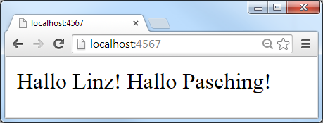

title: Building Web Services (HTTP APIs) with Ruby (and Sinatra)

# Agenda

- What's Sinatra?
- Let a Thousand Sinatra Clones Bloom
- Why Sinatra? Goodies
- Example Web Service (HTTP API) - Routes
- Sinatra in Action - `get '/beer/:key'`
- What's JSON? 
- What's JSONP?
- Serializers - From Ruby Objects to JavaScript Objects
- Appendix: Sinatra Styles - Classic or Modern (Modular)
- Appendix: Database Connection Management
- Appendix: Sinatra Books
- Appendix: What's Rack?

# What's Sinatra?

Simple (yet powerful and flexible) micro webframwork.

~~~
require 'sinatra'

get '/' do
  'Hallo Linz! Hallo Pasching!'
end
~~~

Sinatra itself [less than 2000 lines of code](https://github.com/sinatra/sinatra/blob/master/lib/sinatra/base.rb).  

Installation. Type in your terminal (shell):

~~~
$ gem install sinatra
~~~

# What's Sinatra? (Continued)

Example - `hallo.rb`:

~~~
require 'sinatra'

get '/' do
  'Hallo Linz! Hallo Pasching!'
end
~~~

Run script (server):

~~~
$ ruby hallo.rb

>> Sinatra has taken the stage...
>> Listening on 0.0.0.0:4567, CTRL+C to stop
~~~

Open browser:

# Let a Thousand Sinatra Clones Bloom

Micro Frameworks Inspired by Sinatra

Express.js (in Server-Side JavaScript w/ Node.js):

~~~
var express = require( 'express' );
var app = express();

app.get( '/', function( req, res ) {
  res.send( 'Hallo Linz! Hallo Pasching!' );
});

app.listen( 4567 );
~~~

Scotty (in Haskell):

What's Haskell?

- Haskell is an advanced purely-functional programming language
  e.g. a monad is just a monoid in the category of endofunctors, what's the problem?

~~~
import Web.Scotty

main :: IO ()
main = scotty 4567 $ do
    get "/" $ text "Hallo Linz! Hallo Pasching!"
~~~

- *Perl*: Dancer
- *PHP*: Fitzgerald
- *Groovy/Java*: Ratpack
- *CoffeeScript*: Zappa
- *Lua*: Mercury
- *F#/.NET*: Frank
- *C#/.NET*: Nancy
- *C*: Bogart
- *Go*: Martini
- *Python*: Flask  (started as an april fool's joke - that easy?! - it can't be true)
- and [many more](http://en.wikipedia.org/wiki/Sinatra_(software)#Frameworks_inspired_by_Sinatra).

# Why Sinatra?  Goodies

1) Single file scripts

2) Easy to package up into a gem. Example:

    $ gem install beerdb     # Yes, the beerdb includes a Sinatra app.

3) Lets you build command line tools. Example:

    $ beerdb serve           # Startup web service (HTTP JSON API).

4) Lets you mount app inside app (including Rails). Example:

    mount BeerDb::Server, :at => '/api/v3'

# Example Web Service (HTTP JSON API) - Routes

Lets build a beer and brewery API.

Get beer by key `/beer/:key`. Examples:

- `/beer/guinness`
- `/beer/murphysred`
- `/beer/zipferurtyp`
- `/beer/hofstettnergranitbock`

Get brewery by key `/brewery/:key`. Examples:

- `/brewery/guinness`
- `/brewery/murphy`
- `/brewery/zipf`
- `/brewery/hofstetten`

Bonus:

Get random beer `/beer/rand` and random brewery `/brewery/rand`.

# Sinatra in Action - `get '/beer/:key'`

`beerdb/server.rb`:

~~~
get '/beer/:key' do |key|

  beer = Beer.find_by!( key: key )
  json_or_jsonp( beer.as_json )

end

get '/brewery/:key' do |key|

  brewery = Brewery.find_by!( key: key )
  json_or_jsonp( brewery.as_json )

end
~~~

That's it.

Bonus:

~~~
get '/beer/:key' do |key|

  if ['r', 'rnd', 'rand', 'random'].include?( key )
    beer = Beer.rnd.first
  else
    beer = Beer.find_by!( key: key )
  end

  json_or_jsonp( beer.as_json )
end

get '/brewery/:key' do |key|

  if ['r', 'rnd', 'rand', 'random'].include?( key )
    brewery = Brewery.rnd.first
  else
    brewery = Brewery.find_by!( key: key )
  end

  json_or_jsonp( brewery.as_json )
end
~~~

# What's JSON?

JSON = JavaScript Object Notation

Example - `GET /beer/hofstettnergranitbock`:

~~~
{
  "key": "hofstettnergranitbock",
  "title": "Hofstettner Granitbock",
  "abv": 7.2,
  "og": 17.8,
  "tags": [ "lager", "bock" ],
  "brewery": {
    "key": "hofstetten",
    "title": "Brauerei Hofstetten"
  },
  "country": {
   "key": "at",
   "title": "Austria"
  }
}
~~~

# What's JSONP / JSON-P?

JSONP / JSON-P = JSON with Padding.  Why?

Call Home Restriction. Cross-Domain Browser Requests Get Blocked. 

Hack: Wrap JSON into a JavaScript function/callback
e.g. `functionCallback( <json_data_here> )`
and serve as plain old JavaScript.

Example - `Content-Type: application/json`:

~~~
{
  "key": "hofstettnergranitbock",
  "title": "Hofstettner Granitbock",
  "abv": "7.2",
  ...
}
~~~

becomes `Content-Type: application/javascript`:

~~~
functionCallback(
  {
    key: "hofstettnergranitbock",
    title: "Hofstettner Granitbock",
    abv: 7.2,
    ...
  }
);
~~~

Bonus: Little Sinatra helper for JSON or JSONP response (depending on callback parameter).

~~~
def json_or_jsonp( json )
  callback = params.delete('callback')

  if callback
    content_type :js
    response = "#{callback}(#{json})"
  else
    content_type :json
    response = json
  end
end
~~~

#  What's CORS (Cross-Origin Resource Sharing)? - JSONP v2.0 - HTTP Access Control

CORS = Cross-Origin Resource Sharing

JSONP "Hack" no longer needed; let's you use "plain" standard HTTP Request in JavaScript.
Requires a "modern" browser 

Uses HTTP headers in request and response (for access control).

### Example 1) Simple GET request

Request (needs to send along Origin header):

~~~
Origin: http://foo.example
~~~

Response (use Access-Control-Allow-Origin header to allows):

~~~
Access-Control-Allow-Origin: *
~~~

### Example 2) POST "pre-flight" request w/ OPTIONS

Request:

~~~
Origin: http://foo.example
Access-Control-Request-Method: POST
Access-Control-Request-Headers: X-PINGOTHER
~~~

Response:

~~~
Access-Control-Allow-Origin: http://foo.example
Access-Control-Allow-Methods: POST, GET, OPTIONS
Access-Control-Allow-Headers: X-PINGOTHER
Access-Control-Max-Age: 1728000
~~~

# Serializers - From Ruby Objects (in Memory) to JavaScript Object (in Text) 

JSON built into Ruby 2.0 as a standard library. Example:

~~~
require 'json'

hash =
{
  key: "hofstettnergranitbock",
  title: "Hofstettner Granitbock"
}
~~~~

### 1) `JSON.generate`

~~~
puts JSON.generate( hash )

>> {"key":"hofstettnergranitbock","title":"Hofstettner Granitbock"}
~~~

### 2) `#to_json`

~~~
puts hash.to_json

>>  {"key":"hofstettnergranitbock","title":"Hofstettner Granitbock"}
~~~

# Serializers - From Ruby Objects (in Memory) to JavaScript Object (in Text) Continued

Serializers for your Models. Example:

~~~
class BeerSerializer

  def initialize( beer )
    @beer = beer
  end

  attr_reader :beer

  def as_json
    data = { key:      beer.key,
             title:    beer.title,
             abv:      beer.abv,
             ...
           }
    data.to_json
  end

end # class BeerSerializer
~~~

And add `as_json` to your Model. Example:

~~~
class Beer < ActiveRecord::Base

  def as_json_v2( opts={} )
    BeerSerializer.new( self ).as_json
  end

end # class Beer
~~~

# From Ruby Objects to JSON - Many More Options - Jbuilder

- [`rails/jbuilder`](https://github.com/rails/jbuilder) - Create JSON structures via a builder-style DSL

~~~
json.content format_content(@message.content)
json.(@message, :created_at, :updated_at)

json.author do
  json.name @message.creator.name.familiar
  json.email_address @message.creator.email_address_with_name
  json.url url_for(@message.creator, format: :json)
end

json.comments @message.comments, :content, :created_at

json.attachments @message.attachments do |attachment|
  json.filename attachment.filename
  json.url url_for(attachment)
end
~~~

will create

~~~
{
  "content": "
This is <i>serious</i> monkey business
",
  "created_at": "2011-10-29T20:45:28-05:00",
  "updated_at": "2011-10-29T20:45:28-05:00",

  "author": {
    "name": "David H.",
    "email_address": "'David Heinemeier Hansson' <david@heinemeierhansson.com>",
    "url": "http://example.com/users/1-david.json"
  },

  "comments": [
    { "content": "Hello everyone!", "created_at": "2011-10-29T20:45:28-05:00" },
    { "content": "To you my good sir!", "created_at": "2011-10-29T20:47:28-05:00" }
  ],

  "attachments": [
    { "filename": "forecast.xls", "url": "http://example.com/downloads/forecast.xls" },
    { "filename": "presentation.pdf", "url": "http://example.com/downloads/presentation.pdf" }
  ]
}
~~~

# From Ruby Objects to JSON - Many More Options - Wunderbar.json

- [`rubys/wunderbar`](https://github.com/rubys/wunderbar) - Another builder-style DSL 

~~~
Wunderbar.json do
  _content format_content(@message.content)
  _ @message, :created_at, :updated_at 

  _author do
    _name @message.creator.name.familiar
    _email_address @message.creator.email_address_with_name
    _url url_for(@message.creator, format: :json)
  end

  _comments @message.comments, :content, :created_at

  _attachments @message.attachments do |attachment|
    _filename attachment.filename
    _url url_for(attachment)
  end
end
~~~

#  What's Rack?

Lets you mix 'n' match servers and apps.

Lets you stack apps inside apps inside apps inside apps inside apps.

Good News: A Sinatra app is a Rack app.

Learn more about Rack @ [`rack.github.io`](http://rack.github.io).

# What's Rack?  Cont'd

Mimimalistic Rack App

~~~
lambda { |env| [200, {}, ["Hello Linz! Hello Pasching!"]] }
~~~

To use Rack, provide an "app": an object that responds to the call method,
taking the environment hash as a parameter, and returning an Array with three elements:

- The HTTP response code  e.g. `200`
- A Hash of headers e.g. `{}`
- The response body, which must respond to each e.g. `["Hello Linz! Hello Pasching!"]`

`hello.rb`:

~~~
require 'rack'

hello_app =  ->{ |env|
                   [200, {}, ["Hello Linz! Hello Pasching!"]]
               }

Rack::Handler::Webserver.run hello_app
~~~

#  "Real World" Example - sport.db.admin - Apps inside Apps inside Apps

[`sport.db.admin / config / routes.rb`](https://github.com/sportdb/sport.db.admin/blob/master/config/routes.rb):

~~~
Sportdbhost::Application.routes.draw do

  mount About::App,     :at => '/sysinfo'
  mount DbBrowser::App, :at => '/browse'

  get '/api' => redirect('/api/v1')
  mount SportDb::Api, :at => '/api/v1'

  mount LogDb::App, :at => '/logs'

  mount SportDbAdmin::Engine, :at => '/'

end
~~~

# What's Metal? - Rack v2.0

Q: Why update (break) Rack v1.0?

A: Make it faster, faster, faster. Non-blocking streaming with asynchronous event callbacks is the new black.

An app without any middleware:

~~~
require 'the_metal/puma'

TheMetal.create_server(->(req, res) {
  res.write_head 200, 'Content-Type' => 'text/plain'
  res.write "Hello World\n"
  res.finish
}).listen 9292, '0.0.0.0'
~~~

You can use a class too:

~~~
class Application
  def call req, res
    res.write_head 200, 'Content-Type' => 'text/plain'
    res.write "Hello World\n"
    res.finish
  end
end

require 'the_metal/puma'
server = TheMetal.create_server Application.new
server.listen 9292, '0.0.0.0'
~~~

# What's Metal? - Rack v2.0 - Cont'd

An app that checks out a database connection when the request starts and checks it back in when the response is finished:

~~~
require 'the_metal'

class Application
  def call req, res
    res.write_head 200, 'Content-Type' => 'text/plain'
    res.write "Hello World\n"
    res.finish
  end
end

class DBEvents
  def start_app app
    puts "ensure database connection"
  end

  def start_request req, res
    puts "-> checkout connection"
  end

  def finish_request req, res
    puts "<- checkin connection"
  end
end

require 'the_metal/puma'
app = TheMetal.build_app [DBEvents.new], [], Application.new
server = TheMetal.create_server app
server.listen 9292, '0.0.0.0'
~~~

# Rum, Cuba, Roda 'n' Friends

More Microframeworks Alternatives

- Rum
   - First version by Rack inventor Christian Neune 

- Cuba  - <cuba.is>
   - uses the idea of rum (thus, the name Cuba) and adds a little more machinery

- Roda - <roda.jeremyevans.net>
   - uses the idea of cuba and adds yet more  machinery (e.g. better request tree, plugins, etc.)

   
- Where's this all headed?  Rail 6.0? - Just kidding.

-- lines of codes

Library   | Lines of Code (LOC)
----------|---------------------
Cuba         |        152
Sinatra      |       1_476
Rails (*)    |      13_181
(Almost) Sinatra |      7

(*) only ActionPack (Rails is over 40_000+ LOC)

Assumption less lines of code => faster code, more requests/secs - only use what you need

(Source: Cuba Slides)

- (Almost) Sinatra  ->  add link here

# What's a Request Tree?

Sinatra - plain "flat" request tree 

~~~
get "/articles/:id" do |id|
  article = Article[id]
end

get "/articles/:article_id/comments/:id" do |article_id, id|
  article = Article[article_id]
  comment = article.comments[id]
end
~~~

vs

nested request tree

Cuba Version:
~~~
on get, "articles/:id" do |id|
  article = Article[id]

  on "comments/:id" do |id|
    comment = article.comments[id]
  end
end
~~~

Roda  version:

# HTTP JSON APIs - Go Version

Try another language, for example,

Why Go?

- code gets compiled to zero-dependency (small) machine-code binaries
- kind of a "better" more "modern" C
    - code gets compiled and linked (no virtual machine, or byte code runtime or just-in-time compiler machinery etc. needed)

# HTTP JSON API - Rack v1.0 Version

# HTTP JOSN APIs - NoSQL Version

Try a NoSQL database and get JSON HTTP APIs (almost) for "free".

# That's it. Thanks.

### Questions? Comments?

Learn more about Sinatra @ [`sinatrarb.com`](http://sinatrarb.com)

Learn more about the open beer 'n' brewery database (`beer.db`) @ [`github.com/openbeer`](https://github.com/openbeer)

# Appendix: Sinatra Styles - Classic or Modern (Modular)

~~~
require 'sinatra'

get '/' do
  'Hallo Linz! Hallo Pasching!'
end
~~~

vs.

~~~
require 'sinatra/base'

class Server < Sinatra::Base

  get '/' do
    'Hallo Linz! Hallo Pasching!'
  end

end
~~~

# Appendix: Sinatra Books

 Sinatra: Up and Running by Alan Harris, Konstantin Haase;
November 2011, O'Reilly, 122 Pages

  Jump Start Sinatra by Darren Jones;
January 2013, SitePoint, 150 Pages

# "Real-World" HTTP JSON APIs Examples

Learn from the "masters". Examples:

- GitHub API  ->  [developer.github.com/v3](https://developer.github.com/v3)
- Basecamp API -> [github.com/basecamp/api](https://github.com/basecamp/api)
- Heroku API  ->  [devcenter.heroku.com/categories/platform-api](https://devcenter.heroku.com/categories/platform-api)
- Travis CI API -> [docs.travis-ci.com/api](http://docs.travis-ci.com/api)

~~~
$ curl -i https://api.github.com/users/octocat/orgs
~~~

Headers:

~~~
HTTP/1.1 200 OK
Server: nginx
Date: Fri, 12 Oct 2012 23:33:14 GMT
Content-Type: application/json; charset=utf-8
Connection: keep-alive
Status: 200 OK
ETag: "a00049ba79152d03380c34652f2cb612"
X-GitHub-Media-Type: github.v3
X-RateLimit-Limit: 5000
X-RateLimit-Remaining: 4987
X-RateLimit-Reset: 1350085394
Content-Length: 5
Cache-Control: max-age=0, private, must-revalidate
X-Content-Type-Options: nosniff
~~~

JSON Payload:

~~~
[]
~~~

# GitHub API Example - List Commits on a Repo

~~~
GET /repos/:owner/:repo/commits
~~~

Headers:

~~~
Status: 200 OK
Link: <https://api.github.com/resource?page=2>; rel="next"
X-RateLimit-Limit: 5000
X-RateLimit-Remaining: 4999
~~~

JSON Payload:

~~~
[
  {
    "url": "https://api.github.com/repos/octocat/Hello-World/commits/6dcb09b5b57875f334f61aebed695e2e4193db5e",
    "sha": "6dcb09b5b57875f334f61aebed695e2e4193db5e",
    "html_url": "https://github.com/octocat/Hello-World/commit/6dcb09b5b57875f334f61aebed695e2e4193db5e",
    "comments_url": "https://api.github.com/repos/octocat/Hello-World/commits/6dcb09b5b57875f334f61aebed695e2e4193db5e/comments",
    "commit": {
      "url": "https://api.github.com/repos/octocat/Hello-World/git/commits/6dcb09b5b57875f334f61aebed695e2e4193db5e",
      "author": {
        "name": "Monalisa Octocat",
        "email": "support@github.com",
        "date": "2011-04-14T16:00:49Z"
      },
      "committer": {
        "name": "Monalisa Octocat",
        "email": "support@github.com",
        "date": "2011-04-14T16:00:49Z"
      },
      "message": "Fix all the bugs",
      "tree": {
        "url": "https://api.github.com/repos/octocat/Hello-World/tree/6dcb09b5b57875f334f61aebed695e2e4193db5e",
        "sha": "6dcb09b5b57875f334f61aebed695e2e4193db5e"
      },
      "comment_count": 0
    },
    "author": {
      "login": "octocat",
      "id": 1,
      "avatar_url": "https://github.com/images/error/octocat_happy.gif",
      "gravatar_id": "somehexcode",
      "url": "https://api.github.com/users/octocat",
      "html_url": "https://github.com/octocat",
      "followers_url": "https://api.github.com/users/octocat/followers",
      "following_url": "https://api.github.com/users/octocat/following{/other_user}",
      "gists_url": "https://api.github.com/users/octocat/gists{/gist_id}",
      "starred_url": "https://api.github.com/users/octocat/starred{/owner}{/repo}",
      "subscriptions_url": "https://api.github.com/users/octocat/subscriptions",
      "organizations_url": "https://api.github.com/users/octocat/orgs",
      "repos_url": "https://api.github.com/users/octocat/repos",
      "events_url": "https://api.github.com/users/octocat/events{/privacy}",
      "received_events_url": "https://api.github.com/users/octocat/received_events",
      "type": "User",
      "site_admin": false
    },
    "committer": {
      "login": "octocat",
      "id": 1,
      "avatar_url": "https://github.com/images/error/octocat_happy.gif",
      "gravatar_id": "somehexcode",
      "url": "https://api.github.com/users/octocat",
      "html_url": "https://github.com/octocat",
      "followers_url": "https://api.github.com/users/octocat/followers",
      "following_url": "https://api.github.com/users/octocat/following{/other_user}",
      "gists_url": "https://api.github.com/users/octocat/gists{/gist_id}",
      "starred_url": "https://api.github.com/users/octocat/starred{/owner}{/repo}",
      "subscriptions_url": "https://api.github.com/users/octocat/subscriptions",
      "organizations_url": "https://api.github.com/users/octocat/orgs",
      "repos_url": "https://api.github.com/users/octocat/repos",
      "events_url": "https://api.github.com/users/octocat/events{/privacy}",
      "received_events_url": "https://api.github.com/users/octocat/received_events",
      "type": "User",
      "site_admin": false
    },
    "parents": [
      {
        "url": "https://api.github.com/repos/octocat/Hello-World/commits/6dcb09b5b57875f334f61aebed695e2e4193db5e",
        "sha": "6dcb09b5b57875f334f61aebed695e2e4193db5e"
      }
    ]
  }
]
~~~

# new slides / ideas

# rack-test

# json schema ???

- project site -> [json-schema.org](http://json-schema.org)

What's?

Describe your data structure n types (schema) in JSON. Example:

Why?

Pros:

- More tooling
  - auto-generate docu
  - auto-generate tests
  - auto-generate (test) client libraries
  - auto-generate validator (for required fields, types, etc.)

- More (re)use
  - (re)use "common" schemas

# HTTP JSON API Guidelines

Heroku API Design Guidelines

- 
- 

(Source: )

