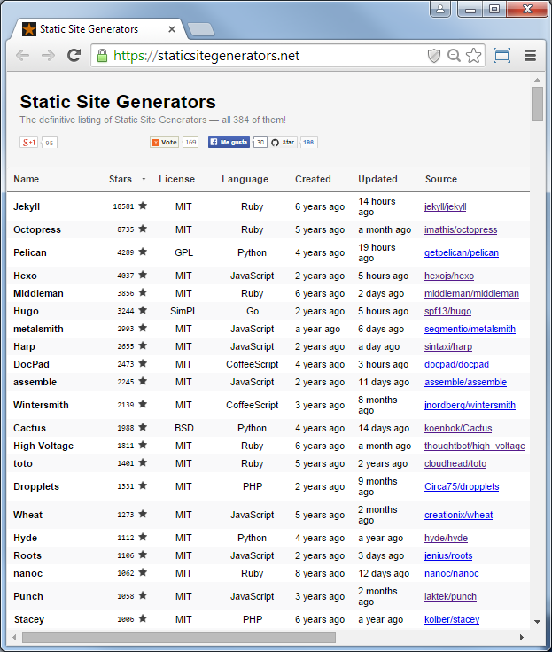
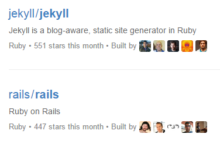
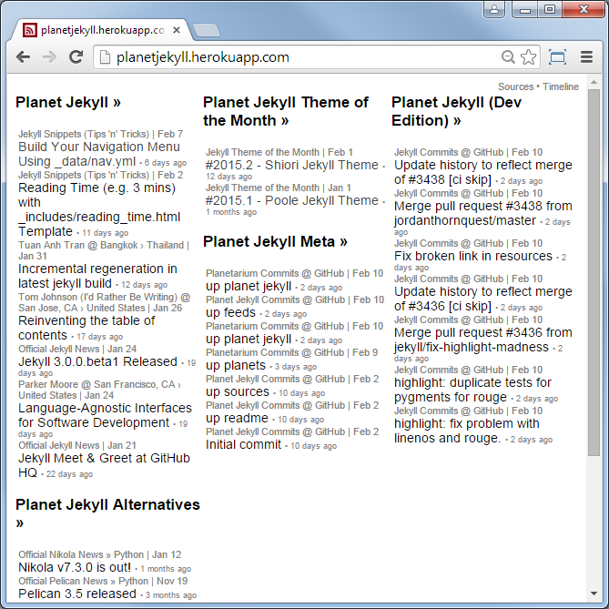

title: Static is the New Dynamic - Jekyll, Octopress, GitHub Pages n Friends

%css

pre {
  padding: 4px 4px 4px 4px;
  border-top: #bbb 1px solid;
  border-bottom: #bbb 1px solid;
  background: #f3f3f3;
}

%end

# Agenda

- Dynamic Site Generators
- Static Site Generators
- Why Static?
- Static Site Generator - Folder Structure Example
- Static Site Generators - The Biggies
- Build Your Own Static Site Generator in Ruby in 5 Minutes
- Static is the New Dynamic - Jekyll is the New Ruby Killer App
- Jekyll Getting Started
- Jekyll - Beyond the Basics - Collections, Data
- Dynamic Examples  -  Videos, Comments, n More
- Jekyll Goodies -  HTML Proofer, Prose.io, GitHub.j, Jekyll Planet Gem, WordPress Jekyll Export Plugin
- GitHub Pages
- Octopress 3.0 Upcoming

# Dynamic Site Generators

**The Biggies** (PHP Rules!)

- WordPress
- Drupal
- Joomla

On your live production site requires

- database (e.g. mysql)
- application server (e.g. mod_php)
- web server (e.g. apache)

# Static Site Generators

On your live prodcution site requires

- web server (e.g. apache) only

- NO database needed
- NO application server needed

Note: You can host your site on Amazon S3 (Simple Storage Service).

# Static is the New Dynamic - Why Static?

- Fast, Faster, Fastest

- Simple, Simpler, Simplest

- Pretty, Prettier, Prettiest
    - e.g. designer nirvana - do-it-yourself - full control over your design; use Bootstrap, Material, or what not.

Bonus: Secure - invite all the hackers - basically unbreakable!

There are only static files on your server.
If an attacker hacks your server, there's "just" some "temporary" data loss.
To recover
- Regenerate your site on your local machine.
- Upload it again to the server or shutdown the old "hacked" server and use a new server
  and you're back in action.

# Static Site Generator - Folder Structure Example

~~~
├── _config.yml                               # site configuration
├── _posts                                    # sample blog posts
|   ├── 2014-05-05-sportdb-update-v192.md     #   filename format:
|   ├── 2014-10-10-new-repo-bavaria-bayern.md #    => YEAR-MONTH-DAY-TITLE.MARKUP
|   ├── 2014-10-21-sql-views.md
|   ├── 2014-11-11-new-reop-maps.md
|   └── 2014-12-15-quick-starter-datafiles.md
├── _layouts                           
|   ├── default.html                   # master layout template
|   └── post.html                      # single blog post template
├── css                               
|   ├── _settings.scss                 # style settings (e.g. variables)
|   └── style.scss                     # master style page
├── feed.xml                           # web feed template (e.g. in atom format)
├── archive.html                       # archive template
└── index.html                         # index template
~~~

will result in:

~~~
└── _site                                # output build folder; site gets generated here
    ├── css
    |   └── style.css                    # styles for pages (copied 1:1 as is)
    ├── sportdb-update-v192.html         # blog post page
    ├── new-repo-bavaria-bayern.html     # another blog post page
    ├── sql-views.html                   #  ""
    ├── new-repo-maps.html               #  ""
    ├── quick-starter-datafiles.html     #  ""
    ├── feed.xml                         # web feed (e.g. in atom format)
    ├── archive.html                     # archive page
    └── index.html                       # index page
~~~

# Example Blog Post 

~~~
---
layout: post
title: "New Repo - Bayern (Bavaria) - incl. European Beer Stars 2011, 2012, 2013"
---

Hello, I'v moved all beer, brewpub n brewery data for Bayern
(Baviria) to its own repo, that is, [`openbeer/by-bayern`](https://github.com/openbeer/by-bayern).

Note, the repo also includes all European Beer Star winners from Bayern
(Bavaria) for the years 2011, 2012 and 2013. Cheers. Prost.
~~~

or 

~~~
---
layout: post
title: "New Repo - Bayern (Bavaria) - incl. European Beer Stars 2011, 2012, 2013"
---

Hello, I'v moved all beer, brewpub n brewery data for Bayern
(Baviria) to its own repo, that is, <a href="https://github.com/openbeer/by-bayern"><code>openbeer/by-bayern</code></a>.

Note, the repo also includes all European Beer Star winners from Bayern
(Bavaria) for the years 2011, 2012 and 2013. Cheers. Prost.

~~~

# Meet the Obama campaign's $250 million fundraising platform

The numbers

- 6 month life span
- $250 million dollars, 4,276,463 donations
- 81,548,259 pageviews, 17,807,917 unique visitors
- 60% faster time to paint than previous platform
- 240 a/b tests, 49% increase in donation conversion rate
- 1,101 frontend deploys
- 4,000 lines of JavaScript
- 23% of traffic is mobile (including tablet)

# Meet the Obama campaign's $250 million fundraising platform (Cont.)

The web stack

- Static HTML pages generated by Ruby w/ Jekyll
- Served by Akamai CDN, origin hosted on Amazon S3
- Version control with GitHub
- Conversion optimization with Optimizely
- LESS for CSS preprocessor, JavaScript compiled by CodeKit
- Redundant, REST payment processor

(Source:
[Kyle Rush, Nov 2012](http://kylerush.net/blog/meet-the-obama-campaigns-250-million-fundraising-platform/))

# Static Site Generators Directories - `staticgen.com`

(Source: [staticgen.com](http://www.staticgen.com))

# Static Site Generators Directories - `staticsitegenerators.net`

(Source: [staticsitegenerators.net](http://staticsitegenerators.net))

# Static Site Generators - The Biggies

**Ruby**

- Jekyll
- Middleman
- Nanoc

**Python**

- Nikola
- Pelican
- Cactus
- Hyde

**JavaScript**

- Hexo
- Metalsmith
- Harp
- Docpad

**And Many More**

- Hugo (Go)
- Hakyll (Haskell)

# Let a Thousand Static Site Generators Bloom in Ruby

- { :awestruct }   - a static site-baking tool   @ [`awestruct.org`](http://awestruct.org) [(Code)](https://github.com/awestruct)
- Bonsai   - a tiny static web site generator   @[`tinytree.info`](http://tinytree.info) [(Code)](https://github.com/benschwarz/bonsai)
- Brochure
- Frank   - a static site non-framework    @ [(Code)](https://github.com/blahed/frank)
- Hobix   - commandline blogging & static pages & ruby   @ [`hobix.github.io/hobix`](http://hobix.github.io/hobix)   [(Code)](https://github.com/hobix/hobix)
- Middleman
- Nanoc
- Ruhoh
- Stasis
- Staticmatic
- Toto
- Webgen
- Webby
- Zenweb
 
And many more.

#  Build Your Own Static Site Generator in Ruby in 5 Minutes

Nostaliga - Anyone remember those "Build Your Own Blog in Ruby on Rails in 5 Minutes" live demos?

~~~
require 'find'
require 'kramdown'

# 1) make an out directory

SITE_PATH = './_site'
Dir.mkdir( SITE_PATH ) unless File.exist?( SITE_PATH )

# 2) add a markdown converter helper method

def markdown( text )
  Kramdown::Document.new( text ).to_html
end

# 3) loop over files and generate hypertext (.html) from markdown (.md)

Find.find('.') do |path|
  if File.extname(path) == '.md'              # e.g. ./index.md => .md
    basename = File.basename(path, '.md')     # e.g. ./index.md => index

    File.open( "#{SITE_PATH}/#{basename}.html", 'w') do |file|
      file.write markdown( File.read( path ) )
    end
  end
end
~~~

Many more ways. Example:

- [Using Rake to Generate a Blog](http://patshaughnessy.net/2015/1/8/using-rake-to-generate-a-blog) by Pat Shaughnessy; January 2015 

# Static is the New Dynamic - Jekyll is the New Ruby Killer App

Rails =>  24 900+ Stars / 9 700+ Forks

~~~
Jekyll                => 18 500+ Stars         3 800+ Forks
Octopress (2.0+3.0)   =>  8 700+ Stars (+400)  3 100+ Forks
Jekyll Bootstrap      =>  2 400+ Stars         1 400+ Forks
Jekyll Now            =>    900+ Stars         3 000+ Forks
~~~

Content is king. Growing faster. More Jekyll Themes

~~~
Jekyll Incorporated   =>   800+ Stars          200+ Forks
Poole                 => 1 000+ Stars          300+ Forks
Hyde                  =>   800+ Stars          400+ Forks
Lanyon                =>   700+ Stars          400+ Forks
Minimal Mistakes      =>   400+ Stars          900+ Forks
~~~

Now - let's add Bootstrap (or HTML5 Boilerplate) - Just kidding ;-)

~~~
Bootstrap             =>  77 600+ Stars        29 800+ Forks
HTML5 Boilerplate     =>  28 600+ Stars         7 400+ Forks
~~~

# Jekyll Getting Started - Method 1 -  Fork GitHub Jekyll Theme Repo

- Step 1: Fork a GitHub Jekyll Theme Repo e.g. `jekyll-minimal-theme`
- Step 2: Change the repo name to `<yourname>.github.io`
- Step 3: Change the Jekyll settings in `_config.yml` e.g. `site.url`

That's it. Edit your first post in the `_posts` folder.

# Jekyll Getting Started - Method 2 - "Hacker-Style" - Use the Command-Line

~~~
  $ jekyll new my-site
     # => New jekyll site installed in ~/my-site
  $ cd my-site
  $ jekyll build
     # => Configuration file: ~/_config.yml
     #                Source: ~/my-site
     #           Destination: ~/my-site/_site
     #          Generating... done.
  $ jekyll serve
     # =>     Server address: http://127.0.0.1:4000/
     #      Server running... press ctrl-c to stop.
~~~

Browse your site e.g. open the page @ `http://127.0.0.1:4000`

# Jekyll - Beyond the Basics - Collections

Basically like new post types e.g. books, albums, links, apps, etc.

Add a new "custom" folder (starting with underscore e.g. `_apps`)
for each new collection
and add your posts (w/o dates) as usual. Example:

~~~
_apps/
  beer-a-day.md
  country-codes.md
  sportweb.md
~~~

In your templates use `site.apps`. Example:

~~~
{%% for app in site.apps %}

  

      <a href="{{{ site.url }}{{{ app.url }}">
        {{{ app.title }}
      </a>
       
      
  

{%% endfor %}
~~~

For collection such as `_books`, `_albums` or `_links` use
`site.books`, `site.albums`, `site.links` and so on.

# Jekyll - Beyond the Basics - Data

Lets you store data in the `_data` folder in YAML, JSON, CSV. Example:

~~~
_data/
   books.yml
~~~

`books.yml`:

~~~
- title:     "111 Gründe, Bier zu lieben"
  subtitle:  Das Buch gegen den Durst
  author:    Marc Halupczok
  publisher: Schwarzkopf + Schwarzkopf
  tags:      de, culture, history
  isbn:      978-3-86265-399-7
  cover:     111-gruende-bier-zu-lieben.jpg

- title:     Bier in Wien (A La Carte)
  author:    Christian Grünwald (Herausgeber)
  publisher: D + R Verlagsgesellschaft
  tags:      at, wien, vienna, city guide
  isbn:      978-3-902469-52-6
  cover:     at/bier-in-wien.jpg
~~~

In your templates use `site.data.books`. Example:

~~~
{%% for book in site.data.books %}

  

    
     
    {{{ book.title }}
    {%% if book.edition %}
       {{{ book.edition}}
    {%% endif %}
    by {{{ book.author }}; {{{ book.publisher }}
  

{%% endfor %}
~~~

# Dynamic Examples  -  Videos

**Syntax**

~~~
{%% video urls [class names] [width height] [preload:auto|metadata|none] %}
~~~

**Examples**

~~~
{%% video {{{ site.cdn }}/videos/clouds.mp4 %}
{%% video featured wide /images/clouds.jpg /videos/clouds.mp4 /videos/clouds.webm /videos/clouds.ogv 1080px 608px preload:auto %}
~~~

Becomes

~~~
<video controls preload='metadata' onclick='(function(el){ if(el.paused) el.play(); else el.pause() })(this)'>
  <source src='https://cdn.com/video/clouds.mp4' type='video/mp4; codecs="avc1.42E01E, mp4a.40.2"'>
</video>

<video class='featured wide' controls poster='/images/clouds.jpg' width='1080px' height='608px' preload='auto'
  onclick='(function(el){ if(el.paused) el.play(); else el.pause() })(this)'>
  <source src='/videos/clouds.mp4' type='video/mp4; codecs="avc1.42E01E, mp4a.40.2"'>
  <source src='/videos/clouds.webm' type='video/webm; codecs="vp8, vorbis"'>
  <source src='/videos/clouds.ogv' type='video/ogg; codecs="theora, vorbis"'>
</video>
~~~

(Source: [octopress/video-tag](https://github.com/octopress/video-tag))

# More Dynamic Examples

**Comments, Comments, Comments**

Add comments using JavaScript-only service (Disqus, Facebook, etc.)

**Brute Force Hammer Method**

Re-generate and re-deploy your site every minute (or when pinged with web hook etc.)

# Jekyll Goodies -  HTML Proofer

What's HTML Proofer?

HTML Proofer is a gem (e.g. `html-proofer`) that proofreads your HTML output.
Tests include if your image references are legitimate,
if they have alt tags, if your internal links are working, and many many more.

Usage:

~~~
require 'html/proofer'

HTML::Proofer.new("./_site").run
~~~

Or configure your Travis build:

~~~
script: jekyll build && htmlproof ./_site
~~~

(Source: [jekyllrb.com/docs/continuous-integration](http://jekyllrb.com/docs/continuous-integration/))

# More Jekyll Goodies

**Prose.io, GitHub.js**

Write and save your posts in your browser with "distraction-free"
simple online text editor like Prose.io - a content editor for GitHub, for example.

How does it work? -- GitHub offers an HTTP JSON API; using the GitHub.js machinery lets you
build your own single-page web app in JavaScript only - no server required
other than GitHub itself ;-).

**Jekyll Planet Gem**

The Jekyll Planet gem (e.g. `jekyll-planet`) lets you
subscribe to web feeds and (auto-)save the latest posts
in your Jekyll `_posts` folder.

Why?! -- Lets others use whatever blog (or content managment system) they like - you don't care -
to pull in the posts and get the stories added to your site
all you need is a ye good ol' web feed.

**WordPress Jekyll Export Plugin**

One Click - gets you a zip w/ ready-to-use static Jekyll site.

Why?! -- Best of both worlds - use all the WordPress tools
plus get a fast and simple static site for live production.

Find out more:

- [Prose.io](https://github.com/prose)
- [GitHub.js](https://github.com/michael/github)
- [Jekyll Planet Gem](https://github.com/feedreader/jekyll-planet)
- [WordPress Jekyll Exporter](https://wordpress.org/plugins/jekyll-exporter)

# GitHub Pages

What's GitHub Pages?

- Free Hosting
- Free Content Tracker
- Free Ruby Processing w/ Jekyll

=> Where's the catch? You have to use git.

# GitHub Pages Milestones / History

2015:

- Jan 2015 +++ [How GitHub uses GitHub to document GitHub](https://github.com/blog/1939-how-github-uses-github-to-document-github)

2014:

- Jul 2014 +++ [GitHub Pages now runs Jekyll 2.2.0](https://github.com/blog/1867-github-pages-now-runs-jekyll-2-2-0)
- May 2014 +++ [GitHub Pages <3](https://github.com/blog/1833-github-pages-3)
- Mar 2014 +++ [Repository metadata and plugin support for GitHub Pages](https://github.com/blog/1797-repository-metadata-and-plugin-support-for-github-pages)

2013:

- Sep 2013 +++ [Viewing YAML Metadata in your Documents](https://github.com/blog/1647-viewing-yaml-metadata-in-your-documents)
- Aug 2013 +++ [Cutting the GitHub Pages Gem](https://github.com/blog/1581-cutting-the-github-pages-gem)
- May 2013 +++ [Jekyll Turns 1.0](https://github.com/blog/1502-jekyll-turns-1-0)
- Apr 2013 +++ [New GitHub Pages domain: github.io](https://github.com/blog/1452-new-github-pages-domain-github-io)
- Jan 2013 +++ [GitHub Pages updated to Jekyll 0.12.0](https://github.com/blog/1366-github-pages-updated-to-jekyll-0-12-0)

2012:

- Jun 2012 +++ [GitHub Pages Update](https://github.com/blog/1173-github-pages-update)
- Apr 2012 +++ [Instantly Beautiful Project Pages](https://github.com/blog/1081-instantly-beautiful-project-pages)

2009:

- Apr 2009 +++ [Pages 2.0](https://github.com/blog/410-pages-2-0)
- Apr 2009 +++ [GitHub Pages Upgraded to Jekyll 0.5.0](https://github.com/blog/402-github-pages-upgraded-to-jekyll-0-5-0)

2008:

- Dec 2008 +++ [GitHub Pages](https://github.com/blog/272-github-pages)

# GitHub Pages Tip - Make Your `gh_pages` Branch the Default; Delete `master` Branch

Step 1a) Already has `gh-pages` branch:

~~~
git checkout gh-pages   
git merge master
git push
~~~

Step 1b) Create `gh-pages` branch:

~~~
git checkout -b gh-pages
git merge master
git push origin gh-pages
~~~

Step 2) Make `gh-pages` branch default branch on GitHub via settings tab

Step 3)  Delete `master` branch on GitHub

~~~
git push origin :master     # will delete master branch on remote (that is, github)
    
git branch -d master        # will delete master branch in local remote
~~~

Step 4) Delete local git repo and get a fresh clone from GitHub

~~~
rm -rf <repo>
git clone <repo-remote-url>
~~~

That's it.

**Bonus: Check if remote is setup with `git remote show <repo-remote-shorthand>`**

~~~
$ git remote show origin
# => * remote origin
       Fetch URL: https://github.com/openbeer/book.git
       Push  URL: https://github.com/openbeer/book.git
       HEAD branch: gh-pages
       Remote branch:
          gh-pages tracked
       Local branch configured for 'git pull':
          gh-pages merges with remote gh-pages
       Local ref configured for 'git push':
          gh-pages pushes to gh-pages (up to date)
~~~

# Octopress 3.0 Upcoming

### "Classic" Octopress

Basically a pre-configured Jekyll site w/ a theme, helpers, build scripts and more.
"packaged" as ready-to-fork-and-use git repo. To get started use:

~~~
$ git clone octopress
~~~

and than start changing the configuration settings and so on.

What's wrong with that?!

- Not-so-easy to update.
- Not-so-easy to extend and configure.

# Octopress 3.0 Upcoming (Cont.)

### "Modern" Octopress (Released February 2015)

Modul-mania. Now almost everything is a gem
(more than 20+ gems e.g. `octopress-videotag`, `octopress-unpublish`, `octopress-deploy`, and so on)
plus a new command line tool (that is, `octopress`). To get started, use:

~~~
$ gem install octopress
$ octopress new
~~~

Why?!

- Easier to update.
- Easier to extend and configure (use what you need; no big all-in-one git repo hairball -
instead many small gems that work with "plain vanilla" jekyll).

**There will no longer be a division between Octopress and Jekyll.**

# Octopress 3.0 in Action

~~~
$ octopress --help

octopress 3.0.0 -- Octopress is an obsessively designed toolkit for Jekyll blogging.

Usage:

  octopress <subcommand> [options]

Options:
  -h, --help         Show this message
  -v, --version      Print the name and version
  -t, --trace        Show the full backtrace when an error occurs

Subcommands:
  new         Creates a new site with Jekyll and Octopress scaffolding at the specified path.
  docs        Launch local server with docs for Octopress v3.0.0.rc.31 and Octopress plugins.
  init        Add Octopress's default scaffolding to your site.
  publish     Convert a draft to a normal published post.
  unpublish   Convert a post to a draft. Command accepts path to post or search string.
  isolate     Move all posts not matching selected post to _posts/_exile. Command accepts path to post or search string.
  integrate   Reintegrate posts from _posts/_exile.
  deploy      Deploy your Octopress site.
~~~

## Command `new post`

~~~
$ octopress new post --help

octopress new post -- Add a new post to your Jekyll site.

Usage:

  octopress new post <TITLE> [options]

Options:
  -d,  --date DATE    Use 'now' or a String that is parseable by Time#parse.
  -tm, --template PATH  New post from a template.
  -l,  --lang LANGUAGE  Set a post language (e.g. en, it) for multi-language sites.
  -f,  --force        Overwrite file if it already exists
  -s,  --slug SLUG    Use this slug in filename instead of sluggified post title.
  -d,  --dir DIR      Create post at _posts/DIR/.
  -c,  --config <CONFIG_FILE>[,CONFIG_FILE2,...]  Custom Jekyll configuration file
  -h,  --help         Show this message
~~~

## Command `deploy`

~~~
$ octopress deploy --help

octopress deploy 1.0.4 -- Deploy your Octopress site.

Usage:

  octopress deploy [options]

Options:
      --config FILE  The path to your config file (default: _deploy.yml)
  -h, --help         Show this message

Subcommands:
  pull         Pull down the published copy of your site into DIR
  init         Create a configuration file for a deployment method (git, rsync, s3).
  add-bucket   Add a new S3 bucket and configure it for static websites. Name defaults to bucket_name in config file
~~~

and many more.

#  Thank You - Questions? Comments? 

Check the Planet Jekyll includes:

- Jekyll News Reader
- Jekyll Theme of the Month Series
- Jekyll Snippets (Tips 'n' Tricks)
- Jekyll Quick Reference (Cheat Sheet),
- Jekyll Minimial Theme
- and more.

