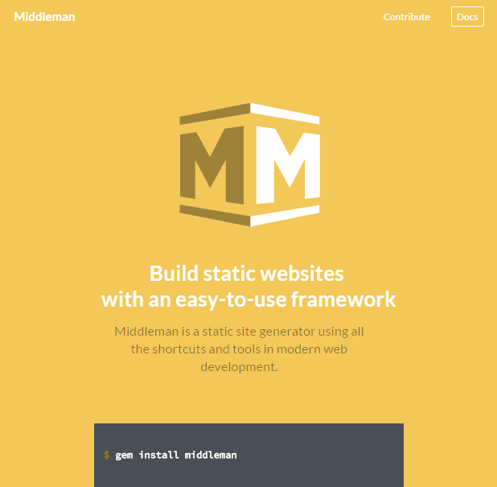
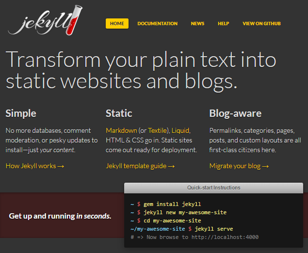
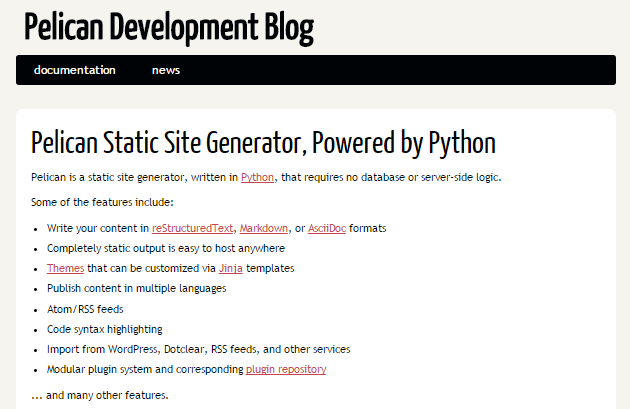
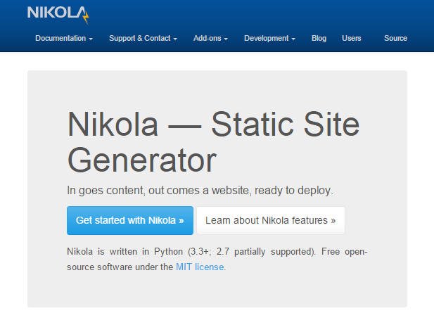
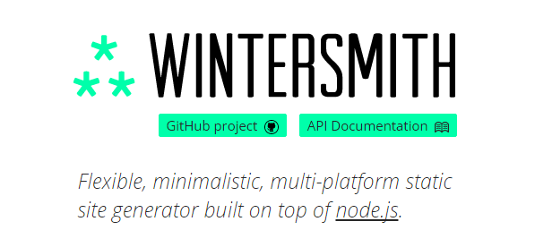
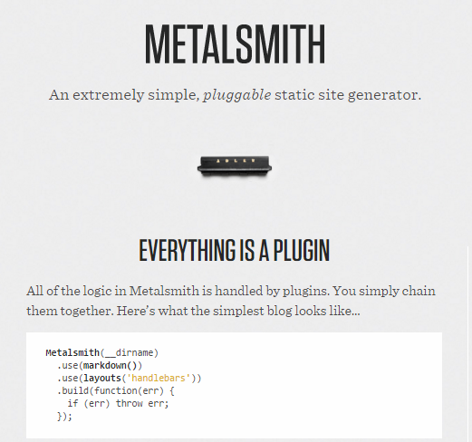
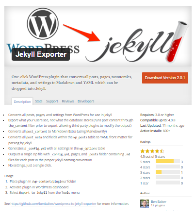

title: The World's Greatest (Free) Static Site Builders / Generators 

%css

pre {
  padding: 4px 4px 4px 4px;
  border-top: #bbb 1px solid;
  border-bottom: #bbb 1px solid;
  background: #f3f3f3;
}

%end

# Agenda

The World's Greatest (Free) Static Site Builders / Generators 

-   I. Ruby       - Middleman or Jekyll?
-  II. Python     - Pelican or Nikola?
- III. JavaScript - Wintersmith or Metallsmith?
-  IV. Go         - Hugo?
-   V. PHP, Haskell, Lisp, Rust, C, etc.

And the Winner is...

# Part I. - Ruby, Ruby, Ruby

# Hello, Middleman

by Thomas Reynolds et al (★4 756 / 870 043 Downloads) -
web: [`middlemanapp.com`](https://middlemanapp.com),
github: [`middleman/middleman`](https://github.com/middleman/middleman),
gem: [`middleman`](https://rubygems.org/gems/middleman)

Static Site Spotlight: 

[ROSSConf](https://github.com/rossconf/rossconf.io) •
[Sass Language](https://github.com/sass/sass-site) •
[Adventure Time! Middleman Sample](https://github.com/remotesynth/Static-Site-Samples/tree/master/middlemansite) •
[Many More](https://middlemanapp.com/community/built_using_middleman)

# Hello, Jekyll

by Tom Preston-Werner, Nick Quaranto,
Parker Moore, Jordon Bedwell, Matt Rogers et al (★22 380 / 1 756 295 Downloads) -
web: [`jekyllrb.com`](http://jekyllrb.com),
github: [`jekyll/jekyll`](https://github.com/jekyll/jekyll),
gem: [`jekyll`](https://rubygems.org/gems/jekyll)

Static Site Spotlight:

[Vienna.rb](https://github.com/vienna-rb/vienna-rb.github.com) •
[Vienna.html](https://github.com/viennahtml/viennahtml.github.io) •
[Facebook React](https://github.com/facebook/react/tree/master/docs) •
[Bootstrap](https://github.com/twbs/bootstrap/tree/master/docs) •
[Stack Overflow Blog](https://github.com/StackExchange/stack-blog) •
[PHP: The Right Way](https://github.com/codeguy/php-the-right-way) •
[Open Data Handbook v2](https://github.com/okfn/opendatahandbook) •
[Adventure Time! Jekyll Sample](https://github.com/remotesynth/Static-Site-Samples/tree/master/jekyllsite) •
[Many More](https://github.com/jekyll/jekyll/wiki/Sites)
[And More](http://planetjekyll.github.io/showcase)

# Middleman or Jekyll?  - HTML Templates

**Middleman** - Embedded Ruby (ERB) Template Language

~~~
<!DOCTYPE html>
<html>
  <%%= partial "partials/head" %>
  <body>
    <%%= partial "partials/header" %>
    

      

      <%%= yield %>
      

    

    <%%= partial "partials/footer" %>
  </body>
</html>
~~~

(Source: [`layouts/layout.erb`](https://github.com/remotesynth/Static-Site-Samples/blob/master/middlemansite/source/layouts/layout.erb))

# Middleman or Jekyll?  - HTML Templates (Cont.)

**Jekyll** - Liquid Template Language

~~~
<!DOCTYPE html>
<html>
  {%% include head.html %}
  <body>
    {%% include header.html %}
    

      

      {{{ content }}
      

    

    {%% include footer.html %}
  </body>
</html>
~~~

(Source: [`_layouts/default.html`](https://github.com/remotesynth/Static-Site-Samples/blob/master/jekyllsite/_layouts/default.html))

# Middleman or Jekyll? - Post with Front Matter (Categories, etc.)

**Middleman** - YAML + Markdown

~~~
---
layout: post
title:  "Food Chain (Season 6)"
date:   2014-06-12 10:33:56
categories: season6 episodes
shortdesc: Finn and Jake learn about the food chain by becoming the food chain.
banner: /images/foodchain.jpg
---

The episode begins with candy children that have bodies resembling different
shapes sliding down a slide, shouting with excitement. The kids are viewed
from an horizontal angle in the next scene as they go through a playground-like structure.

<!--more-->

Finn and Jake are examining the 'Catapilla Family'.
After watching Princess Bubblegum teach the children about the Food Chain
...
~~~

(Source: [`posts/2014-06-12-season-6-food-chain.md`](https://github.com/remotesynth/Static-Site-Samples/blob/master/middlemansite/source/posts/2014-06-12-season-6-food-chain.markdown))

# Middleman or Jekyll? - Post with Front Matter (Categories, etc.)

**Jekyll** - YAML + Markdown

~~~
---
layout: post
title:  "Food Chain (Season 6)"
date:   2014-06-12 10:33:56
categories: season6 episodes
shortdesc: Finn and Jake learn about the food chain by becoming the food chain.
banner: /images/foodchain.jpg
---

The episode begins with candy children that have bodies resembling different
shapes sliding down a slide, shouting with excitement. The kids are viewed
from an horizontal angle in the next scene as they go through a playground-like structure.

<!--more-->

Finn and Jake are examining the 'Catapilla Family'.
After watching Princess Bubblegum teach the children about the Food Chain
...
~~~

(Source: [`_posts/2014-06-12-season-6-food-chain.md`](https://github.com/remotesynth/Static-Site-Samples/blob/master/jekyllsite/_posts/2014-06-12-season-6-food-chain.markdown))

# Middleman or Jekyll? - Configuration / Settings

**Middleman** - Ruby

~~~
set :css_dir, 'stylesheets'

set :js_dir, 'javascripts'

set :images_dir, 'images'

set :site_title, 'Adventure Time!'
set :banner, '/images/about.jpg'
set :description, 'Adventure Time is an American animated television series...'

activate :blog do |blog|
  blog.sources           = "posts/{year}-{month}-{day}-{title}.html"
  blog.summary_separator = "<!--more-->"
  blog.tag_template      = "tag.html"
  blog.calendar_template = "calendar.html"
end

page "/feed.xml", layout: false
~~~

(Source: [`config.rb`](https://github.com/remotesynth/Static-Site-Samples/blob/master/middlemansite/config.rb))

# Middleman or Jekyll? - Configuration / Settings (Cont.)

**Jekyll** - YAML

~~~
title: Adventure Time!
email: brian.rinaldi@example.com
banner: "/images/about.jpg"
description: > Adventure Time is an American animated television series...
  The series follows the adventures of Finn, a human boy, and his best friend...
  a dog with magical powers to change shape and grow and shrink at will...

baseurl: "" 
url:     "http://yourdomain.com" 

excerpt_separator: "<!--more-->"
~~~

(Source: [`_config.yml`](https://github.com/remotesynth/Static-Site-Samples/blob/master/jekyllsite/_config.yml))

# Middleman or Jekyll? -  Summary

|  -                       | Middleman  | Jekyll    |
| ------------------------ | ---------- | --------- |
| GitHub Stars (+1s)       | ★4 756    | ★22 380  |
| Gem Downloads            | 870 043    | 1 756 295 |
|  -                       |  -         |  -        |
| Settings / Configuration | Ruby       | YAML      |
| HTML Templates           | Ruby (ERB) | Liquid    |
| . Layouts                | Yes        | Yes       |
| . Includes               | Yes        | Yes       |
| Front Matter / Meta Data | YAML       | YAML      |
| CSS Preprocessing        | Sass       | Sass      |
| HTML "Shortcodes"        | Markdown   | Markdown  |

# Middleman or Jekyll?  More Static Site Builders (in Ruby)

- [**Nanoc**](https://github.com/nanoc/nanoc) by Denis Defreyne et al (★1 225)
- [**Ruhoh**](https://github.com/ruhoh/ruhoh.rb) by Jade Dominguez et al (★611)
- [**Bonsai**](https://github.com/benschwarz/bonsai) by Ben Schwarz et al (★269)
- [**Awestruct**](https://github.com/awestruct/awestruct) by Bob McWhirter et al (★208) 
- [**WebGen**](https://github.com/gettalong/webgen) by Thomas Leitner et al (★77)
- [**ZenWeb**](https://github.com/seattlerb/zenweb) by Ryan Davis et al (★50)
- and many more

Note: Sorted by GitHub Stars (+1s)

# Part II. - Python, Python, Python

# Hello, Pelican

by Alexis Metaireau et al (★5 231 / 14 749 Downloads Last Month) -
web: [`getpelican.com`](http://getpelican.com),
github: [`getpelican/pelican`](https://github.com/getpelican/pelican),
pypi: [`pelican`](https://pypi.python.org/pypi/pelican)

Static Site Spotlight: 

[Pelican Blog](https://github.com/getpelican/pelican-blog) •
[Linux Kernel Archives](https://www.kernel.org/pelican.html) •
[Many More](https://github.com/getpelican/pelican/wiki/Powered-by-Pelican)

# Hello, Nikola

by Roberto Alsina et al (★874 / 6 038 Downloads Last Month) -
web: [`getnikola.com`](https://getnikola.com),
github: [`getnikola/nikola`](https://github.com/getnikola/nikola),
pypi: [`Nikola`](https://pypi.python.org/pypi/Nikola)

Static Site Spotlight: 

[Nikola](https://github.com/getnikola/nikola-site)

# Pelican or Nikola? -  Summary

|   -                      | Pelican          | Nikola           |
| ------------------------ | ---------------- | ---------------- |
| GitHub Stars (+1s)       | ★5 231          | ★874            |
| Downloads Last Month     | 14 749           | 6 038            |
|  -                       |  -               |  -               |
| Settings / Configuration | Python           | Python           |
| HTML Templates           | Jinja2           | Jinja2           |
| . Layouts                | Yes              | Yes              |
| . Includes               | Yes              | Yes              |
| Front Matter / Meta Data | reStructuredText | reStructuredText |
| CSS Preprocessing        | -                | -                |
| HTML "Shortcodes"        | reStructuredText | reStructuredText |

Note: CSS Preprocessing - LESS or Sass supported with plugins

# Pelican or Nikola? - More Static Site Builders (in Python)

- [**Cactus**](https://github.com/koenbok/Cactus) by Koen Bok et al (★2 450)
- [**Hyde**](https://github.com/hyde/hyde) by Lakshmi et al (★1 234)
- [**Letterpress**](https://github.com/an0/Letterpress) by Ling Wang et al (★513)
- and many more

Note: Sorted by GitHub Stars (+1s)

# Part III. - JavaScript, JavaScript, JavaScript

# Hello, Wintersmith

by Johan Nordberg et al (★2 578 / 3 113 Downloads Last Month) -
web: [`wintersmith.io`](http://wintersmith.io),
github: [`jnordberg/wintersmith`](https://github.com/jnordberg/wintersmith),
npm: [`wintersmith`](https://www.npmjs.com/package/wintersmith)

Static Site Spotlight: 

[Wintersmith Examples](https://github.com/jnordberg/wintersmith/tree/master/examples) •
[Adventure Time! Wintersmith Sample](https://github.com/remotesynth/Static-Site-Samples/tree/master/wintersmithsite) •
[Many More](https://github.com/jnordberg/wintersmith/wiki/Showcase)

# Hello, Metalsmith

by Ian Storm Taylor et al (★4 070 / 40 213 Downloads Last Month) -
web: [`metalsmith.io`](http://metalsmith.io),
github: [`segmentio/metalsmith`](https://github.com/segmentio/metalsmith),
npm: [`metalsmith`](https://www.npmjs.com/package/metalsmith)

Static Site Spotlight: 

[Metalsmith](https://github.com/segmentio/metalsmith.io) • 
[Metalsmith Examples](https://github.com/segmentio/metalsmith/tree/master/examples)

# Wintersmith or Metalsmith? - HTML Templates

**Wintersmith** - [Jade Template Language](http://jade-lang.com)

~~~
doctype html
html(lang="en")
    include ./partials/head
  body
    include ./partials/header

    div(id="main-wrapper")
        div(class="container")
            include ./partials/homepagemiddle

    include ./partials/footer
~~~

(Source: [templates/index.jade](https://github.com/remotesynth/Static-Site-Samples/blob/master/wintersmithsite/templates/index.jade))

# Wintersmith or Metalsmith? -  Summary

| -                        | Wintersmith | Metalsmith       |
| ------------------------ | ----------- | ---------------- |
| GitHub Stars (+1s)       | ★2 578     | ★4 070          |
| Downloads Last Month     | 3 113       | 40 213           |
| -                        | -           | -                |
| Settings / Configuration | JSON        | JavaScript       |
| HTML Templates           | Jade        | Handlebars (HBS) |
| . Layouts                | Yes         | Yes              |
| . Includes               | Yes         | Yes              |
| Front Matter / Meta Data | YAML        | YAML             |
| CSS Preprocessing        | -           | Plugins          |
| HTML "Shortcodes"        | Markdown    | Markdown         |

# Wintersmith or Metalsmith? - More Static Site Builders (in JavaScript)

- [**Hexo**](https://github.com/hexojs/hexo) by Tommy Chen et al (★7 346)
- [**Harp**](https://github.com/sintaxi/harp) by Brock Whitten et al (★3 417)
- [**Blacksmith**](https://github.com/flatiron/blacksmith) by  et al (★571)
- and many more

Note: Sorted by GitHub Stars (+1s)

# Part IV. - Go, Go, Go

by Steve Francia et al (★6 701) - 
web: [`gohugo.io`](https://gohugo.io),
github: [`spf13/hugo`](https://github.com/spf13/hugo)

Static Site Spotlight: 

[Balsamiq Documentation](http://blogs.balsamiq.com/ux/2015/11/19/new-documentation-site) •
[Adventure Time! Hugo Sample](https://github.com/remotesynth/Static-Site-Samples/tree/master/hugosite) •
[Many More](https://gohugo.io/showcase)

# Hugo - HTML Templates

**Hugo** - [Go Temmplate Language](https://golang.org/pkg/html/template)

~~~
<!DOCTYPE html>
<html>
  {{{ partial "head.html" . }}
  <body>
    {{{ partial "header.html" . }}
    

        

            <article class="box post">
                

                <header>
                  <h2>{{{ .Title }}</h2>
                  
{{{ .Params.shortdesc }}

                </header>
                {{{ .Content }}
            </article>
        

    

    {{{ partial "footer.html" . }}
  </body>
</html>
~~~

(Source: [layouts/_default/single.html](https://github.com/remotesynth/Static-Site-Samples/blob/master/hugosite/layouts/_default/single.html))

# Hugo - Summary

|  -                       | Hugo          |
| ------------------------ | ------------- |
| GitHub Stars (+1s)       | ★6 701       |
|  -                       |  -            |
| Settings / Configuration | TOML          |
| HTML Templates           | Go Templates  |
| . Layouts                | Yes           |
| . Includes               | Yes           |
| Front Matter / Meta Data | TOML          |
| CSS Preprocessing        | -             |
| HTML "Shortcodes"        | Markdown      |

# Part V. - Conclusions

# GitHub Stars

| Site Builder  | GitHub Stars  |
| ------------- | ------------- |
| Jekyll        | ★22 380      |
| Hugo          | ★6 701       |
| Pelican       | ★5 231       |
| Middleman     | ★4 756       | 
| Metallsmith   | ★4 070       |
| Wintersmith   | ★2 578       |
| Nicola        | ★874         |

# Building Blocks

**Configuration / Settings**

- 1) Use a data format: YAML • TOML • JSON
- 2) Use a (scripting) language: Ruby • Python • JavaScript 

**HTML Templates**

- 1) Use a "classic" template language: Liquid • Jinja • Handlebars (HBS) • Go Templates
- 2) Use a (scripting) language: Embedded Ruby (ERB) • Embedded JavaScript (EJS) 
- 3) Use a "compact" template language: Jade • Haml

**CSS Preprocessing**

- 1) No, thanks
- 2) Sass • LESS • Stylus

**HTML "Shortcodes"**

- 1) No, thanks
- 2) Markdown • ReStructuredText (ReST)  

# And the Winner is...

**WordPress (Static Site) Exporter Plugin**

by Ben Balter et al (★561),
wordpress: [`plugins/jekyll-exporter`](https://wordpress.org/plugins/jekyll-exporter),
github: [`benbalter/wordpress-to-jekyll-exporter`](https://github.com/benbalter/wordpress-to-jekyll-exporter)

# Links, Links, Links

**Articles / Booklets**

- [Static Website Generators Reviewed: Jekyll, Middleman, Roots, Hugo](http://www.smashingmagazine.com/2015/11/static-website-generators-jekyll-middleman-roots-hugo-review) by Mathias Biilmann Christensen; Smashing Magazine; Nov 2015
- [Why Static Website Generators Are The Next Big Thing](http://www.smashingmagazine.com/2015/11/modern-static-website-generators-next-big-thing) by Mathias Biilmann Christensen; Smashing Magazine; Nov 2015
- [Static Site Generators: Modern Tools for Static Website Development](http://www.oreilly.com/web-platform/free/static-site-generators.csp) by Brian Rinaldi; Free O'Reilly E-Booklet; Sept 2015

**News**

- [Vienna.html (Static Site) News @ Twitter](https://twitter.com/viennahtml)
- [{static is} The New Dynamic](http://www.thenewdynamic.org) 

**Events**

- [Vienna.html Meetup](http://viennahtml.github.io) - Next Meetup Feb 2016 @ sektor5 - Vienna, Austria
- [Static Web Tech Meetup](http://www.staticwebtech.com) - @ San Francisco, California
- [{static is} The New Dynamic Meetup](http://www.meetup.com/The-New-Dynamic) - @ New York City, New York

# Bonus: Many More Static Site Builder / Generators

**Q**: What about PHP, Haskell, Lisp, Bash, Rust, C, _[Your Language Here]_, etc.?

**A**: See the Static Site Builder / Generator Directories:

- [`staticgen.com`](http://www.staticgen.com)
- [`staticsitegenerators.net`](https://staticsitegenerators.net)

