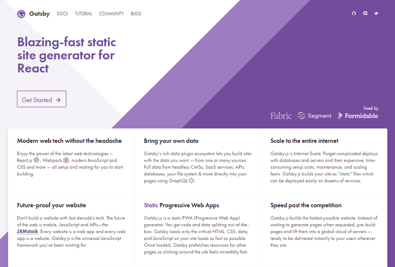
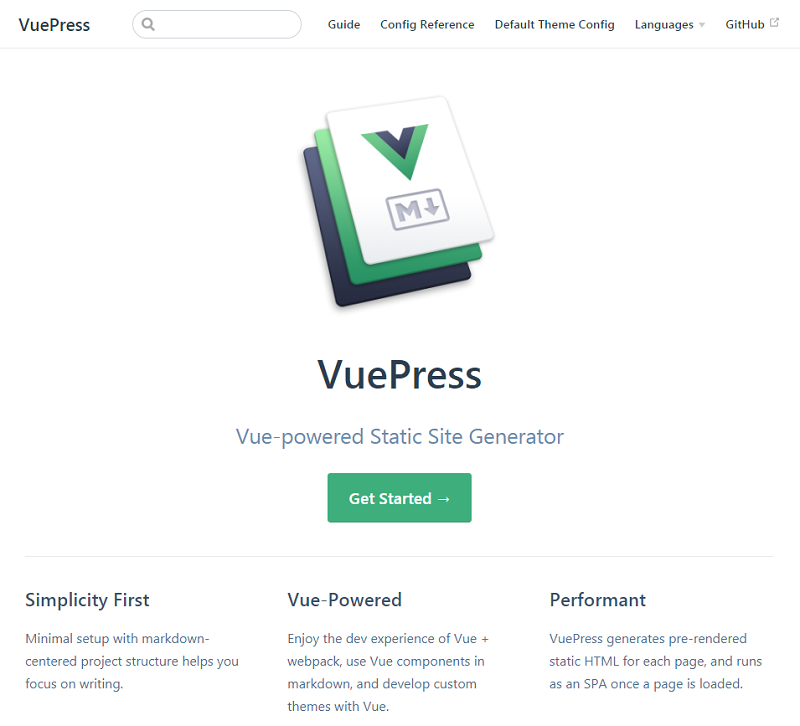

title: Stay Static - Build Static Websites w/ VuePress (and Text with Formatting Conventions in Markdown)


# 10 Years Ago - Dynamic Website Generators in 2007

**The Biggies** (PHP Rules!)

- WordPress
- Drupal
- Joomla!

On your live production site requires

- database (e.g. mysql)
- application server (e.g. mod_php)
- web server (e.g. apache)

On every request - (re)builds the page on-the-fly
e.g. queries the database, runs scripts,
merges templates, etc.


# Why Static? Inside a Dynamic WordPress Page Query

1. When a visitor first clicks on or types a URL for a page that is part of your blog, WordPress starts by running a few core files (wp-config.php, wp-settings.php, etc.) If you are interested in the specifics of the file loading order, start at index.php and follow the chain of files as each PHP file includes/requires additional PHP files (or read this excellent post at humanshell.net)
2. WordPress loads and initializes any plugins you have activated (calls the plugin init actions).
3. WordPress loads the "text domain" for internationalization, and the functions.php file from the currently active theme.
4. WordPress runs the wp() function (in wp-includes/functions.php), which calls $wp->main() ($wp is an object of class WP, which is defined in wp-includes/class-wp.php). This tells WordPress to:
    1. Parse the URL into a query specification using WP->parse_request() -- more on that below.
    2. Set all the is_ variables that are used by Conditional Tags using $wp_query->parse_query() ($wp_query is an object of class WP_Query, which is defined in wp-includes/query.php). Note that in spite of this function's name, in this case WP_Query->parse_query doesn't actually do any parsing for us, since that is done before-hand by WP->parse_request().
    3. Convert the query specification into a MySQL database query, and run the database query to get the list of posts, in function WP_Query->get_posts(). Save the posts in the $wp_query object to be used in the WordPress Loop.
    4. Handle 404 errors.
    5. Send the blog's HTTP headers.
    6. Set up some variables for the WordPress Loop.
5. WordPress loads your template, figures out which template file to use according to the Template Hierarchy, and runs that file (basically doing whatever your template file says to do). Or, WordPress could run one of the feed files (such as wp-rss2.php) instead.
6. Generally, the template or feed file runs the WordPress Loop to print blog posts or a static page.
7. The template or feed file will also likely print out permalinks to some archives, categories, or posts using built-in WordPress functions.

And so and so on and so on and so on.

(Source: [codex.wordpress.org/Query_Overview](https://codex.wordpress.org/Query_Overview))


# 10 Years Later - Dynamic Website Generators Today in 2017?

**The Biggies** (PHP Rules!)

- WordPress
- Drupal
- Joomla!

See the difference ;-) JavaScript Fatigue - Anyone?
Use WordPress (PHP) ;-)
about 30% of the Internet and counting.


# Static Website Compilers / Builders / Generators  in 1999

**The Biggies** in 1999

1. Macromedia Dreamweaver
2. Microsoft FrontPage
3. Netscape Composer

And today?


# Hello, Gatsby!

by Kyle Mathews et al (★22 649) -
github: [`gatsbyjs/gatsby`](https://github.com/gatsbyjs/gatsby)




(Source: [gatsbyjs.org](https://gatsbyjs.org))


# React vs Vue

And for Vue?


# Hello, VuePress!

by Evan You et al (★7 741) -
github: [`gatsbyjs/gatsby`](https://github.com/gatsbyjs/gatsby)




(Source: [vuepress.vuejs.org](https://vuepress.vuejs.org))


# History - Genesis - Why Not Build the Vue Docu(mentation) with Vue?

April 2018 - First Version (0.1) by Evan You.

(Source: [vuepress/CHANGELOG.md](https://github.com/vuejs/vuepress/blob/master/CHANGELOG.md))


### Why Not ...?  

- Nuxt
- Docsify / Docute
- Hexo
- GitBook

A: See [VuePress Guide Why Not ...?](https://vuepress.vuejs.org/guide/#why-not)


# As Easy as 1, 2, 3

### Step 1: Install

    $ yarn global add vuepress    # -or-  npm install -g vuepress

### Step 2: Create a page (text file) with formatting in markdown conventions

    $ echo '# Hello VuePress Vienna' > README.md

### Step 3a: Start Your (Local) Dev Server

    $ vuepress dev       # dev server with hot reloading

### Step 3b: Build Your (Static) Website

    $ vuepress build


# VuePress Commands

Try:

    $ vuepress -h

prints

```
  Usage: vuepress <command> [options]

  Options:

    -V, --version                output the version number
    -h, --help                   output usage information

  Commands:

    dev [options] [targetDir]    start development server
    build [options] [targetDir]  build dir as static site
    eject [targetDir]            copy the default theme into .vuepress/theme for customization.

  Run vuepress <command> --help for detailed usage of given command.
```

and

    $ vuepress dev -h

prints

```
  Usage: dev [options] [targetDir]

  start development server

  Options:

    -p, --port <port>  use specified port (default: 8080)
    -h, --host <host>  use specified host (default: 0.0.0.0)
    -h, --help         output usage information
```

and

    $ vuepress build -h

prints

```
  Usage: build [options] [targetDir]

  build dir as static site

  Options:

    -d, --dest <outDir>  specify build output dir (default: .vuepress/dist)
    --debug              build in development mode for debugging
    -h, --help           output usage information
```


# Hello, VuePress Sample - Inside an Existing Project


### Step 1: Install as a local dependency (that is, add to package.json)

    $ yarn add -D vuepress

### Step 2: Create a docs directory

    $ mkdir docs

### Step 3: Create your first (docu) page with formatting in markdown conventions

    $ echo '# Hello VuePress Vienna' > docs/README.md


# Hello, VuePress Sample - Inside an Existing Project (Cont.)


Then, add some scripts to package.json:

```
{
  "scripts": {
    "docs:dev": "vuepress dev docs",
    "docs:build": "vuepress build docs"
  }
}
```

Now you can start writing with:

    $ yarn docs:dev

To build / generate the (static) website run:

    $ yarn docs:build


# Hello, VuePress (Static) Website - File Structure - Zero Configuration

```
└──docs/
     Page-1.md
     Page-2.md
     README.md
```


# Hello, VuePress (Static) Website - File Structure - Add Config

```
└──docs/
    │  Page-1.md
    │  Page-2.md
    │  README.md
    └──.vupress/
          config.js
```

`config.js`:

``` js
module.exports = {

  title: 'My VuePress Site',

  themeConfig: {
    sidebar: [
      '/',
      '/Page-1',
      '/Page-2'
    ]
  }
};
```


# Hello, VuePress (Static) Website - File Structure - Add Components

```
└── docs/
    │ Page-1.md
    │ Page-2.md
    │ README.md
    │
    └── .vupress/
        │ config.js
        └── components/
              NumberModifier.vue  
```

`NumberModifier.vue`:

```
<template>
  <div class="number-modifier">
    <button @click="increment()">+</button>
    <strong> {{value}} </strong>
    <button @click="decrement()">-</button>
  </div>
</template>


<script>
export default {
  props: ['start'],

  data() {
    return {
      value: this.start
    }
  },

  methods: {
    increment() { this.value++ },
    decrement() { this.value-- }
  }
}
</script>
```


# Use Vue Components Inside Pages

`Page-1.md`:


```
---
title: Page 1
# We can even add meta tags to the page! This sets the keywords meta tag.
# <meta name="keywords" content="my SEO keywords"/>
meta:
  - name: keywords
  - content: my SEO keywords
---

# This is Page 1

**Our Component:**
<NumberModifier :start="5"></NumberModifier>


Duis aute irure dolor in reprehenderit in voluptate velit esse
cillum dolore eu fugiat nulla pariatur. Excepteur sint occaecat cupidatat non
proident, sunt in culpa qui officia deserunt mollit anim id est laborum.

```


# Use Vue Components Inside Pages (Cont.)


`README.md`:

```
# Hello VuePress!

_How are you doing?_
> **I'm doing fine, thanks!**

_Great, I was wondering what `49 + 32` is?_
> **{{49 + 32}}**

_Could you repeat that a few times?_

> **Sigh...**
<p v-for="i of 3">{{49 + 32}}</p>
```


# Let's Build the (Static) Website


    $ yarn docs:build

Results in:

```
└───dist
    │   404.html
    │   index.html
    │   Page-1.html
    │   Page-2.html
    │
    └───assets
        ├───css
        │       4.styles.b3ee96ce.css
        │
        ├───img
        │       search.83621669.svg
        │
        └───js
                0.cef95dbc.js
                1.b6288c2e.js
                2.e793cd69.js
                3.70a93ea8.js
                app.2afab76e.js
```


# Themes - Use Pre-Build Designs or Use Your Own Designs

Use default (built-in) theme as a start:

```
└───theme
    │   DropdownLink.vue
    │   Home.vue
    │   Layout.vue
    │   Navbar.vue
    │   NavLink.vue
    │   NavLinks.vue
    │   NotFound.vue
    │   OutboundLink.vue
    │   Page.vue
    │   search.svg
    │   SearchBox.vue
    │   Sidebar.vue
    │   SidebarButton.vue
    │   SidebarGroup.vue
    │   SidebarLink.vue
    │   util.js
    │
    └───styles
            arrow.styl
            code.styl
            config.styl
            custom-blocks.styl
            mobile.styl
            nprogress.styl
            theme.styl
```


`Home.vue`:
```
<template>
  <div class="home">
    <div class="hero">
      
      <h1>{{ data.heroText || $title }}</h1>
      <p class="description">
        {{ data.tagline || $description }}
      </p>
      <p class="action" v-if="data.actionText && data.actionLink">
        <NavLink class="action-button" :item="actionLink"/>
      </p>
    </div>
    <div class="features" v-if="data.features && data.features.length">
      <div class="feature" v-for="feature in data.features">
        <h2>{{ feature.title }}</h2>
        <p>{{ feature.details }}</p>
      </div>
    </div>
    <Content custom/>
    <div class="footer" v-if="data.footer">
      {{ data.footer }}
    </div>
  </div>
</template>

<script>
import NavLink from './NavLink.vue'

export default {
  components: { NavLink },
  computed: {
    data () {
      return this.$page.frontmatter
    },
    actionLink () {
      return {
        link: this.data.actionLink,
        text: this.data.actionText
      }
    }
  }
}
</script>
```
