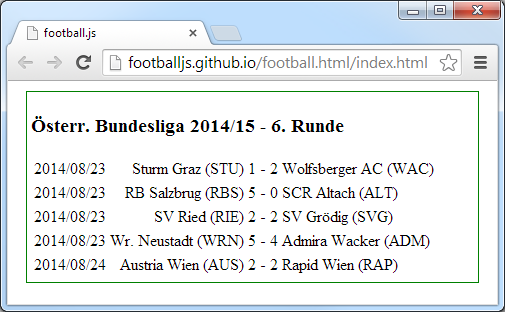

title: Building Your Own Tags / Elements / Web Components

%css

pre {
  padding: 4px 4px 4px 4px;
  border-top: #bbb 1px solid;
  border-bottom: #bbb 1px solid;
  background: #f3f3f3;
}

%end

# Building Your Own Tags / Elements / Web Components

Agenda

* What's a custom tag? What's a custom element? What's a web component?
* What's X-Tag? What's Polymer?
* Web Components Machinery - New Web Standard Building Blocks
* Example 1 - `<beer-of-the-day>`  
* Example 2 - `<football-js event='at.2013/14'>`

# `<x-tag>` - Use or Build Your Own Tag / Element / Web Component

- What's a custom tag?
- What's a custom element?
- What's a web component?

Tag == Element == Web Component

Lets you build your own tags that you can use as easily as plain old `
` or `` tags.

Example:

~~~
<football-js event='at.2013/14'></football-js>
~~~

More Examples:

~~~
<super-button></super-button>

<you-tube-video imfeelinglucky='rock me amadeus'></yout-tube-video>

<pdf-js src='wien.pdf'></pdf-js>

<marked-js>
## Markdown Renderer

* code in `JavaScript`
* realtime formatting

_many_ more goodies.
</marked-js>

<x-toolbar theme='light'>
  <x-button icon='menu'></x-button>
  <x-button icon='refresh'></x-button>
  
Toolbar: light theme

  <x-button icon='add'></x-button>
</x-toolbar>
~~~

# What's X-Tag? What's Polymer?

### X-Tag

Small JavaScript library by Mozilla - lets you use and build custom tags
for all modern browsers

More info @ [`www.x-tags.org`](http://www.x-tags.org)

### Polymer

Library by Google - lets you use and build custom tags;
uses web components machinery built into modern browsers;
pollyfills only for older browsers.

More info @ [`www.polymer-project.org`](http://www.polymer-project.org)

# Web Components Machinery - New Web Standard Building Blocks

### Custom Elements 

(`<element>`) - [W3C Spec](http://www.w3.org/TR/custom-elements/)

### Shadow DOM

(hide DOM subtrees under shadow roots - `createShadowRoot()`) - [W3C Spec](http://www.w3.org/TR/shadow-dom/)

### HTML Imports

(include and reuse HTML documents) - [W3C Spec](http://www.w3.org/TR/html-imports/)

### HTML Templates

(`<template>`) - [W3C Spec](http://www.w3.org/TR/html-templates/)

### MDV (Model Driven Views)

(`repeat='{{{{ greetings }}}}'`) - JavaScript Library

# Example 1 - `<beer-of-the-day>` Tag Definition

`beer-of-the-day.html`

~~~
<polymer-element name='beer-of-the-day'>
  <template>
    I'm a fan of <b>Ottakringer Helles</b>
      and this is my Shadow DOM.
    
  </template>
</polymer-element>
~~~

# Example 1 - `<beer-of-the-day>` Tag Usage

~~~
<html>
  <head>

    <!-- 1. Shim/polyfill missing web components machinery -->
    

    <!-- 2. Load custom tag (e.g HTML Imports in action) -->
    <link rel='import' href='beer-of-the-day.html'>

  </head>
  <body>

    <!-- 3. Use custom tag -->
    <beer-of-the-day></beer-of-the-day>

  </body>
</html>
~~~

# Example 2 - `<football-js>` Bundesliga Matchday Widget

What's `football.js`?

Football widgets in JavaScript using the football.db HTTP JSON(P) API

The old way in JavaScript. Usage Example:

~~~

~~~

The new way:

~~~
<link rel='import' href='football-js.html'>   <!-- HTML Imports -->

<football-js event='at.2013/14'></football-js>  <!-- custom tag use -->
~~~

# Example 2 - `<football-js>` - MDV (Model Driven Views)

### Matchday Data as JavaScript Objects

~~~
{
  "event":{"key":"at.2013/14","title":"Österr. Bundesliga 2013/14"},
  "round":{"pos":2,"title":"2. Runde","start_at":"2013/07/27","end_at":"2013/07/28"},
  "games":[{"team1_title":"SK Rapid Wien","team1_code":"RAP","team2_title":"SC Wiener Neustadt","team2_code":"WRN","play_at":"2013/07/27","score1":4,"score2":0},
           {"team1_title":"FC Admira Wacker","team1_code":"ADM","team2_title":"FC Wacker Innsbruck","team2_code":"FCW","play_at":"2013/07/27","score1":1,"score2":2},
           {"team1_title":"SV Ried","team1_code":"RIE","team2_title":"Wolfsberger AC","team2_code":"WAC","play_at":"2013/07/27","score1":1,"score2":0},
           {"team1_title":"FC RB Salzburg","team1_code":"RBS","team2_title":"FK Austria Wien","team2_code":"AUS","play_at":"2013/07/27","score1":5,"score2":1},
           {"team1_title":"SK Sturm Graz","team1_code":"STU","team2_title":"SV Grödig","team2_code":"SVG","play_at":"2013/07/28","score1":0,"score2":2}]
}
~~~

~~~
<template>
  

    <h3>
      {{{{ data.event.title }}}  -  {{{{ data.round.title }}}
    </h3>
  

</template>
~~~

# Example 2 - `<football-js>` Widget - Nested Templates

~~~
<template>
  

    <h3>
      {{{{ data.event.title }}}}  -  {{{{ data.round.title }}}}
    </h3>

   <table>
   <template repeat='{{{{data.games}}}}'>
   <tr>
    <td>
      {{{{ play_at }}}}
     </td>
     <td style='text-align: right;'>
       {{{{ team1_title }}}} ({{{{ team1_code }}}})
     </td>

     <td>
       {{{{ score1 }}}} - {{{{ score2 }}}}
     </td>
     <td>
      {{{{ team2_title }}}} ({{{{ team2_code }}}})
     </td>
   </tr>
   </template>
   </table>  
</template>
~~~

# Example 2 - `<football-js>` - All Together Now

~~~
<polymer-element name='football-js' attributes='event'>
 
  <template>
   

   

    <h3>
      {{{{ data.event.title }}}}  -  {{{{ data.round.title }}}}
    </h3>

    <table>
   <template repeat='{{{{data.games}}}}'>
   <tr>
    <td>
      {{{{ play_at }}}}
     </td>
     <td style='text-align: right;'>
       {{{{ team1_title }}}} ({{{{ team1_code }}}})
     </td>

     <td>
       {{{{ score1 }}}} - {{{{ score2 }}}}
     </td>
     <td>
      {{{{ team2_title }}}} ({{{{ team2_code }}}})
     </td>
   </tr>
   </template>
    </table>

 

 </template>
  
  
</polymer-element>
~~~

# Example 2 - `<football-js>` - Usage

~~~
<!DOCTYPE html>
<html>
  <head>
    <meta charset='utf-8'>
    <title>football.js</title>
    
    <link rel='import' href='football-js.html'>
  </head>
  <body>
    <football-js event='at.2013/14'></football-js>
  </body>
</html>
~~~

That's it.

# Thanks - Questions? Comments?

