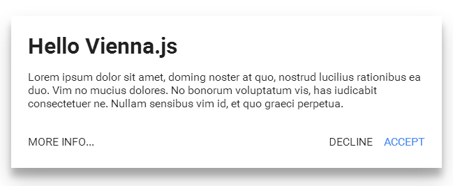
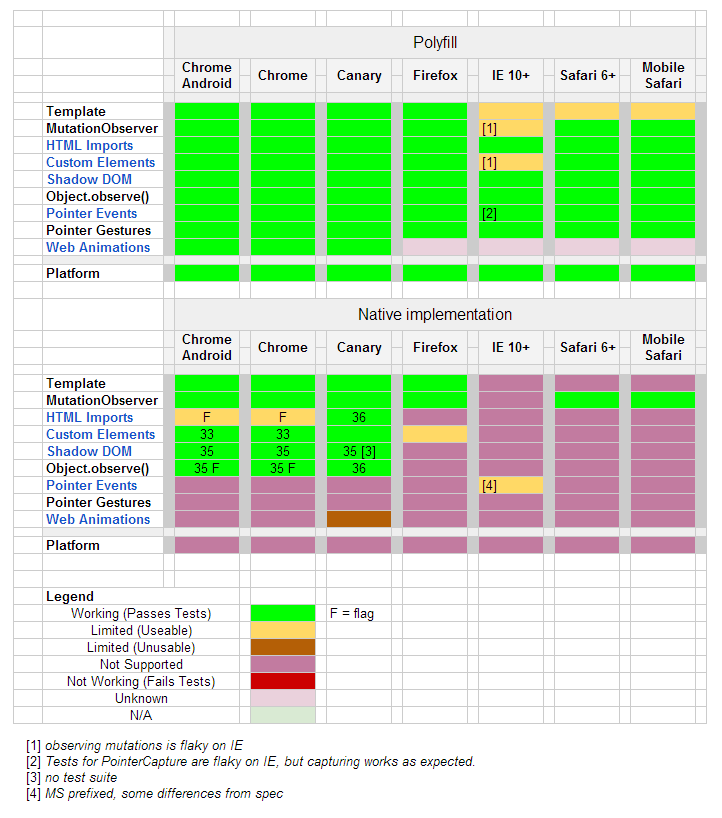
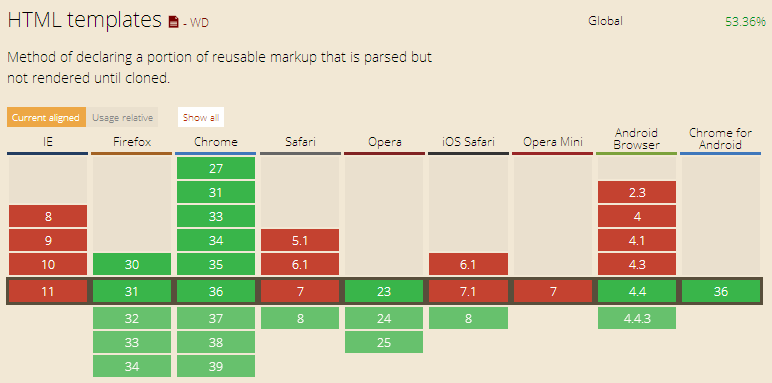
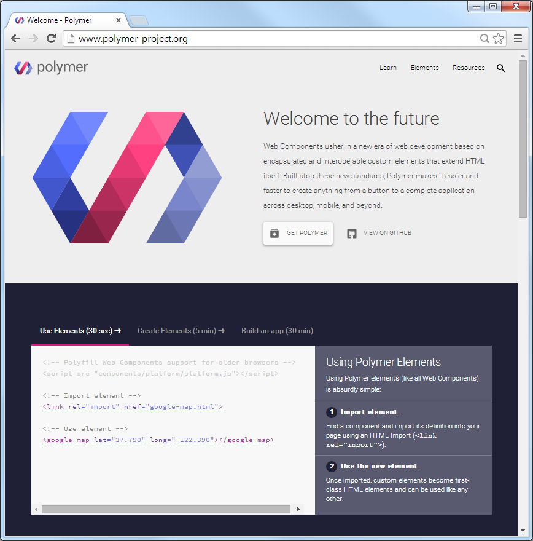
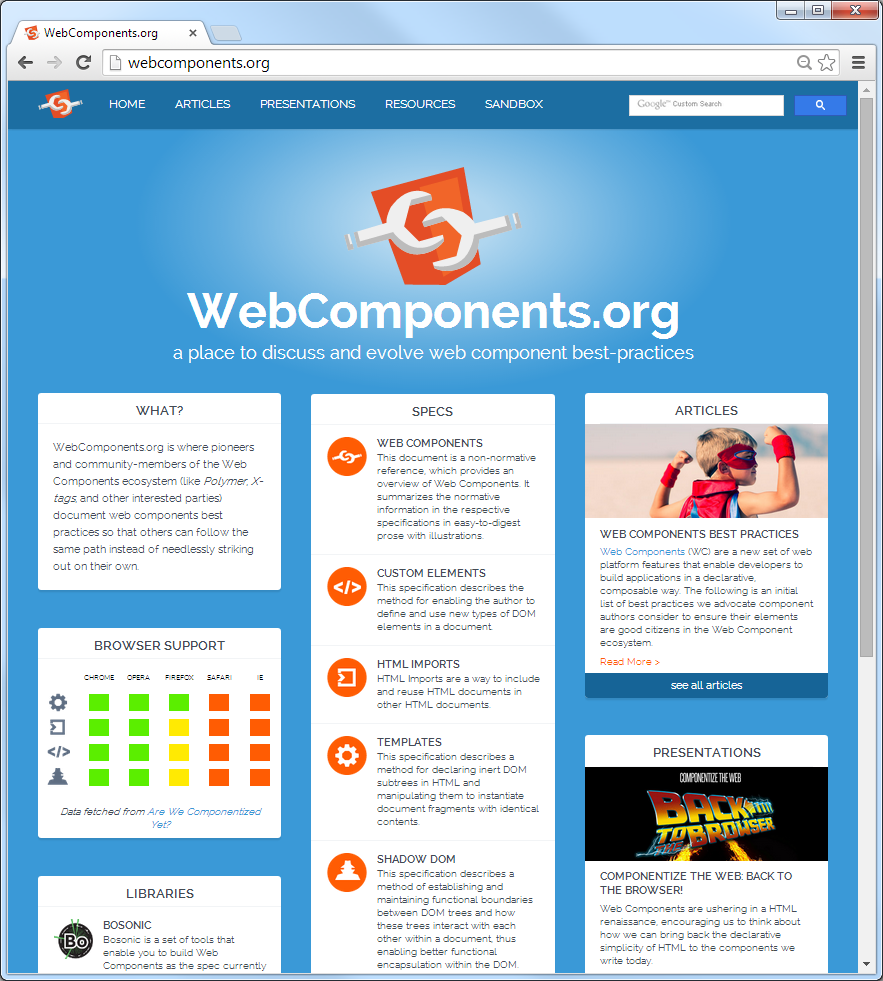

title: Building Your Own Web Components (Tags / Elements)

%css

pre {
  padding: 4px 4px 4px 4px;
  border-top: #bbb 1px solid;
  border-bottom: #bbb 1px solid;
  background: #f3f3f3;
}

%end

# Building Your Own Web Components (Tags / Elements)

Agenda

* What's a web component? What's a custom tag? What's a custom element? 
* Web Components Machinery - New Web Standard Building Blocks
* What's X-Tag? What's Polymer?
* Example 1 - `<beer-of-the-day>`  
* Example 2 - `<football-matchday event='at.2014/15'>`

# `<beer-of-the-day>` - Use or Build Your Own Web Component (Tag / Element)

- What's a web component?
- What's a custom tag?
- What's a custom element?

Web Component == Tag == Element
e.g. => `<beer-of-the-day>`, `<football-matchday>`, `<super-button>`

Web components machinery lets you
build your own HTML tags that you can use as easily as plain old `
` or `` tags.

# `<football-matchday>` - Use or Build Your Own Web Component (Tag / Element) - Example

Step 1: Import element definition into your page using an HTML import (`<link rel='import'>`)

~~~
<link rel='import' href='football-matchday.html'>
~~~

Step 2: Use the new element; once imported the new `<football-matchday>` element
is a first-class HTML element; use like any other

~~~
<football-matchday event='at.2014/15'></football-matchday>
~~~

# Trivia Quiz - How many builtin standard elements (tags) has HTML 4.1? HTML 5?

A) --  50+  ?

B) --  100+  ?

C) --  200+  ?

D) --  500+  ?

E) --  1,000+  ?

F) --  10,000+  ?

# All HTML 5 Elements (A-Z)

**A**
`<a>`
`<abbr>`
(x)`<acronym>`
`<address>`
(x)`<applet>`
`<area>`
(5)`<article>`
(5)`<aside>`
(5)`<audio>`
**B**
`<b>`
`<base>`
(x)`<basefont>`
(5)`<bdi>`
`<bdo>`
(x)`<bgsound>`
(x)`<big>`
(x)`<blink>`
`<blockquote>`
`<body>`
` `
`<button>`
**C**
(5)`<canvas>`
`<caption>`
(x)`
`
`<cite>`
`<code>`
`<col>`
`<colgroup>`
**D**
(5)`<data>`
(5)`<datalist>`
`<dd>`
`<del>`
(5)`
`
`<dfn>`
`<dialog>`
(x)`<dir>`
`
`
`<dl>`
`<dt>`
**E**
`<em>`
(5)`<embed>`
**F**
`<fieldset>`
(5)`<figcaption>`
(5)`<figure>`
(x)``
(5)`<footer>`
`<form>`
(x)`<frame>`
(x)`<frameset>`
**G H**
`<h1>`
`<h2>`
`<h3>`
`<h4>`
`<h5>`
`<h6>`
`<head>`
(5)`<header>`
(x,5)`<hgroup>`
`
`
`<html>`
**I**
`<i>`
`<iframe>`
``
`<input>`
`<ins>`
(x)`<isindex>`
**J K**
`<kbd>`
(5)`<keygen>`
**L**
`<label>`
`<legend>`
`<li>`
`<link>`
(x)`<listing>`
**M**
(5)`<main>`
`<map>`
(5)`<mark>`
(x)`<marquee>`
(5)`<menu>`
(5)`<menuitem>`
`<meta>`
(5)`<meter>`
**N**
(5)`<nav>`
(x)`<nobr>`
(x)`<noframes>`
`<noscript>`
**O**
`<object>`
`<ol>`
`<optgroup>`
`<option>`
(5)`<output>`
**P**
`
`
`<param>`
(5)`<picture>`
(x)`<plaintext>`
`<pre>`
(5)`<progress>`
**Q**
`<q>`
**R**
(5)`<rp>`
(5)`<rt>`
(5)`<ruby>`
**S**
`<s>`
`<samp>`
`

</polymer-element>
~~~

<!-- check: use noscript  e.g
       <polymer-element name='beer-of-the-day' noscript>
       - use if you don't need any further JavaScript logic
          e.g lifecycle callbacks, mixins, etc.
  -->

<!--
[ add pic here ]
 ## add background-image ???  use :host ?
  p { background-color: yellow; }  ?? use/style for overlay image - text

  -->

# Example 1 - `<beer-of-the-day>` Tag Usage

~~~
<html>
  <head>

    <!-- 1. Shim/polyfill missing web components machinery -->
    

    <!-- 2. Load custom tag (e.g HTML Imports in action) -->
    <link rel='import' href='beer-of-the-day.html'>

  </head>
  <body>

    <!-- 3. Use custom tag -->
    <beer-of-the-day></beer-of-the-day>

  </body>
</html>
~~~

<!--
  todo
[add pic here - dom before show shadow dom]

[add pic here - turn on shadow dom - setting]

[add pic here - dom after show shadow dom]
-->

# Example 2 - `<football-matchday>` Österr. Bundesliga Matchday Widget

What's `football.js`?

Football widgets in JavaScript using the football.db HTTP JSON(P) API

The old way in JavaScript. Usage Example:

~~~

~~~

The new way:

~~~
<!-- step 1: HTML Imports -->
<link rel='import' href='football-matchday.html'>

<!-- step 2: use custom tag -->
<football-matchday event='at.2014/15'></football-matchday>
~~~

# Example 2 - `<football-matchday>` - MDV (Model Driven Views)

### Matchday Data as JavaScript Objects

<!--
 fix: try w/o data e.g. event.title ??
-->

~~~
{
  "event":{"key":"at.2014/15","title":"Österr. Bundesliga 2014/15"},
  "round":{"pos":6,"title":"6. Runde","start_at":"2014/08/23","end_at":"2014/08/24"},
  "games":[{"team1_title":"Sturm Graz","team1_code":"STU","team2_title":"Wolfsberger AC","team2_code":"WAC","play_at":"2014/08/23","score1":1,"score2":2},
           {"team1_title":"RB Salzbrug","team1_code":"RBS","team2_title":"SCR Altach","team2_code":"ALT","play_at":"2014/08/23","score1":5,"score2":0},
           {"team1_title":"SV Ried","team1_code":"RIE","team2_title":"SV Grödig","team2_code":"SVG","play_at":"2014/08/23","score1":2,"score2":2},
           {"team1_title":"Wr. Neustadt","team1_code":"WRN","team2_title":"Admira Wacker","team2_code":"ADM","play_at":"2014/08/23","score1":5,"score2":4},
           {"team1_title":"Austria Wien","team1_code":"AUS","team2_title":"Rapid Wien","team2_code":"RAP","play_at":"2014/08/24","score1":2,"score2":2}]
}
~~~

~~~
<template>
  

    <h3>
      {{{{ data.event.title }}}  -  {{{{ data.round.title }}}
    </h3>
  

</template>
~~~

# Example 2 - `<football-matchday>` Widget - Nested Templates

~~~
<template>
  

    <h3>
      {{{{ data.event.title }}}}  -  {{{{ data.round.title }}}}
    </h3>

   <table>
   <template repeat='{{{{data.games}}}}'>
   <tr>
    <td>
      {{{{ play_at }}}}
     </td>
     <td style='text-align: right;'>
       {{{{ team1_title }}}} ({{{{ team1_code }}}})
     </td>

     <td>
       {{{{ score1 }}}} - {{{{ score2 }}}}
     </td>
     <td>
      {{{{ team2_title }}}} ({{{{ team2_code }}}})
     </td>
   </tr>
   </template>
   </table>  
</template>
~~~

# Example 2 - `<football-matchday>` - All Together Now

~~~
<polymer-element name='football-matchday' attributes='event'>
 
  <template>
   

   

    <h3>
      {{{{ data.event.title }}}}  -  {{{{ data.round.title }}}}
    </h3>

    <table>
   <template repeat='{{{{data.games}}}}'>
   <tr>
    <td>
      {{{{ play_at }}}}
     </td>
     <td style='text-align: right;'>
       {{{{ team1_title }}}} ({{{{ team1_code }}}})
     </td>

     <td>
       {{{{ score1 }}}} - {{{{ score2 }}}}
     </td>
     <td>
      {{{{ team2_title }}}} ({{{{ team2_code }}}})
     </td>
   </tr>
   </template>
    </table>

 

 </template>
  
  
</polymer-element>
~~~

# Example 2 - `<football-matchday>` - Usage

~~~
<!DOCTYPE html>
<html>
  <head>
    <meta charset='utf-8'>
    <title>football.js</title>
    
    <link rel='import' href='football-matchday.html'>
  </head>
  <body>
    <football-matchday event='at.2014/15'></football-matchday>
  </body>
</html>
~~~

That's it.

# Thanks - Questions? Comments?

## Learn More

- [webcomponents.org](http://webcomponents.org)

# Appendix: Web Components Machinery - New Web Standard Building Blocks - Sources

### Chrome

- [`chromestatus.com`](http://www.chromestatus.com/features)
- [`chromium.org/blink/web-components`](http://www.chromium.org/blink/web-components)

### Firefox

- Bugzilla pages
   - [Bug #856140 - Update document.register to adhere to the latest Custom Element spec](https://bugzilla.mozilla.org/show_bug.cgi?id=856140)
   - [Bug #877072 - Implement HTML Imports](https://bugzilla.mozilla.org/show_bug.cgi?id=877072)
   - [Bug #806506 - Implement web components ShadowRoot interface](https://bugzilla.mozilla.org/show_bug.cgi?id=806506)
   - and others

### Internet Explorer

- [`status.modern.ie`](http://status.modern.ie)

Site source on github (creative commons licensed) build w/ Node.js;
modern IE ?! - is this possible? - IE and modern?

### Apple

- Secrets, Secrets, Secrets - Who knows when or what? 

<!--

# Appendix: Google Map "Classic" JavaScript API vs `<google-map>`

[see andi osmany talk ??]

# Appendix: Web Components in Action

[add example] from   Web Components in Action by Chris Bucked ??

add link to (upcoming) book - free first chapter available

Example:

-->

# Appendix: New Anti-Pattern? Single Web Component App `<my-beer-app>`

~~~
<!DOCTYPE html>
<html>
  <head>
    <title>My Beer App</title>
    <link rel='import' href='my-beer-app.html'>
  </head>
  <body>
    <my-beer-app>
  </body>
</html>
~~~

Anti-Pattern? Why? Why Not?

# Appendix: Vanilla JS Example - HTML5 Rocks Article Series

HTML5 Rocks Series

- [HTML's New Template Tag: Standardizing client-side templating](http://www.html5rocks.com/en/tutorials/webcomponents/template) by Eric Bidelman (Google); February 26th, 2013 (Updated: December 18th, 2013)
- [Custom Elements: Defining new elements in HTML](http://www.html5rocks.com/en/tutorials/webcomponents/customelements) by Eric Bidelman (Google); August 28th, 2013 (Updated: December 18th, 2013)
- [Shadow DOM 101](http://www.html5rocks.com/en/tutorials/webcomponents/shadowdom) by Dominic Cooney (Google); January 4th, 2013 (Updated: December 18th, 2013)
- [Shadow DOM 201: CSS and Styling](http://www.html5rocks.com/en/tutorials/webcomponents/shadowdom-201) by Eric Bidelman (Google); March 15th, 2013 (Updated: April 10th, 2014)
- [Shadow DOM 301: Advanced Concepts & DOM APIs](http://www.html5rocks.com/en/tutorials/webcomponents/shadowdom-301) by Eric Bidelman (Google); March 21st, 2013 (Updated: December 18th, 2013)
- [HTML Imports: #include for the web](http://www.html5rocks.com/en/tutorials/webcomponents/imports) by Eric Bidelman (Google); November 11th, 2013 (Updated: December 18th, 2013)

# Appendix: Vanilla JS Example - Register a Custom Web Element

~~~
var proto = Object.create(HTMLElement.prototype);

proto.createdCallback = function() {
  this.textContent = 'I'm an x-foo!';
};

proto.foo = function() {
  console.log('foo() called');
};

var XFoo = document.registerElement('x-foo', {
  prototype: proto
});
~~~

Now use like:

~~~
var xfoo = new XFoo();   // or
var xfoo = document.createElement('x-foo');

document.body.appendChild( xfoo );
~~~

or

~~~
<x-foo>   <!-- OMG! It's HTML! -->
~~~

# Appendix: Vanilla JS Example - Create a Shadow DOM 

# Appendix: Vanilla JS Example - Stamp-Out a Template

