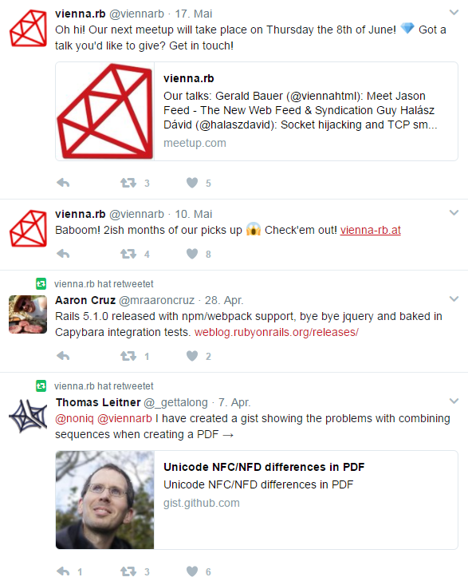
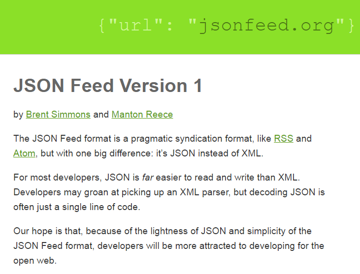
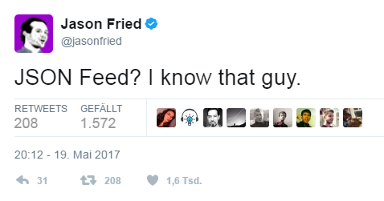
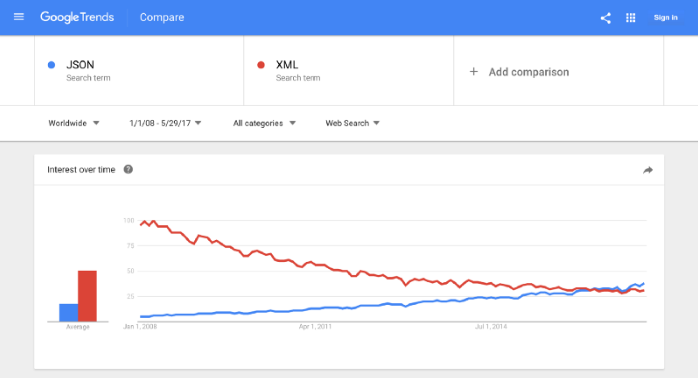
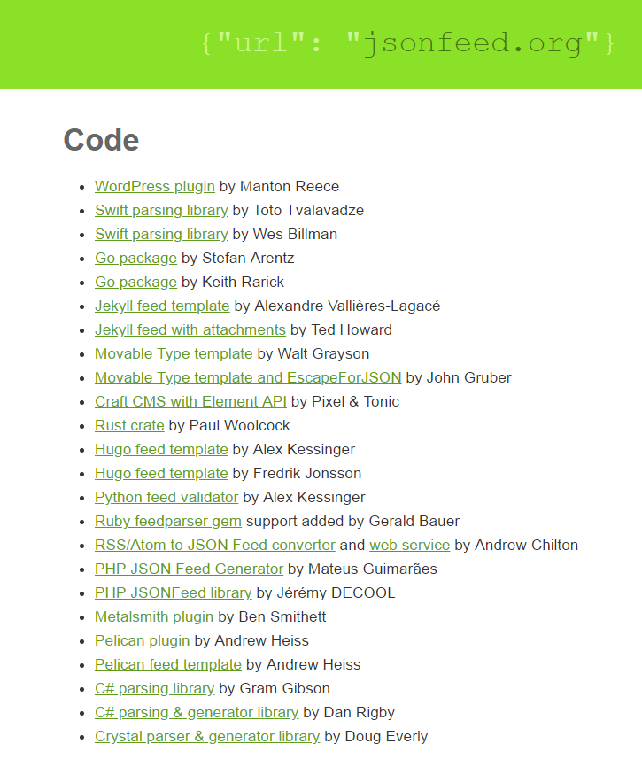

title: Meet Jason Feed - The New Web Feed & Syndication Guy


# The Future of Online News - The Future of Facebook & Co

- How do you read your news?
  - On your computer?
  - On your mobile phone?
  - In your browser?
  - In an app?

- How many websites do you read?
  - One (just Facebook ;-) or Krone)
  - Two or three
  - More than ten
  - More than a hundred


# What's a Web Feed?


A web feed (or news feed) is a (simple) document/text format
that:

(1) lets you publish a list of:

- status updates, blog postings, articles, pictures, cartoons, recordings, etc.

and that

(2) lets others subscribe to your updates.


# News Feeds in 2017 - viennarb




# News Feeds in 2020 - viennarb.json5

```
{
  title: "vienna.rb",
  description: "Aggregation of Ruby relevant topics in Vienna and Austria and organizing meetups while we're at it. http://vienna-rb.at/",
  author: { name: "vienna.rb" },
  item: [
    {
      content_text: "Oh hi! Our next meetup will take place on Thursday the 8th of June! 💎 Got a talk you'd like to give? Get in touch! https://meetup.com/vienna-rb/events/239689512",
      date_published: "2017-05-17T05:26",
      url: "http://vienna-rb.at/status/864819337416388608",
      id:  "http://vienna-rb.at/status/864819337416388608",
    },
    {
      content_text: "Baboom! 2ish months of our picks up 😱 Check'em out! http://www.vienna-rb.at/",
      date_published: "2017-05-11T0:12",
      url: "http://vienna-rb.at/status/862354623805489152",
      id:  "http://vienna-rb.at/status/862354623805489152",
    },
    {
      content_text: "Rails 5.1.0 released with npm/webpack support, bye bye jquery and baked in Capybara integration tests. http://weblog.rubyonrails.org/releases/",
      date_publlished: "2017-04-28T02:50",
      url: "http://vienna-rb.at/status/857894899500429314",
      id:  "http://vienna-rb.at/status/857894899500429314",
      author: { name: "Aaron Cruz" },
    }
  ]
}
```


# Triva Quiz - News Feeds in 2009 - What's RSS?

- (A) RDF Site Summary
- (B) Rich Site Summary
- (C) Really Simple Syndication
- (D) Really Simple, Stupid
- (E) Rapid Syndicaton Solution

RDF = Resource Description Framework


# Web Feed Formats - XML, JSON, YAML, HTML, TXT

- RSS 2.0 (0.91, 0.92) a.k.a. Really Simple Syndication - in XML
- RSS 1.0 a.k.a. RDF Site Summary - in RDF/XML
- Atom - in XML
- JSON Feed - in - surprise, surprise - JSON
- Microformats (h-feed/h-entry) - in HTML
- Feed.TXT - in plain text; metadata in (simplified) YAML or JSON; Markdown

Some more. Let's celebrate diversity! Live and let live!


# Triva Quiz - The Wonders of RSS 2.0 - Find the Content

What's your favorite way to add content in hypertext to RSS 2.0?

- (A) `<description>`
- (B) `<content:encoded>`  from RDF/RSS 1.0 content module extension
- (C) `<media:content>`  from Yahoo! search extension
- (D) Other (Please, tell!)

Bonus: Is your content in plain text, in html, in xhtml, in html escaped?
Is your content a summary? or full text?


# Meet Jason Feed - A New Feed Format in JSON - feed.json



More [jsonfeed.org](https://jsonfeed.org) »


# Meet Jason Feed - A New Feed Format in JSON - feed.json (Cont.)



```
{
    "version": "https://jsonfeed.org/version/1",
    "title": "Jason Fried's Microblog",
    "home_page_url": "https://micro.blog/jasonfried/",
    "feed_url": "https://micro.blog/jasonfried/feed.json",
    "author": {
        "name": "Jason Fried",
        "url": "https://micro.blog/jasonfried/",
        "avatar": "https://micro.blog/jasonfried/avatar.png"
    },
    "items": [
        {
            "id": "865767227416612864",
            "url": "https://micro.blog/jasonfried/status/865767227416612864",
            "content_text": "JSON Feed? I know that guy.",
            "date_published": "2017-05-19T20:12:00-00:00"
        }
    ]
}
```

# Meet Jason Feed - A New Feed Format in JSON - feed.json (Cont.)

Use `content_text` for text

```
"content_text": "JSON Feed? I know that guy.",
```

and `content_html` for hypertext.

No artificial intelligence (AI) needed ;-)


# Meet Jason Feed - A New Feed Format in JSON - feed.json (Cont.)

Bonus: Use `summary` for summaries

and `content_text` or `content_html` for full content.

Note: "Full" content might just be:

```
"content_text": "Me!"
```


# Why JSON? Why not XML?

JSON is the new XML ;-)  Easier. Free. Simpler.




# Reading JSON Feed - Ruby One-Liner - Ruby Loves JSON - JSON.parse

```
require 'open-uri'
require 'json'

text = open( 'http://openfootball.github.io/feed.json' ).read
feed = JSON.parse( text )

puts feed['title']
# => "football.db - Open Football Data"

puts feed['url']
# => "http://openfootball.github.io/"

puts feed['items'][0]['title']
# => "football.db - League Quick Starter Sample - Mauritius Premier League - Create Your Own Repo/League(s) from Scratch"

puts feed['items'][0]['url']
# => "http://openfootball.github.io/2015/08/30/league-quick-starter.html"

puts feed['items'][0]['date_updated']
# => 2015-08-30T00:00

puts feed['items'][0]['content_text']
# => "Added a new quick starter sample using the Mauritius Premier League to get you started..."
```


# Reading XML in Ruby in 2017 What's the state of the art?

- REXML Stdlib?
- Nokogiri Gem?  (with libxml c-extension)
- Text with regular expressions?
- Other? Please tell!


#  Rules for Standard Makers - Evolve or Die ;-) - Break Things - Many Worlds Possible

Standards - Standards - Standards  


(Source: [xkcd.com/1179](https://xkcd.com/1179/))


#  Rules for Standard Makers - Evolve or Die ;-) - Break Things - Many Worlds Possible (Cont.)

One (format) to rule them all.
All your base are belong to us.
JavaScript is eating the world ;-)


(Source: [xkcd.com/927](https://xkcd.com/927/))


# One Gem to rule them all! All your base are blong to feedparser.

Live and let live! Celebrate diversity. In the end all formats
are just 0 and 1s or:

- `feed.title`
- `feed.url`
- `feed.items[0].title`
- `feed.items[0].url`
- `feed.items[0].published`
- `feed.items[0].content_html` or `feed.items[0].content`
- `feed.items[0].content_text`
- `feed.items[0].summary`
- etc.

=> Let your computer handle the reading of web feeds.


# What's the feedparser gem?

Web feed parser and normalizer @ GitHub [`feedparser/feedparser`](https://github.com/feedparser/feedparser)

Formats include:

- XML - with Atom or RSS
- JSON - with JSON Feed
- HTML - with Microformats e.g. `h-entry`/`h-feed`

<!-- break -->

- Upcoming - TXT - with Feed.TXT e.g. YAML & Markdown (Yeah!)


# What's the feedparser gem? Cont.

```
require 'open-uri'
require 'feedparser'

txt = open( 'http://openfootball.github.io/feed.json' ).read

feed = FeedParser::Parser.parse( txt )

puts feed.title
# => "football.db - Open Football Data"

puts feed.url
# => "http://openfootball.github.io/"

puts feed.items[0].title
# => "football.db - League Quick Starter Sample - Mauritius Premier League - Create Your Own Repo/League(s) from Scratch"

puts feed.items[0].url
# => "http://openfootball.github.io/2015/08/30/league-quick-starter.html"

puts feed.items[0].updated
# => Sun, 30 Aug 2015 00:00:00 +0000

puts feed.items[0].content_text
# => "Added a new quick starter sample using the Mauritius Premier League to get you started..."

...
```


# What's the feedparser gem? Cont. - Microformats

```
require 'microformats'
require 'feedparser'

text =<<HTML
<article class="h-entry">
  <h1 class="p-name">Microformats are amazing</h1>
  <p>Published by
    <a class="p-author h-card" href="http://example.com">W. Developer</a>
     on <time class="dt-published" datetime="2013-06-13 12:00:00">13<sup>th</sup> June 2013</time>

  <p class="p-summary">In which I extoll the virtues of using microformats.</p>

  <div class="e-content">
    <p>Blah blah blah</p>
  </div>
</article>
HTML

feed = FeedParser::Parser.parse( text )

puts feed.format
# => "html"
puts feed.items.size
# =>  1
puts feed.items[0].authors.size
# => 1
puts feed.items[0].content_html  
# => "<p>Blah blah blah</p>"
puts feed.items[0].content_text  
# => "Blah blah blah"
puts feed.items[0].title
# => "Microformats are amazing"
puts feed.items[0].summary
# => "In which I extoll the virtues of using microformats."
puts feed.items[0].published
# => 2013-06-13 12:00:00
puts feed.items[0].authors[0].name
# => "W. Developer"
...
```


# Add JSON Feed to Your Site

WordPress JSON Feed Plugin. Yes! Jeykyll. Yes! Hugo. Yes!
And many more.

See the [JSON Feed Code Page](https://jsonfeed.org/code):




# Add JSON Feed to Your Site  - Jekyll Template

```
---
#  feed.json format; see https://jsonfeed.org for more

layout: null
---
{
    "version": "https://jsonfeed.org/version/1",
    "title": "{{ site.title | xml_escape }}",
    "home_page_url": "{{ "/" | absolute_url }}",
    "feed_url": "{{ "/feed.json" | absolute_url }}",
    "items": [
    
        {
            "id": "{{ post.url | absolute_url }}",
            "title": {{ post.title | jsonify }},
            "content_html": {{ post.content | jsonify }},
            "url": "{{ post.url | absolute_url }}",
            "date_published": "{{ post.date | date_to_xmlschema }}"
        },
    
    ]
}
```

(Source: [/openfootball.github.io/feed.json](https://github.com/openfootball/openfootball.github.io/blob/master/feed.json))


# Add Feed.TXT to Your Site  - Jekyll Template

```
---
#  feed.txt format; see https://feedtxt.github.io for more

layout: null
---
|<<<
 title:         {{ site.title }}
 home_page_url: {{ "/" | absolute_url }}
 feed_url:      {{ "/feed.txt" | absolute_url }}
 </>
 
  id:    {{ post.url | absolute_url }}
  title: {{ post.title }}
  url:   {{ post.url | absolute_url }}
  published: {{ post.date | date_to_xmlschema }}
  ---
{{ post.content }}
  </>

>>>|
```
(Source: [/openfootball.github.io/feed.txt](https://github.com/openfootball/openfootball.github.io/blob/master/feed.html.txt))


# Thanks - Questions? Comments?


# Bonus: JSON Feed Podcast Example

Yes, works "out-of-the-box" for podcasts too.
Use attachments for audio recordings (media files).

```
{
    "version": "https://jsonfeed.org/version/1",
    "user_comment": "This is a podcast feed. You can add this feed to your podcast client using the following URL: http://therecord.co/feed.json",
    "title": "The Record",
    "home_page_url": "http://therecord.co/",
    "feed_url": "http://therecord.co/feed.json",
    "items": [
        {
            "id": "http://therecord.co/chris-parrish",
            "title": "Special #1 - Chris Parrish",
            "url": "http://therecord.co/chris-parrish",
            "content_text": "Chris has worked at Adobe and as a founder of Rogue Sheep, which won an Apple Design Award for Postage. Chris’s new company is Aged & Distilled with Guy English — which shipped Napkin, a Mac app for visual collaboration. Chris is also the co-host of The Record. He lives on Bainbridge Island, a quick ferry ride from Seattle.",
            "content_html": "Chris has worked at <a href=\"http://adobe.com/\">Adobe</a> and as a founder of Rogue Sheep, which won an Apple Design Award for Postage. Chris’s new company is Aged & Distilled with Guy English — which shipped <a href=\"http://aged-and-distilled.com/napkin/\">Napkin</a>, a Mac app for visual collaboration. Chris is also the co-host of The Record. He lives on <a href=\"http://www.ci.bainbridge-isl.wa.us/\">Bainbridge Island</a>, a quick ferry ride from Seattle.",
            "summary": "Brent interviews Chris Parrish, co-host of The Record and one-half of Aged & Distilled.",
            "date_published": "2014-05-09T14:04:00-07:00",
            "attachments": [
                {
                    "url": "http://therecord.co/downloads/The-Record-sp1e1-ChrisParrish.m4a",
                    "mime_type": "audio/x-m4a",
                    "size_in_bytes": 89970236,
                    "duration_in_seconds": 6629
                }
            ]
        }
    ]
}
```

# Bonus: JSON Feed - Who's Who - Meet Brent Simmons n Manton Reece

Brent Simmons? - I know this guy!

Manton Reece? - I know that guy!

Brent Simmons built the NetNewsWire  more than 10+ years ago;
was first (most popular) news reader for Apple Mac OS X.

Blogs at [inessential.com](http://inessential.com)
with [feed.json](http://inessential.com/feed.json) ;-)


Manton Reece builds micro.blog - a timeline and publishing platform for the open web.
Also built the WordPress JSON Feed plugin ;-)

Blogs at [manton.org](http://manton.org) with [feed.json](http://manton.org/feed/json) ;-)


# Bonus: Let's "fix" JSON - What's wrong or missing in JSON 1.0?

- Add comments.
- Allow object keys without quotes.
- Add multi-line strings.
- Allow trailing commas or make commas optional.
- And much much more.

New (working) JSON format proposals include:

- [SON (Simple Object Notation)](https://github.com/aleksandergurin/simple-object-notation)
- [HJSON (Human JSON)](http://hjson.org)
- [JSON5](http://json5.org)
- and others

Why not evolve JSON? Keep it frozen, forever, really?

SON Feed? JSON5 Feed? HJSON Feed? Anyone?


# Bonus: What's Feed.TXT?

Feeds in Plain Text w/ Structured Meta Data @ GitHub [/feedtxt](https://feedtxt.github.io)

- Meta Data in (Simplified) YAML or Classic or Mordern JSON.
- Content in Plain Text with Markdown Formatting Conventions.

Example: Yes, the world's 1st podcasting feed in plain text ;-) Let's try.

```
|>>>
 comment: This is a podcast feed. You can add this feed to your podcast client using the following URL: http://therecord.co/feed.json
 title:   The Record
 home_page_url: http://therecord.co/
 feed_url:      http://therecord.co/feed.txt
 </>
 id:        http://therecord.co/chris-parrish
 title:     Special #1 - Chris Parrish
 url:       http://therecord.co/chris-parrish
 summary:   Brent interviews Chris Parrish, co-host of The Record and one-half of Aged & Distilled.
 published: 2014-05-09T14:04:00-07:00
 attachments:
 - url:           http://therecord.co/downloads/The-Record-sp1e1-ChrisParrish.m4a
   mime_type:     audio/x-m4a
   size_in_bytes: 89970236,
   duration_in_seconds: 6629
 ---
 Chris has worked at [Adobe][1] and as a founder of Rogue Sheep, which won an Apple Design Award for Postage.
 Chris’s new company is Aged & Distilled with Guy English — which shipped [Napkin](2),
 a Mac app for visual collaboration. Chris is also the co-host of The Record.
 He lives on [Bainbridge Island][3], a quick ferry ride from Seattle.

 [1]: http://adobe.com/
 [2]: http://aged-and-distilled.com/napkin/
 [3]: http://www.ci.bainbridge-isl.wa.us/
<<<|  
```
